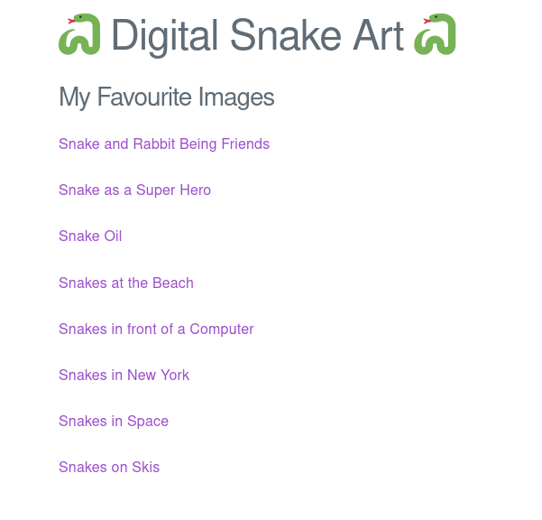

## Challenge

I'm a big fan of digital art!

How do you like my new gallery?

http://ch.hackyeaster.com:2307

[digitalsnakeart.zip](writeupfiles/digitalsnakeart.zip)


Note: The service is restarted every hour at x:00.

## Solution

The website is a set of images generated by DALL-E



and e.g. the "Snakes in space" page looks like:


and has an url like:

```
http://ch.hackyeaster.com:2307/art?art=bmFtZTogU25ha2VzIGluIFNwYWNlCmltYWdlOiBzbmFrZXNfaW5fc3BhY2UKc291cmNlOiBEQUxMLUUKcmVzb2x1dGlvbjogMjU2eDI1Ng==
```

let's see what's in the base64 string:

```bash
$ echo "bmFtZTogU25ha2VzIGluIFNwYWNlCmltYWdlOiBzbmFrZXNfaW5fc3BhY2UKc291cmNlOiBEQUxMLUUKcmVzb2x1dGlvbjogMjU2eDI1Ng==" | base64 -d
name: Snakes in Space
image: snakes_in_space
source: DALL-E
```

So we probably have to manipulate that base64 string to get it to give it our flag.

But we get the source code, so let's look at that:


```java
package com.hackyeaster.digitalsnakeart;

import org.springframework.boot.SpringApplication;
import org.springframework.boot.autoconfigure.SpringBootApplication;

@SpringBootApplication
public class Application {

    public static void main(String[] args) {
        SpringApplication.run(Application.class, args);
    }
}
```
{: file='writeupfiles/digitalsnakeart/com/hackyeaster/Application.java'}

```java
package com.hackyeaster.digitalsnakeart;

public class Code {

    private final short code;

    public Code(short code) {
        this.code = code;
    }

    public boolean isCorrect() {
        return (code > 0 && code < 500 && code == SnakeService.getSecretCode());
    }

}
```
{: file='writeupfiles/digitalsnakeart/com/hackyeaster/Code.java'}


```java
package com.hackyeaster.digitalsnakeart;

import java.io.ByteArrayInputStream;
import java.io.InputStreamReader;
import java.nio.charset.StandardCharsets;
import java.util.Base64;
import org.springframework.beans.factory.annotation.Autowired;
import org.springframework.core.env.Environment;
import org.springframework.ui.Model;
import org.springframework.web.bind.annotation.GetMapping;
import org.springframework.web.bind.annotation.RequestParam;
import org.yaml.snakeyaml.Yaml;

@org.springframework.stereotype.Controller
public class Controller {

    @Autowired
    private Environment env;

    @GetMapping("/")
    public String index(Model model) {
        return "index";
    }

    @GetMapping("/art")
    public String path(Model model, @RequestParam(name = "art") String art) {
        SnakeService.initialize(env);
        SnakeArt result = parse(art);
        if (result == null) {
            return "fail";
        }
        model.addAttribute("name", result.getName());
        model.addAttribute("image64", result.getImage().getBase64String());
        model.addAttribute("source", result.getSource());
        model.addAttribute("resolution", result.getResolution());
        return "art";
    }

    private SnakeArt parse(String string) {
        try {
            byte[] yml = Base64.getDecoder().decode(string);
            InputStreamReader reader = new InputStreamReader(new ByteArrayInputStream(yml), StandardCharsets.UTF_8);
            return new Yaml().loadAs(reader, SnakeArt.class);
        } catch (Exception e) {
            e.printStackTrace();
            return null;
        }
    }

}
```
{: file='writeupfiles/digitalsnakeart/com/hackyeaster/Controller.java'}


```java
package com.hackyeaster.digitalsnakeart;

public class Flag extends Image {

    public Flag(Code code) {
        if (code.isCorrect()) {
            this.base64String = SnakeService.loadFlag();
        } else {
            this.base64String = SnakeService.load("snake_no_access");
        }
    }
}
```
{: file='writeupfiles/digitalsnakeart/com/hackyeaster/Flag.java'}

```java
package com.hackyeaster.digitalsnakeart;

public class Image {

    protected String base64String;

    public String getBase64String() {
        if (base64String == null) {
            return SnakeService.load("fail");
        }
        return base64String;
    }

    protected Image() {
    }

    public Image(String name) {
        this.base64String = SnakeService.load(name);
    }
}
```
{: file='writeupfiles/digitalsnakeart/com/hackyeaster/Image.java'}

```java
package com.hackyeaster.digitalsnakeart;

import lombok.Getter;
import lombok.Setter;

public class SnakeArt {

    @Getter
    @Setter
    public String name;

    @Getter
    @Setter
    public Image image;

    @Getter
    @Setter
    public String source;

    @Getter
    @Setter
    public String resolution;

}
```
{: file='writeupfiles/digitalsnakeart/com/hackyeaster/SnakeArt.java'}

```java
package com.hackyeaster.digitalsnakeart;

import org.springframework.core.env.Environment;
import org.springframework.stereotype.Service;

@Service
public class SnakeService {

    private static Environment env;

    static void initialize(Environment environment) {
        if (env == null) {
            env = environment;
        }
    }

    static short getSecretCode() {
        return env != null ? new Short(env.getProperty("secret.code")) : -1;
    }

    static String load(String name) {
        if (name != null && name.startsWith("snake") && name.length() <= 30) {
            return env.getProperty("image." + name);
        }
        return env.getProperty("image.notfound");
    }

    static String loadFlag() {
        return env.getProperty("image.flag");
    }

}

```
{: file='writeupfiles/digitalsnakeart/com/hackyeaster/SnakeService.java'}


So it looks like there is a secret codes stored in `env.getProperty("secret.code")`
