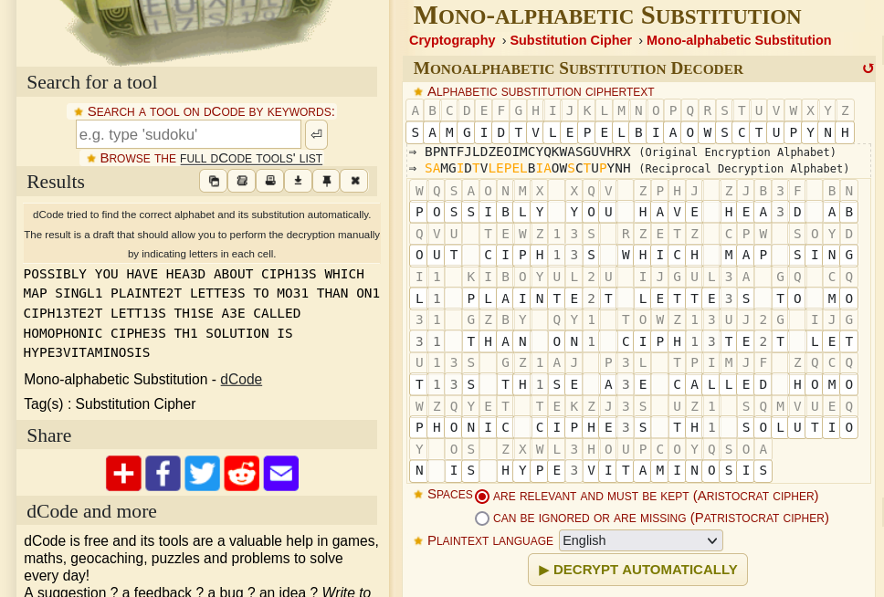

## Challenge

I found this fruity message. Can you decrypt it?

🥦🥝🍋🍊🥭🍌🫑🧅 🧅🥝🥖 🍉🍠🥬🫐 🍉🫐🥔🥥🍈 🥔🍌🥝🥖🍏 🥐🍍🥦🍉🍇🥥🍋 🥑🍉🍍🥐🍉 🍅🍠🥦 🍋🥭🍓🍐🌶🍇 🥕🌶🥔🥭🍓🍏🍒🍆🍏 🌶🫐🍎🍏🍒🥥🍊 🍎🥝 🍅🥝🥥🍇 🍎🍉🥔🍓 🥝🍓🍇 🥐🥭🥦🍉🍇🥥🍏🫐🍆🍎 🌶🫐🍎🍏🍇🥥🍋 🍎🍉🍇🍊🫐 🍠🥥🍒 🥐🍠🌶🫑🫐🍈 🍉🥝🍅🥝🥦🍉🥝🍓🍍🥐 🥐🍍🥕🍉🫐🥥🍋 🍏🍉🍇 🍋🥝🫑🥖🍏🍍🥝🍓 🥭🍋 🍉🧅🥦🍒🥥🥬🥭🍏🍠🍅🥭🍓🥝🍋🥭🍊

🚩 Flag

- lowercase only, no spaces
- wrap into he2023{ and }
- example: he2023{exampleflagonly}

**Hints**

- the plaintext consist of lowercase letters (and spaces) only
- there are more than 26 symbols
- 🍏 == 🍎


## Solution

Ok, so we get a bunch of fruits, spaces seem to be in the right places. Substitution cipher? But we have more that 26 characters. Let's convert it to ASCII characters to make it easier to work with.


```python
ct = "🥦🥝🍋🍊🥭🍌🫑🧅 🧅🥝🥖 🍉🍠🥬🫐 🍉🫐🥔🥥🍈 🥔🍌🥝🥖🍏 🥐🍍🥦🍉🍇🥥🍋 🥑🍉🍍🥐🍉 🍅🍠🥦 🍋🥭🍓🍐🌶🍇 🥕🌶🥔🥭🍓🍏🍒🍆🍏 🌶🫐🍎🍏🍒🥥🍊 🍎🥝 🍅🥝🥥🍇 🍎🍉🥔🍓 🥝🍓🍇 🥐🥭🥦🍉🍇🥥🍏🫐🍆🍎 🌶🫐🍎🍏🍇🥥🍋 🍎🍉🍇🍊🫐 🍠🥥🍒 🥐🍠🌶🫑🫐🍈 🍉🥝🍅🥝🥦🍉🥝🍓🍍🥐 🥐🍍🥕🍉🫐🥥🍋 🍏🍉🍇 🍋🥝🫑🥖🍏🍍🥝🍓 🥭🍋 🍉🧅🥦🍒🥥🥬🥭🍏🍠🍅🥭🍓🥝🍋🥭🍊"

ct2 = ct.replace(" ","")

fruits = set(ct2)
fruitstr = "".join (fruits)
alphanum = "abcdefghijklmnopqrstuvwxyz123"

t = ct.maketrans(fruitstr,alphanum)

print(ct.translate(t))
```

this gives us a ciphertext of

```
wqsaonmx xqv zphj zjb3f bnqvu tewz13s rzetz cpw soydi1 kiboyul2u ijgul3a gq cq31 gzby qy1 towz13uj2g ijgu13s gz1aj p3l tpimjf zqcqwzqyet tekzj3s uz1 sqmvueqy os zxwl3houpcoyqsoa
```

Now we enter this in [dcode.fr substitution solver](https://www.dcode.fr/monoalphabetic-substitution). And the automatic analyzer gets us close, we fiddle a bit more with the mapping between plaintext and ciphertext, quickly realizing that differnt ciphertext letters map to the same plaintext letter, so we are dealing with a homophonic cipher.



The text we get is

```
POSSIBLY YOU HAVE HEA3D ABOUT CIPH13S
WHICH MAP SINGL1 PLAINTE2T LETTE3S TO
MO31 THAN ON1 CIPH13TE2T LETT13S TH1SE
A3E CALLED HOMOPHONIC CIPHE3S TH1
SOLUTION IS HYPE3VITAMINOSIS
```

from this we can see that the missing mappings are `1=E, 2=X, 3=R`, and so the full message reads:

```
POSSIBLY YOU HAVE HEARD ABOUT CIPHERS
WHICH MAP SINGLE PLAINTEXT LETTERS TO
MORE THAN ONE CIPHERTEXT LETTERS THESE
A3E CALLED HOMOPHONIC CIPHERS THE
SOLUTION IS HYPERVITAMINOSIS
```

and we find our flag!

