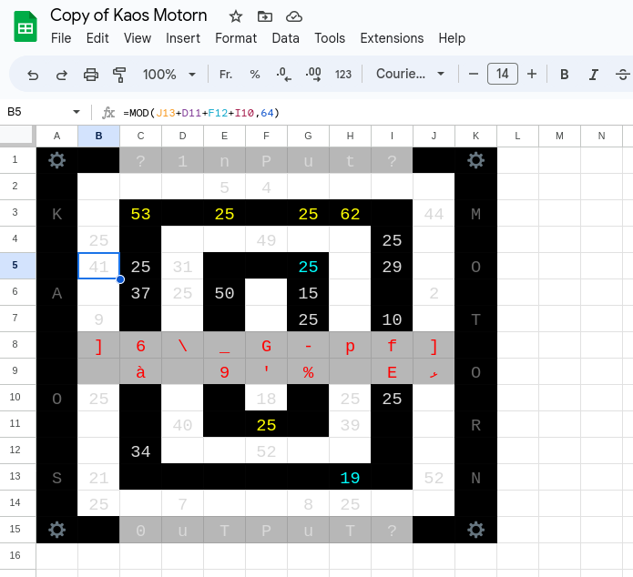

## Challenge

What?
Is?
This?
[Kaos?](https://docs.google.com/spreadsheets/d/1yxWyraRKss6Wqbw_ejuws6v92vwdE1AEAP1Cc8oec7M/edit?usp=sharing)

**Hint:** Inputs are in the range 0..9.

## Solution

We get a link to a mysterious Google spreadsheet:

We make our [own copy](https://docs.google.com/spreadsheets/d/1rhnP4bK9lTDUk5FKnVthlbLbxPjLboOfSJk-rjI-nmo/edit?usp=sharing) that we can fool around with
