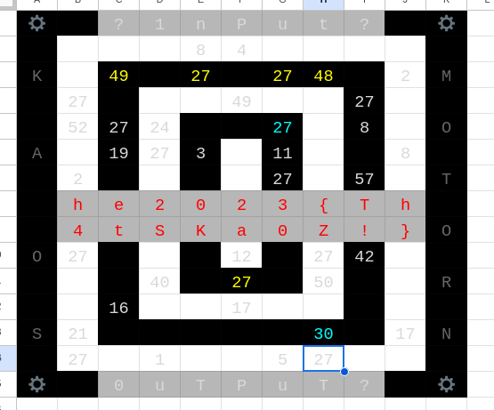

## Challenge

What?
Is?
This?
[Kaos?](https://docs.google.com/spreadsheets/d/1yxWyraRKss6Wqbw_ejuws6v92vwdE1AEAP1Cc8oec7M/edit?usp=sharing)

**Hint:** Inputs are in the range 0..9.

## Solution

We get a link to a mysterious Google spreadsheet:


We make our [own copy](https://docs.google.com/spreadsheets/d/1rhnP4bK9lTDUk5FKnVthlbLbxPjLboOfSJk-rjI-nmo/edit?usp=sharing) that we can fool around with


Basically, there are a set of equations, converting a set of input numbers (along the outside ring), and leading to a flag (in the middle). Assumuing it starts with `he2023`, we get the following equations for the first output character

```
h = 52 + B5                        = 104 // should be 104 for 'h'
B5 = J13+D11+F12+I10   % 64        = 52
J13 = D14+B7*E2        % 64
D11 = E2*G14           % 64
F12 = E2*B7+D14        % 64
I10 = J6*G14+B7        % 64

D14 = 7
B7 = 9
E2 = 5
G14 = 8
J6 = 2
```

Presumable we can alter the values in cells D14,B7,E2,G14,J6 to get our flag?

We will need to do this for more of the known characters then

ok, lets do the same for `e`

```
e = 44 + I7  # must be 101
I7 = F12+D11*G6+H3     # must be 57
F12 = E2 * B7+ D14   % 64
D11 = E2 * G14       % 64
G6 = G14*B7+D14      % 64
H3 = B7*J6*7         % 64
```

Since we know the inputs are in range of of 0-9, we write a small script to see how many possibilities this leaves us with

```python
options = 0
for d14 in range(0,9):
  for b7 in range(0,9):
    for e2 in range(0,9):
      for g14 in range(0,9):
        for j6 in range(0,9):

          # equations for h
          i10 = (j6*g14+b7)      % 64
          f12 = (e2*b7+d14)      % 64
          d11 = (e2*g14)         % 64
          j13 = (d14 +b7*e2)     % 64
          b5 = (j13+d11+f12+i10) % 64

          # equations for e
          h3 = (b7*j6*7)        % 64
          g6 = (g14*b7+d14)     % 64
          i7 = (f12+d11*g6+h3)  % 64

          if b5 == 52 and i7 == 57:
            options += 1
            print("d14: "+str(d14)+" b7: "+str(b7)+" e2: "+str(e2)+" g14: "+str(g14)+" j6: "+str(j6))

print("Options: "+ str(options))
```

This still leaves us with 18 differnt options for the 5 inputs, so we add another restriction for the next character of the string we know (`2`)


```
'2' = 48+J3  # should be 50
J3 =  F12+D11+D5+F4    % 64        # should be 2
F12 = see above
D11 = see above
D5 = E2+J6+B7+D14+G14
F4 = E2*G14+D14+J6
```

so we add this to our script:

```python
options = 0
for d14 in range(0,9):
  for b7 in range(0,9):
    for e2 in range(0,9):
      for g14 in range(0,9):
        for j6 in range(0,9):

          # equations for h
          i10 = (j6*g14+b7)      % 64
          f12 = (e2*b7+d14)      % 64
          d11 = (e2*g14)         % 64
          j13 = (d14 +b7*e2)     % 64
          b5 = (j13+d11+f12+i10) % 64

          # equations for e
          h3 = (b7*j6*7)        % 64
          g6 = (g14*b7+d14)     % 64
          i7 = (f12+d11*g6+h3)  % 64

          # equations for '2'
          d5 = (e2+j6+b7+d14+g14) % 64
          f4 = (e2*g14+d14+j6)    % 64
          j3 = (f12+d11+d5+f4)    % 64

          if b5 == 52 and i7 == 57 and j3 == 2:
            options += 1
            print("d14: "+str(d14)+" b7: "+str(b7)+" e2: "+str(e2)+" g14: "+str(g14)+" j6: "+str(j6))

print("Options: "+ str(options))
```

and this leaves us with just 1 option for input cells:

```
D14: 1
B7:  2
E2:  8
G14: 5
J6:  8
```

And when we fill that in our spreadsheet, we get the full flag:



