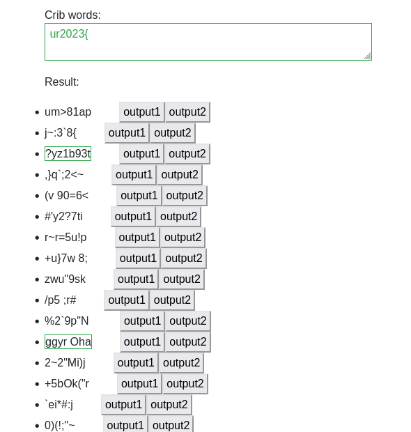
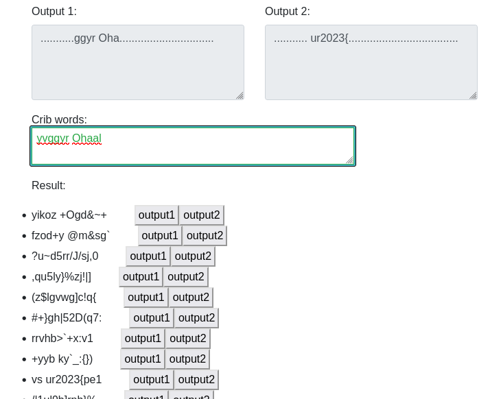

## Challenge

Oh no! Someone encrypted my poem, using a One-Time-Pad.

Good news: Each line was encrypted individually, with the same key.

Bad news: The plaintext was changed somehow, before encryption.

[cipher.txt](writeupfiles/cipher.txt)

## Solution

```
The Little Rabbit Ohaal

626b34041c11143a444e1b342c0e341036592d39044a0c102505145b57030c1b0e15290a533231071f71040465221023026b
7a2a304a14115a311d5b4d3d320e66520a11392e124a1000621a414310014e070245350f147431150a7105142273103a4328132f01181e
733e334a0615513203170a263d1632100f506c3f1d18461c2015554316074e1f1c47264c257427061f71080a2273103a4328043c47
626b2b081412463144411e733e0574004b0237280d5b09393315004103050f2a5d6a240943272513592c4a142373153c11670534050d1e
```
{: file='crypto.txt'}


The `Ohaal` in the file is rot13 for `Bunny`, so we're likely looking for rot13'd plaintext?

We try a cribdragging approach but look for rot13 words instead of plain English

The challenge mentions a poem, so it seems likely the last line contains our flag.

We us an online [crib-dragging tool](https://toolbox.lotusfa.com/crib_drag/), and since it only works
for pairs of ciphertexts, we open a window for each combination of lines that involves the 4th line,
since we are primarily interested in the flag.

**Step 1**

We start by trying the crib `he2023{` (we need to provide it in ROT13, so we use `ur2023{`) and see if
we get anything that looks like it might be valid ROT13 text

Here is a screenshot of the online tool we used:


And this crib gives us the following results



Among the results we see `ggyr Oha`, which looks potentiall like RO13 English? And indeed, ROT13 of that is `ttle Bun` ..could very well be "little Bunny"!
("Ohaal" was also in our ciphertext file!). We set that as part of output 1 (since we theorized the fourth line, here output 2, contains the crib we used)

**Step 2**

Next we guess that the plaintext is indeed `little Bunny`, ROT13 that (`yvggyr Ohaal`), and now use that as the crib, so that hopefully we can reveal some
of the letters around our `he2023{` string:



We see that `vs ur2023{pe1` is among the results, which is `is he2023{cr1` ROT13 decoded, that looks promising!

**Step 3**

We can keep guessing here, maybe `is he2023{cr1` -> `flag is he2023{cr1b`? ..but we can also fill in what we know using one of the other ciphertext lines

For example, using a combination of line 2 and 4, and using `vs ur2023{pe1` as a crib, we get a result of  `l nyy bs uvz` which translates to `y all of him`

**Step 4**

We continue in this way until we slowly reveal all the plaintext, doing this for the various different combinations of cipher text lines simultaneously, slowly
extending and guessing more plaintext, seeing if it works in the other encrypted lines.

**Final**

After a while we are able to fully decrypt the 4 messages:
```
626b34041c11143a444e1b342c0e341036592d39044a0c102505145b57030c1b0e15290a533231071f71040465221023026b
v unir n yvggyr Ohaal jvgu n pbng nf fbsg nf qbja
i have a little Bunny with a coat as soft as down

7a2a304a14115a311d5b4d3d320e66520a11392e124a1000621a414310014e070245350f147431150a7105142273103a4328132f01181e
naq arneyl nyy bs uvz vf juvgr rkprcg bar ovg bs oebja
and nearly all of him is white except one bit of brown

733e334a0615513203170a263d1632100f506c3f1d18461c2015554316074e1f1c47264c257427061f71080a2273103a4328043c47
gur svefg guvat va gur zbeavat jura V trg bhg bs orq
the first thing in the morning when I get out of bed

626b2b081412463144411e733e0574004b0237280d5b09393315004103050f2a5d6a240943272513592c4a142373153c11670534050d1e
v jbaqre vs ur2023{pe1o_qe4ttva_4_ce0svg!} vf gur synt
i wonder if he2023{cr1b_dr4ggin_4_pr0fit!} is the flag
```

