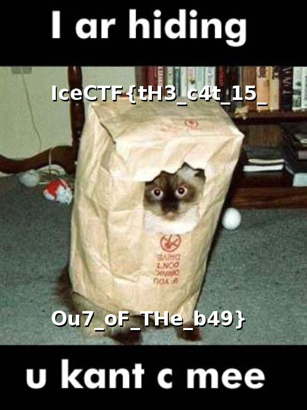

## Challenge

[This][1] site seems awfully suspicious, do you think you can figure out
what they're hiding?

## Solution

We get to a web page with just an image

    <!DOCTYPE html>
    <html>
        <head>
            <title>IceCTF 2016 - Move Along</title>
            <link rel="stylesheet" type="text/css" href="css/main.css">
        </head>
        <body>
            </img>
        </body>
    </html>
{: .language-html}

we explore a bit and find that the directory `move_along` has another
image in it

which contains the flag

[1]: http://move-along.vuln.icec.tf/
