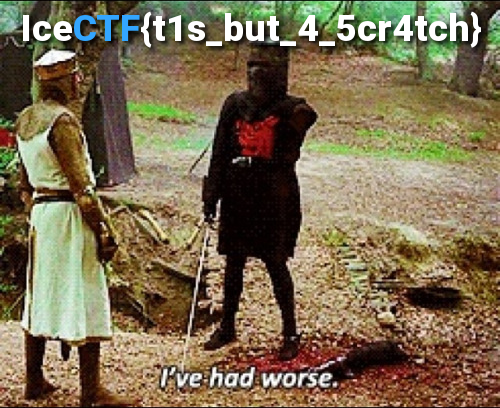

## Challenge

We intercepted this image, but it must have gotten corrupted during the
transmission. Can you try and fix it? corrupt.png

## Solution

    $ pngcheck -v corrupt.png
    File: corrupt.png (469363 bytes)
      File is CORRUPTED.  It seems to have suffered EOL conversion.
      It was probably transmitted in text mode.
    ERRORS DETECTED in corrupt.png

We open it in a hex editor and see that the [header is corrupted][1],
and only thing we had to do was fix this header to fix the file

[1]: https://en.wikipedia.org/wiki/Portable_Network_Graphics
