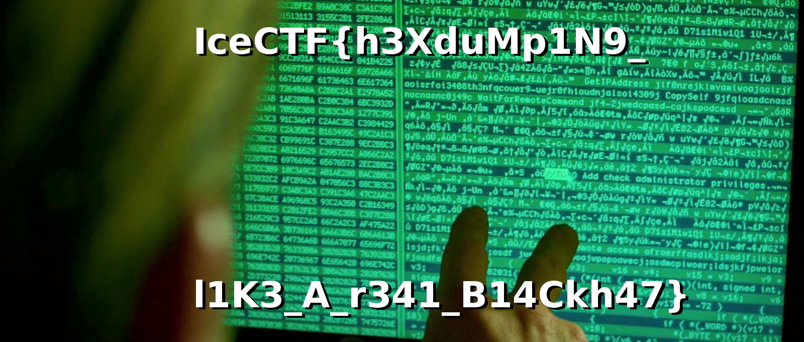

## Challenge

Thor has been staring at this for hours and he can't make any sense out
of it, can you help him figure out what it is?
[thor.txt](./writeupfiles/thor_7101f3b9690d5dc6c3afefa49d82e0526b278ec1c564139369ad22c28721d4cf.txt)

## Solution

Looking at the file it looks like the output of `od -tx2` or `xxd`. A
bit  
of googling reveals that `xxd` has a flag `-r` which reverses the
output.  
(I.e. `cat a | xxd | xxd -r > b`, `a == b`)

Once this is done

    $ cat writeupfiles/thor_7101f3b9690d5dc6c3afefa49d82e0526b278ec1c564139369ad22c28721d4cf.txt | xxd -r > tmp
    $ file tmp
    tmp: lzip compressed data, version: 1
    # Apparently I need "lzip" and the file to be named tmp.lz to decompress nicely. There's a special circle of hell for software which cares about file extensions.
    $ cat tmp | lzip -d > tmp2
    $ file tmp2
    tmp2: JPEG image data, JFIF standard 1.01, resolution (DPI), density 72x72, segment length 16, Exif Standard: [TIFF image data, little-endian, direntries=5, xresolution=74, yresolution=82, resolutionunit=2, software=GIMP 2.8.18], progressive, precision 8, 1600x680, frames 3
{: .language-console}

## Flag

    IceCTF{h3XduMp1N9_l1K3_A_r341_B14Ckh47}

