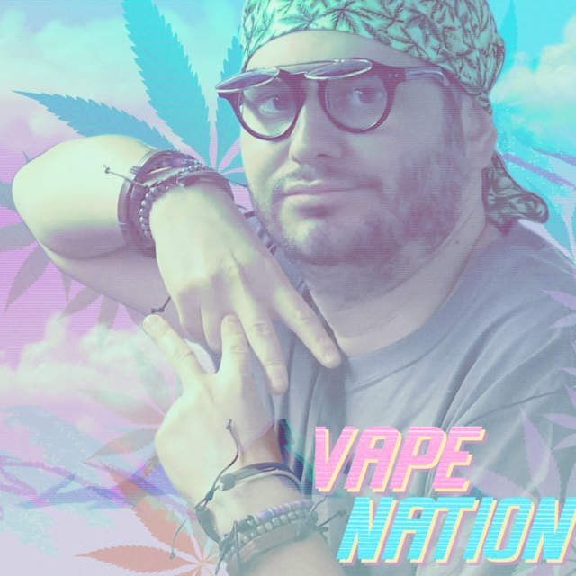

## Challenge

Go Green!

## Solution

The hint makes us suspect that we need to look at the green channel,
manual inspection show it contains mostly even values, but some uneven
ones, so we try outputting where the uneven ones are

    from PIL import Image

    img = Image.open('vape_nation.png').convert('RGB')
    pixels_orig = img.load()

    (w,h)=img.size

    outimg = Image.new( 'RGB', (w,h), "white")
    pixels_out = outimg.load()

    for i in range(0,h):
        for j in range(0,w):
          (r,g,b) = pixels_orig[i,j]
          if g%2 != 0:
              pixels_out[i,j] = (0,0,0)

    outimg.save("vape_nation_out.png","png")
{: .language-python}

which outputs the following image containing our flag:

