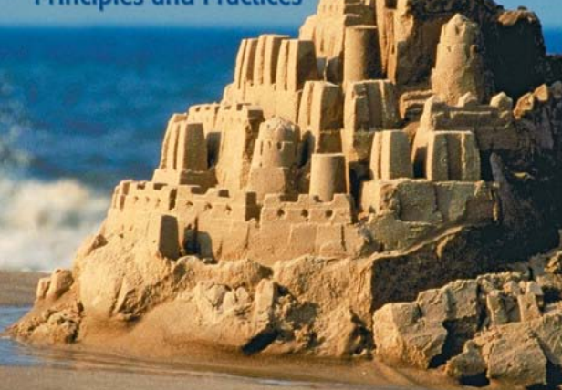

## Challenge

We found this very mysterious image, it doesn't look complete and there
seems to be something hidden on it... does this mean anything to you?
sandcastle.png. This flag is not in the standard flag format, add
IceCTF\{} to the message when you've found it. The flag is all
lowercase, and contains no special characters.

## Solution

    $ exiftool sandcastle.png                               [15-08-16 14:04:42]
    ExifTool Version Number         : 10.10
    File Name                       : sandcastle.png
    Directory                       : .
    File Size                       : 381 kB
    File Modification Date/Time     : 2016:08:12 22:24:08+02:00
    File Access Date/Time           : 2016:08:12 22:24:08+02:00
    File Inode Change Date/Time     : 2016:08:12 22:24:08+02:00
    File Permissions                : rwxrwxrwx
    File Type                       : PNG
    File Type Extension             : png
    MIME Type                       : image/png
    Image Width                     : 616
    Image Height                    : 428
    Bit Depth                       : 8
    Color Type                      : RGB
    Compression                     : Deflate/Inflate
    Filter                          : Adaptive
    Interlace                       : Noninterlaced
    Pixels Per Unit X               : 3780
    Pixels Per Unit Y               : 3780
    Pixel Units                     : meters
    Modify Date                     : 2016:06:19 11:14:52
    Comment                         : 58-7-9.210-13-2.67-3-16.85-17-15.305-18-4.83-12-18.75-8-15.47-4-2.83-20-11.208-6-6.85-11-6.75-7-3.106-9-14
    Image Size                      : 616x428
    Megapixels                      : 0.264

the comment in the exifdata looks like it could be a book cipher, we
identified the image to be part of the cover to the fourth edition of
*Cryptography and Network Security* by William Stallings.

    58-7-9.210-13-2.67-3-16.85-17-15.305-18-4.83-12-18.75-8-15.47-4-2.83-20-11.208-6-6.85-11-6.75-7-3.106-9-14

    page-line-character?
    page-line-word (and then first letter of word)?

    58-7-9
    210-13-2
    67-3-16
    85-17-15
    305-18-4
    83-12-18
    75-8-15
    47-4-2
    83-20-11
    208-6-6
    85-11-6
    75-7-3
    106-9-14
