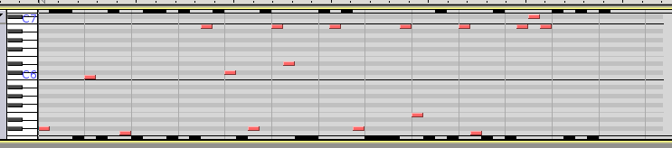
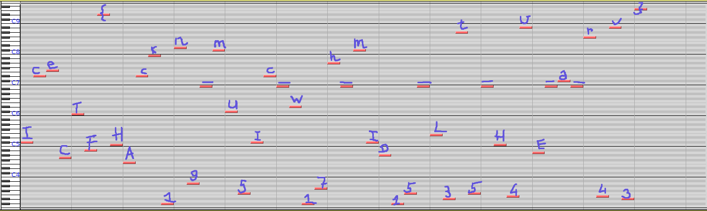

## Challenge

Those who came before me lived through their vocations From the past
until  
completion, they'll turn away no more And still I find it so hard to say
what I  
need to say But I'm quite sure that you'll tell me just how I should
feel  
today.

## Solution

The attached file was a MIDI file. When imported into Audacity, it
displays:

We notice that the number of keys between the first note and the second
note is exactly the difference between `I` and `c` in ASCII, so we work
out the rest as well:

## Flag

    IceCTF{HAck1n9_mU5Ic_w17h_mID15_L3t5_H4vE_a_r4v3}

