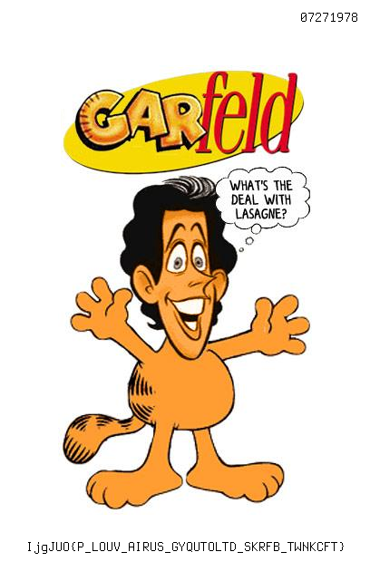

## Challenge

You found the marketing campaign for a brand new sitcom. Garfeld! It has
a secret message engraved on it. Do you think you can figure out what
they're trying to say?

## Solution

The image reads:

`IjgJUO{P_LOUV_AIRUS_GYQUTOLTD_SKRFB_TWNKCFT}`

Looks like the flag but encrypted somehow

Turns out to be vigenere with key `ahchbjhi`

we later realized that the `07271978` at the top of the image is a hint
for this key with A=0,B=1 etc

## Flag

    IceCTF{I_DONT_THINK_GRONSFELD_LIKES_MONDAYS}

