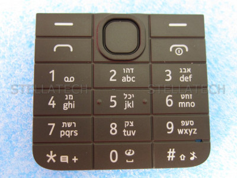

**Challenge**  
We got word from a friend of ours lost in the depths of the Andorran
jungles! Help us figure out what he is trying to tell us before its too
late!

Note: The flag here is non-standard, in the result you should end up
with some words! The flag is IceCTF\{<words, lowercase, including
spaces>}

**Solution**  
We're given a file with hex bytes, we can use `xxd` to covnert that into
the appropriate characters/bytes:

    xxd -r -p comms.txt > out.txt

Which is full of some fun symbols?

    ⨅]]⌞⌞⌟[⨆]⌟]]]⨆⨆⨆⌜[[[⌝⌝⌝⌞⌝⌝⌝⌝⨆⌝⌝⌝⌞⌞⌝⌝⌝⌝⌟⌝⌝⨅⨅⌞⌞⨆[]]]⌝⌝⌝⌝]]⌟[[[⌝⌝⌝⌝⌟⌝⌝⌝⌝]]]⌞⌞⌞⌝⌝⌝⨆]⌞⌞

combining pigpen cipher with T9 we translate this to:

  

    ⨅ ]] ⌞⌞ ⌟ [ ⨆ ] ⌟ ]]] ⨆⨆⨆ ⌜ [[[ ⌝⌝⌝ ⌞ ⌝⌝⌝⌝ ⨆ ⌝⌝⌝ ⌞⌞ ⌝⌝⌝⌝ ⌟ ⌝⌝ ⨅⨅ ⌞⌞ ⨆ [ ]]] ⌝⌝⌝⌝ ]] ⌟ [[[ ⌝⌝⌝⌝ ⌟ ⌝⌝⌝⌝ ]]] ⌞⌞⌞ ⌝⌝⌝ ⨆ ] ⌞⌞
    t h  e  _ m a g _ i   c   w o   r   d s    a r   e  s    _ q  u  e  a m i   s    h  _ o   s    _ s    i   f   r   a g e

method explained:

* `⨅` in pigpen would signify `H`, when we instead combine this with T9,
  it would mean the letter `t` (one press on the number `8`)
* `]]` would be the `dd` in classic pigpen, but now signifies 2 presses
  on the number `4`, which would be an `h`
* `⌞⌞` is two presses on the 3, so a letter `e`
* etc

This gives us the sentence

    the magic words are squeamish ossifrage

Which was the solution to a challenge ciphertext set by the inventor of
RSA in 1977 ([link][1])

## Flag

    IceCTF{squeamish ossifrage}

[1]: https://en.wikipedia.org/wiki/The_Magic_Words_are_Squeamish_Ossifrage
