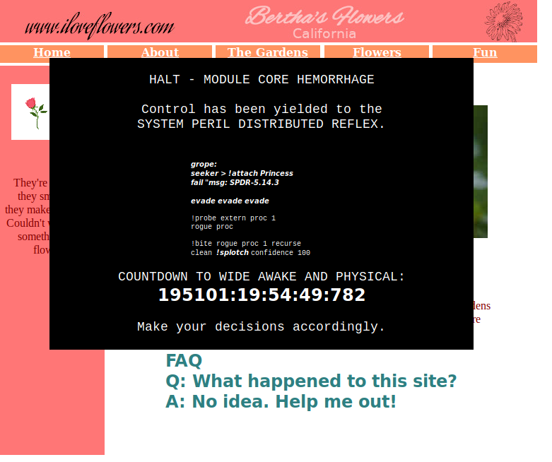

## Challenge

I stumbled on to this strange website. It seems like a website made by a
flower enthusiast, but it appears to have been taken over by someone...
or something.

Can you figure out what it's trying to tell us?

https://static.icec.tf/iloveflowers/

## Solution

website:

The website seems to be a reference to Halo
(https://en.wikipedia.org/wiki/I\_Love\_Bees)

We download the [entire
website](writeupfiles/static.icec.tf/iloveflowers/)

    wget -m https://static.icec.tf/iloveflowers/

After much searching, the flag turns out to be the favicon gif file:

We see nothing with `strings` or `binwalk` or in the exifdata, but after
we extract all the frames to png images

    convert -coalesce favicon.gif out%03d.png

and run examine the exifdata

    $ exiftool out*.png
    ======== out-0.png
    ExifTool Version Number         : 10.60
    File Name                       : out-0.png
    Directory                       : .
    File Size                       : 746 bytes
    File Modification Date/Time     : 2018:09:16 18:45:41+02:00
    File Access Date/Time           : 2018:09:16 18:45:56+02:00
    File Inode Change Date/Time     : 2018:09:16 18:45:41+02:00
    File Permissions                : rw-rw-r--
    File Type                       : PNG
    File Type Extension             : png
    MIME Type                       : image/png
    Image Width                     : 16
    Image Height                    : 16
    Bit Depth                       : 8
    Color Type                      : Palette
    Compression                     : Deflate/Inflate
    Filter                          : Adaptive
    Interlace                       : Noninterlaced
    Gamma                           : 2.2
    White Point X                   : 0.3127
    White Point Y                   : 0.329
    Red X                           : 0.64
    Red Y                           : 0.33
    Green X                         : 0.3
    Green Y                         : 0.6
    Blue X                          : 0.15
    Blue Y                          : 0.06
    Palette                         : (Binary data 285 bytes, use -b option to extract)
    Background Color                : 59
    Modify Date                     : 2018:09:06 15:20:54
    Datecreate                      : 2018-09-16T18:41:49+02:00
    Datemodify                      : 2018-09-06T15:20:54+02:00
    Image Size                      : 16x16
    Megapixels                      : 0.000256
    ======== out-100.png
    ExifTool Version Number         : 10.60
    File Name                       : out-100.png
    
    [..]
{: .language-bash}

we see that they each have binary metadata embedded that we can extract
using the -b option:

    $ exiftool -b out*.png > outbinary
{: .language-bash}

this file doesnt look like much, we could probably clean it up, but a
`strings` already gives us the flag:

    $ strings outbinary | grep Ice
    IceCTF{MY_FAVORITE_ICON}
    IceCTF{MY_FAVORITE_ICON}
    IceCTF{MY_FAVORITE_ICON}
    IceCTF{MY_FAVORITE_ICON}
    IceCTF{MY_FAVORITE_ICON}
    IceCTF{MY_FAVORITE_ICON}
    IceCTF{MY_FAVORITE_ICON}
    IceCTF{MY_FAVORITE_ICON}
    IceCTF{MY_FAVORITE_ICON}
    IceCTF{MY_FAVORITE_ICON}
    IceCTF{MY_FAVORITE_ICON}
    IceCTF{MY_FAVORITE_ICON}
    IceCTF{MY_FAVORITE_ICON}
    IceCTF{MY_FAVORITE_ICON}
    IceCTF{MY_FAVORITE_ICON}
    IceCTF{MY_FAVORITE_ICON}
{: .language-bash}

## Flag

    IceCTF{MY_FAVORITE_ICON}

