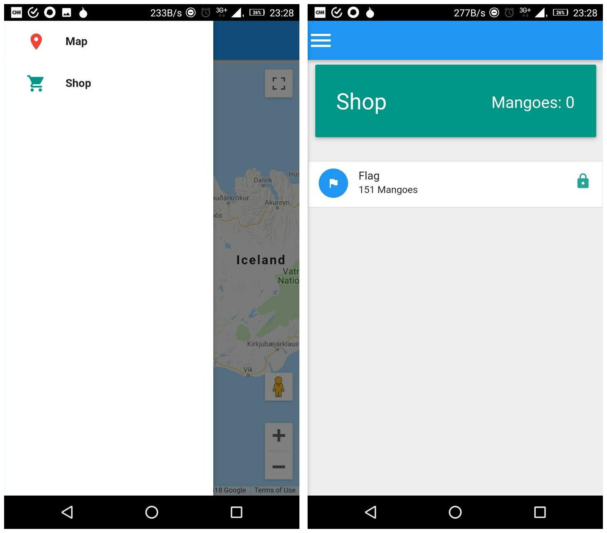

## Challenge

I love these new AR games that have been coming out recently, so I
decided that I would make my own with my favorite fruit! The Mango!

Can you poke 151 mangos?

NOTE Make sure that you allow the app access to your GPS location and
camera otherwise the app will not work. You can do that in App
Permissions in Settings.

[apk](writeupfiles/pokemango.apk)

## Solution

installing the app gives a map and a shop menu where it appears you need
to find 151 mangoes to get the flag

We decompile the app:

    apktool decode pokemango.apk

## Flag

