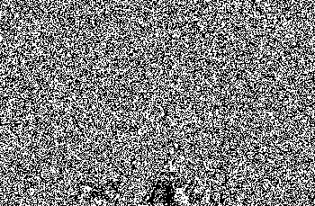
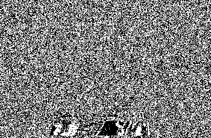
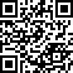

## Challenge

I joined a couple of hacking channels on IRC and I started recieving
these strange messages. Someone sent me this image. Can you figure out
if there's anything suspicous hidden in it?

## Solution

Nothing in exif data, nothing with binwalk, nothing obvious, so we check
the LSB of each challenge. The blue channel seems to consist of only odd
number, this seems suspicious so we investigate furter. Mapping the LSB
of each of the RGB channels to black or white gives the following
result:

    from PIL import Image
    
    img = Image.open('drumbone.png')
    pixels = img.load()
    
    (w,h) = img.size
    print(w,h)
    
    outimg_r = Image.new('RGB', (w,h), "white")
    outimg_g = Image.new('RGB', (w,h), "white")
    outimg_b = Image.new('RGB', (w,h), "white")
    
    pixels_r = outimg_r.load()
    pixels_g = outimg_g.load()
    pixels_b = outimg_b.load()
    
    for i in range(0,w):
      for j in range(0,h):
        (r,g,b) = pixels[i,j]
        if not r&1:
            pixels_r[i,j] = (0,0,0)
        if not g&1:
            pixels_g[i,j] = (0,0,0)
        if not b&1:
            pixels_b[i,j] = (0,0,0)
    
    outimg_r.save("outimg_r.png")
    outimg_g.save("outimg_g.png")
    outimg_b.save("outimg_b.png")
{: .language-python}

This gives us the following images:

  
  

Bingpot! the blue channel seems to contain a QR code!

We clean up the image a bit to get our flag:

    from PIL import Image
    
    img = Image.open('drumbone.png')
    pixels = img.load()
    
    (w,h) = img.size
    outimg_b = Image.new('RGB', (outw,outh), "white")
    pixels_b = outimg_b.load()
    
    wout = -1
    hout = -1
    for i in range(1,w,6):
      wout += 1
      hout = -1
      for j in range(1,h,6):
        hout+=1
        (r,g,b) = pixels[i,j]
        if not b&1:
            pixels_b[wout,hout] = (0,0,0)
    
    outimg_b = outimg_b.resize((10*outw,10*outh))
    outimg_b.save("outimg_b.png")
{: .language-python}

## Flag

    IceCTF{Elliot_has_been_mapping_bits_all_day}

