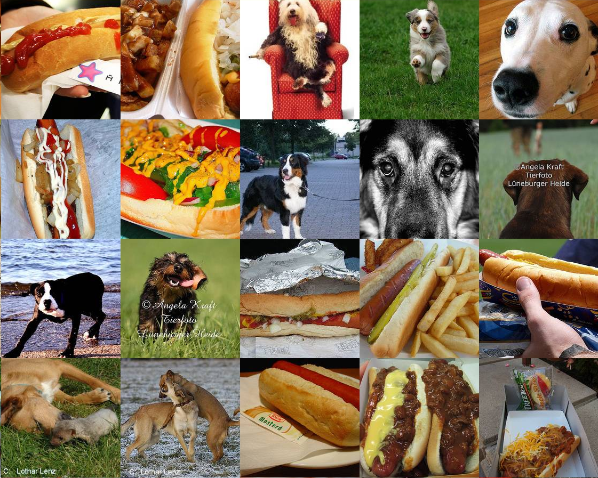
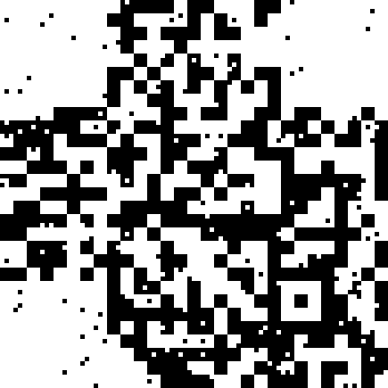
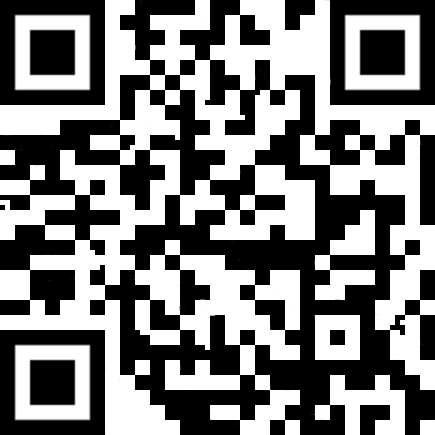

## Challenge

According to my friend Zuck, the first step on the path to great power
is to rate the relative hotness of stuff... think Hot or Not.

  
(this is a scaled-down image, original was >70Mb)

## Solution

Looking at the image more closely, we see it is made up of a series of
subimages of either dogs or hotdogs.

Looks like we have to classify the subimages into hotdogs or regular
dogs..

First we split the image up into all its subimages with imagemagick

    $ convert -crop 224x224 +repage hotdogs/out%04d.jpg
{: .language-bash}

Next, we can use [Clarifai][1] to do the image recognition to determine
whether the subimages are dogs or hotdogs. Clarifai gives you 5000 free
operations per month, but since we have a little over 7500 subimages, we
needed two accounts to perform this analysis.

    import os
    import json
    from PIL import Image
    from clarifai.rest import ClarifaiApp
    from clarifai.rest import Image as ClImage
    
    app = ClarifaiApp(api_key='f7f15032b1a04f1fafc2092c63e50e9f')
    model = app.models.get('general-v1.3')
    
    # detect image contents for all subimages
    pixels = []
    for i in range(0,87*87):
        image = ClImage(file_obj=open("hotdogs/out"+str(i).zfill(4)+".jpg", 'rb'))
        response = model.predict([image])
    
        hot = False
        concepts = response['outputs'][0]['data']['concepts']
        for concept in concepts:
            if 'food' in concept['name']:
                hot = True
        pixels += [1 if hot == True else 0]
    
    # make qr code image
    (w,h)=(87,87)
    
    outimg = Image.new( 'RGB', (w,h), "white")
    pixels_out = outimg.load()
    
    p = 0
    for i in range(0,h):
        for j in range(0,w):
            print(pixels[p])
            if pixels[p] == 1:
                pixels_out[j,i]=(0,0,0)
            else:
                pixels_out[j,i]=(255,255,255)
            p += 1
    
    outimg = outimg.resize((5*w,5*h))
    outimg.save("pixels_outimg2.png","png")
{: .language-python}

This outputs the following image:

This is clearly a QR code, it is just missing the corner anchors. We add
these and clean the image up slightly:

## Flag

    IceCTF{h0td1gg1tyd0g}

[1]: https://clarifai.com
