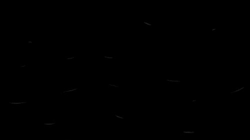

## Challenge

Here's a picture of my favorite vegetable. I hope it doesn't make you
cry.

## Solution

After a lot of experimenting, we find out we can uncover a hidden
message from the image using steghide:

    $ steghide extract -sf rabbithole.jpg
    Enter passphrase: <onion>
    wrote extracted data to "address.txt".
{: .language-bash}

whoo! contents of the file `address.txt` is:

    wsqxiyhn23zdi6ia

might be an `.onion` link? Opening `http://wsqxiyhn23zdi6ia.onion` with
a tor browser (or via https://onion.link/) gives:

[rabbithole.html](writeupfiles/rabbithole.html)

    <!DOCTYPE HTML>
    <html>
        <head>
            <title>Rabbit Hole</title>
    	<meta charset="UTF-8">
            
        </head>
        <body>
            

                
            

            
聐㠃㐊㐀㐀膜舕㐀㐀㐀㐀㐀㐀㐵㐜ꕳ𓅡𔕨𓁯𓅤   [..] 

             

                 
             

        </body>
    </html>
{: .language-html}

We find nothing in the images, but after some hints we find that the
chinese characters are [base65536][1]

[file with just the characters](writeupfiles/rabbithole_characters.txt)

    # pip install base65536

    import base65536

    with open('rabbithole_characters.txt','r') as f:
        ct = f.readline().rstrip().replace(' ','')

    with open('rabbithole_out','wb') as f2:
        f2.write(base65536.decode(ct))
{: .language-python}

which turns out to be an [epub](writeupfiles/rabbithole_out.epub) on
cell phone hacking. Searching the contents for the flag gives it to us

## Flag

    IceCTF{if_you_see_this_youve_breached_my_privacy}

[1]: https://github.com/Parkayun/base65536
