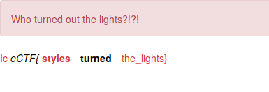

## Challenge

Help! We're scared of the dark!

https://static.icec.tf/lights\_out

## Solution

We see a black page

with source:

    <!doctype html>
    <html>
        <head>
            <meta charset="utf-8" />
            <title>Lights out!</title>
            <link rel="stylesheet" href="main.css" />
        </head>
        <body>
            
Who turned out the lights?!?!

            

            

                <i data-hide="true"></i>
                <strong data-show="true">
                <small></small>
                </strong>
                <small></small>
            

            

        </body>
    </html>
{: .language-html}

Some fiddling with the css yields the flag

## Flag

    IceCTF{styles_turned_the_lights}

