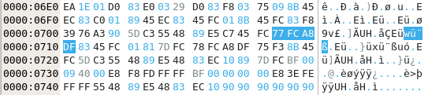

## Challenge

You find [this][1] when searching for some music, which leads you to
[be-quick-or-be-dead-1](writeupfiles/be-quick-or-be-dead-1). Can you run
it fast enough?

You can also find the executable in
`/problems/be-quick-or-be-dead-1_3_aeb48854203a88fb1da963f41ae06a1c`.

## Solution

    $ ./be-quick-or-be-dead-1
    Be Quick Or Be Dead 1
    =====================
    
    Calculating key...
    You need a faster machine. Bye bye.

ok, sounds like we need to speed up the execution of the program. We
examine it with objdump and find  
this functions that wastes a lot of time:

    0000000000400706 <calculate_key>:
      400706:       55                      push   %rbp
      400707:       48 89 e5                mov    %rsp,%rbp
      40070a:       c7 45 fc 3c 7e d4 6f    movl   $0x6fd47e3c,-0x4(%rbp)
      400711:       83 45 fc 01             addl   $0x1,-0x4(%rbp)
      400715:       81 7d fc 78 fc a8 df    cmpl   $0xdfa8fc78,-0x4(%rbp)
      40071c:       75 f3                   jne    400711 <calculate_key+0xb>
      40071e:       8b 45 fc                mov    -0x4(%rbp),%eax
      400721:       5d                      pop    %rbp
      400722:       c3                      retq
{: .language-asm}

This function sets a value of `0x6fd47e3c`, then repeatedly adds 1 to
this value until  
it becomes equal to `0xdfa8fc78` ..if we edit the intial value to be
`0xdfa8fc77` it  
will be much faster while still reaching the same final state. We can do
this with  
a hex editor

we save, and run the program again:

    $ ./be-quick-or-be-dead-1
    Be Quick Or Be Dead 1
    =====================
    
    Calculating key...
    Done calculating key
    Printing flag:
    picoCTF{why_bother_doing_unnecessary_computation_27f28e71}

[1]: https://www.youtube.com/watch?v=CTt1vk9nM9c
