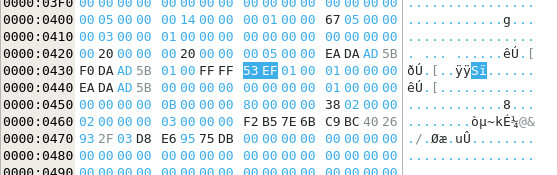

## Challenge

We salvaged a ruined Ext SuperMagic II-class mech recently and pulled
the [filesystem](writeupfiles/ext-super-magic.img) out of the black box.
It looks a bit corrupted, but maybe there's something interesting in
there.

You can also find it in
`/problems/ext-super-magic_4_f196e59a80c3fdac37cc2f331692ef13` on the
shell server.

## Solution

    $ file ext-super-magic.img
    ext-super-magic.img: data
    
    $ debugfs ext-super-magic.img
    debugfs 1.44.1 (24-Mar-2018)
    Checksum errors in superblock!  Retrying...
    ext-super-magic.img: Bad magic number in super-block while opening filesystem

Ok, so there is a bad magic number in the superblock. We look up what
the magic  
number for the superblock should be [here][1]

We need to write the value `0xef53` at bytes 56 and 57 of the
superblock. It also says the superblock always  
starts 1024 bytes from the start (`0x400`). So we open the .img file in
a hex editor, and change the  
bytes at position (`0x438`) to `0xef53` in little endian format:

Let's see if it worked:

    $ file ext-super-magic-fixed.img
    ext-super-magic-fixed.img: Linux rev 1.0 ext2 filesystem data (mounted or unclean), UUID=f2b57e6b-c9bc-4026-932f-03d8e69575db (large files)

whoo! it recognizes it as a valid file system, let's try to mount it:

    $ mkdir tst
    $ sudo mount ext-super-magic-fixed.img tst

The mounted volume contains a bunch of images, including  
one named `flag.jpg` which contains our flag:

[1]: https://wiki.osdev.org/Ext2#Superblock
