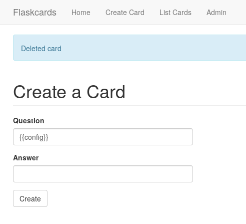
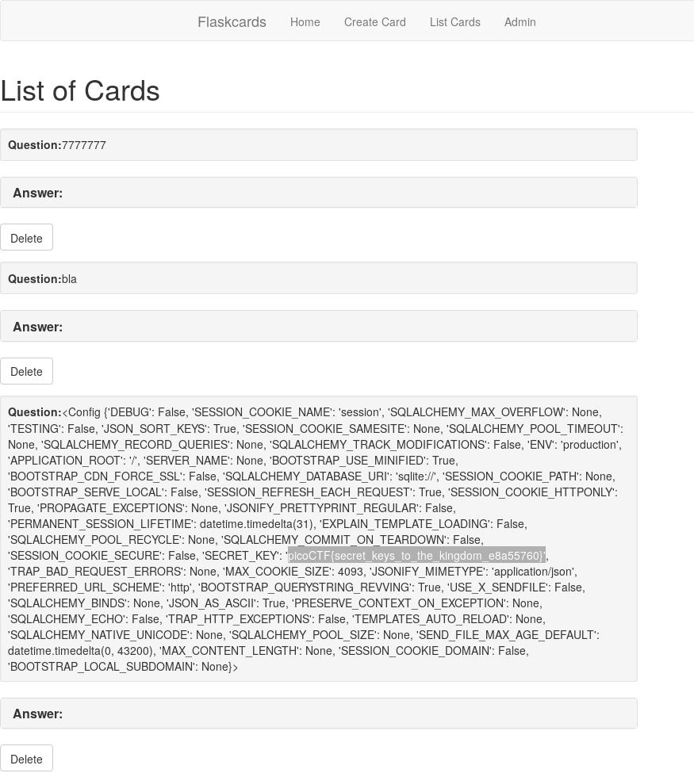

## Challenge

We found [this fishy website][1] for flashcards that we think may be
sending secrets. Could you take a look?

## Solution

The site lets us create flashcards with answers.

After some googling, we find out this might be vulnerable to SSTI
(server side template injection) attacks. We verify this by entering
`{{7*'7'}}` as a card's question or answer field, and indeed it outputs
`7777777`

Next we try to do something more interesting, we enter `{{ config }}`:

which gets us the flag:

[1]: http://2018shell1.picoctf.com:51878/
