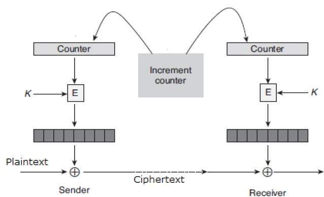

## Challenge

You came across a custom server that Dr Xernon's company eleCTRic Ltd
uses. It seems to be storing some encrypted files. Can you get us the
flag?

Connect with `nc 2018shell1.picoctf.com 56215`.

[Source.](./writeupfiles/eleCTRic.py)

## Solution

We connect to the service and find that there is a text file containing
the flag, but we must know the "share code" to open it. We can also
create files by giving name and content of file, and obtain a share
code.

    Initializing Problem...
    Welcome to eleCTRic Ltd's Safe Crypto Storage
    ---------------------------------------------
    
    Choices:
      E[n]crypt and store file
      D[e]crypt file
      L[i]st files
      E[x]it
    Please choose: i
    
    Files:
      flag_27e6d23c575c14ba2ee8.txt
    
    
    Choices:
      E[n]crypt and store file
      D[e]crypt file
      L[i]st files
      E[x]it
    Please choose: n
    
    Name of file? aaaaaaaaaaaaaaaaaaaaaaaaaaaaaaaa
    Data? test
    Share code:
    wjIPDsHOyoEaAoabEGJUF8IyDw7BzsqBGgKGmxBiVBeNJxYb

We find out through some testing that the share only depends on the name
of the file, not the contents.

We ask it to encrypt 32 a's (64 bits), and see that here the key is
repeated twice,

    filename:   aaaaaaaaaaaaaaaaaaaaaaaaaaaaaaaa.txt (32 a's)
    share:      wjIPDsHOyoEaAoabEGJUF8IyDw7BzsqBGgKGmxBiVBeNJxYb
    xor (hex):  c2320f0ec1ceca811a02869b10625417 c2320f0ec1ceca811a02869b106254178d27161b

this is using AES in CTR mode without but without changing the value of
the counter:

So basically it is XOR'ing every 16 bytes with the same value. And since
XOR is reversible, we can find out this value easily by asking it to
create a file for us. Since we can choose the file name ourselves, this
is a chosen plaintext attack, and we can now:

* XOR our chosen filename with the share code generated for it to find
  the encryption key
* then XOR this key with the name of the flag file to find it's share
  code
* Ask service to decrypt by providing the share code we found for the
  flag file

We write a little python script that will find the share code for the
flag file, given the name of the flag file, and the share code it gave
us when we asked it to create a file named
`abcdefghijklmnopqrstuvwxyz.txt`

    import base64
    import sys
    
    
    def xor_bytes(a, b):
        # if b shorter than a it will be repeated
        c = bytearray()
        for i in range(0, len(a)):
            c.append(a[i] ^ b[i%len(b)])
        return c
    
    
    def get_share_code(flag_fname, known_share):
    
        known_pt_string = 'abcdefghijklmnopqrstuvwxyz.txt'
        known_ct = base64.b64decode(known_share)
    
        known_pt = bytearray(map(ord, known_pt_string))
        key = xor_bytes(known_ct, known_pt)
    
        flag = bytearray(map(ord, flag_fname))
        pt = xor_bytes(flag, key)
    
        share = base64.b64encode(pt)
    
        print(share)
    
    if __name__ == "__main__":
        get_share_code(sys.argv[1], sys.argv[2])
    
        # flag file: flag_4e2c84b4994eac36bec9.txt
        # share for abcd..z.txt: VhtSQN/bJkGGTTEqpp3g9UYLQlDPyzZRll10MrOH
        # share for flag: URVQQ+WJJBuMH24k/8q2sVIYUheM3yRK1gkuPr8=
{: .language-python}

So we log in to netcat, look up the name of the flag file we want to
read  
(different each time we connect), and ask it to encrypt a file named
`abcdefghijklmnopqrstyvwxyz`:

    $ nc 2018shell1.picoctf.com 56215
    Initializing Problem...
    Welcome to eleCTRic Ltd's Safe Crypto Storage
    ---------------------------------------------
    
    Choices:
      E[n]crypt and store file
      D[e]crypt file
      L[i]st files
      E[x]it
    Please choose: i
    
    Files:
      flag_4e2c84b4994eac36bec9.txt
    
    Choices:
      E[n]crypt and store file
      D[e]crypt file
      L[i]st files
      E[x]it
    Please choose: n
    
    Name of file? abcdefghijklmnopqrstuvwxyz
    Data? bla
    Share code:
    VhtSQN/bJkGGTTEqpp3g9UYLQlDPyzZRll10MrOH
{: .language-bash}

then we run our decryption script

    $ python3 electric.py flag_4e2c84b4994eac36bec9.txt VhtSQN/bJkGGTTEqpp3g9UYLQlDPyzZRll10MrOH
    b'URVQQ+WJJBuMH24k/8q2sVIYUheM3yRK1gkuPr8='

So now we know the share code for the flag file and can ask the service
to decrypt it:

    Choices:
      E[n]crypt and store file
      D[e]crypt file
      L[i]st files
      E[x]it
    Please choose: e
    
    Share code? URVQQ+WJJBuMH24k/8q2sVIYUheM3yRK1gkuPr8=
    Data:
    picoCTF{alw4ys_4lways_Always_check_int3grity_c469e9ba}

\\o/

