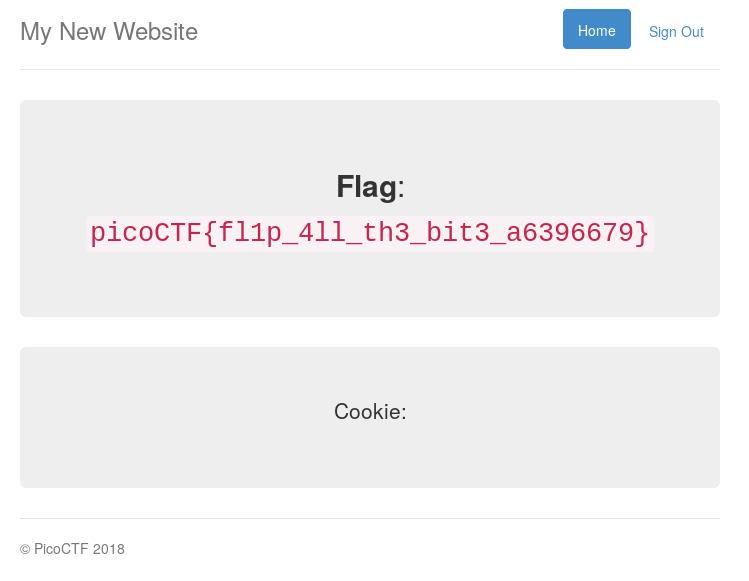

## Challenge

Uh oh, the login page is more secure... I think.
http://2018shell1.picoctf.com:46026 (link).

[Source](writeupfiles/server_noflag.py)

    from flask import Flask, render_template, request, url_for, redirect, make_response, flash
    import json
    from hashlib import md5
    from base64 import b64decode
    from base64 import b64encode
    from Crypto import Random
    from Crypto.Cipher import AES
    
    app = Flask(__name__)
    app.secret_key = 'seed removed'
    flag_value = 'flag removed'
    
    BLOCK_SIZE = 16  # Bytes
    pad = lambda s: s + (BLOCK_SIZE - len(s) % BLOCK_SIZE) * \
                    chr(BLOCK_SIZE - len(s) % BLOCK_SIZE)
    unpad = lambda s: s[:-ord(s[len(s) - 1:])]
    
    
    @app.route("/")
    def main():
        return render_template('index.html')
    
    @app.route('/login', methods=['GET', 'POST'])
    def login():
        if request.form['user'] == 'admin':
            message = "I'm sorry the admin password is super secure. You're not getting in that way."
            category = 'danger'
            flash(message, category)
            return render_template('index.html')
        resp = make_response(redirect("/flag"))
    
        cookie = {}
        cookie['password'] = request.form['password']
        cookie['username'] = request.form['user']
        cookie['admin'] = 0
        print(cookie)
        cookie_data = json.dumps(cookie, sort_keys=True)
        encrypted = AESCipher(app.secret_key).encrypt(cookie_data)
        print(encrypted)
        resp.set_cookie('cookie', encrypted)
        return resp
    
    @app.route('/logout')
    def logout():
        resp = make_response(redirect("/"))
        resp.set_cookie('cookie', '', expires=0)
        return resp
    
    @app.route('/flag', methods=['GET'])
    def flag():
      try:
          encrypted = request.cookies['cookie']
      except KeyError:
          flash("Error: Please log-in again.")
          return redirect(url_for('main'))
      data = AESCipher(app.secret_key).decrypt(encrypted)
      data = json.loads(data)
    
      try:
         check = data['admin']
      except KeyError:
         check = 0
      if check == 1:
          return render_template('flag.html', value=flag_value)
      flash("Success: You logged in! Not sure you'll be able to see the flag though.", "success")
      return render_template('not-flag.html', cookie=data)
    
    class AESCipher:
        """
        Usage:
            c = AESCipher('password').encrypt('message')
            m = AESCipher('password').decrypt(c)
        Tested under Python 3 and PyCrypto 2.6.1.
        """
    
        def __init__(self, key):
            self.key = md5(key.encode('utf8')).hexdigest()
    
        def encrypt(self, raw):
            raw = pad(raw)
            iv = Random.new().read(AES.block_size)
            cipher = AES.new(self.key, AES.MODE_CBC, iv)
            return b64encode(iv + cipher.encrypt(raw))
    
        def decrypt(self, enc):
            enc = b64decode(enc)
            iv = enc[:16]
            cipher = AES.new(self.key, AES.MODE_CBC, iv)
            return unpad(cipher.decrypt(enc[16:])).decode('utf8')
    
    if __name__ == "__main__":
        app.run()
{: .language-python}

## Solution

AES in CBC mode is vulnerable to [bitflipping attacks][1].

We log into the site, and get a cookie and its plaintext:

    Cookie:
    plaintext: {'admin': 0, 'password': 'bla', 'username': 'bla'}
    encrypted: 0dAX+nusd7/rVAVbq0ih0tZaLUn3mZYXOfnyMCJdzzJjvu8cPgiP/3C8CKgAOjblGU1Pijpg2qG0hqDcJ3yaZA==

Our goals is to change the `0` in the admin variable to a `1` (in the
source code we see that this will get us our flag).

We want to change the byte in position 10 (11th character) of the
plaintext, which would involve changing the corresponding  
byte in the block before it in the ciphertext (byte number 8), but since
this scheme uses a 16-bit IV, which is prepended  
to the ciphertext, we need to edit the byte in position 10 of the
ciphertext as well. We want to change this from a `0` to  
a `1`, so we XOR this byte of the ciphertext with the XOR of these two
values (`'0' XOR '1' = 0x01`):

    >>> import base64
    >>> hex(ord('0')^ord('1'))
    '0x1'
    >>> c = '0dAX+nusd7/rVAVbq0ih0tZaLUn3mZYXOfnyMCJdzzJjvu8cPgiP/3C8CKgAOjblGU1Pijpg2qG0hqDcJ3yaZA=='
    >>> d = base64.b64decode(c)
    >>> d
    b'\xd1\xd0\x17\xfa{\xacw\xbf\xebT\x05[\xabH\xa1\xd2\xd6Z-I\xf7\x99\x96\x179\xf9\xf20"]\xcf2c\xbe\xef\x1c>\x08\x8f\xffp\xbc\x08\xa8\x00:6\xe5\x19MO\x8a:`\xda\xa1\xb4\x86\xa0\xdc\'|\x9ad'
    >>> hex(d[10])
    '\x05'
    >>> hex(d[10] ^ 0x01)
    '\x04'
    >>> new = b'\xd1\xd0\x17\xfa{\xacw\xbf\xebT\x04[\xabH\xa1\xd2\xd6Z-I\xf7\x99\x96\x179\xf9\xf20"]\xcf2c\xbe\xef\x1c>\x08\x8f\xffp\xbc\x08\xa8\x00:6\xe5\x19MO\x8a:`\xda\xa1\xb4\x86\xa0\xdc\'|\x9ad'
    >>> base64.b64encode(n)
    b'0dAX+nusd7/rVARbq0ih0tZaLUn3mZYXOfnyMCJdzzJjvu8cPgiP/3C8CKgAOjblGU1Pijpg2qG0hqDcJ3yaZA=='
{: .language-python}

We change our cookie to this value and get our flag!

[1]: https://masterpessimistaa.wordpress.com/2017/05/03/cbc-bit-flipping-attack/
