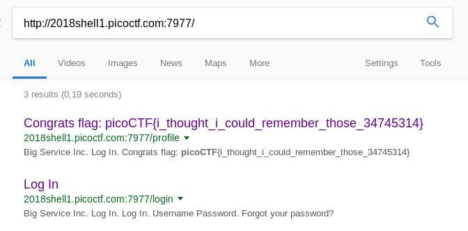

## Challenge

There is a website running at http://2018shell1.picoctf.com:54584
(link). We need to get into any user for a flag!

## Solution

There is a login page and a password reset page. Judging by the title,
this is where we need to look, but it asks for  
a username, and we get an error if we enter a non-existing username. So
we need to find a username first, hmm..

We look at the html source for the main page, and find this comment:

    [..]
            

        

    

    <!--Proudly maintained by pendleton -->
    
      

    </section>
    [..]
{: .language-html}

So we guess that this user also has an account on the website, and this
turns out to be correct. Now that we have a username,  
we can enter this into the "forgot password" menu. We are now presented
with a series of security questions,

    What is your favorite carmake?
    What is your favorite food?
    What is your favorite color?
    Who is your favorite hero?

After three wrong answers you are locked out of the account (until you
clear cookies). It would be too much work to  
guess all of these answers, even if we do get unlimited tries. we also
notice that if we refresh the page before answering,  
it will give us another one of these questions randomly. So if we can
guess one answer, we can refresh until we get the same  
question, and repeat that until we have answered 4 questions.

Color seems like the easiest to guess, and indeed, it doesn't take us
long to find out that `blue` is the correct answer for  
this user. So we refresh questions until we are asked for our fav
colour, answer the same questioni 4 times and then we are  
able to reset our password. Once we log into the account with the new
password, we get the flag:

Fun fact: since the profile page was completely unauth'd, googling the
url of the challenge also led us to the flag:

