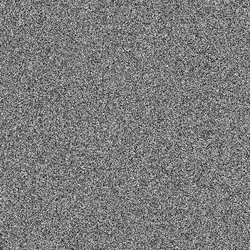

**Challenge**  
We only have 49 shades of gray

000000 to F5F5F5... there's one shade missing! Find the hex value of the
missing shade. Pound sign optional.

[Image](writeupfiles/shades.png)

## Solution

They tell us there are 50 shades of gray, ranging from 0 to 245 (0xF5).
This would mean there is a shade of gray made from every pixel value
divisible by 5 between those two values (#000000 #0a0a0a #0f0f0f etc)
..except one. We find out which one with a small

    from PIL import Image
    
    img=Image.open("shades.png")
    
    pixels=img.load()
    (width,height)=img.size
    
    for i in xrange (0,250,5):
      found = 0
      for w in range (0,width):
        for h in range (0,height):
           if pixels[w,h][0] == i:
             found=1
             break
      if not found:
          print "shade not found: "+str(i)
{: .language-python}

when we run this we find

`
shade not found: 80
`

which in hex is 50, so the missing shade of gray is #505050, which we
submit as our flag

