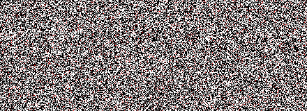
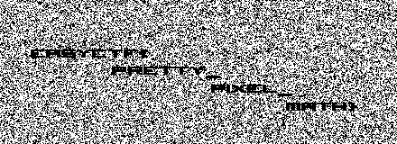

## Challenge

[mystery1](writeupfiles/mystery1) - [mystery2](writeupfiles/mystery2)

mystery1:

mystery2:

## Solution

Subtract pixel values from each other (and clean up output little bit
more) reveals the flag:

    from PIL import Image
    
    img1=Image.open("mystery1.png")
    img2=Image.open("mystery2.png")
    
    pixels1=img1.load()
    pixels2=img2.load()
    
    (width,height)=img1.size
    
    ## create new image to which we will write hidden image
    outimg = Image.new( 'RGB', (width,height), "white")
    pixels_out = outimg.load()
    
    for w in range (0,width):
      for h in range (0,height):
         r=pixels1[w,h][0]-pixels2[w,h][0]
         g=pixels1[w,h][1]-pixels2[w,h][1]
         b=pixels1[w,h][2]-pixels2[w,h][2]
    
         if (r,g,b)==(0,0,0) or (r>250 and g >250 and b >250)  :
             pixels_out[w,h] = (255,255,255)
         else:
             pixels_out[w,h] = (0,0,0)
    
    
    
    outimg.save("outimpg.png","png")
{: .language-python}

