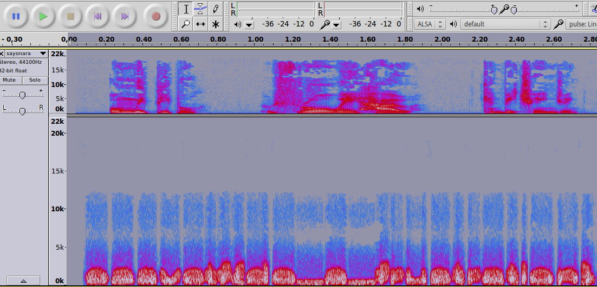

## Challenge

Found some interesting words of advice left by sayonara-bye... help me
understand it!

[sayonara.mp3](writeupfiles/sayonara.mp3) MD5:
9f44501f0ac360c3255548c96b70aecb

Hint: Why does that right channel sound strange?

## Solution

Opening the file in audacity and changing the view to spectogram (left
side menu), we can just make out the flag in the right channel:

