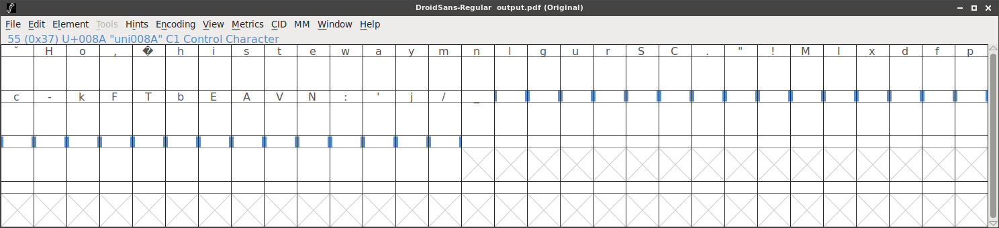

# HackVent 2017

Another edition of Hacking-Lab's annual advent calender CTF. Every day between December 1 and Christmas, a new challenge is released. Solve it on the day of release for maximum points, solve it later (but before the new year) for one point less.

## Overview


```
Title                                    Category  Points  Flag
---------------------------------------- --------- ------- -----------------------------
Dec  1: 5th Anniversary                  Easy      2/1     HV17-5YRS-4evr-IJHy-oXP1-c6Lw
Dec  2: Wishlist                         Easy      2/1     HV17-Th3F-1fth-Pow3-r0f2-is32
Dec  3: Strange Logcat Entry             Easy      2/1     HV17-th1s-isol-dsch-00lm-agic
Dec  4: HoHoHo                           Medium    3/2     HV17-RP7W-DU6t-Z3qA-jwBz-jItj
Dec  5: Only One hint                    Medium    3/2     HV17-7pKs-whyz-o6wF-h4rp-Qlt6
Dec  6: Santa's journey                  Medium    3/2     HV17-eCFw-J4xX-buy3-8pzG-kd3M
Dec  7: I know..                         Medium    3/2     HV17-UCyz-0yEU-d90O-vSqS-Sd64
Dec  8: True 1337s                       Medium    3/2     HV17-th1s-ju5t-l1k3-j5sf-uck!
Dec  9:
Dec 10:
Dec 11:
Dec 12:
Dec 13:
Dec 14:
Dec 15:
Dec 16:
Dec 17:
Dec 18:
Dec 19:
Dec 20:
Dec 21:
Dec 22:
Dec 23:
Dec 24:

Hidden 1:  Header                         Hidden    1       HV17-4llw-aysL-00ki-nTh3-H34d
Hidden 2:
Hidden 3:  Robots                         Hidden    1       HV17-bz7q-zrfD-XnGz-fQos-wr2A
Hidden 4:  CSS                            Hidden    1       HE17-W3ll-T00E-arly-forT-his!
Hidden 5:  Telnet                         Hidden    1       HV17-UH4X-PPLE-ANND-IH4X-T1ME

```


There were 5  hidden balls this year.

## Hidden ball 1:

**Solution**

Challenges are accessed by url like `https://hackvent.hacking-lab.com/challenge.php?day=2`

Let's see what happens when we try to skip ahead to Christmas `?day=25`

We get:

```
The resource (#1959) you are trying to access, is not (yet) for your eyes.
```

ok, weird, what about `?day=26`

```
The resource (#1958) you are trying to access, is not (yet) for your eyes.
```

day and resource number seem to add up to 1984 every time, so let's see what happens when we fill in `?day=1984`

```
The resource you are trying to access, is hidden in the header.
```

whoo! let's check the headers:

```
HTTP/1.1 200 OK
Date: Sat, 02 Dec 2017 21:14:21 GMT
Server: Merry Christmas & Hacky New Year
Strict-Transport-Security: max-age=15768000
Flag: HV17-4llw-aysL-00ki-nTh3-H34d
Keep-Alive: timeout=5, max=99
Connection: Keep-Alive
Transfer-Encoding: chunked
Content-Type: text/html; charset=UTF-8
```

There is our flag!

**Nugget**

```
HV17-4llw-aysL-00ki-nTh3-H34d
```

## Hidden ball 2:

**Solution**

**Nugget**

```
HV17-
```

## Hidden ball 3:

**Solution**  

we check `robots.txt` and see the following message: `We are people, not machines`

so then we check `people.txt`: `What's about akronyms?`

so then we check `humans.txt` and see:

```
All credits go to the following incredibly awesome HUMANS (in alphabetic order):
avarx
DanMcFly
HaRdLoCk
inik
Lukasz
M.
Morpheuz
MuffinX
PS
pyth0n33

HV17-bz7q-zrfD-XnGz-fQos-wr2A

```

whoo, theres a flag!

**Nugget**

```
HV17-bz7q-zrfD-XnGz-fQos-wr2A
```

## Hidden ball 4:

**Solution**

This one was hiding in the css folder `/css/egg.png`, it's an egg from Hacky Easter!


**Nugget**

```
HE17-W3ll-T00E-arly-forT-his!
```

## Hidden ball 5:

**Solution**

we scan the challenge server for open ports

```bash
$ nmap challenges.hackvent.hacking-lab.com

Starting Nmap 7.01 ( https://nmap.org ) at 2017-12-06 22:59 CET
Nmap scan report for challenges.hackvent.hacking-lab.com (80.74.140.188)
Host is up (0.56s latency).
rDNS record for 80.74.140.188: urb80-74-140-188.ch-meta.net
Not shown: 996 filtered ports
PORT    STATE  SERVICE
22/tcp  open   ssh
23/tcp  open   telnet
80/tcp  closed http
443/tcp closed https

Nmap done: 1 IP address (1 host up) scanned in 67.94 seconds
```

so, there's a telnet service running, we connect, and are greeted by santa:


```bash
$ telnet challenges.hackvent.hacking-lab.com

__.----.                                                
              _.'        '-.                                             
             /    _____     '-.                                          
            /_.-""     ""-._   \                 HO, HO, HO...           
           ."   _......._   ".  \                                        
           ; .-' _ ))) _ '-. ;   |                                       
           '/  ." _   _ ".  \'.  /                                       
           _|  .-.^ ) ^.-.  |_ \/-.                                      
           \ '"==-.(_).-=="' //    \                                     
            '.____.-^-.____.' \    /                                     
             |    ( - )   |   '--'                                       
              \           /                                              
      _________\_________/_______________________________________________

```

He keeps talking for a minute, and then gives us the flag

**Nugget**

```
HV17-UH4X-PPLE-ANND-IH4X-T1ME
```


## Dec 1: 5th Anniversary  
*time to have a look back*

**Challenge**  


**Solution**  

Looks like we need the solutions from previous years, good thing I kept writeups

```
2014: HV14-BAAJ-6ZtK-IJHy-bABB-YoMw
2015: HV15-Tz9K-4JIJ-EowK-oXP1-NUYL
2016: HV16-t8Kd-38aY-QxL5-bn4K-c6Lw
```

Putting the fragments together gives our nugget

**Nugget**

```
HV17-5YRS-4evr-IJHy-oXP1-c6Lw
```


## Dec 2: Wishlist  
*The fifth power of two*

**Challenge**  

Something happened to my wishlist, please help me.

[Get the Wishlist](writeupfiles/Wishlist.txt)

**Solution**  

This is clearly base-64 encoded, we decode, and still looks base64 endoded. Taking the hint
into account, we decode 32 times:

```bash
$ cat Wishlist.txt | base64 -d | base64 -d | base64 -d | base64 -d | base64 -d |
base64 -d | base64 -d  | base64 -d | base64 -d | base64 -d | base64 -d | base64 -d |
base64 -d | base64 -d | base64 -d | base64 -d | base64 -d | base64 -d | base64 -d |
base64 -d | base64 -d | base64 -d | base64 -d | base64 -d | base64 -d | base64 -d |
base64 -d | base64 -d | base64 -d | base64 -d | base64 -d | base64 -d

HV17-Th3F-1fth-Pow3-r0f2-is32%   
```

**Nugget**

```
HV17-Th3F-1fth-Pow3-r0f2-is32
```

## Dec 3: Strange Logcat Entry  
*Lost in messages*

**Challenge**  

I found those strange entries in my Android logcat, but I don't know what it's all about... I just want to read my messages!

[Get the logcat](writeupfiles/logcat.txt)

**Solution**  

This is a long logcat file, but we notice that only two lines have raw tabs,
suggesting they were manually added for the challenge:


which are the following lines:

```
11-13 20:40:13.542	 137   137 I DEBUG	 : 			FAILED TO SEND RAW PDU MESSAGE

[..]

11-13 20:40:24.044	137	  137  DEBUG: I 07914400000000F001000B913173317331F300003AC7F79B0C52BEC52190F37D07D1C3EB32888E2E838CECF05907425A63B7161D1D9BB7D2F337BB459E8FD12D188CDD6E85CFE931
```

This seems to be a raw SMS format, which we can decoded here:

https://www.diafaan.com/sms-tutorials/gsm-modem-tutorial/online-sms-pdu-decoder/

or using a python script:

```bash
$ pip install python-gsmmodem
```

```python
import gsmmodem
import json

PDU='07914400000000F001000B913173317331F300003AC7F79B0C52BEC52190F37D07D1C3EB32888E2E838CECF05907425A63B7161D1D9BB7D2F337BB459E8FD12D188CDD6E85CFE931'

decoded = gsmmodem.pdu.decodeSmsPdu(PDU)
print json.dumps(decoded, indent=4)

```

```
{
    "reference": 0,
    "protocol_id": 0,
    "text": "Good Job! Now take the Flag: HV17-th1s-isol-dsch-00lm-agic",
    "smsc": "+44000000000",
    "number": "+13371337133",
    "type": "SMS-SUBMIT",
    "tpdu_length": 64
}
```

So the flag is in the SMS!


**Nugget**

```
HV17-th1s-isol-dsch-00lm-agic
```

## Dec 4: HoHoHo  
*hint*

**Challenge**  

Santa has hidden something for you [here](writeupfiles/HoHoHo_medium.pdf)

**Solution**  

It's a pdf file, opening in okular popped up that ther was an embedded font file, named [DroidSans-HACKvent.sfd](DroidSans-HACKvent.sfd) ..with hackvent in the name, that's got to be hiding our flag!

We used [fontforge](https://fontforge.github.io/overview.html) to extract the font from the pdf file and view it:



hmm, we don't see any characters in the boxes, so we select `view->fit to bounding box`:


And there is our flag! ..looks like the characters were just tiny and being selectively enlarged in the pdf to create the visible text.

**Nugget**

```
HV17-RP7W-DU6t-Z3qA-jwBz-jItj
```

## Dec 5: Only One Hint  

**Challenge**  

Here is your flag:

```
0x69355f71
0xc2c8c11c
0xdf45873c
0x9d26aaff
0xb1b827f4
0x97d1acf4
```

and the one and only hint:

```
0xFE8F9017 XOR 0x13371337
```    

**Solution**  

`0xFE8F9017 XOR 0x13371337` is `0xedb88320` which is a polynomial involved in CRC32, and indeed

`crc32('HV17')` is `0x69355f71`

Let's try to bruteforce the other parts:

```python
import binascii
import itertools
import string

alphabet=string.printable

ct=[0x69355f71,
0xc2c8c11c,
0xdf45873c,
0x9d26aaff,
0xb1b827f4,
0x97d1acf4]

perms = list(itertools.product(alphabet, repeat=4))

for p in perms:
    # the & 0xffffffff only needed in python2
    out = binascii.crc32( ''.join(p) ) & 0xffffffff

    if out in ct:
        print ("bingo! "+ tst +" ("+hex(out)+")")

```

which gives the following output:

```
bingo! 7pKs (0xc2c8c11c)
bingo! h4rp (0xb1b827f4)
bingo! o6wF (0x9d26aaff)
bingo! whyz (0xdf45873c)
bingo! HV17 (0x69355f71)
bingo! Qlt6 (0x97d1acf4)
```

whoo!

**Nugget**

```
HV17-7pKs-whyz-o6wF-h4rp-Qlt6
```

## Dec 6: Santa's Journey
*Make sure Santa visits every country*

**Challenge**  

Follow Santa Claus as he makes his journey around the world.

http://challenges.hackvent.hacking-lab.com:4200/

**Solution**  

When we click on the link we get a QR code image, it decodes to `Iceland`. If we refresh we get `Angola`.
Ok, let's automate this, hope we get the flag if we try often enough:

```python
import requests
from qrtools import QR


while True:
    # download image
    url = "http://challenges.hackvent.hacking-lab.com:4200/"
    r = requests.get(url)

    with open("qrcode.png", "wb") as qrimage:
        qrimage.write(r.content)

    # read QR code
    myCode = QR(filename='qrcode.png')
    if myCode.decode():
        print myCode.data_to_string()
    if 'HV17' in myCode.data_to_string():
        break;
```

This outputs:

```
Saint-Martin
Lebanon
Anguilla
Nepal
New Zealand
Marshall Islands
Western Sahara
Chile
Yemen
Antarctica
Lithuania
Czech Republic
Panama
Saudi Arabia
Mali

[..]

China
Christmas Island
Pitcairn
Slovakia
Pitcairn
Bahrain
Cape Verde
Angola
Malawi
Ecuador
Turkmenistan
Jamaica
Mozambique
American Samoa
HV17-eCFw-J4xX-buy3-8pzG-kd3M
```

whoo! we got our flag


**Nugget**

```
HV17-eCFw-J4xX-buy3-8pzG-kd3M
```

## Dec 7: I know ...
*... what you did last xmas*

**Challenge**  

We were able to steal a file from santas computer. We are sure, he prepared a gift and there are traces for it in this file.

Please help us to recover it: [SANTA.FILE](writeupfiles/SANTA.FILE)

**Solution**  

I have a feeling this wasn't intended to be this easy, but..

```bash
$ file SANTA.FILE
SANTA.FILE: Zip archive data, at least v1.0 to extract

$ unzip SANTA.FILE
Archive:  SANTA.FILE
  inflating: SANTA.IMA   

$ file SANTA.IMA
SANTA.IMA: DOS/MBR boot sector, code offset 0x58+2, OEM-ID "WINIMAGE", sectors/cluster 4, root entries 16, sectors 3360 (volumes <=32 MB) , sectors/FAT 3, sectors/track 21, serial number 0x2b523d5, label: "           ", FAT (12 bit), followed by FAT

$ strings SANTA.IMA | grep HV17
Y*C:\Hackvent\HV17-UCyz-0yEU-d90O-vSqS-Sd64.exe
```

Note: There was also a ROT-13 version of the flag, which is probably the way the
challenge was designed to be solved:

```bash
$ strings SANTA.IMA |grep -4 HV17
-+/D
&xNsb
GameDVR_GameGUID
TitleIdr
Y*C:\Hackvent\HV17-UCyz-0yEU-d90O-vSqS-Sd64.exe
Typey=
Revision
P:\Unpxirag\UI17-HPlm-0lRH-q90B-iFdF-Fq64.rkr
969343ecc7b246e8426e573c30fd94c4ffa050c2
```

**Nugget**

```
HV17-UCyz-0yEU-d90O-vSqS-Sd64
```

## Dec 8: True 1337s
... can read this instantly

**Challenge**  

I found this obfuscated code on a public FTP-Server. But I don't understand what it's doing...

[File](writeupfiles/True.1337)

**Solution**  

Obfuscated python. The following snippet cleans up the code significantly:

```bash
for i in `seq 1 200`; do
	echo $i;
	q=$(python -c "print('+'.join(['True'] * $i))")
	sed -i "s/($q)/($i)/g" True.1337
	q=$(python -c "print('+'.join(['1337'] * $i))")
	sed -i "s/($q)/($i)/g" True.1337
done
```

This leaves us with two functions, one on
each line, calling a bunch of chrs. Replacing that with a `print()` call on
each, we can see the original code:


```
A=chr
SANTA=input
FUN=print
C=SANTA("?")
if C=="1787569":FUN(''.join(chr(ord(a) ^ ord(b)) for a,b in zip("{gMZF_MC_X\ERF[X","31415926535897932384626433832")))
```

(Not precisely the original, some things already deleted / cleaned up).

Running it (or the original) with py3k + the magic number results in our flag:

```
?1787569
HV17-th1s-ju5t-l1k3-j5sf-uck!
```

**Nugget**

```
HV17-th1s-ju5t-l1k3-j5sf-uck!
```

## Dec 9: Title  
*hint*

**Challenge**  

**Solution**  

**Nugget**

```
HV17-
```

## Dec 10: Title  
*hint*

**Challenge**  

**Solution**  

**Nugget**

```
HV17-
```

## Dec 11: Title  
*hint*

**Challenge**  

**Solution**  

**Nugget**

```
HV17-
```

## Dec 12: Title  
*hint*

**Challenge**  

**Solution**  

**Nugget**

```
HV17-
```

## Dec 13: Title  
*hint*

**Challenge**  

**Solution**  

**Nugget**

```
HV17-
```

## Dec 14: Title  
*hint*

**Challenge**  

**Solution**  

**Nugget**

```
HV17-
```

## Dec 15: Title  
*hint*

**Challenge**  

**Solution**  

**Nugget**

```
HV17-
```

## Dec 16: Title  
*hint*

**Challenge**  

**Solution**  

**Nugget**

```
HV17-
```

## Dec 17: Title  
*hint*

**Challenge**  

**Solution**  

**Nugget**

```
HV17-
```

## Dec 18: Title  
*hint*

**Challenge**  

**Solution**  

**Nugget**

```
HV17-
```

## Dec 19: Title  
*hint*

**Challenge**  

**Solution**  

**Nugget**

```
HV17-
```

## Dec 20: Title  
*hint*

**Challenge**  

**Solution**  

**Nugget**

```
HV17-
```

## Dec 21: Title  
*hint*

**Challenge**  

**Solution**  

**Nugget**

```
HV17-
```

## Dec 22: Title  
*hint*

**Challenge**  

**Solution**  

**Nugget**

```
HV17-
```

## Dec 23: Title  
*hint*

**Challenge**  

**Solution**  

**Nugget**

```
HV17-
```

## Dec 24: Title  
*hint*

**Challenge**  

**Solution**  

**Nugget**

```
HV17-
```
