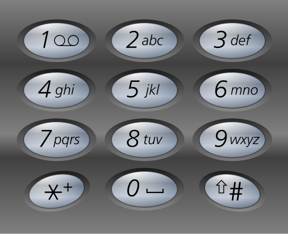
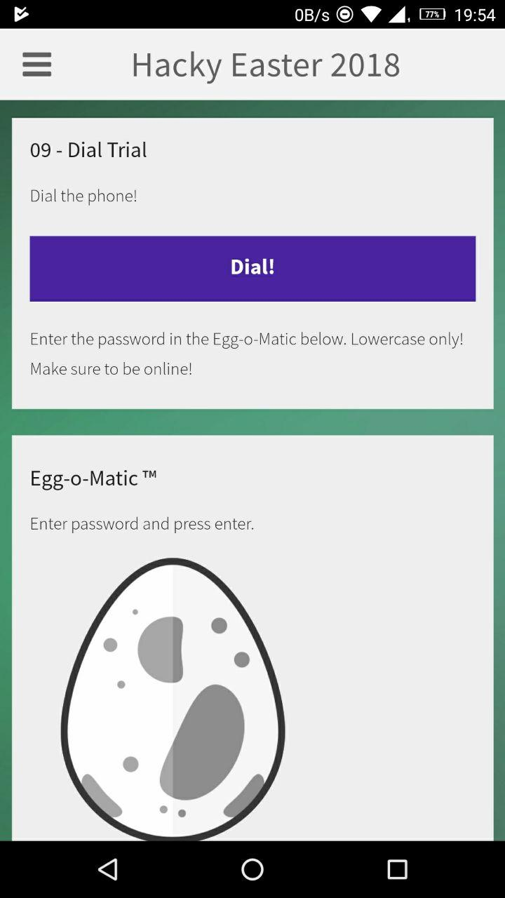
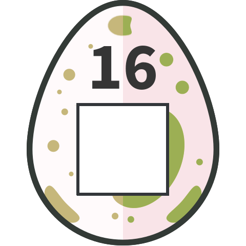
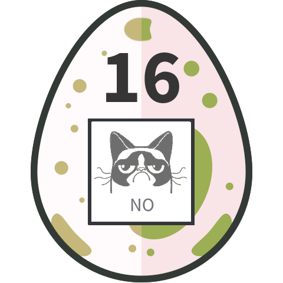

# HackyEaster 2018

## Overview


```
Title                                    Difficulty  Flag
---------------------------------------- ---------- -----------------------------
Teaser
Challenge 01: Prison Break               Easy       he18-gx8L-AJUw-DSMH-6aUI
Challenge 02: Babylon                    Easy       he18-egu6-pL6f-QjmF-qXWj
Challenge 03: Pony Coder                 Easy
Challenge 04: Memeory                    Easy       he18-cGoS-a2tz-BD2w-zXH8
Challenge 05: sloppy & Paste             Easy       he18-2yTc-bJ1f-raIQ-gKc6
Challenge 06: Cooking for Hackers        Easy       he18-MdVx-nSgb-wzYT-TtoE
Challenge 07: Jigsaw                     Easy       he18-jFsP-AXNB-GUXu-dkms
Challenge 08: Disco Egg                  Easy       he18-Qox7-xFIw-cljk-ySdF
Challenge 09: Dial Trial                 Easy       he18-Yuk0-9zPD-l8Di-aL1i
Challenge 10: Level Two                  Medium
Challenge 11: De Egg you must            Medium
Challenge 12: Patience                   Medium
Challenge 13: Sagittarius...             Medium
Challenge 14: Same same...               Medium     he18-D76U-PvxZ-7Icy-mkF1
Challenge 15: Manile greetings           Medium     he18-ifiI-T6ZT-TNyX-9DZp
Challenge 16: git cloak --hard           Medium     he18-k4oU-OEar-n9Sr-ULi0
Challenge 17: Space Invaders             Medium
Challenge 18: Egg Factory                Medium
Challenge 19: Virtual Hen                Hard
Challenge 20: Artist: No Name Yet        Hard
Challenge 21: Hot Dog                    Hard
Challenge 22: Block Jane                 Hard
Challenge 23: Rapbid Learning            Hard
Challenge 24: ELF                        Hard
Hidden Egg #1
Hidden Egg #2
Hidden Egg #3                                       he18-yeCd-TI6g-nSrz-WgZX
```

## General

Some challenges are mobile challenges that need to be solved with the Hacky Easter app

We get the [apk](writeupfiles/HackyEaster_9_5.0.1.apk) for the app (e.g. with the GetAPK app)
and decode it using `apktool`

```bash
$ sudo apt-get install apktool
$ apktool decode HackyEaster_9_5.0.1.ap
```


## Teaser

**Challenge**

**Solution**

**Egg**

## Hidden Egg #1:

**Challenge**

**Solution**

**Egg**

## Hidden Egg #2:

**Challenge**

**Solution**

**Egg**

## Hidden Egg #3:

**Challenge**

Got *app*etite? What about an egg for launch?

**Solution**

description suggest we need to look in the Hacky Easter app, and indeed find an egg lurking
at `build/apk/res/drawable/jc_launcher.png`

**Egg**


```
he18-yeCd-TI6g-nSrz-WgZX
```

## Challenge 01: Prison Break

**Challenge**

Your fellow inmate secretly passed you an old cell phone and a weird origami. The only thing on the phone are two stored numbers.

```
555-7747663 Link
555-7475464 Sara
```

Find the password and enter it in the Egg-o-Matic below. lowercase only, no spaces!


**Solution**

Combine the telephone numbers with the dots on the origami and a T9 pad:



```
7747663 (Link)
1334322 (number of dots)
prisone

7475464 (Sara)
3342321 (number of dots)
risking

```

this reads `prisonerisking`, enter this into egg-o-matic to get our egg


**Egg**


```
he18-gx8L-AJUw-DSMH-6aUI
```

## Challenge 02: Babylon

**Challenge**

The tower is not the only thing in Babylon which has walls and shelves.

```
4 - 4 - 28 - 355
```

[babylon.txt](writeupfiles/chall02/babylon.txt)


**Solution**`

This refers to the [Library of Babel](https://en.wikipedia.org/wiki/The_Library_of_Babel), from a short story written by Jorge Luis Borges.
The library in the story contains every single possible 410 page book. Most will be jibberish, but it will also contain every 410 page book ever
written or that ever will be written.

This concept has been made into a on online version: https://libraryofbabel.info/

We can find the book, on hexagon given by the content of the text file, wall 4, shelf 4, volume 28, page 355.

https://libraryofbabel.info/book.cgi?2hd04vwksv96d2ij58kr4x49lgvckeoub1m8u2zpss9wwyiwpvq7vkz89iiv198n0k99qih4s18v713uksdkpsz4wfo6su0zl0uvw23icgf0n175gryfepsidc8yumvam1hjfs2mzsfqzycapk46wf6erucoun3hm1teokgyqjpqghqshghzf71tsjup7j7qp57sbdcntz0k1vv2iurfx8z96miyi6t9a8ahhj1yruajetvlm2doe1dluy9yk8fylnhyjrot1v7i1u1e9gnmpguwrvqyj3hm7wp4iit9lo8rqnscyozzb12ya60o4z9uz2l1y8oei3pl0kwzzzspg74sb3yooid26fuuq9y9tca4d3oh8nsf3mbliwws4o5l78w2n4uuzrnh6u4ynnwyvk8e5wszmqmpnwbvey4h7s18c9uprc8j2ovradt051trqnh48xg7wc1wtzqo0gfyn0pqx7hjnifycl7z9tm8vscj8e6x3xhcbi6cj5sel12010p6rwssftmvy5szjxcpzmb63t33xs6lxtx0oh33ukajz0cx5ltbl8eyr1tzzyb4x6irt91mzwdcv7zoz7hfszzkzj6yi63isqpb9yo6iizr1caktzpxhp9ebdyfrgdil3p6fpt1gjj6bmo116i7rs0ctam10rhf4jzw4dd5j5hayn2igo69umgssncg8yogu7fy802qy02qth95mfks4pn2y5lk3mmt9b6crdbytwvbev1fub8l7tzbpsdh6rld5hs2il35deqcjrdusrfz10i7ga3qfn1nxf7ntf27qi2xn5r1s8y52o0q2gxg6fugt1kwe1f62j3bywee7d8dsq33mpmuorjab9ywr1sz1i0r6ih16vfuje3bwti1sbbsltrwtichfsoalis3daw6u76gwf90owzbh75hg2ktmohif074250fly91hf8qgfxz31nfqi0n8o0w82jy1nfomlhzc5qjgml9dax8xlwayenhl748m5zqgzaz0d64kswphbs8fl8spp5vn97kw4p3jdygnz329645sw52maj2ybafczpnozsfwxob5448vxab7q4t2re4tvoe6xle5dt2n3q98z1jamdix94gpf6skds07hijddt5pyul8yzaanw376wwaby6pli9hmjpwpt2j4jzbbagpf1pgfmpe9d5phmj8aef38lw18eng5xu6k5soogvv1sl8gc5yga9lzpzdq97rm73qzg0nz2qb3s67bbf79etfhzzrgcs1kkvhzmxz8u7ddcf9ukxmn7f3d7yr0qw8113nno5qhxgsr1ym7x8v9t9tq6umkrv2e0wpr3n25nskk2ixrajv8fhgx5wqnd40kff4q9v50v9nxh5063v9eusz765qt8rwhe15mm8ttsd1kca3nqqszzrkfpr5e0tlkiajtz2zicoe6ppng7p86kwsxjhct6yifvz0fowrnffpqlxuzyg5kivlerbtw50apxj9id51otjo142ni7ir502y44t20nv4icx6x5t4zxaihzkwu33stjswp10d395vb07pkqhrwhiik7yr4lq2bxnad152iomi8f1e45mlk422895b0tj9cvr05ae86x2mhdfcd1i9mph3gp874orfrof2ooph25mcvbjhfu4rgtelpzh3n6tqop30e3jjy22rllqtc3v9wlk3zf28a1b3kkw9xnxi7yaz22q2e8jy9gcmn2skfy4x4tjcd038sk85oi6u8pjurqdwgc28f02301xx6bnc8b01lfkvpf7r9vufpoxa7991rl5u53an9nnv63tgkayu05sd6vj14ri03fsu6pyfusfsmsagfvgag7pxrjeaad6in4dktpms8vssp06golf523o7a206rqcm7bwdilni6kcz0ncxurgleefuz5d0a299i6ws2y30pipk7sg4tqi28hhzib997xc0lkqmibmgaalapnq4ogsbilvfmbao5o4u782rsmzko53qbmn9vhsy49nph5xks9nppy7r7jwkrdhtmudofudh5vetovw579l0ytpzd0im5j5593xwccinx2y9u1i5w9bdfhlvwjkza8jxpo0ffmgjoxl7951aym0r0sybfx19tx8baozfbkpsadjnbu9m0udvef7dxswamsqkz0q9lj2isyrr04qx3xlgtbx0kp9ldmpf58ivziori03jowd7nq4l5i6xtr2c9o0lie64pzmzzx10jroho9vl0u1waam6iguxudj0wby1qst3hgdogux0xo2ytkeqqyxvb9lhsosvxfyb4hgp1e7tas0jhlkptgyy6arp05a485u8ewqzzwmrarmenpfok9tlnpwcel74vbkzsei8hhi3y8evcilrtb9xjiqvqryb333sg7ax5l411hj0d6i3d4y8d3rb4px47gw6xrnvo1lt0rn130okqo9ijk1hi4dwa79lhtylazqg2ma6bjsvvi03obedaj70ej25pau0iliavcbpw0vj8rs7nwr3h85wo136zwlrxjt2xk82vifum2jyw15fxigmeb4790xff3iisg781ep7vfza53wupuuzlynpvujilzqjx1a0ewmzm9527th2c84bt3il8nwvalwafn9iajekizfpn1f1sbkwatuufezd9v9hwqlyokvdl62fh1acxv8fmpffbjm0s6q0qghlbzq0eoghhjoladv6bzl2lwrowj5l05xfo3hvab0kc8djiha4qwnlnevo22yxfo97q1irohidipypccuiwx8vjty4zt8qlvefe68kf51pex4b99dqqnn2zdsswg2u3wkz5iv65jc94o5b40yrbr992996wuu441jy87xvde0bb61lczqfnbg0ss2jnzcm3nsoo8rrtpnh0bphpd7yrpfvlz63uj6tn0ptxne63yvziis84kxuwzfs6fw696tuyjwx0pbpsvtx0ky8fcgtj92ej0xosvqkkehmdly0q1cqaydepbqsmqmxfzhgb4dwcxszwhr5n8zt4eifhr1yjbouejpiwesdi0rzph15z0cwth06s30blffqwwyuhhyu1vn1mdgsa2hvqhagpafmumeix9ppcgraou49l9r4vzzm5vg325ilt3nduqrtg73zbuwvou379vyd8crg6b27rvq05h2pgy9vwatxl88cm7ba9p7407hgblci42a78xrhprtai2rinq0xsly9c69ypnko73nqpumnjkwqb4sw4-w4-s4-v28:355


This leads to a page which is mostly spaces an the following sentence:

```
the super secret hackyeaster password is checkthedatayo
```

we enter this into the egg-o-matic to get our egg

**Egg**


```
he18-egu6-pL6f-QjmF-qXWj
```

## Challenge 03:

**Challenge**

**Solution**

**Egg**

## Challenge 04: Memeory

**Challenge**

Fancy a round of memeory?


Click here to play.

**Solution**

We inspect the html, and can see the images on each of the cards:

```html
<div class="moduleLegespiel">
<figure id="legespiel_card_63" class="">
	<a href="#card_63">
      
	  
	  
	 </a>
	 
</figure><figure id="legespiel_card_58" class="">
	<a href="#card_58">
	  
	  
	  
	</a>
	
</figure><figure id="legespiel_card_84">
	<a href="#card_84">
	  
	  
	  
   </a>
	  
</figure><figure id="legespiel_card_73">
	<a href="#card_73">
	  
	  
	  
   </a>
   
</figure><figure id="legespiel_card_19">

[..]
```

so we just find the pairs and play the game to get our egg:


**Egg**


```
he18-cGoS-a2tz-BD2w-zXH8
```


## Challenge 05: Sloppy & Paste

**Challenge**

This was a mobille challenge.


**Solution**

When we try to copy the text shown, it copies a different text


so we get the apk of the mobile app and decode it

```
apktool decode HackyEaster_9_5.0.1.apk
```

and find the string we are looking for in `assets/www/challenge05.html`


**Egg**


```
he18-2yTc-bJ1f-raIQ-gKc6
```

## Challenge 06: Cooking for Hackers

**Challenge**

```
You've found this recipe online:

    1 pinch: c2FsdA==

    2 tablesspoons: b2ls

    1 teaspoon: dDd3Mmc=

    50g: bnRkby4=

    2 medium, chopped: b25pb24=

But you need one more secret ingredient! Find it!
```

**Solution**

These b64 decode to

```
1 pinch: salt
2 tablesspoons: oil
1 teaspoon: t7w2g
50g: ntdo.
2 medium, chopped: onion

But you need one more secret ingredient! Find it!
```

The period at the end of the fourth part is the hint, this is a url!

```
saltoilt7w2gntdo.onion
```

open it with a tor browser to get the egg

**Egg**


```
he18-MdVx-nSgb-wzYT-TtoE
```

## Challenge 07: Jigsaw

**Challenge**

Thumper was probably under time pressure and jumped around a bit too wild. As a result, his picture has broken.

Can you write a program to put it back together


**Solution**

This tool is pure magic and solved this challenge for us using a genetic algorithm: https://github.com/nemanja-m/gaps

```bash
$ gaps --image=../jigsaw.png --generations=30 --population=600 --save
```


```
goodsheepdontalwayswearwhite
```

We put this phrase into the egg-o-matic to get our egg

**Egg**


```
he18-jFsP-AXNB-GUXu-dkms
```

## Challenge 08: Disco Egg

**Challenge**

```
Make things as simple as possible but no simpler.

-- Albert Einstein
```

[disco.html](writeupfiles/chall08/disco.html)

**Solution**

We are led to a site with an egg continually chaning colour


The element of the disco egg look as follows in the source:

```html
<div id="overlay">
<table><tr>
<td class="cyan black green darkgreen blue orange red darkgrey brown" style="background-color:#006412;"></td>
<td class="cyan red brown blue black green darkgrey" style="background-color:#FBF305;"></td>
<td class="cyan black blue red lightgrey" style="background-color:#FBF305;"></td>
<td class="darkgreen black tan cyan green blue" style="background-color:#FBF305;"></td>
<td class="brown blue darkgrey cyan mediumgrey lightgrey black darkgreen" style="background-color:#FF6403;"></td>
[..]
```

we notice that each element has either `black` or `white` in the list but not both. We let the background color reflect this and find our QR code


```bash
cat disco.html
| sed 's|</td>|</td>\n|g'
| sed 's|class=\".*white.*|class=\"white\" style=\"background-color:#FFFFFF;\"></td>|g'
| sed 's|class=\".*black.*|class=\"black\" style=\"background-color:#000000;\"></td>|g'
> disco2.html
```

**Egg**


```
he18-Qox7-xFIw-cljk-ySdF
```

## Challenge 09:

**Challenge**

Another mobile challenge




**Solution**

we find the [mp3 file](writeupfiles/chall09/dial.mp3) played by the app when hitting the button.

We convert it to [wav file](writeupfiles/chall09/dial.wav) and decode the DTMF tones using http://dialabc.com/sound/detect/index.html


```
472612252336262636253412
```

This looks like it could be similar to the first challenge, each pair of number representing a
letter, `47` means 4 times number 7 (letter `s` in T9)

```
47 26 12 25 23 36 26 26 36 25 34 12
s  n  a  k  e  o  n  n  o  k  i  a
```

Whoo! we enter `snakeonnokia` in the egg-o-matic to get our egg

**Egg**


```
he18-Yuk0-9zPD-l8Di-aL1i
```

## Challenge 10:

**Challenge**

**Solution**

**Egg**

## Challenge 11: De egg you must

**Challenge**


Who was first, the cat or the egg?


[basket.zip](writeupfiles/chall11/basket.zip)

**Solution**

The zip file is password protected but easily cracked with fcrackzip and this [wordllist](http://mirrors.kernel.org/openwall/wordlists/passwords/)

```bash
$ fcrackzip -v --use-unzip -D -p dictionaries/password basket.zip
found file 'egg1', (size cp/uc 1389653/1433600, flags 9, chk 4f21)
found file 'egg2', (size cp/uc 1426168/1433600, flags 9, chk 4f21)
found file 'egg3', (size cp/uc 1425557/1433600, flags 9, chk 4f21)
found file 'egg4', (size cp/uc 1425787/1433600, flags 9, chk 4f21)
found file 'egg5', (size cp/uc 1423266/1433600, flags 9, chk 4f21)
found file 'egg6', (size cp/uc 362705/384584, flags 9, chk 4f21)


PASSWORD FOUND!!!!: pw == thumper

```

```bash
$ file egg1
egg1: ISO Media, Apple iTunes Video (.M4V) Video

```

The first file looks like a video, but it doesn't play properly. We try to extract frames and
get the following error:


```bash
$ ffmpeg -i egg1.m4v -r 1/1 $filename%03d.jpg
ffmpeg version 3.3.4-2 Copyright (c) 2000-2017 the FFmpeg developers
  built with gcc 7 (Ubuntu 7.2.0-8ubuntu2)
  configuration: --prefix=/usr --extra-version=2 --toolchain=hardened --libdir=/usr/lib/x86_64-linux-gnu --incdir=/usr/include/x86_64-linux-gnu --enable-gpl --disable-stripping --enable-avresample --enable-avisynth --enable-gnutls --enable-ladspa --enable-libass --enable-libbluray --enable-libbs2b --enable-libcaca --enable-libcdio --enable-libflite --enable-libfontconfig --enable-libfreetype --enable-libfribidi --enable-libgme --enable-libgsm --enable-libmp3lame --enable-libopenjpeg --enable-libopenmpt --enable-libopus --enable-libpulse --enable-librubberband --enable-libshine --enable-libsnappy --enable-libsoxr --enable-libspeex --enable-libssh --enable-libtheora --enable-libtwolame --enable-libvorbis --enable-libvpx --enable-libwavpack --enable-libwebp --enable-libx265 --enable-libxvid --enable-libzmq --enable-libzvbi --enable-omx --enable-openal --enable-opengl --enable-sdl2 --enable-libdc1394 --enable-libiec61883 --enable-chromaprint --enable-frei0r --enable-libopencv --enable-libx264 --enable-shared
  libavutil      55. 58.100 / 55. 58.100
  libavcodec     57. 89.100 / 57. 89.100
  libavformat    57. 71.100 / 57. 71.100
  libavdevice    57.  6.100 / 57.  6.100
  libavfilter     6. 82.100 /  6. 82.100
  libavresample   3.  5.  0 /  3.  5.  0
  libswscale      4.  6.100 /  4.  6.100
  libswresample   2.  7.100 /  2.  7.100
  libpostproc    54.  5.100 / 54.  5.100
[mov,mp4,m4a,3gp,3g2,mj2 @ 0x55e2047e2f20] moov atom not found
egg1: Invalid data found when processing input
```

a `moov atom` contains metadata about the video [link](https://developer.apple.com/library/content/documentation/QuickTime/QTFF/QTFFChap2/qtff2.html).

We remember the challenge description `cat or the egg` so we concatenate the different files together to get a working video

```bash
$ cat egg* > eggall
```

We notice some marking at the bottom of the frames during the last second orso, but not sure what that means?

```bash
$ ffmpeg -i eggall -y -ss 24 -an -r 20 frame%03d.jpg
```


**Egg**

## Challenge 12:

**Challenge**

**Solution**

**Egg**

## Challenge 13:

**Challenge**

13 - Sagittarius...

... is playing with his pila again.

Can you find the Easter egg QR code he has hidden from you?

**Solution**

I loaded pila.kmz into a KMZ viewer and saw this:


So obviously the wrong projection.


**Egg**

## Challenge 14:

**Challenge**

Same same...
...but different!
Upload the right files and make the server return an Easter egg!

The PHP code seems to require that we upload two files which are QR codes with
the word 'Hackvent' in one and 'Hacky Easter' in the other, and that those
files should have identical sha1sums.

I just assumed it would accept PDFs without looking since the sha1 collision
for pdfs was pretty recently big news. Found
https://github.com/nneonneo/sha1collider as one of the top results in a search.

**Solution**

```
$ qrencode 'Hackvent' -o a.png
$ qrencode 'Hacky Easter' -o b.png
$ convert a.png a.pdf
$ convert b.png b.pdf
$ python3 sha1collider/collide.py a.pdf b.pdf --progressive
```

and got out two PDFs with identical hashes in under a second! Neat.

```
bdece875ca36c6505b0728cbeca7495db1a30246  out-a.pdf
bdece875ca36c6505b0728cbeca7495db1a30246  out-b.pdf
```

**Egg**


## Challenge 15: Manila

**Challenge**

Randy Waterhouse receives a package from his friend Enoch Root containing a deck of cards and a letter:

Dear Randy,

even though our stay in Manila was not very pleasant, I fondly think of our discussions there:

```
GTIFL RVLEJ TAVEY ULDJO KCCOK P
```

Wishing you happy Easter

Enoch

[](writeupfiles/chall15/deck)

**Solution**

The text is a hint to the book Cryptonomicon by Neal Stephenson. Combined with the cards image, we realize this is a [Solitaire Cipter](https://en.wikipedia.org/wiki/Solitaire_\(cipher\))

if we convert the notation of the deck slightly we can solve it online [here](https://ermarian.net/services/encryption/solitaire.php)

key:

```
8d 3s 7d 3d 2c 5s Ad 6c 7s 6d A Kd Qh Js Jc 7h 3h 9h 9s 8s 9c As 4h 8c 3c Kh Ah 6s 6h Ts Ks Ac Td Qd Qc B Qs 4s 9d 2s 5c Jh Th 4c Tc 5d 8h 2h 2d Jd 7c Kc 5h 4d
```

which gives output:

```
THEPA SSWOR DISCR YPTON OMICO N
```

So the password is `CRYPTONOMICON`, and we put that into the egg-o-matic to get our flag

**Egg**


```
he18-ifiI-T6ZT-TNyX-9DZp
```

## Challenge 16: git cloak --hard

**Challenge**

This one requires your best Git-Fu! Find the hidden egg in the repository.

[repo.zip](writeupfiles/chall16/repo.zip)

**Solution**

The zip files contains a git repo with a number of images in it:

<table>


The egg with the QR code translates to `7dUDQDhMQkLYsQTMJq62`, but this is not a valid egg of course.

```bash
$ git log
commit b9e860f47fe6990cbda4ac5bb3d2829d2191f1eb (HEAD -> master)
Author: PS <ps@hacking-lab.com>
Date:   Tue Jan 23 05:43:16 2018 -0500

    even more funny images added

commit 3839c14d2863fd850794661677352305ea798eb6
Author: PS <ps@hacking-lab.com>
Date:   Tue Jan 23 05:43:15 2018 -0500

    more funny images added

commit 228b603ed45ddaf1b1d3fe502e168fa2508ee5ed
Author: PS <ps@hacking-lab.com>
Date:   Tue Jan 23 05:43:15 2018 -0500

    created the funny git meme repo
```

We rewind the commits to see if there is anything interesting

```bash
$ git reset HEAD~2
Unstaged changes after reset:
M       02.png
D       04.png
```

we see that image 2 was modified and another image deleted




but alas, this different egg (QRcode reads `qdUX0sgDVjWxiFNifHKE`) is still not what we are looking for..


```bash
$ git log --all --graph --oneline
* b9e860f (HEAD -> master) even more funny images added
| * 9a29769 (branch) branch created
|/
* 3839c14 more funny images added
* 228b603 created the funny git meme repo
```

So we see that a different branch was created at some point, but we don't find the egg here either.

```bash
$ cat .git/config
[core]
        repositoryformatversion = 0
        filemode = false
        bare = false
        logallrefupdates = true
        symlinks = false
        ignorecase = true
[user]
        name = PS
        email = ps@hacking-lab.com
```


```bash
$ cat .git/logs/HEAD                                                               [29-03-18 13:00:39]
0000000000000000000000000000000000000000 228b603ed45ddaf1b1d3fe502e168fa2508ee5ed PS <ps@hacking-lab.com> 1516704195 -0500      commit (initial): created the funny git meme repo
228b603ed45ddaf1b1d3fe502e168fa2508ee5ed 228b603ed45ddaf1b1d3fe502e168fa2508ee5ed PS <ps@hacking-lab.com> 1516704195 -0500      checkout: moving from master to temp
228b603ed45ddaf1b1d3fe502e168fa2508ee5ed b9820d55ce59799992648672a5a43fff4effd56b PS <ps@hacking-lab.com> 1516704195 -0500      commit: temp branch created
b9820d55ce59799992648672a5a43fff4effd56b 9d7c9b5a1c8773ea48caac90d05401679b0a8897 PS <ps@hacking-lab.com> 1516704195 -0500      commit: added one more image
9d7c9b5a1c8773ea48caac90d05401679b0a8897 228b603ed45ddaf1b1d3fe502e168fa2508ee5ed PS <ps@hacking-lab.com> 1516704195 -0500      checkout: moving from temp to master
228b603ed45ddaf1b1d3fe502e168fa2508ee5ed 3839c14d2863fd850794661677352305ea798eb6 PS <ps@hacking-lab.com> 1516704195 -0500      commit: more funny images added
3839c14d2863fd850794661677352305ea798eb6 3839c14d2863fd850794661677352305ea798eb6 PS <ps@hacking-lab.com> 1516704195 -0500      checkout: moving from master to branch
3839c14d2863fd850794661677352305ea798eb6 9a29769663d029f1b3ad83fec7e7f19ca1cf8e78 PS <ps@hacking-lab.com> 1516704195 -0500      commit: branch created
9a29769663d029f1b3ad83fec7e7f19ca1cf8e78 3839c14d2863fd850794661677352305ea798eb6 PS <ps@hacking-lab.com> 1516704196 -0500      checkout: moving from branch to master
3839c14d2863fd850794661677352305ea798eb6 b9e860f47fe6990cbda4ac5bb3d2829d2191f1eb PS <ps@hacking-lab.com> 1516704196 -0500      commit: even more funny images added

$ git log --all --branches --remotes --tags --reflog --oneline --graph
* b9e860f (HEAD -> master) even more funny images added
| * 9a29769 (branch) branch created
|/
* 3839c14 more funny images added
| * 9d7c9b5 added one more image
| * b9820d5 temp branch created
|/
* 228b603 created the funny git meme repo
```

```
git checkout 9d7c9b5a1c8773ea48caac90d05401679b0a8897
```

gives us another image, `tree.jpg` and yet another version of `02.png`:




Eventually discovered `git fsck` notes a dangling blob which is apparently some
piece of data that was included at one point but the commit was later removed or backed out.

```console
$ git fsck
Prüfe Objekt-Verzeichnisse: 100% (256/256), Fertig.
dangling blob dbab6618f6dc00a18b4195fb1bec5353c51b256f
$ git cat-file -p dbab6618f6dc00a18b4195fb1bec5353c51b256f > tmp.png
$ file tmp.png
tmp: PNG image data, 480 x 480, 8-bit colormap, non-interlaced
```

**Egg**


## Challenge 17:

**Challenge**

Alien space invaders left a secret message. Luckily, you know that they used codemoji.org for the encryption.

Decrypt the message, and save the planet!!

> ⚾⭐📯💵🎨📢📘💪☀🌆💪🐸🎨🐦📢

**Solution**

- Go to https://codemoji.org/#/encrypt
- create a random message
- "share", they give you a shortlink that resolves into "https://codemoji.org/share.html?data=...." where data is an html encoded, base64 encoded blob of json like:

   ```json
   {
     "message": "⚾⭐📯💵🎨📢📘💪☀🌆💪🐸🎨🐦📢",
     "key": "👾"
   }
    ```

- replace the message with the given input: "⚾⭐📯💵🎨📢📘💪☀🌆💪🐸🎨🐦📢"
- and get [this url](https://codemoji.org/share.html?data=eyJtZXNzYWdlIjoi4pq%2B4q2Q8J%2BTr/CfkrXwn46o8J%2BTovCfk5jwn5Kq4piA8J%2BMhvCfkqrwn5C48J%2BOqPCfkKbwn5OiXG4iLCJrZXkiOiLwn5G%2BIn0%3D)
- which decodes with the invader emoji to `invad3rsmustd13`

**Egg**


## Challenge 18:

**Challenge**

**Solution**

**Egg**

## Challenge 19:

**Challenge**

**Solution**

**Egg**

## Challenge 20:

**Challenge**

**Solution**

we find some hidden text in the pdf file using extractpdf.com:

```
Composition

No Name Yet

�Okay, let’s do the information exchange as we coordinated. First let me
tell you: hiding informations in a MIDI file will be popular soon! We should
only do it this way to stay covered. MIDI hiding is just next level – wow! So,
here are all informations you need to find the secret: Trackline: Can’t remember now,
but you’ll find it. It’s kinda quiet this time, because of the doubled protection
algorithm! Characters: 0 - 127 (by the way: we won‘t need the higher ones
ever…)Let’s go!�
I‘m very exited for the lyrics that you will create
for this masterpiece.
Best wishes, your friend

LuckyTail

```

**Egg**

## Challenge 21: Hot Dog

**Challenge**

or: how to solve this darn crypto challenge to get your sleep back.

Enter the flag found, into the Egg-o-Matic below, without brackets.

[hotdog.zip](writeupfiles/chall21/hotdog.zip)


**Solution**

The zipfile contains a tiff file


with binwalk we find a png image embedded


```bash
$ zbarimg egg-almost.png
QR-Code:Arf3ThIY8VQg2GUd249wzDYi7CXqTST+9g4Q7bbT2eF+mD2KB+6oi3rVSY/eZ6/onNBNYPo2BPqIVEbL35G62pIHvabGcrYosGCpYhiz6EYnamnNPrHdzmEOs8lCRw1c2Pe8kl41FH0ud7tBn6qD/stnZfGkcbeIrjaSiIYSveHS

scanned 1 barcode symbols from 1 images in 0.02 seconds


```

**Egg**

## Challenge 22:

**Challenge**

**Solution**

**Egg**

## Challenge 23:

**Challenge**

**Solution**

**Egg**

## Challenge 24:

**Challenge**

**Solution**

**Egg**
