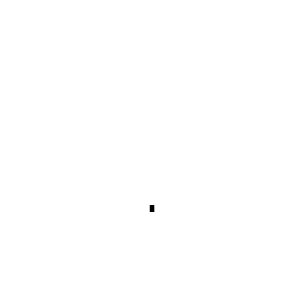
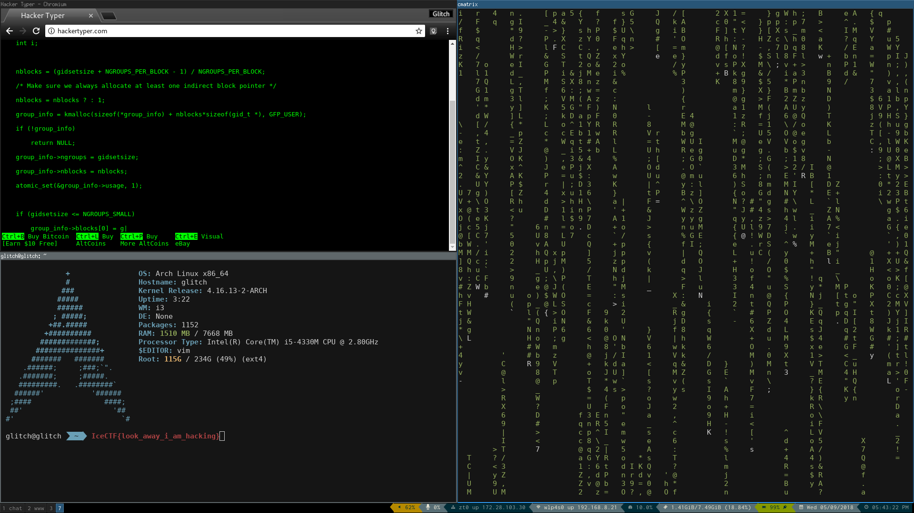

# IceCTF 2016

2-Week-long Icelandic CTF in September 2018

Team: Galaxians


## Overview
```
Title                          Category       Points Flag
------------------------------ -------------- ------ -----------------------------
Toke Relaunch                  Web            50     IceCTF{what_are_these_robots_doing_here}
Lights out                     Web            75     IceCTF{styles_turned_the_lights}

Modern Picasso                 Forensics      150    IceCTF{wow_fast}
Hard Shells                    Forensics      200    IceCTF{look_away_i_am_hacking}
Lost in the Forest             Forensics      300    IceCTF{good_ol_history_lesson}

garfield                       Cryptography   100    IceCTF{I_DONT_THINK_GRONSFELD_LIKES_MONDAYS}
Think outside the key!         Cryptography   200
Ancient Foreign Communications Cryptography   300    IceCTF{squeamish ossifrage}

Drumbone                       Steganography  150
Hot or Not                     Steganography  300
Rabbit Hole                    Steganography  400


Poke-A-Mango                   Reversing      250
Passworded!                    Reversing      400

Hello World!                   Misc           10      IceCTF{this_is_a_flag}
anticaptcha                    Misc           250     IceCTF{ahh_we_have_been_captchured}
ilovebees                      Misc           199
Secret Recipe                  Misc           290
```


## Web 50: Toke Relaunch

**Challenge**

We've relaunched our famous website, Toke! Hopefully no one will hack it again and take it down like the last time.


**Solution**

The link leads to some marijuna website


Last edition the toke challenge had the flag hidden in a cookie, but no cookies are set this time, so we have to look elsewhere

We check the robots.txt file and see:

```
User-agent: *
Disallow: /secret_xhrznylhiubjcdfpzfvejlnth.html

```

the disallowed file contains our flag.

**Flag**
```
IceCTF{what_are_these_robots_doing_here}
```


## Web 75: Ligths out

**Challenge**

Help! We're scared of the dark!

https://static.icec.tf/lights_out

**Solution**

We see a black page


with source:

```html
<!doctype html>
<html>
    <head>
        <meta charset="utf-8" />
        <title>Lights out!</title>
        <link rel="stylesheet" href="main.css" />
    </head>
    <body>
        <div class="alert alert-danger">Who turned out the lights?!?!</div>
        <summary>
        <div class="clearfix">
            <i data-hide="true"></i>
            <strong data-show="true">
            <small></small>
            </strong>
            <small></small>
        </div>
        </summary>
    </body>
</html>

```

Some fiddling with the css yields the flag


**Flag**

```
IceCTF{styles_turned_the_lights}
```

## Forensics 150: Modern Picasso

**Challenge**

Here's a rendition of some modern digital abstract art. Is it more than art though?


**Solution**

Using imagemagick to convert the white background in each frame to transparant:

```
convert picasso.gif -transparent white picasso_transparent.gif
```

gives a gif that slowly builds up the flag:



**Flag**

```
IceCTF{wow_fast}
```

## Forensics 200: Hard Shells

**Challenge**

After a recent hack, a laptop was seized and subsequently analyzed. The victim of the hack? An innocent mexican restaurant. During the investigation they found this suspicous file. Can you find any evidence that the owner of this laptop is the culprit?

[file](writeupfiles/hardshells)

**Solution**

the file is an encrypted zip file.

we use fcrackzip with the crackstation wordlist to find the password

```bash
$ fcrackzip -v --use-unzip  -D -p wordlist hardshells.zip
'hardshells/' is not encrypted, skipping
found file 'hardshells/d', (size cp/uc 309500/5242880, flags 9, chk 91d0)
checking pw TILIGUL'S

PASSWORD FOUND!!!!: pw == tacos
```

the [file we get](writeupfiles/d) now is a Minix filesystem

```bash
$ file d
d: Minix filesystem, V1, 30 char names, 20 zones
```

Running `strings`, we found `IHDR` indicating it might be a PNG file. Comparing
the file (in vim) to a normal PNG file we discovered they'd changed PNG to PUG
and the file became valid.

This gives us a nice screenshot of someone's desktop, with the flag.




**Flag**
```
IceCTF{look_away_i_am_hacking}
```

## Forensics 300: Lost in the Forest

**Challenge**
You've rooted a notable hacker's system and you're sure that he has hidden something juicy on there. Can you find his secret?

**Solution**
We receive a zip file named 'fs.zip' which contains a partial root file system of our hacker's machine. After unzipping we looked for all potentially interesting files:

```
find -type f .
```

And spotted './home/hkr/Desktop/clue.png' which is just a picture of a red
herring. Cute. So the other dozens of JPGs are probably also red herrings. Next
we looked for more interesting files and just looked at them individually with
a text editor:

```
vim `find -type f .`
```

Most were rather uninteresting, but there was a base64 looking string,
`./home/hkr/hzpxbsklqvboyou` which might be interesting later. In
`.bash_history` there were some interesting commands:

```
wget https://gist.githubusercontent.com/Glitch-is/bc49ee73e5413f3081e5bcf5c1537e78/raw/c1f735f7eb36a20cb46b9841916d73017b5e46a3/eRkjLlksZp
mv eRkjLlksZp tool.py
./tool.py ../secret > ../hzpxbsklqvboyou
```

So that script generated the base64 stuff on the desktop. We'll just write a [decode version of the script](./writeupfiles/lost-in-the-forest.py) and decrypt our output.


**Flag**
```
IceCTF{good_ol_history_lesson}
```

## Cryptography 100: garfeld

**Challenge**

You found the marketing campaign for a brand new sitcom. Garfeld! It has a secret message engraved on it. Do you think you can figure out what they're trying to say?


**Solution**

The image reads:

`IjgJUO{P_LOUV_AIRUS_GYQUTOLTD_SKRFB_TWNKCFT}`


Looks like the flag but encrypted somehow

Turns out to be vigenere with key `ahchbjhi`

we later realized that the `07271978` at the top of the image is a hint for this key with A=0,B=1 etc


**Flag**

```
IceCTF{I_DONT_THINK_GRONSFELD_LIKES_MONDAYS}
```

## Cryptography 200: Think outside the key

**Challenge**

**Solution**

**Flag**
```
flag
```

## Cryptography 300: Ancient Foreign Communications

**Challenge**
We got word from a friend of ours lost in the depths of the Andorran jungles! Help us figure out what he is trying to tell us before its too late!

Note: The flag here is non-standard, in the result you should end up with some words! The flag is IceCTF{<words, lowercase, including spaces>}

**Solution**
We're given a file with hex bytes, we can use `xxd` to covnert that into the appropriate characters/bytes:

```
xxd -r -p comms.txt > out.txt
```

Which is full of some fun symbols?

```
⨅]]⌞⌞⌟[⨆]⌟]]]⨆⨆⨆⌜[[[⌝⌝⌝⌞⌝⌝⌝⌝⨆⌝⌝⌝⌞⌞⌝⌝⌝⌝⌟⌝⌝⨅⨅⌞⌞⨆[]]]⌝⌝⌝⌝]]⌟[[[⌝⌝⌝⌝⌟⌝⌝⌝⌝]]]⌞⌞⌞⌝⌝⌝⨆]⌞⌞
```

combining pigpen cipher with T9 we translate this to:


```
⨅ ]] ⌞⌞ ⌟ [ ⨆ ] ⌟ ]]] ⨆⨆⨆ ⌜ [[[ ⌝⌝⌝ ⌞ ⌝⌝⌝⌝ ⨆ ⌝⌝⌝ ⌞⌞ ⌝⌝⌝⌝ ⌟ ⌝⌝ ⨅⨅ ⌞⌞ ⨆ [ ]]] ⌝⌝⌝⌝ ]] ⌟ [[[ ⌝⌝⌝⌝ ⌟ ⌝⌝⌝⌝ ]]] ⌞⌞⌞ ⌝⌝⌝ ⨆ ] ⌞⌞
t h  e  _ m a g _ i   c   w o   r   d s    a r   e  s    _ q  u  e  a m i   s    h  _ o   s    _ s    i   f   r   a g e
```

```
the magic words are squeamish ossifrage
```

Which was the solution to a challenge ciphertext set by the inventor of RSA in 1977 ([link](https://en.wikipedia.org/wiki/The_Magic_Words_are_Squeamish_Ossifrage))

**Flag**
```
IceCTF{squeamish ossifrage}
```

## Steganography 150: Drumbone

**Challenge**

**Solution**

**Flag**
```
flag
```


## Steganography 300: Hot or Not

**Challenge**

**Solution**

**Flag**
```
flag
```


## Steganography 400: Rabbit Hole

**Challenge**

**Solution**

**Flag**
```
flag
```

## Reverse Engineering: Poke-A-Mango

**Challenge**

I love these new AR games that have been coming out recently, so I decided that I would make my own with my favorite fruit! The Mango!

Can you poke 151 mangos?

NOTE Make sure that you allow the app access to your GPS location and camera otherwise the app will not work. You can do that in App Permissions in Settings.

[apk](writeupfiles/pokemango.apk)

**Solution**

installing the app gives a map and a shop menu where it appears you need to find 151 mangoes to get the flag


We decompile the app:

```
apktool decode pokemango.apk
```

**Flag**
```

```

## Reverse Engineering 400: Passworded!

**Challenge**

**Solution**

**Flag**
```
flag
```


## Misc 10: Hello World!

**Challenge**

Welcome to the competition! To get you started we decided to give you your first flag. The flags all start with the "IceCTF" and have some secret message contained with in curly braces "{" and "}".

Within this platform, the challenges will be shown inside a frame to the right. For example purposes the download interface is shown on the right now. For static challenges you will need to click the large button in order to receive your challenge. For non static challenges, the lab itself will be shown on the right.

To submit the flag you can click the blue flag button in the bottom right hand corner.

Your flag is `IceCTF{this_is_a_flag}`

**Solution**

`CTRL+C, CTRL+V`

**Flag**

```
IceCTF{this_is_a_flag}
```

## Misc 250: anticaptcha

**Challenge**

Wow, this is a big captcha. Who has enough time to solve this? Seems like a lot of effort to me!

https://gg4ugw5xbsr2myw-anticaptcha.labs.icec.tf/


**Solution**

looks like we will have to answer these questions to get the flag. We automate this:

```python

from bs4 import BeautifulSoup
import requests
from fractions import gcd as _gcd
import math
import re
import sys
from itertools import count, islice
from math import sqrt

URL = "https://gg4ugw5xbsr2myw-anticaptcha.labs.icec.tf/"

def isprime(n):
    n = int(n)
    return n > 1 and all(n%i for i in islice(count(2), int(sqrt(n)-1)))

def gcd(a, b):
    return _gcd(int(a), int(b))

def nthword(a, b):
    return b.replace('.',' ').replace('  ',' ').split(' ')[int(a)]


asdf = {
    'What is the greatest common divisor of (?P<a>[0-9]+) and (?P<b>[0-9]+)?': gcd,
    'Is (?P<a>[0-9]+) a prime number?': isprime,
    'What is the (?P<a>[0-9]+).. word in the following line:(?P<b>.*)': nthword,
    'What is the tallest mountain on Earth?': lambda: "Mount Everest",
    'What is the capital of Hawaii?': lambda: "Honolulu",
    'What color is the sky?': lambda: "blue",
    'What year is it?': lambda: "2018",
    'Who directed the movie Jaws?': lambda: "Steven Spielberg",
    'What is the capital of Germany?': lambda: "Berlin",
    'Which planet is closest to the sun?': lambda: "Mercury",
    'How many strings does a violin have?': lambda: "4",
    'How many planets are between Earth and the Sun?': lambda: "2",
}


data = requests.get(URL)

answers = []

html_doc = data.text
soup = BeautifulSoup(html_doc, 'html.parser')
for idx, td in enumerate(soup.find_all('td')):
    if idx % 2 == 1:
        continue

    text = td.text.replace('\n', '')

    matched = False
    for (m, func) in asdf.items():
        match = re.match(m, text)
        if match:
            matched = True
            answers.append(str(func(*match.groups())))

    if not matched:
        print("> %s <" % text)


r = requests.post(URL, headers={'Content-type': 'application/x-www-form-urlencoded'}, data={'answer': answers})
print(r.text[:1000])
```

when we get it right, the page responds with our flag

**Flag**
```
IceCTF{ahh_we_have_been_captchured}
```


## Misc 200: ilovebees

**Challenge**

I stumbled on to this strange website. It seems like a website made by a flower enthusiast, but it appears to have been taken over by someone... or something.

Can you figure out what it's trying to tell us?

https://static.icec.tf/iloveflowers/

**Solution**

website:


**Flag**
```
flag
```


## Misc 300: Secret Recipe

**Challenge**

I found this secret recipe when I was digging around in my Icelandic grandmother's attic. I have a feeling that she might have been a part of some secret organization. Can you see if there are any other secrets hidden in the recipe?


**Solution**

Transcription:

> Leyniuppskrift:
>
> Byrjaðu á að brjóta 5 egg og setja svo 3 matskeiðar af skyri í skál. Hrærið
> svo 9 desilítra af hveiti út í ásamt 3 desilítrum af mjólk. Svo skal setja 7
> teskeiðar af lyftidufti og 2 teskeiðar af vanilludropum áður enn það eru sett
> 9 grömm af smjöri í skálina.
>
> Hrærið þessu rækilega saman og setjið svo út á pönnu.
>
> Alveg eins og amma gerði þða

Translation:

> Secret Recipe
>
> Start breaking 5 eggs and then put 3 tablespoons of sprouts into a bowl. Stir
> 9 decilitres of flour together with 3 deciliters of milk. Then put 7
> teaspoons of baking soda and 2 teaspoons of vanilla pods before putting 9
> grams of butter in the bowl.
>
> Stir this thoroughly and then place it on a pan.
>
> Just like a grandmother made a pillow


**Flag**
```
flag
```

