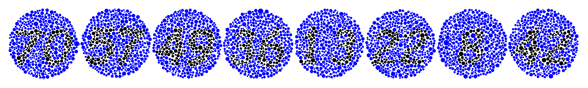
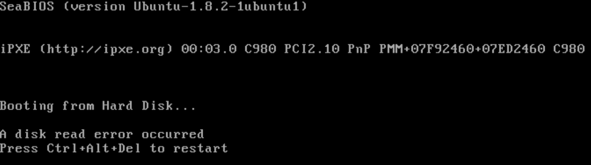

# HackyEaster 2017

## Overview


```
Title                                    Category  Flag
---------------------------------------- --------- -----------------------------
Teaser                                             one do3s not simply s0lve a tea3er 0f hacky easter
Challenge 01: Puzzle This!               Easy      C5LHYOifJSLOnYmKjBmS
Challenge 02: Lots of Dots               Easy      pJ94m6jt3AYbogL2gv9i
Challenge 05: Key Strokes                Easy      2MmSpjmlU6NPAhCUVyUP
Challenge 06: Message Ken                Easy      uktVsuNNyPVQarmXTuYU
Challenge 10: An egg or not...           Medium    UALYyPlhy2aYfYpzcJHA
```

## Teaser

**Challenge**  

1. Solve the riddles and get a solution fragment from each.
2. Combine all the fragments in the right manner.
3. Decode the result to get the final solution string.
4. Sign-Up on Hacking-Lab, if you don't have an account yet.
5. Submit your solution in Hacking-Lab HERE.
6. Wait for April 4, when HackyEaster 2017 starts!

**Solutions**

*Riddle 1*

`MBD2A !ysaep ,ysaE`

Reverse: `Easy, peasy! A2DBM`

*Riddle 2*

`UGllY2Ugb2YgY2FrZSEgWlhHSUQ=`

b64 decode: `Piece of cake! ZXGID`

*Riddle 3*

One for free here: 404 - not found!

invisible text on webpage: `One for free here: 404 - not found! XIZLS`

*Riddle 4*

```
eval(function(p,a,c,k,e,d){e=function(c){return c};if(!''.replace(/^/,String)){while(c--){d[c]=k[c]||c}
k=[function(e){return d[e]}];e=function(){return'\\w+'};c=1};while(c--){if(k[c]){p=p.replace(
new RegExp('\\b'+e(c)+'\\b','g'),k[c])}}return p}('0(\'1\');',2,2,'alert|VYGY6'.split('|'),0,{}))
```

run the javascript: `VYGY6`

*Riddle 5*

```
3a3ea00cfc35332cedf6e5e9a32e94da
9d5ed678fe57bcca610140957afab571
f09564c9ca56850d4cd6b3319e541aee
5dbc98dcc983a70728bd082d1a47546e
7fc56270e7a70fa81a5935b72eacbe29
```

md5: `EBQSA`

*Riddle 6*
```
--- -. . / -- --- .-. . / .... . .-. . ---... / .--- .- --- -- -.--
```

morse code: `ONEMOREHERE: JAOMY`

*Riddle 7*

`Hwldp wx, Euxwh! QYAVL`

ROT23: `Etiam tu, Brute! NVXSI`

*Riddle 8*

```
84 97 107 101 32 116 104 105 115 58 32 71 89 53 84 70
```

ascii: `Take this: GY5TF`

*Riddle 9*

Just a bit:
/2mi4AMj

bit.ly: `5DFME`

*Riddle 10*

No Comment

HTML comment: ` <!-- A43JN-->`

*Riddle 11*

```
👻👽👻👻👻👻👽👽👻👽👻👻👽👽👽👽👻👽👻👻👽👽👽👻👻👽👻👻👻👽👽👽👻👽👻👽👻👻👽👻👻👽👻👻👻👻👻👽
👻👽👻👽👻👽👻👻👻👽👻👽👻👻👽👽👻👻👽👻👻👻👻👽👻👻👽👻👻👻👻👻👻👽👻👻👽👽👽👻👻👻👽👽👻👽👻👽👻
👽👻👽👽👻👻👻👻👽👻👻👻👽👽👽👻👽👻👻👽👻👽👽
```

Binary: `CONGRATS! N5XGK`

*Riddle 12*

```
697c611778601371647d12177e7d060572
3133333731333337313333373133333731
```

xor the strings together:

```python
a="697c611778601371647d12177e7d060572"
b="3133333731333337313333373133333731"
out=''

for i in range(0,len(a),2):
    c = int(a[i:i+2],16)
    d = int(b[i:i+2],16)

    out += chr(c^d)

print out
```

`xor: XOR IS FUN! ON52C`

*Riddle 13*

URER LBH TB: MJX4E

ROT13: `HERE YOU GO: ZWK4R`

*Riddle 14*

```
89504E470D0A1A0A0000000D494844520000001D0000000708020000007BBCD1A5000000017352474200AECE1CE90
000000467414D410000B18F0BFC6105000000097048597300000EC300000EC301C76FA8640000001874455874536F
667477617265007061696E742E6E657420342E302E36FC8C63DF000001AA4944415428534D513DC8416118BD7E4A1
9180C0665A0582C8C7E22DF20C5480A130629060CF29792C16CB06293C82283C2F0C562540693C94F297F2983FB9D
EBF9BEDB77A673CE7DEE799FF3BE0CFB81C160904824C4098542C1E17098CDE672B90C399D4E9D4EA740208846A39
BCD2693C9300CF3F5079A29168B56ABD5E572B5DBEDDF5C954A85B9D3E944D2EBF5D66AB5DBEDF67EBF5BADD6EBF5
1A8D4676BB1D9F7ABD9EDFEF877FBFDFE3F1782E97BB5EAFF0B1473A9D063F1C0E1A8D86CB1D8FC7D8CBE3F1341A0
DC8C964A2502840FE83CF050987C3642693C96AB54A1C558810B8DC4824321C0E178B85CD66836C369BD80244A7D3
A194DBED7E3C1E8893CBE5E804743A1DEE57964DA552F57A1D64B7DB994C2632095CAE4C260B8542C160502A95AED
7EBC160100804E05F2E97E3F1882054E6F7DDEFF770CEE73378369BA5DCE7F3899B04E1C174BBDD582CF6FD01162F
954AD84EA9542E974B9A108BC5FF7301AD564B2F91CFE729174033BC1BF17EBFCFF87CBEF97C4E7ABBDDEAF57A90D
96C66341A3FA519FE5AD56A35A44824C2D99F71B652A9F0B9ABD5CA62B1604028142612891FA2F7838B729D41E800
00000049454E44AE426082
```

turned out to be hex representation of png image, convert back:

```python
import binascii

ct = '89504E470D0A1A0A0000000D494844520000001D0000000708020000007BBCD1A5000000017352474200AECE1CE90000000467414D410000B18F0BFC6105000000097048597300000EC300000EC301C76FA8640000001874455874536F667477617265007061696E742E6E657420342E302E36FC8C63DF000001AA4944415428534D513DC8416118BD7E4A19180C0665A0582C8C7E22DF20C5480A130629060CF29792C16CB06293C82283C2F0C562540693C94F297F2983FB9DEBF9BEDB77A673CE7DEE799FF3BE0CFB81C160904824C4098542C1E17098CDE672B90C399D4E9D4EA740208846A39BCD2693C9300CF3F5079A29168B56ABD5E572B5DBEDDF5C954A85B9D3E944D2EBF5D66AB5DBEDF67EBF5BADD6EBF51A8D4676BB1D9F7ABD9EDFEF877FBFDFE3F1782E97BB5EAFF0B1473A9D063F1C0E1A8D86CB1D8FC7D8CBE3F1341A0DC8C964A2502840FE83CF050987C3642693C96AB54A1C558810B8DC4824321C0E178B85CD66836C369BD80244A7D3A194DBED7E3C1E8893CBE5E804743A1DEE57964DA552F57A1D64B7DB994C2632095CAE4C260B8542C160502A95AED7EBC160100804E05F2E97E3F1882054E6F7DDEFF770CEE73378369BA5DCE7F3899B04E1C174BBDD582CF6FD01162F954AD84EA9542E974B9A108BC5FF7301AD564B2F91CFE729174033BC1BF17EBFCFF87CBEF97C4E7ABBDDEAF57A90D96C66341A3FA519FE5AD56A35A44824C2D99F71B652A9F0B9ABD5CA62B1604028142612891FA2F7838B729D41E80000000049454E44AE426082'

with open('teaser.png', 'w+') as fout:
    fout.write(binascii.unhexlify(ct))
```


PNG image: `AGBTC`


*Riddle 16*

```
FRIDAY THE THIRTEENTH, 4:00 PM
/([FOR]*)([ID]{2})([^N]*)(.)(.*)/g
$2E$44
```

regex: `IDEN4`

*Riddle 16*

`<~<+oue+DGm>FD,5.CghC,+E)./+Ws0B9h&:~>`

Base85 decode: `DFMFZ`

**Final Solution**

We suspect the solution fragments are part of a base32 encoded string,
so we try different possible permutations of the fragments which yield valid outputs:

```python
import itertools
import base64
import string

def extend_solution(partialsolution, mychunks):
    ''' try adding different permutations of 4 pieces to current solution, recurse til solution found'''
    for i in itertools.permutations(mychunks, 4):
        t = partialsolution + ''.join(i)
        padded = t +  '=' * (-len(t) % 8)
        oldchunks = mychunks[:]
        try:
            d = base64.b32decode(padded)

            valid = True
            for c in d:
                #if c not in string.printable:
                if not (c.isalnum() or c == ' '):
                    valid = False
                    break

            if valid:
                if len(t) >= 80:
                    print "possible solution: " + d + " (" + t + ")"

                #recursion
                for x in i:
                    mychunks.remove(x)
                extend_solution(partialsolution+''.join(i), mychunks)
        except Exception as e:
            print e
            exit()

        mychunks = oldchunks[:]


chunks= ['A2DBM','ZXGID','XIZLS','VYGY6','EBQSA','JAOMY','NVXSI','GY5TF',
         '5DFME','A43JN','N5XGK','ON52C','ZWK4R','AGBTC','IDEN4','DFMFZ']

print "solving.."
extend_solution('',chunks)
```

this outputs various possible solutions:

```
solving..
possible solution:  a tea3s not haeply s1terone do3er 0f sikky earlve (EBQSA5DFMEZXGIDON52CA2DBMVYGY6JAOMYXIZLSN5XGKIDEN4ZWK4RAGBTCA43JNNVXSIDFMFZGY5TF)
possible solution:  a tea3s not haeply s0lveone do3er 0f sikky easter (EBQSA5DFMEZXGIDON52CA2DBMVYGY6JAOMYGY5TFN5XGKIDEN4ZWK4RAGBTCA43JNNVXSIDFMFZXIZLS)
possible solution:  a tea3s not hacky easterone do3er 0f simply s0lve (EBQSA5DFMEZXGIDON52CA2DBMNVXSIDFMFZXIZLSN5XGKIDEN4ZWK4RAGBTCA43JNVYGY6JAOMYGY5TF)
possible solution:  a tea3s not hacky earlveone do3er 0f simply s1ter (EBQSA5DFMEZXGIDON52CA2DBMNVXSIDFMFZGY5TFN5XGKIDEN4ZWK4RAGBTCA43JNVYGY6JAOMYXIZLS)
[..]
possible solution: one do3s not simply s1ter a tea3er 0f hacky earlve (N5XGKIDEN4ZXGIDON52CA43JNVYGY6JAOMYXIZLSEBQSA5DFMEZWK4RAGBTCA2DBMNVXSIDFMFZGY5TF)
possible solution: one do3s not simply s0lve a tea3er 0f hacky easter (N5XGKIDEN4ZXGIDON52CA43JNVYGY6JAOMYGY5TFEBQSA5DFMEZWK4RAGBTCA2DBMNVXSIDFMFZXIZLS)
possible solution: one do3s not sikky easter a tea3er 0f haeply s0lve (N5XGKIDEN4ZXGIDON52CA43JNNVXSIDFMFZXIZLSEBQSA5DFMEZWK4RAGBTCA2DBMVYGY6JAOMYGY5TF)
[..]
possible solution: one do3er 0f sikky earlve a tea3s not haeply s1ter (N5XGKIDEN4ZWK4RAGBTCA43JNNVXSIDFMFZGY5TFEBQSA5DFMEZXGIDON52CA2DBMVYGY6JAOMYXIZLS)
```

and best one and our solution is:

```
one do3s not simply s0lve a tea3er 0f hacky easter (N5XGKIDEN4ZXGIDON52CA43JNVYGY6JAOMYGY5TFEBQSA5DFMEZWK4RAGBTCA2DBMNVXSIDFMFZXIZLS)
```

**Flag**

```
one do3s not simply s0lve a tea3er 0f hacky easter
```

## Challenge 01: Puzzle This!

**Challenge**

An easy one to start with.


**Solution**

Shuffled, looks like no rotations.


**Flag**

```
C5LHYOifJSLOnYmKjBmS
```

## Challenge 02: Lots of Dots

**Challenge**

The dots in the following image contain a secret message. Can you find it?


**Solution**

Had a non-colourblind person look at it, he said nothing was there. Split out LSB and bingo:



Pop into the egg-o-matic:


**Flag**

```
pJ94m6jt3AYbogL2gv9i
```

## Challenge 05: Key Strokes

**Challenge**  

05 - Key Strokes

esc i c e l a n d esc a y a n k e e space f o x
space esc o f l o w e r up esc $ esc i y esc e esc a
y esc / l a return esc r w esc right right right
right esc x i f r esc e esc X x x : s / c e / a g i
c / return esc down d d esc i m esc Z Z

**Solution**  

Oh my gosh this is VIM! That's awesome :D

Entering the keystrokes as they provide spells out: magicwandfrankfoxy


**Flag**

```
2MmSpjmlU6NPAhCUVyUP
```

## Challenge 06: Message to Ken

**Challenge**  

Barbie has written a secret message for her sweetheart Ken. Can you decrypt it?

Fabrgal JaeM Hsa faonah uiff;rnl tf btuxbrffuinhzoroyhitbM Fincta dd

Hint:
Shift+Lock+1

**Solution**  
Holy crap this is AWESOME. This relies on you knowing about the barbie typewriters made in the 90s that had a secret code mechanism.
http://www.cryptomuseum.com/crypto/mehano/barbie/#e118

So this is key 2 for coding.

```
norm: abcdefghijklmnopqrstuvwxyz ABCDEFGHIJKLMNOPQRSTUVWXYZ 0123456789
   1: torbiudfhgzcvanqyepskx¢1w; RC>GHAPND<VUBLIKJETOYXM2QF 63405789-¨
   2: icolapxstvybjeruknfhqg;dzw >FAUTCYOLVJDZINQKSEHG<.1PB 523406789-
   3: hrnctqlpsxwogiekzaufyd+b;¢ SARYO>QIUX<GFDLJVTHNP1Z3KC 7405689-¨§
   4: sneohkbufd;rxtaywiqpzl%c¢+ E>SPNRKLG1XYCUDV<HOIQ2B4JA 805679-¨§£
```

'Beloved KenM The secret password is lipglosspartycocktailM Barbie xx'

put the password into the egg-o-matic:


**Flag**

```
uktVsuNNyPVQarmXTuYU
```

## Challenge 07: Crypto for Rookies

**Challenge**  

This crypto is not hard to crack.


**Solution**

line 1: dancing men cipher:   
line 2: base64 decode:     `BONTEAOK`  
line 3: alphabet position: `BONTEBRK`  
line 4:  
line 5: pigpen cipher: `CONTEBOK`  
line 6:  
line 7:  
line 8: hex: `BONYEBOK`


final solution: changed letters per line?

**Flag**

## Challenge 10: An egg or not ...


**Challenge**  
... an egg, that's the question!

Are you able to answer this question and find the (real) egg?


(original svg verson [here](writeupfies/10.svg))

**Solution**  
The QR code is made of individual dots. Some are doubled up, I think we remove the doubles.

I stripped out the `<use ...>` statements and then transformed into a TSV:

```python
data = open('tmp', 'r').read()
q = [x.split('\t') for x in data.split('\n')]
haveSeen = {}

for i in q:
        k = "%s,%s" % (i[0], i[1])
        if k not in haveSeen:
                print """<use x="%s" y="%s" xlink:href="#%s"/>""" % (*i)
        haveSeen[k] = True
```


(original svg verson [here](writeupfies/10.b.svg))

**Flag**  

```
UALYyPlhy2aYfYpzcJHA
```

## Challenge 12: Once Upon a File

**Challenge**  
Once upon a file there was a hidden egg. It's still waiting to be saved by a noble prince or princess.

**Solution**  

Hmm. Zipped file containing a single file, nothing interesting in zipdetails.

```console
[hxr@leda:~/Downloads]$ file file
file: DOS/MBR boot sector, code offset 0x52+2, OEM-ID "NTFS    ", sectors/cluster 8, Media descriptor 0xf8, sectors/track 63, hidden sectors 1, dos < 4.0 BootSector (0x80), FAT (1Y bit by descriptor); NTFS, sectors/track 63, sectors 10239, $MFT start cluster 426, $MFTMirror start cluster 2, bytes/RecordSegment 2^(-1*246), clusters/index block 1, serial number 09850f88350f86a00
```

Ok, that's interesting.

```console
qemu-system-x86_64 -drive format=raw,file=disk.img
```



Not sure where to go from here. tcpdump where it's pixieing to?

**Nugget**


## Challenge 14: Shards

**Challenge**  
Oh no! What a mess!

**Solution**  
Image reassembly software??

**Nugget**

## Challenge 15: P Cap

**Challenge**  
What about a little P cap?

**Solution**  
Lotsa SMB traffic, looks like a file named R05h4L.jpg is tranferred. Dollars to doughnuts that's an egg.

**Nugget**

## Challenge 16: Pathfinder

**Challenge**  
Can you find the right path?

**Solution**  

```
$ curl -i hackyeaster.hacking-lab.com:9999  
HTTP/1.1 200 OK
Content-Type: application/json; charset=utf-8
Content-Length: 39
Date: Thu, 06 Apr 2017 04:19:00 GMT
Connection: keep-alive

{"Answer":"I only talk to PathFinder!"}
```

aha, let's pretend we're pathfinder:

```python
import requests

url = 'http://hackyeaster.hacking-lab.com:9999'

s = requests.Session()

r = s.get(url)
print r.text
# {"Answer":"I only talk to PathFinder!"}, so pretend we're pathfinder:


headers = {'User-Agent': 'PathFinder'}
r = s.get(url, headers=headers)
print r.text
# {"Answer":"Follow one of the possible paths","paths":[1,3,5,8]}, try to pick one?:

# hmm, how to format our path string?
payload = {
    'path': [1]
}
r = s.post(url, headers=headers, params=payload)
print r.text

```

this outputs

```
{"Answer":"I only talk to PathFinder!"}
{"Answer":"Follow one of the possible paths","paths":[1,3,5,8]}
{"Answer":"You've left the path!"}
```

need to figure out how to submit path we want to walk, hmm..

**Nugget**


## Challenge 20: Spaghetti hash

**Challenge**  
Lazy Larry needs to improve the security of his password hashing implementation. He decides to use SHA-512 as a new hashing algorithm in order to be super secure. Unfortunately, the database column for the hash can only hold 128 bit. As Bob is too lazy to extend the column and all the code related to it, he decides to shrink the output of the SHA-512 operation, to 128 bit. For this purpose he picks certain characters from the SHA-512 output for producing the new value.

You got hold of four password hashes, calculated with Bob's new implementation. Can you find the corresponding passwords?

```
hash 1: 87017a3ffc7bdd5dc5d5c9c348ca21c5
hash 2: ff17891414f7d15aa4719689c44ea039
hash 3: 5b9ea4569ad68b85c7230321ecda3780
hash 4: 6ad211c3f933df6e5569adf21d261637
```

Lucky you, you know that the following web service is calculating Bob's algorithm. However, the web service only accepts strings of length 4 or less - brute-forcing a password list thus is no option, since the passwords you are looking for are all longer.

```
https://hackyeaster.hacking-lab.com/hackyeaster/hash?string=abcd
```

**Solution**  
Doesn't look too bad

**Nugget**

**Nugget**


## Dec X: Title  

**Challenge**  
**Solution**  
**Nugget**

```
HV16-
```
