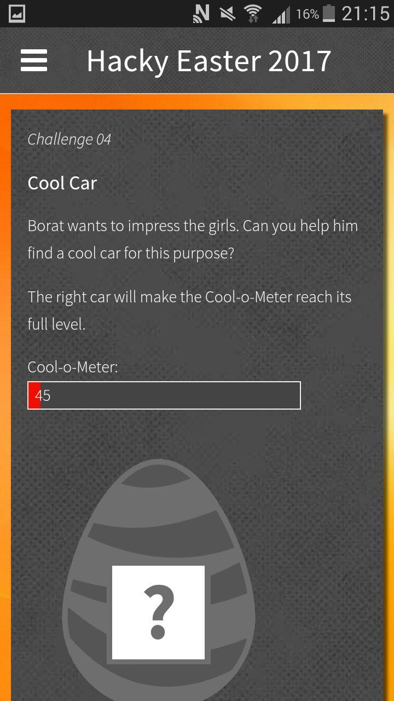
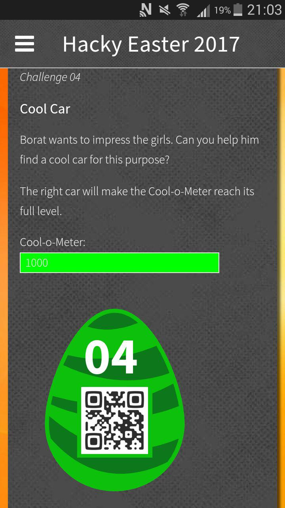
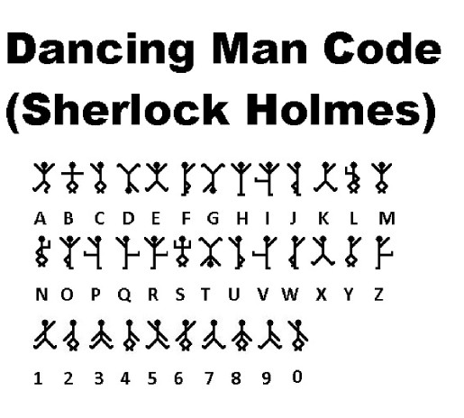

# HackyEaster 2017

## Overview


```
Title                                    Difficulty  Flag
---------------------------------------- ---------- -----------------------------
Teaser                                              one do3s not simply s0lve a tea3er 0f hacky easter
Challenge 01: Puzzle This!               Easy       C5LHYOifJSLOnYmKjBmS
Challenge 02: Lots of Dots               Easy       pJ94m6jt3AYbogL2gv9i
Challenge 03: Favourite Letters          Easy       Sf2MF6QPqpTrB7Eh2is7
Challenge 04: Cool Car                   Easy       MuxlR4DSDdQDUeyKhKnT
Challenge 05: Key Strokes                Easy       2MmSpjmlU6NPAhCUVyUP
Challenge 06: Message Ken                Easy       uktVsuNNyPVQarmXTuYU
Challenge 07: Crypto for Rookies         Easy       2owhVG07plVCwLD1Ggmn
Challenge 08: Snd Mny                    Easy       t10fBcKFNKShxwos5g0e
Challenge 09: Microscope                 Easy       rcwuXWsHjUcU7BbOLC18
Challenge 10: An egg or not...           Medium     UALYyPlhy2aYfYpzcJHA
Challenge 11: Tweaked Tweet              Medium
Challenge 12: Once Upon a File           Medium     duRpDmUeN0d71XzeF8ae
Challenge 13: Lost the Thread            Medium
Challenge 14: Shards                     Medium
Challenge 15: P Cap                      Medium
Challenge 16: Pathfinder                 Medium     xdzEPrFsO8jZH0OHLweM
Challenge 17: Monster Party              Medium
Challenge 18: Nitwit's Doormat Key       Medium
Challenge 19: Disco Time                 Hard
Challenge 20: Spaghetti Hash             Hard       ICBXMH6GJqMqYDsjkaCn
Challenge 21: MonKey                     Hard
Challenge 22: Game, Set and Hash         Hard
Challenge 23: Lovely Vase                Hard
Challenge 24: Your Passport, please      Hard  
```

## Teaser

**Challenge**  

1. Solve the riddles and get a solution fragment from each.
2. Combine all the fragments in the right manner.
3. Decode the result to get the final solution string.
4. Sign-Up on Hacking-Lab, if you don't have an account yet.
5. Submit your solution in Hacking-Lab HERE.
6. Wait for April 4, when HackyEaster 2017 starts!

**Solutions**

*Riddle 1*

`MBD2A !ysaep ,ysaE`

Reverse: `Easy, peasy! A2DBM`

*Riddle 2*

`UGllY2Ugb2YgY2FrZSEgWlhHSUQ=`

b64 decode: `Piece of cake! ZXGID`

*Riddle 3*

One for free here: 404 - not found!

invisible text on webpage: `One for free here: 404 - not found! XIZLS`

*Riddle 4*

```
eval(function(p,a,c,k,e,d){e=function(c){return c};if(!''.replace(/^/,String)){while(c--){d[c]=k[c]||c}
k=[function(e){return d[e]}];e=function(){return'\\w+'};c=1};while(c--){if(k[c]){p=p.replace(
new RegExp('\\b'+e(c)+'\\b','g'),k[c])}}return p}('0(\'1\');',2,2,'alert|VYGY6'.split('|'),0,{}))
```

run the javascript: `VYGY6`

*Riddle 5*

```
3a3ea00cfc35332cedf6e5e9a32e94da
9d5ed678fe57bcca610140957afab571
f09564c9ca56850d4cd6b3319e541aee
5dbc98dcc983a70728bd082d1a47546e
7fc56270e7a70fa81a5935b72eacbe29
```

md5: `EBQSA`

*Riddle 6*
```
--- -. . / -- --- .-. . / .... . .-. . ---... / .--- .- --- -- -.--
```

morse code: `ONEMOREHERE: JAOMY`

*Riddle 7*

`Hwldp wx, Euxwh! QYAVL`

ROT23: `Etiam tu, Brute! NVXSI`

*Riddle 8*

```
84 97 107 101 32 116 104 105 115 58 32 71 89 53 84 70
```

ascii: `Take this: GY5TF`

*Riddle 9*

Just a bit:
/2mi4AMj

bit.ly: `5DFME`

*Riddle 10*

No Comment

HTML comment: ` <!-- A43JN-->`

*Riddle 11*

```
👻👽👻👻👻👻👽👽👻👽👻👻👽👽👽👽👻👽👻👻👽👽👽👻👻👽👻👻👻👽👽👽👻👽👻👽👻👻👽👻👻👽👻👻👻👻👻👽
👻👽👻👽👻👽👻👻👻👽👻👽👻👻👽👽👻👻👽👻👻👻👻👽👻👻👽👻👻👻👻👻👻👽👻👻👽👽👽👻👻👻👽👽👻👽👻👽👻
👽👻👽👽👻👻👻👻👽👻👻👻👽👽👽👻👽👻👻👽👻👽👽
```

Binary: `CONGRATS! N5XGK`

*Riddle 12*

```
697c611778601371647d12177e7d060572
3133333731333337313333373133333731
```

xor the strings together:

```python
a="697c611778601371647d12177e7d060572"
b="3133333731333337313333373133333731"
out=''

for i in range(0,len(a),2):
    c = int(a[i:i+2],16)
    d = int(b[i:i+2],16)

    out += chr(c^d)

print out
```

xor: `XOR IS FUN! ON52C`

*Riddle 13*

URER LBH TB: MJX4E

ROT13: `HERE YOU GO: ZWK4R`

*Riddle 14*

```
89504E470D0A1A0A0000000D494844520000001D0000000708020000007BBCD1A5000000017352474200AECE1CE90
000000467414D410000B18F0BFC6105000000097048597300000EC300000EC301C76FA8640000001874455874536F
667477617265007061696E742E6E657420342E302E36FC8C63DF000001AA4944415428534D513DC8416118BD7E4A1
9180C0665A0582C8C7E22DF20C5480A130629060CF29792C16CB06293C82283C2F0C562540693C94F297F2983FB9D
EBF9BEDB77A673CE7DEE799FF3BE0CFB81C160904824C4098542C1E17098CDE672B90C399D4E9D4EA740208846A39
BCD2693C9300CF3F5079A29168B56ABD5E572B5DBEDDF5C954A85B9D3E944D2EBF5D66AB5DBEDF67EBF5BADD6EBF5
1A8D4676BB1D9F7ABD9EDFEF877FBFDFE3F1782E97BB5EAFF0B1473A9D063F1C0E1A8D86CB1D8FC7D8CBE3F1341A0
DC8C964A2502840FE83CF050987C3642693C96AB54A1C558810B8DC4824321C0E178B85CD66836C369BD80244A7D3
A194DBED7E3C1E8893CBE5E804743A1DEE57964DA552F57A1D64B7DB994C2632095CAE4C260B8542C160502A95AED
7EBC160100804E05F2E97E3F1882054E6F7DDEFF770CEE73378369BA5DCE7F3899B04E1C174BBDD582CF6FD01162F
954AD84EA9542E974B9A108BC5FF7301AD564B2F91CFE729174033BC1BF17EBFCFF87CBEF97C4E7ABBDDEAF57A90D
96C66341A3FA519FE5AD56A35A44824C2D99F71B652A9F0B9ABD5CA62B1604028142612891FA2F7838B729D41E800
00000049454E44AE426082
```

turned out to be hex representation of png image, convert back:

```python
import binascii

ct = '89504E470D0A1A0A0000000D494844520000001D0000000708020000007BBCD1A5000000017352474200AECE1CE90000000467414D410000B18F0BFC6105000000097048597300000EC300000EC301C76FA8640000001874455874536F667477617265007061696E742E6E657420342E302E36FC8C63DF000001AA4944415428534D513DC8416118BD7E4A19180C0665A0582C8C7E22DF20C5480A130629060CF29792C16CB06293C82283C2F0C562540693C94F297F2983FB9DEBF9BEDB77A673CE7DEE799FF3BE0CFB81C160904824C4098542C1E17098CDE672B90C399D4E9D4EA740208846A39BCD2693C9300CF3F5079A29168B56ABD5E572B5DBEDDF5C954A85B9D3E944D2EBF5D66AB5DBEDF67EBF5BADD6EBF51A8D4676BB1D9F7ABD9EDFEF877FBFDFE3F1782E97BB5EAFF0B1473A9D063F1C0E1A8D86CB1D8FC7D8CBE3F1341A0DC8C964A2502840FE83CF050987C3642693C96AB54A1C558810B8DC4824321C0E178B85CD66836C369BD80244A7D3A194DBED7E3C1E8893CBE5E804743A1DEE57964DA552F57A1D64B7DB994C2632095CAE4C260B8542C160502A95AED7EBC160100804E05F2E97E3F1882054E6F7DDEFF770CEE73378369BA5DCE7F3899B04E1C174BBDD582CF6FD01162F954AD84EA9542E974B9A108BC5FF7301AD564B2F91CFE729174033BC1BF17EBFCFF87CBEF97C4E7ABBDDEAF57A90D96C66341A3FA519FE5AD56A35A44824C2D99F71B652A9F0B9ABD5CA62B1604028142612891FA2F7838B729D41E80000000049454E44AE426082'

with open('teaser.png', 'w+') as fout:
    fout.write(binascii.unhexlify(ct))
```


PNG image: `AGBTC`


*Riddle 16*

```
FRIDAY THE THIRTEENTH, 4:00 PM
/([FOR]*)([ID]{2})([^N]*)(.)(.*)/g
$2E$44
```

regex: `IDEN4`

*Riddle 16*

`<~<+oue+DGm>FD,5.CghC,+E)./+Ws0B9h&:~>`

Base85 decode: `DFMFZ`

**Final Solution**

We suspect the solution fragments are part of a base32 encoded string,
so we try different possible permutations of the fragments which yield valid outputs:

```python
import itertools
import base64
import string

def extend_solution(partialsolution, mychunks):
    ''' try adding different permutations of 4 pieces to current solution, recurse til solution found'''
    for i in itertools.permutations(mychunks, 4):
        t = partialsolution + ''.join(i)
        padded = t +  '=' * (-len(t) % 8)
        oldchunks = mychunks[:]
        try:
            d = base64.b32decode(padded)

            valid = True
            for c in d:
                #if c not in string.printable:
                if not (c.isalnum() or c == ' '):
                    valid = False
                    break

            if valid:
                if len(t) >= 80:
                    print "possible solution: " + d + " (" + t + ")"

                #recursion
                for x in i:
                    mychunks.remove(x)
                extend_solution(partialsolution+''.join(i), mychunks)
        except Exception as e:
            print e
            exit()

        mychunks = oldchunks[:]


chunks= ['A2DBM','ZXGID','XIZLS','VYGY6','EBQSA','JAOMY','NVXSI','GY5TF',
         '5DFME','A43JN','N5XGK','ON52C','ZWK4R','AGBTC','IDEN4','DFMFZ']

print "solving.."
extend_solution('',chunks)
```

this outputs various possible solutions:

```
solving..
possible solution:  a tea3s not haeply s1terone do3er 0f sikky earlve (EBQSA5DFMEZXGIDON52CA2DBMVYGY6JAOMYXIZLSN5XGKIDEN4ZWK4RAGBTCA43JNNVXSIDFMFZGY5TF)
possible solution:  a tea3s not haeply s0lveone do3er 0f sikky easter (EBQSA5DFMEZXGIDON52CA2DBMVYGY6JAOMYGY5TFN5XGKIDEN4ZWK4RAGBTCA43JNNVXSIDFMFZXIZLS)
possible solution:  a tea3s not hacky easterone do3er 0f simply s0lve (EBQSA5DFMEZXGIDON52CA2DBMNVXSIDFMFZXIZLSN5XGKIDEN4ZWK4RAGBTCA43JNVYGY6JAOMYGY5TF)
possible solution:  a tea3s not hacky earlveone do3er 0f simply s1ter (EBQSA5DFMEZXGIDON52CA2DBMNVXSIDFMFZGY5TFN5XGKIDEN4ZWK4RAGBTCA43JNVYGY6JAOMYXIZLS)
[..]
possible solution: one do3s not simply s1ter a tea3er 0f hacky earlve (N5XGKIDEN4ZXGIDON52CA43JNVYGY6JAOMYXIZLSEBQSA5DFMEZWK4RAGBTCA2DBMNVXSIDFMFZGY5TF)
possible solution: one do3s not simply s0lve a tea3er 0f hacky easter (N5XGKIDEN4ZXGIDON52CA43JNVYGY6JAOMYGY5TFEBQSA5DFMEZWK4RAGBTCA2DBMNVXSIDFMFZXIZLS)
possible solution: one do3s not sikky easter a tea3er 0f haeply s0lve (N5XGKIDEN4ZXGIDON52CA43JNNVXSIDFMFZXIZLSEBQSA5DFMEZWK4RAGBTCA2DBMVYGY6JAOMYGY5TF)
[..]
possible solution: one do3er 0f sikky earlve a tea3s not haeply s1ter (N5XGKIDEN4ZWK4RAGBTCA43JNNVXSIDFMFZGY5TFEBQSA5DFMEZXGIDON52CA2DBMVYGY6JAOMYXIZLS)
```

and best one and our solution is:

```
one do3s not simply s0lve a tea3er 0f hacky easter (N5XGKIDEN4ZXGIDON52CA43JNVYGY6JAOMYGY5TFEBQSA5DFMEZWK4RAGBTCA2DBMNVXSIDFMFZXIZLS)
```

**Flag**

```
one do3s not simply s0lve a tea3er 0f hacky easter
```

## Challenge 01: Puzzle This!

**Challenge**

An easy one to start with.


**Solution**

Shuffled, looks like no rotations.


**Flag**

```
C5LHYOifJSLOnYmKjBmS
```

## Challenge 02: Lots of Dots

**Challenge**

The dots in the following image contain a secret message. Can you find it?


**Solution**

Had a non-colourblind person look at it, he said nothing was there. Split out LSB and bingo:


Pop into the egg-o-matic:


**Flag**

```
pJ94m6jt3AYbogL2gv9i
```

## Challenge 03: Favourite Letters

```
Francesca's favourite letter is s
Riley's favourite letter is o
Ellie's favourite letter is a
Vince's favourite letter is p
Quintain's favourite letter is r
Otto's favourite letter is i
David's favourite letter is p
Tom's favourite letter is l
Paul's favourite letter is e
Ulrich's favourite letter is y
Henry's favourite letter is w
Norman's favourite letter is h
Louis' favourite letter is i
Zane's favourite letter is s
York's favourite letter is c
Bob's favourite letter is h
Meave's favourite letter is s
Ian's favourite letter is o
Sidney's favourite letter is g
George's favourite letter is s
Kitty's favourite letter is d
Wilbert's favourite letter is h
Adam's favourite letter is t
Xander's favourite letter is i
Callum's favourite letter is e
Jack's favourite letter is r
```

**Solution**

All names start with different letter and there are 26 of them, so lets take the
first letter of the name as a hint for the positioning of the favourite letters:

```
ABCDEFGHIJKLMNOPQRSTUVWXYZ
thepasswordishieroglyphics
```

put `hieroglyphics` into the egg-o-matic to get our egg5


**Flag**

```
Sf2MF6QPqpTrB7Eh2is7
```

## Challenge 04: Cool Car

**Challenge**

(Mobile Challenge)



Borat wants to impress the girls. Can you help him find a cool car for his purpose?


**Solution**

There is a meter we presumably need to fill, source code from decompiled apk shows:

```javascript
function setLevel(l) {
  if (l>1000) l=1000;
  $('#level').css('width',(l/4)+'px');
  $('#level').css('background-color', 'rgba(' + Math.round((1000-l)*0.255) + ',' + Math.round(l*0.255) + ',0,1.0)');
  $('#level').text(""+Math.round(l));
}
function requestLevels() {
    window.location.href="ps://sensors";
}
function sensorFeedback(json) {
    var jsonResp = JSON.parse(json);
    setLevel(jsonResp.l);
    if (jsonResp.k) {
        decryptScrambledEggWithKey(jsonResp.k);
        clearInterval(intervalId);
    }
}
var intervalId = setInterval(requestLevels, 2000);
```

so it checks some sensor level, and looks like this needs to be 1000 to get our egg

hmm, Borat and cars, we find this youtube video https://www.youtube.com/watch?v=yAuu3xOsorQ
in which Borat wants a car with a pussy magnet ..hmm, magnets?

I held a fridge magnet to my phone and the meter filled right up to 1000 and gave me the egg



**Flag**

```
MuxlR4DSDdQDUeyKhKnT
```

## Challenge 05: Key Strokes

**Challenge**  

```
esc i c e l a n d esc a y a n k e e space f o x
space esc o f l o w e r up esc $ esc i y esc e esc a
y esc / l a return esc r w esc right right right
right esc x i f r esc e esc X x x : s / c e / a g i
c / return esc down d d esc i m esc Z Z
```

**Solution**  

Oh my gosh this is VIM! That's awesome :D

Entering the keystrokes as they provide spells out: `magicwandfrankfoxy`


**Flag**

```
2MmSpjmlU6NPAhCUVyUP
```

## Challenge 06: Message to Ken

**Challenge**  

Barbie has written a secret message for her sweetheart Ken. Can you decrypt it?

```
Fabrgal JaeM Hsa faonah uiff;rnl tf btuxbrffuinhzoroyhitbM Fincta dd
```

Hint: `Shift+Lock+1`

**Solution**  
Holy crap this is AWESOME. This relies on you knowing about the barbie typewriters made in the 90s that had a secret code mechanism.
http://www.cryptomuseum.com/crypto/mehano/barbie/#e118

So this is key 2 for coding.

```
norm: abcdefghijklmnopqrstuvwxyz ABCDEFGHIJKLMNOPQRSTUVWXYZ 0123456789
   1: torbiudfhgzcvanqyepskx¢1w; RC>GHAPND<VUBLIKJETOYXM2QF 63405789-¨
   2: icolapxstvybjeruknfhqg;dzw >FAUTCYOLVJDZINQKSEHG<.1PB 523406789-
   3: hrnctqlpsxwogiekzaufyd+b;¢ SARYO>QIUX<GFDLJVTHNP1Z3KC 7405689-¨§
   4: sneohkbufd;rxtaywiqpzl%c¢+ E>SPNRKLG1XYCUDV<HOIQ2B4JA 805679-¨§£
```

'Beloved KenM The secret password is lipglosspartycocktailM Barbie xx'

put the password into the egg-o-matic:


**Flag**

```
uktVsuNNyPVQarmXTuYU
```

## Challenge 07: Crypto for Rookies

**Challenge**  

This crypto is not hard to crack.


**Solution**

Line | Cipher              | Result
---- | ------------------- | ------
1:   | dancing men cipher  | `BONTBBOK`
2:   | base64 decode       | `BONTEAOK`
3:   | alphabet position   | `BONTEBRK`
4:   | rot13               | `BANTEBOK`
5:   | pigpen cipher       | `CONTEBOK`
6:   | reversed?           | `BONTEBOA`
7:   | rot23?              | `BOPTEBOK`
8:   | hex:                | `BONYEBOK`




- final solution: changed letters per line? If so: EABRAOCOBAPKNY
- Update: not working. Maybe I copied them wrong? Or somethnig else? :S
- Odd one out per position: `CAPYBARA`

pop this in egg-o-matic and get our egg:


**Flag**

```
2owhVG07plVCwLD1Ggmn
```

## Challenge 08: Snd Mny

**Challenge**

(Mobile Challenge)

Please, I'm begging you!

**Solution**

find the relevant code in decompiled apk:

```java
public class SndActivity extends Activity {
    protected void onCreate(Bundle savedInstanceState) {
        super.onCreate(savedInstanceState);
        requestWindowFeature(1);
        getWindow().setFlags(AccessibilityNodeInfoCompat.ACTION_NEXT_HTML_ELEMENT, AccessibilityNodeInfoCompat.ACTION_NEXT_HTML_ELEMENT);
        setContentView(C0085R.layout.activity_snd);
        Intent intent = getIntent();
        String action = intent.getAction();
        String type = intent.getType();
        if ("android.intent.action.SEND".equals(action) && type != null && HTTP.PLAIN_TEXT_TYPE.equals(type)) {
            String text = intent.getStringExtra("android.intent.extra.TEXT");
            if (text != null && "c95259de1fd719814daef8f1dc4bd64f9d885ff0".equals(sha1(text.toLowerCase()))) {
                ((TextView) findViewById(C0085R.id.sndTextView)).setText("Thank you!!");
                ImageView image = (ImageView) findViewById(C0085R.id.sndImageView);
                byte[] decodedString = Base64.decode(new StringBuilder(getString(C0085R.string.f16e) + "ROBVi").reverse().toString(), 0);
                image.setImageBitmap(BitmapFactory.decodeByteArray(decodedString, 0, decodedString.length));
            }
        }
    }

[..]

}
```

`c95259de1fd719814daef8f1dc4bd64f9d885ff0` is the SHA-1 hash for the string `money`

send this string to the app somehow?

ah, we notice there is now a new entry in the share menu to share to the hackyeaster `SndActivity` app.

we share something random and get the following:


we presumably need to send just the string `money` downloaded an app called *Clipboard Actions* which
lets you share anything on your clipboard


**Flag**

```
t10fBcKFNKShxwos5g0e
```

## Challenge 09: Microscope

**Challenge**  

(Mobile Challenge)

In order to see this easter egg, you have to look closely!

[button with leads to microscope showing a page with a tiny tiny egg on it]

**Solution**  

We look at the source for the challenge from the decompiled apk

```java
package ps.hacking.hackyeaster.android;

import android.app.Activity;
import android.os.Bundle;
import android.support.v4.view.accessibility.AccessibilityNodeInfoCompat;
import android.webkit.HttpAuthHandler;
import android.webkit.WebResourceError;
import android.webkit.WebResourceRequest;
import android.webkit.WebView;
import android.webkit.WebViewClient;

public class MicroscopeActivity extends Activity {

    /* renamed from: ps.hacking.hackyeaster.android.MicroscopeActivity.1 */
    class C00841 extends WebViewClient {
        C00841() {
        }

        public void onReceivedHttpAuthRequest(WebView view, HttpAuthHandler handler, String host, String realm) {
            handler.proceed("he2017", "egggghunthackinglab");
        }

        public void onReceivedError(WebView view, WebResourceRequest request, WebResourceError error) {
            view.loadDataWithBaseURL(null, "<html>&#128048;</html>", "text/html", "utf-8", null);
        }
    }

    protected void onCreate(Bundle savedInstanceState) {
        super.onCreate(savedInstanceState);
        requestWindowFeature(1);
        getWindow().setFlags(AccessibilityNodeInfoCompat.ACTION_NEXT_HTML_ELEMENT, AccessibilityNodeInfoCompat.ACTION_NEXT_HTML_ELEMENT);
        setContentView(C0085R.layout.activity_microscope);
        WebView webview = (WebView) findViewById(C0085R.id.microscopeWebView);
        webview.getSettings().setJavaScriptEnabled(true);
        webview.setWebViewClient(new C00841());
        webview.loadUrl("https://hackyeaster.hacking-lab.com/hackyeaster/challenge09_su6z47IoTT7.html".replace('6', '5'));
    }
}
```

we see the microscipe butten opens this webpage: https://hackyeaster.hacking-lab.com/hackyeaster/challenge09_su5z47IoTT7.html

We open this page:

```html
<html>
  <head>
    <meta http-equiv="cache-control" content="max-age=0" />
    <meta http-equiv="cache-control" content="no-cache" />
    <meta http-equiv="expires" content="0" />
    <meta http-equiv="expires" content="Tue, 01 Jan 1980 1:00:00 GMT" />
    <meta http-equiv="pragma" content="no-cache" />
  </head>
  <body style="background: url('images/background.jpg') no-repeat center center fixed;  -webkit-background-size: cover; -moz-background-size: cover; -o-background-size: cover; background-size: cover;">
  <table width=100% height=100% border="0">
    <tr>
        <td style="text-align: center; vertical-align: middle;">
          <div style="padding: 20px; width: 180px; height: 180px; position: absolute; left: 50%; top: 50%; margin-top: -110px; margin-left: -110px;">
            
          </div>
        </td>
    </tr>
  </table>
  </body>
</html>
```

and find the location of the egg image


**Flag**  

```
rcwuXWsHjUcU7BbOLC18
```

## Challenge 10: An egg or not ...


**Challenge**  
... an egg, that's the question!

Are you able to answer this question and find the (real) egg?


(original svg verson [here](writeupfies/10.svg))

**Solution**  
The QR code is made of individual dots. Some are doubled up, I think we remove the doubles.

I stripped out the `<use ...>` statements and then transformed into a TSV:

```python
data = open('tmp', 'r').read()
q = [x.split('\t') for x in data.split('\n')]
haveSeen = {}

for i in q:
        k = "%s,%s" % (i[0], i[1])
        if k not in haveSeen:
                print """<use x="%s" y="%s" xlink:href="#%s"/>""" % (*i)
        haveSeen[k] = True
```


(original svg verson [here](writeupfies/10.b.svg))

**Flag**  

```
UALYyPlhy2aYfYpzcJHA
```

## Challenge 11: Tweaked Tweet

**Challenge**  

(Mobile Challenge)

Blue little birdie create a fancy message, please tweet it!

[button to tweet a message]

**Solution**  

We check the decompiled sources and see the code to generate the tweet:

```java
private void startTweakedTweet() {
    try {
        startActivity(new Intent("android.intent.action.VIEW", Uri.parse("https://twitter.com/intent/tweet?text=%23%EF%BC%A8a%EF%BD%83%EF%BD%8By%CE%95%EF%BD%81ste%EF%BD%92%E2%80%A9201%EF%BC%97%E2%80%A9%E2%85%B0%EF%BD%93%E2%80%80a%E2%80%84l%EF%BD%8F%EF%BD%94%E2%80%80%CE%BFf%E2%80%89%EF%BD%86un%EF%BC%81%E2%80%A8%23%D1%81tf%E2%80%88%23%EF%BD%88%EF%BD%81%CF%B2king-lab")));
    } catch (Exception e) {
        e.printStackTrace();
    }
}
```

The tweet in ascii:

```
#ＨaｃｋyΕａsteｒ
201７
ⅰｓ a lｏｔ οf ｆun！
#сtf #ｈａϲking-lab
```

in hex:

```
23efbca861efbd83efbd8b79ce95efbd81737465efbd92e280a9323031efbc97e280
a9e285b0efbd93e2808061e280846cefbd8fefbd94e28080cebf66e28089efbd8675
6eefbc81e280a823d1817466e2808823efbd88efbd81cfb26b696e672d6c6162
```

**Flag**  

```

```

## Challenge 12: Once Upon a File

**Challenge**  
Once upon a file there was a hidden egg. It's still waiting to be saved by a noble prince or princess.

**Solution**  

Hmm. Zipped file containing a single file, nothing interesting in zipdetails.

```console
[hxr@leda:~/Downloads]$ file file
file: DOS/MBR boot sector, code offset 0x52+2, OEM-ID "NTFS    ", sectors/cluster 8, Media descriptor 0xf8, sectors/track 63, hidden sectors 1, dos < 4.0 BootSector (0x80), FAT (1Y bit by descriptor); NTFS, sectors/track 63, sectors 10239, $MFT start cluster 426, $MFTMirror start cluster 2, bytes/RecordSegment 2^(-1*246), clusters/index block 1, serial number 09850f88350f86a00
```

Ok, that's interesting.

```console
qemu-system-x86_64 -drive format=raw,file=disk.img
```


Not sure where to go from here. tcpdump where it's pixieing to? EDIT: apparently this is standard qemu/seabios behaviour. Whoops. No idea. Tried `photorec` on the disk image with no luck.

next we tried binwalk

```bash
$ binwalk -e file

DECIMAL       HEXADECIMAL     DESCRIPTION
--------------------------------------------------------------------------------
36447         0x8E5F          Unix path: /0/1/2/3/4/5/6/7/8/9/:/;/</=/>/?/@/A/B/C/D/E/F/G/H/I/J/K/L/M/N/O/P/Q/R/S/T/U/V/W/X/Y/Z/[/\/]/^/_/`/a/b/c/d/e/f/g/h/i/j/k/l/m/n/o
184320        0x2D000         Zip archive data, at least v2.0 to extract, compressed size: 439156, uncompressed size: 5242880, name: file
623596        0x983EC         End of Zip archive

$ ls _file.extracted
2D000.zip  file

$ cd _file.extracted  

$ binwalk -e file

DECIMAL       HEXADECIMAL     DESCRIPTION
--------------------------------------------------------------------------------
36447         0x8E5F          Unix path: /0/1/2/3/4/5/6/7/8/9/:/;/</=/>/?/@/A/B/C/D/E/F/G/H/I/J/K/L/M/N/O/P/Q/R/S/T/U/V/W/X/Y/Z/[/\/]/^/_/`/a/b/c/d/e/f/g/h/i/j/k/l/m/n/o
1093632       0x10B000        Microsoft Cabinet archive data, 17834 bytes, 1 file
2832320       0x2B37C0        Microsoft Cabinet archive data, 17834 bytes, 1 file
3116030       0x2F8BFE        Microsoft executable, MS-DOS
3788479       0x39CEBF        mcrypt 2.2 encrypted data, algorithm: blowfish-448, mode: CBC, keymode: 8bit
3793983       0x39E43F        mcrypt 2.2 encrypted data, algorithm: blowfish-448, mode: CBC, keymode: 8bit
4477995       0x44542B        mcrypt 2.2 encrypted data, algorithm: blowfish-448, mode: CBC, keymode: SHA-1 hash
5073287       0x4D6987        mcrypt 2.2 encrypted data, algorithm: blowfish-448, mode: CBC, keymode: 8bit
5075359       0x4D719F        mcrypt 2.2 encrypted data, algorithm: blowfish-448, mode: CBC, keymode: 8bit
5173248       0x4EF000        PNG image, 480 x 480, 8-bit colormap, non-interlaced
5173767       0x4EF207        Zlib compressed data, best compression

$ ls _file.extracted
10B000.cab  2B37C0.cab  4EF207  4EF207.zlib  egg12.png  eg?Z2.png

```
and there we see we get our egg


**Nugget**

```
duRpDmUeN0d71XzeF8ae
```

## Challenge 14: Shards

**Challenge**  
Oh no! What a mess!

**Solution**  
Image reassembly software??

**Nugget**

## Challenge 15: P Cap

**Challenge**  
What about a little P cap?

**Solution**  
Lotsa SMB traffic, looks like a file named R05h4L.jpg is tranferred. Dollars to doughnuts that's an egg.

opened with wireshark, extracted the objects transferred, seems like two versions of that image, and two webpages:

[R05h4L.jpg](writeupfiles/pcap/R05h4L.jpg) (incomplete)

R05h4L(1).jpg:


perdu.com ([html file](writeupfiles/pcap/perdu.com.html)) ([site](http://perdu.com)):

```html
<html>
    <head>
        <title>Vous Etes Perdu ?</title>
    </head>
    <body>
        <h1>Perdu sur l'Internet ?</h1>
        <h2>Pas de panique, on va vous aider</h2>
        <strong><pre>    * <----- vous &ecirc;tes ici</pre></strong>
    </body>
</html>
```

nothinghere.pl ([html file](writeupfiles/pcap/nothinghere.pl.html)) ([site](http://nothinghere.pl)):

--> find login credentials to this site in pcap and log in?

**Nugget**

## Challenge 16: Pathfinder

**Challenge**  
Can you find the right path?

**Solution**  

```
$ curl -i hackyeaster.hacking-lab.com:9999  
HTTP/1.1 200 OK
Content-Type: application/json; charset=utf-8
Content-Length: 39
Date: Thu, 06 Apr 2017 04:19:00 GMT
Connection: keep-alive

{"Answer":"I only talk to PathFinder!"}
```

aha, let's pretend we're PathFinder by setting our user-agent as such:

```
curl hackyeaster.hacking-lab.com:9999 --user-agent 'PathFinder'

{"Answer":"Follow one of the possible paths","paths":[1,3,5,8]}
```

Ok, looks like we need to find our way in a maze of some sort. After trying many
things, it turned out to be url path, let's choose path `1` by adding `/1` to url

```
curl hackyeaster.hacking-lab.com:9999/1 --user-agent 'PathFinder'

{"Answer":"Go on! Follow one of the possible paths","paths":[5]}
```

we are given new options, so we can now visit `/15` etc until we find our flag:

we automate this in a [python script](writeupfiles/16.py):

```python
import requests
import json
import pprint

count = 0

def findpath(current_url, mypaths):
    global count
    for p in mypaths:
        count += 1
        if count %100 == 0:
            print "currently trying: " + current_url
        new_url = current_url+str(p)
        r = s.get(new_url, headers=headers)
        response = json.loads(r.text)

        if response['Answer'] == "You've left the path!":
            print "error"
            exit()

        # recurse
        elif response['Answer'] == "Go on! Follow one of the possible paths":
            findpath(new_url, response['paths'])

        # if other response, we found it maybe?
        elif response['Answer'] != "This leads to nowhere, so turn around!":
            pprint.pprint(response)
            exit()

    # backtrack


url = 'http://hackyeaster.hacking-lab.com:9999/'
headers = {'User-Agent': 'PathFinder'}
s = requests.Session()

# recursively follow path until we get to an ending
r = s.get(url, headers=headers)
response = json.loads(r.text)
findpath(url, response['paths'])

```

this outputs:

```
currently trying: http://hackyeaster.hacking-lab.com:9999/153274689269185
currently trying: http://hackyeaster.hacking-lab.com:9999/153274689269385174847196523496
currently trying: http://hackyeaster.hacking-lab.com:9999/1532746892698531748471965239265
currently trying: http://hackyeaster.hacking-lab.com:9999/153284679269315
currently trying: http://hackyeaster.hacking-lab.com:9999/15328467926975148384
currently trying: http://hackyeaster.hacking-lab.com:9999/153284697269175
currently trying: http://hackyeaster.hacking-lab.com:9999/1532846972697154838
currently trying: http://hackyeaster.hacking-lab.com:9999/15329468724937
currently trying: http://hackyeaster.hacking-lab.com:9999/153294687269385
currently trying: http://hackyeaster.hacking-lab.com:9999/1572846932497
currently trying: http://hackyeaster.hacking-lab.com:9999/15728469326931587484
currently trying: http://hackyeaster.hacking-lab.com:9999/157284693269375184348196527926
currently trying: http://hackyeaster.hacking-lab.com:9999/1572846932697
currently trying: http://hackyeaster.hacking-lab.com:9999/157284693269753184843196527
currently trying: http://hackyeaster.hacking-lab.com:9999/15729468326
currently trying: http://hackyeaster.hacking-lab.com:9999/15729468326935817434817652992654
currently trying: http://hackyeaster.hacking-lab.com:9999/15729468326935817434871652949658371282597134673
currently trying: http://hackyeaster.hacking-lab.com:9999/1572946832693581743487165924
currently trying: http://hackyeaster.hacking-lab.com:9999/157294683269358174843176592
currently trying: http://hackyeaster.hacking-lab.com:9999/15729468326935817484371652949658371252897134673164289567

{u'Answer': u'Thanks PathFinder you saved my life by giving me the solution to this sudoku!',
 u'Secret': u'https://hackyeaster.hacking-lab.com/hackyeaster/images/challenge/egg16_UYgXzJqpfc.png',
 u'sudoku': [[0, 0, 0, 2, 0, 4, 6, 0, 0],
             [2, 0, 9, 0, 0, 0, 0, 0, 0],
             [0, 0, 0, 0, 0, 6, 5, 0, 0],
             [0, 0, 6, 5, 0, 0, 7, 1, 0],
             [0, 0, 0, 9, 0, 0, 0, 4, 0],
             [7, 3, 1, 0, 0, 0, 0, 0, 0],
             [0, 7, 0, 0, 3, 0, 0, 0, 8],
             [0, 8, 0, 0, 2, 7, 0, 3, 1],
             [0, 1, 4, 0, 6, 0, 0, 0, 0]],
 u'your_solution': [[1, 5, 7, 2, 9, 4, 6, 8, 3],
                    [2, 6, 9, 3, 5, 8, 1, 7, 4],
                    [8, 4, 3, 7, 1, 6, 5, 2, 9],
                    [4, 9, 6, 5, 8, 3, 7, 1, 2],
                    [5, 2, 8, 9, 7, 1, 3, 4, 6],
                    [7, 3, 1, 6, 4, 2, 8, 9, 5],
                    [9, 7, 2, 1, 3, 5, 4, 6, 8],
                    [6, 8, 5, 4, 2, 7, 9, 3, 1],
                    [3, 1, 4, 8, 6, 9, 2, 5, 7]]}

```

Aha! we've reached the end and the `Secret` url give us our egg:


**Flag**

```
xdzEPrFsO8jZH0OHLweM
```

## Challenge 18: Nitwit's doormat key

**Challenge**

**Solution**

we check the source

```html
<!DOCTYPE html>
<html>
	<head>
		<title>Awesome login by me!</title>
		<meta charset="UTF-8">
        <meta name="viewport" content="width=device-width, initial-scale=1">
		<script src="script.js" type="text/javascript"></script>
		<link rel="stylesheet" href="style.css" type="text/css"/>
	</head>
	<body>
    <div id="container1">
  		<div class="form">
          <input id="uzr" type="text" placeholder="username"/>
          <input id="puzzwerd" placeholder="password" type="password"/>
          <input id="sub" type="button" value="Login!">
        </div>
    </div>
    <div id="container2">
	 
    </div>
	<script>
    v06b9e817c4ddcf60fbd82113f8c1f49b = [function(va587d4b34c724ca63a1afcbaeca7f254) {
    return '1407c2b75f43d3691c240e28204533da74ee4054f5f2538e87b69ec590b04de2c2bd190b';
}, function(va587d4b34c724ca63a1afcbaeca7f254) {
    return v16441ef9304a5520d663e6580bf16679.createElement(va587d4b34c724ca63a1afcbaeca7f254);
}, function(va587d4b34c724ca63a1afcbaeca7f254) {
    return va587d4b34c724ca63a1afcbaeca7f254[0].getContext(va587d4b34c724ca63a1afcbaeca7f254[1]);
}, function(va587d4b34c724ca63a1afcbaeca7f254) {
    return va587d4b34c724ca63a1afcbaeca7f254[0].text = va587d4b34c724ca63a1afcbaeca7f254[1];
}, function(va587d4b34c724ca63a1afcbaeca7f254) {
    return null;
}, function(va587d4b34c724ca63a1afcbaeca7f254) {
    '6d363479c97439b921ad2bcba054992d8eda9a0c971df8f80920b84ab4eeae83cae6b76c';
}, function(va587d4b34c724ca63a1afcbaeca7f254) {
    return 'e77a763321d6cf825534ab228e1dfa33e71447c1637dc3b97dcf2d564e2003f67e7c26aa';
}, function(va587d4b34c724ca63a1afcbaeca7f254) {
    va587d4b34c724ca63a1afcbaeca7f254.style.display = 'none';
    return va587d4b34c724ca63a1afcbaeca7f254;
}, function(va587d4b34c724ca63a1afcbaeca7f254) {
    v159851e0e855ec9a87293bada9f49593.onload = va587d4b34c724ca63a1afcbaeca7f254
}, function(va587d4b34c724ca63a1afcbaeca7f254) {
    v159851e0e855ec9a87293bada9f49593.src = va587d4b34c724ca63a1afcbaeca7f254;
}, new Function("va587d4b34c724ca63a1afcbaeca7f254", "return unescape(decodeURIComponent(window.atob(va587d4b34c724ca63a1afcbaeca7f254)))"), function(va587d4b34c724ca63a1afcbaeca7f254) {
    vbe3ae157bcaf01bd49ec5a9b228e92fb = new Function('va587d4b34c724ca63a1afcbaeca7f254', v06b9e817c4ddcf60fbd82113f8c1f49b[10](v21a3d2d3fc5c2c1e1f3a633bd8f16f7e[va587d4b34c724ca63a1afcbaeca7f254]));
    return vbe3ae157bcaf01bd49ec5a9b228e92fb;
}];
v1341746e3d58a8c0d7ce43b877b6beb1 = [0, 255, 0];
v21a3d2d3fc5c2c1e1f3a633bd8f16f7e = ['cmV0dXJuJTIwJ2NhbnZhcyclM0I=', 'cmV0dXJuJTIwJ25vbmUnJTNC', 'cmV0dXJuJTIwJzJkJyUzQg==', 'cmV0dXJuJTIwJ3NjcmlwdCclM0I=', '', 'vd547050f5153d6953e12ea54b398855a', 'v6b31cf3f4c1305942d60342286cd09c5', 'cmV0dXJuJTIwJ2RhdGElM0FpbWFnZSUyRnBuZyUzQmJhc2U2NCUyQyclM0I=', '', 'iVBORw0KGgoAAAANSUhEUgAAAC0AAAAtCAIAAAC1eHXNAAANt0lEQVRYhU2USVMciJGFP6pALCUBYk8tgFi0dUstPST3Grbby0RM9M3hn6CIOc3/82Wix3MYT8f0PEmtllogxCKWZCvWgoIqqPKhbY/z9L2Il3l6L1ueSUZf4E5pzZTlQ6hBWLfErD2N9uRt66o8b90VF3gB6tYUPoJp1A1b8gr0WGPyGjTQAb6N5vAUlKBhreCGVLNHxIqpo2noFDumtSKN4XazhvthB31h9vFzudO6jxbFfbSBh1E3PrIWpKe4Jq+YadFlNnC7VRfXRNn0o6Z4axVwDTXFt9AnN6ySPY1WIGESd8CauUDFTiin6oprjqpy2HGMP6DrEaPJpiia78IzyUlkKdjPJLMndRAxGtEk32WUyYriCd5zViCVPUQz3JFsKUccpeCEKIUrqUu4J/OScizZR+uK++HCl9KMSLwmOqwT3CldlSfhLWziI/lzcyLWrIY1gkbRAK5Au12Fc3yCpswcOpKa0ILOzC2oS09NTZ61S7BgjcGeKKFhsyodyTOmYFq34Ax/Zn2Pq6gJGzCKlu1JtGHGxCqas8dwqzhEL+1XYsbsoxdmCh6KNXNot4oJcQWO5Yo1ClX00h5FN3EfHEEV1WERqnYT+vGeaO2xi9L/yn2mifvEuKnDJfQjfizKZkt0mxRV08BF+NSc4iGpFxfRIrQImZfo1KyJLpgWCzACkzABO+ZIauJHeAuq0hR02ovoPhRmod18BDVRRjdQDUpiWb4v1uFY9OAKum9tiZI0A6doRXqP71od+Mgc4Au4aoyvwKA1Cw37tRlGO/gIFmAAbcGKuGd6zKF0TexC60PxxjTRI6jgbesEqvZNsYjOzWOoyzW5BMPmGpShASVYRE15AY3BEOxBGSalPtjErTAPn8rL5lg00GfwHo9Zdbkd74hlOITfW4UKauCG+Q+4QFX5BLqlTasTNmEP5tCoeWUewCKuoW1YswfsI3MHhqCO2kRdjOJ1XJTKqFP6YM7gKRJehClYhvuwL15aTfM12oDiV6iinIjoMFu4PVlRDju3yDuZQ+QhsRjUI+5n7Cl2I2uRDzLP4YH0IXKbqITbHC8yGkkl4zzzo8hh50nEZMYiMZasKVrND5mPFPOOwcjBiKOIU8h0se8b7lpzyRnugUlx2SzBE3SovAhtpa9kbmR2KY+Jccdi5ElQD0acQ6ETuE1sJw/wVWIEqsqSNUd0Bv3pq8pqxkHyHr4kTsItET86RtOXM7cy74jiH4hdxUB4K3WH2Ml4Qd6XltOkTtKj4lqokPEu83LmNaI74tBZCr2IqNqnGQPpOeVp6kgQ7ofTjD68GhEZ65lVck9BcJI+CIrkTMRm5msURH9Gceybb87gteNY1IOh8GCqI90urYc7k75kPROiTDwgD8hSRDXygLhnLohxuRnUrDPRBotkmC5igZhK3ovWjA9kNXMq8lJwD31PtjvqykcRxXA1o+Xfn2kWzeAX0DCPoAW2xDJqwCnutRqiZE9JK2ZOTOJRax1fSAtQhxvmFlRxB5xKy/ZVcRMSXcCc/SWcwGVYhQMxAfto2G6KJTi1Cu/NY7xteuAefCvtoBfQD5+ZW1CDgj0Kb8ygfMfug12xC0341B7DD8Rr+TLahTY4l8Las7btAfM7OEFrYkOahGEwujBFtGDOUFm0fP5MvVZdtMAT/AJqZggN4HlRQ9O4ZJagKG5Cq1lG52IeOnGvmRLzaNx8kDusXfhYvIcxeIsfwpG1Im6bLrwqzcIvAFMXHXgF7qLWW1YZ96Edsy3VYErutX9EXeYUvxTDUEQ7cBPmAfkDfGGqaB1m8Qx+KxLahUwZSvDe3pPmzZlogTb4UdRMQ26idWiHDjMhXuHCptwnhqEdL8K0KaMyuoAqfILumZuoF8/gNNehan1tTqEi2uV71pLVDiNQgip+Cxf2bXQdn4sndps9D1OohH+FDqGET2AWDq1Nq/iYGE7WIkup1nS/csdxC0rylYxF3C/eZE7DXmoNl8h9okxcEOXg0HEuNzN3QlPEZWiPPCcnQ++CM8dA0kbskmdEb3pE+gDYN6Qb5kxxEm5mFhKtQgG25AmxijpFDXfDAXRKBXRbvBKtMCgVRSs+x9Oi0+4XN6EOD82+OYFlU4dDvAk9cr+8KnqgW26Hd/a+PSgq8Aafm/dwWxTu4WMxAjNmHRahD46lLdMPdVyCI3RhymLTvjCnaFwCWqR28yOaQnNiV4xjoN8aQbL7zKIVpgxjMCcdiyFUMB/gSAzg38IOKlTgIfw3rEg1qwde4g17X3qDr8MybJqGGDadYl8q44K9CJ+YPZg0s9BlavgYAX3yX6AkNVANF8RNacGahDLqxitSyZStJnwwS9Dyh2fP7pgNOMEL8DlaELdMGY9Jm+YFbkr9cBPWoWlm8Ftp2bTLQnvmDA/AVfQaquKOaZPfmQ5pF38M780YeosfiiO0gu+YE7EDK6aJWv7t2bNNaDXz8qfWKn+r2YS9KSrWDOzjdbiBCnIbmsV//zHM4xpMSyVYwkXrJv6zNIXrZhdOYRgVxa59F9VgSH5h3RGzuIaG8IBp/QA1PI3GrCXogC14iquoigt/i7DW8I4t2MKXzYH0E76O6tYUdMAbqKMdvCIG8Z71WPwAJXwTlu2HaAs30ct/CvK43Q+rovgEWpN+5UJGAY8oh52rwUVkBT0NXiVtQZN4FLHgGI74EPGx3R/sEXeDs2DV7ow8cXykqDvrybZiDXcQF+QokZH1zAmpnr4Cp8oLqxA5nbyDk6TQgm6gOVOBQdRhdqQuNA6f2q+hhN/DbXvFdMl/MbfNOryEK3DFNO0usYw+ljdgShoS/wr3YNNsme/NsLUvfY8HpbJYN2viNtoSXTCFCmOwhEtSN+7AbxFm0FSsMnxsduDXcIQCBuC3Yh0X0O9g0PwERzCLZCpWCc/iAbOBj8118UsYxatiCu6jH0y7+Ro9hD27DEfwnVxYhk5RgLtwKJ3CrrD8AS+gbfEAKvau2MQ91r55gEZw1azKy6ImwOeihAfhE7MjjZgFGLcrooQqdidehpR70bE4N1eh3Xok3bdad6EbruHX0okZx73WG1GHbvEcj4gO6yOoS1v2ulgxU6iKN9CXNlBCx7AtPsB9aJgX8GuxY9ZRUzyGsrUsvoBOsYbH4E/iN7BiN0RrAY+jVbwK7fiqeIs3rV8Adgeahd/If4ZpcyE14YnYstdh0r4iXlnr4i6esAbEmujBj80P6IEo2K1oWXoolnG7tYCR/ge+xm/shniEin+M2Ilch3bnU+kNeQb3InszTogt8VH4v2AE7ialzFLkkeM5cU05Fqygo3C341rmsfLE2Z4xFLmfmg/XHYOKveQ4vE7sODuUhAr4YWY52ZVmiBNo3UHH5hCeyoe4Yd2DLtgR7WYcl9CkacUXcIEaMCR67UFTlt7CDWtFHkHH0IQx2ENLcsHcFNvQkEuoYgRrqMcelZbhAg7Nn/AtUfwq1CXXIoFVa0IQ3o48I1qDDnLWcR1KitaMA/m5sxIxFbmeqqU7MsfIUlAn6jAQXs4YCA+gqcgNZyPiiuNq+oiYJ9qCe5HrxHj4csaguBJZhNYlGIVW1Guq+LL1Bo1DCTfRktSNu6X/xH2oaV3It2ER7svfoSr02g1zSy6YJdQpLqEKLpuGuAUVUYUJ3IZG8Y8wgXctxBnsmgYUAp+iNXsJT4s9PAU1OEL7omLvoSL+GLbEDfgXdIRHzVvrtuk1PTAgvrWei135rXkHTWigJtShCs/NBlrHc6Zh3lkl+RCquAjborAKi/aw1IQVdIzquE18gDW4iWbwhvXcKthd4hVeM5twTxzKPXgZdcGE6Dab5itRN2U4hGswj4egF63gK9ADm6JDpDUADfgI3TPF7vhmWDnhuES8Tu+TIerOAlnNDMVuxEnSCQ+J4/B7NBgxnfFDcIm8HupMn4R67FXxy9BP0EjfD42kZ1NtGe/Cpxm9mRfBefDAVDKm5efkLXSQfoOKj75hwjrGXWRVfBWaJQ4j7ybXpCV8Ruwkh3AsH1pXw0uOHugLXjvGgnLEqXmleEwc2AcZ40Rb+idoV4ynr4T6kj1l0RSTqrge8a3zl8n7yLng9xHFP/LNknwavAg+R69NdzIVeRgcEheO1vSEsjtizwlB5mXlbuQCMZMsp5sZw5BJNXwQepTuVPwUcSlzN2OEXI2sRVSJRxlF5Zw5z/iEWFFcIgumN7M4HbrIOI14TBzCfPoKOZxk8Iacyegll0LnsBLxNDiMfGBWk0ZkV2QxmMzogAK0Z05FHiZHkWVnTXqa/EicZq5lPsw4xsdBJfgsYwM3Mt+lHpB7olgI3YXu9GLkAXE1cinVQ/Yk00Ej4m1EGx52DmUsB5eIdxGPM6+k1iNOndeUbyKm03OwmFSgLfWBGAhIDysaGWVlRBxnHgVPzA+Kk8h7qSl4r2wxha/lOj5Hl8wmjKEnckV8BydwYNfsYeiSGvIo7JkZ2Jde4kv4jpg3HfB/8LF0V/SLY/iVXDJDUtNehjCr5lCasPZQE3pMAbbwDWsXitcV7cFKZCOYcVTCXdBi7sF2qofYV143OxFHxB7cSTbCdaItsxZ0WT+R3ZHjwQJxQDQcd0USs0G/3YABclA6Tt/P2MQbih68E2pPL8FVchJavnmmDhhHbfYr6IQxUUFN2LYX4YpYQWAAC/H//PPI/J3wPxj0s/ynlZ8N+sc1kH6GvwKgeIkcWQxJLQAAAABJRU5ErkJggg==', 'cmV0dXJuJTIwdjE2NDQxZWY5MzA0YTU1MjBkNjYzZTY1ODBiZjE2Njc5LmdldEVsZW1lbnRCeUlkKHZhNTg3ZDRiMzRjNzI0Y2E2M2ExYWZjYmFlY2E3ZjI1NCklM0I=', 'cmV0dXJuJTIwZG9jdW1lbnQ=', 'Zm9yKHZiOTMyYjI4NGE0YTdlYTdjZWJlMzc5ZTk3MzlhNjYwZSUzRHYxMzQxNzQ2ZTNkNThhOGMwZDdjZTQzYjg3N2I2YmViMSU1QjIlNUQlM0IlMjB2YjkzMmIyODRhNGE3ZWE3Y2ViZTM3OWU5NzM5YTY2MGUlMjAlM0MlMjB2NGM5NWEyNTliYTJmOWQyZGMwMTBkYzEwMzc5Y2FlZjIuZGF0YS5sZW5ndGglM0IlMjB2YjkzMmIyODRhNGE3ZWE3Y2ViZTM3OWU5NzM5YTY2MGUlMkIlM0Q0KXZhNjI3YjZjOGVlMTAzNDk0NGE4Njc5ODNjNTBlNDlhYSUyQiUzRCh2NGM5NWEyNTliYTJmOWQyZGMwMTBkYzEwMzc5Y2FlZjIuZGF0YSU1QnZiOTMyYjI4NGE0YTdlYTdjZWJlMzc5ZTk3MzlhNjYwZSU1RCElM0R2MTM0MTc0NmUzZDU4YThjMGQ3Y2U0M2I4NzdiNmJlYjElNUIxJTVEKSUzRnY5OGI5NjM0NGQxNzMxNzFlNzAzNzY1ODMzOTI0M2EyYSh2NGM5NWEyNTliYTJmOWQyZGMwMTBkYzEwMzc5Y2FlZjIuZGF0YSU1QnZiOTMyYjI4NGE0YTdlYTdjZWJlMzc5ZTk3MzlhNjYwZSU1RCklM0F2MjFhM2QyZDNmYzVjMmMxZTFmM2E2MzNiZDhmMTZmN2UlNUI0JTVEJTNCJTIwdmE2MjdiNmM4ZWUxMDM0OTQ0YTg2Nzk4M2M1MGU0OWFhJTNEdmE2MjdiNmM4ZWUxMDM0OTQ0YTg2Nzk4M2M1MGU0OWFhLnRyaW0oKSUzQg==', 'cmV0dXJuJTIwbmV3JTIwSW1hZ2UoKSUzQg==', 'cmV0dXJuJTIwU3RyaW5nLmZyb21DaGFyQ29kZSh2YTU4N2Q0YjM0YzcyNGNhNjNhMWFmY2JhZWNhN2YyNTQpJTNC'];
v16441ef9304a5520d663e6580bf16679 = v06b9e817c4ddcf60fbd82113f8c1f49b[11](11)();
v62647b9bbd4174f7dfe26356c2d80254 = new Function('va587d4b34c724ca63a1afcbaeca7f254', v06b9e817c4ddcf60fbd82113f8c1f49b[10](v21a3d2d3fc5c2c1e1f3a633bd8f16f7e[10]));
v159851e0e855ec9a87293bada9f49593 = v06b9e817c4ddcf60fbd82113f8c1f49b[7](v06b9e817c4ddcf60fbd82113f8c1f49b[11](13)());
v06b9e817c4ddcf60fbd82113f8c1f49b[8](function() {
    vf47cdd4c73ada3018bb2235586095298 = v62647b9bbd4174f7dfe26356c2d80254(v21a3d2d3fc5c2c1e1f3a633bd8f16f7e[5]);
    v14b0e537ea8314aa8eff15a14130f2dc = v06b9e817c4ddcf60fbd82113f8c1f49b[1](v06b9e817c4ddcf60fbd82113f8c1f49b[11](0)());
    v14b0e537ea8314aa8eff15a14130f2dc.width = v159851e0e855ec9a87293bada9f49593.width;
    v14b0e537ea8314aa8eff15a14130f2dc.height = v159851e0e855ec9a87293bada9f49593.height;
    v14b0e537ea8314aa8eff15a14130f2dc.style.display = v06b9e817c4ddcf60fbd82113f8c1f49b[11](1)();
    va627b6c8ee1034944a867983c50e49aa = v21a3d2d3fc5c2c1e1f3a633bd8f16f7e[4];
    v22f584e55a18700bb1e819235e9faec2 = v06b9e817c4ddcf60fbd82113f8c1f49b[2]([v14b0e537ea8314aa8eff15a14130f2dc, v06b9e817c4ddcf60fbd82113f8c1f49b[11](2)()]);
    v98b96344d173171e7037658339243a2a = new Function('va587d4b34c724ca63a1afcbaeca7f254', v06b9e817c4ddcf60fbd82113f8c1f49b[10](v21a3d2d3fc5c2c1e1f3a633bd8f16f7e[14]));
    v22f584e55a18700bb1e819235e9faec2.drawImage(v159851e0e855ec9a87293bada9f49593, v1341746e3d58a8c0d7ce43b877b6beb1[0], v1341746e3d58a8c0d7ce43b877b6beb1[0]);
    v4c95a259ba2f9d2dc010dc10379caef2 = v22f584e55a18700bb1e819235e9faec2.getImageData(v1341746e3d58a8c0d7ce43b877b6beb1[0], v1341746e3d58a8c0d7ce43b877b6beb1[0], v14b0e537ea8314aa8eff15a14130f2dc.width, v14b0e537ea8314aa8eff15a14130f2dc.height);
    v312f239ab11ab792bbc638880cef0016 = v06b9e817c4ddcf60fbd82113f8c1f49b[11](12)();
    (new Function(v06b9e817c4ddcf60fbd82113f8c1f49b[10](va627b6c8ee1034944a867983c50e49aa)))();
    vd547050f5153d6953e12ea54b398855a = v06b9e817c4ddcf60fbd82113f8c1f49b[4](v22f584e55a18700bb1e819235e9faec2);
    v159851e0e855ec9a87293bada9f49593 = v06b9e817c4ddcf60fbd82113f8c1f49b[4](vd547050f5153d6953e12ea54b398855a);
    v14b0e537ea8314aa8eff15a14130f2dc = v06b9e817c4ddcf60fbd82113f8c1f49b[4](v14b0e537ea8314aa8eff15a14130f2dc);
    v22f584e55a18700bb1e819235e9faec2 = v06b9e817c4ddcf60fbd82113f8c1f49b[4](v4c95a259ba2f9d2dc010dc10379caef2);
    v4c95a259ba2f9d2dc010dc10379caef2 = v06b9e817c4ddcf60fbd82113f8c1f49b[4](v22f584e55a18700bb1e819235e9faec2);
    vb932b284a4a7ea7cebe379e9739a660e = v06b9e817c4ddcf60fbd82113f8c1f49b[4](v22f584e55a18700bb1e819235e9faec2);
    va627b6c8ee1034944a867983c50e49aa = v06b9e817c4ddcf60fbd82113f8c1f49b[4](v22f584e55a18700bb1e819235e9faec2);
    v0acc8db6e0b9f93a7f5e1fba4e39431f = v06b9e817c4ddcf60fbd82113f8c1f49b[4](v22f584e55a18700bb1e819235e9faec2);
    ve7773f4e18e20899677477e2e500daef = v06b9e817c4ddcf60fbd82113f8c1f49b[4](v22f584e55a18700bb1e819235e9faec2);
    vd547050f5153d6953e12ea54b398855a = v06b9e817c4ddcf60fbd82113f8c1f49b[4](v22f584e55a18700bb1e819235e9faec2);
    v1362f0e27add34a3855900a0346601e2 = v06b9e817c4ddcf60fbd82113f8c1f49b[4](v22f584e55a18700bb1e819235e9faec2);
    v16441ef9304a5520d663e6580bf16679 = v06b9e817c4ddcf60fbd82113f8c1f49b[4](v22f584e55a18700bb1e819235e9faec2);
    v312f239ab11ab792bbc638880cef0016 = v06b9e817c4ddcf60fbd82113f8c1f49b[4](v22f584e55a18700bb1e819235e9faec2);
    v21a3d2d3fc5c2c1e1f3a633bd8f16f7e = v06b9e817c4ddcf60fbd82113f8c1f49b[4](v22f584e55a18700bb1e819235e9faec2);
    v1341746e3d58a8c0d7ce43b877b6beb1 = v06b9e817c4ddcf60fbd82113f8c1f49b[4](v22f584e55a18700bb1e819235e9faec2);
    va587d4b34c724ca63a1afcbaeca7f254 = v06b9e817c4ddcf60fbd82113f8c1f49b[4](v22f584e55a18700bb1e819235e9faec2);
    va587d4b34c724ca63a1afcbaeca7f254 = v06b9e817c4ddcf60fbd82113f8c1f49b[4](vf47cdd4c73ada3018bb2235586095298);
    v06b9e817c4ddcf60fbd82113f8c1f49b = v06b9e817c4ddcf60fbd82113f8c1f49b[4](v22f584e55a18700bb1e819235e9faec2);
});
v312f239ab11ab792bbc638880cef0016 = v06b9e817c4ddcf60fbd82113f8c1f49b[9](v06b9e817c4ddcf60fbd82113f8c1f49b[11](7)() + v21a3d2d3fc5c2c1e1f3a633bd8f16f7e[9]);

	</script>
	</body>
</html>

```

Let's try to deobfuscate a bit:


```javascript
my_function_array = [
    //0
    function(my_var) {
        return '1407c2b75f43d3691c240e28204533da74ee4054f5f2538e87b69ec590b04de2c2bd190b';
    },
    //1
    function(my_var) {
        return charlie.createElement(my_var);
    },
    //2
    function(my_var) {
        return my_var[0].getContext(my_var[1]);
    },
    //3
    function(my_var) {
        return my_var[0].text = my_var[1];
    },
    //4
    function(my_var) {
        return null;
    },
    //5
    function(my_var) {
        '6d363479c97439b921ad2bcba054992d8eda9a0c971df8f80920b84ab4eeae83cae6b76c';
    },
    //6
    function(my_var) {
        return 'e77a763321d6cf825534ab228e1dfa33e71447c1637dc3b97dcf2d564e2003f67e7c26aa';
    },
    //7
    function(my_var) {
        my_var.style.display = 'none';
        return my_var;
    },
    //8
    function(my_var) {
        foxtrot.onload = my_var
    },
    //9
    function(my_var) {
        foxtrot.src = my_var;
    },
    //10
    new Function("my_var",
        "return unescape(decodeURIComponent(window.atob(my_var)))"),

    //11
    function(my_var) {
        my_new_function = new Function('my_var',
            my_function_array[10]( my_data_array[my_var] ));
        return my_new_function;
    }
];

my_list = [0, 255, 0];
my_data_array = [
    "return 'canvas';",
    "return 'none';",
    "return '2d';",
    "return 'script';",
    '',
    'tango',
    'v6b31cf3f4c1305942d60342286cd09c5',
    '<png image, see writeupfiles/chall18.png>',
    'return document',
    '<just data? see writeupfiles/chall18_justdata>',
    'return new Image();',
    'return String.fromCharCode(my_var);'
];

charlie = my_function_array[11](11)();
hotel = new Function('my_var', my_function_array[10](my_data_array[10]));
foxtrot = my_function_array[7](my_function_array[11](13)());
my_function_array[8](function() {
    kilo = hotel(my_data_array[5]);
    bravo = my_function_array[1](my_function_array[11](0)());
    bravo.width = foxtrot.width;
    bravo.height = foxtrot.height;
    bravo.style.display = my_function_array[11](1)();

    lima = my_data_array[4];
    alpha = my_function_array[2]([bravo, my_function_array[11](2)()]);
    mike = new Function('my_var', my_function_array[10](my_data_array[14]));
    alpha.drawImage(foxtrot, my_list[0], my_list[0]);
    romeo = alpha.getImageData(my_list[0], my_list[0], bravo.width, bravo.height);
    sierra = my_function_array[11](12)();

    (new Function(my_function_array[10](lima)))();

    tango = my_function_array[4](alpha);
    foxtrot = my_function_array[4](tango);
    bravo = my_function_array[4](bravo);
    alpha = my_function_array[4](romeo);
    romeo = my_function_array[4](alpha);
    uniform = my_function_array[4](alpha);
    lima = my_function_array[4](alpha);

    victor = my_function_array[4](alpha);
    yankee = my_function_array[4](alpha);
    tango = my_function_array[4](alpha);
    zulu = my_function_array[4](alpha);
    charlie = my_function_array[4](alpha);
    sierra = my_function_array[4](alpha);
    my_data_array = my_function_array[4](alpha);
    my_list = my_function_array[4](alpha);
    my_var = my_function_array[4](alpha);
    my_var = my_function_array[4](kilo);
    my_function_array = my_function_array[4](alpha);
});
sierra = my_function_array[9](my_function_array[11](7)() + my_data_array[9]);
```

## Challenge 20: Spaghetti hash

**Challenge**  
Lazy Larry needs to improve the security of his password hashing implementation. He decides to use SHA-512 as a new hashing algorithm in order to be super secure. Unfortunately, the database column for the hash can only hold 128 bit. As Bob is too lazy to extend the column and all the code related to it, he decides to shrink the output of the SHA-512 operation, to 128 bit. For this purpose he picks certain characters from the SHA-512 output for producing the new value.

You got hold of four password hashes, calculated with Bob's new implementation. Can you find the corresponding passwords?

```
hash 1: 87017a3ffc7bdd5dc5d5c9c348ca21c5
hash 2: ff17891414f7d15aa4719689c44ea039
hash 3: 5b9ea4569ad68b85c7230321ecda3780
hash 4: 6ad211c3f933df6e5569adf21d261637
```

Lucky you, you know that the following web service is calculating Bob's algorithm. However, the web service only accepts strings of length 4 or less - brute-forcing a password list thus is no option, since the passwords you are looking for are all longer.

```
https://hackyeaster.hacking-lab.com/hackyeaster/hash?string=abcd
```

**Solution**  

First we use the web service to determine how the smaller hashes are obtained from the full hashes, next we use a dictionary to test whether the smaller hashes
match any of the four we are looking for

```python
import requests
import hashlib

url="https://hackyeaster.hacking-lab.com/hackyeaster/hash?string="

def all_occurrences(s, ch):
    return [i for i, ltr in enumerate(s) if ltr == ch]

# first, determine where each character in new hashes came from in original
# by looking at multiple ones
pairs = []
for c in "abcde":
    m = hashlib.sha512()
    m.update(c)
    r = requests.get(url+c)
    pairs.append([m.hexdigest(), r.text])

origins = []
for i in range(0, len(pairs[0][1])):
    #print "pos: "+str(i)
    possibilities = []
    for j in range(0, len(pairs)):
        n = all_occurrences(pairs[j][0], pairs[j][1][i])
        #print n
        if possibilities == []:
            possibilities = set(n)
        else:
            possibilities = possibilities.intersection(n)
    origins += list(possibilities)

print "\nOrigin of each position in small hash:"
print origins
# [65, 17, 115, 31, 45, 11, 67, 92, 0, 7, 123, 37, 5, 22, 87, 124, 25, 89, 38, 61, 90, 109, 63, 28, 102, 12, 47, 59, 110, 86, 24, 18]

def get_mini_hash(pt, positions):
    m = hashlib.sha512()
    m.update(pt)
    longhash = m.hexdigest()
    smallhash = ''
    for i in positions:
        smallhash += longhash[i]

    return smallhash


# now we know how smaller hashes are derived from larger ones, try word from
# a dictionary to see which match hashes we are looking for
targets = ['87017a3ffc7bdd5dc5d5c9c348ca21c5',
           'ff17891414f7d15aa4719689c44ea039',
           '5b9ea4569ad68b85c7230321ecda3780',
           '6ad211c3f933df6e5569adf21d261637']

found = 0
with open('wordlist.txt') as f:
    while found < 4:
        w = f.readline().strip()
        smallh = get_mini_hash(w, origins)
        if smallh in targets:
            print "\nFound!"
            print w
            print smallh
            found += 1

```

This outputs the following solutions:

```
Origin of each position in small hash:
[65, 17, 115, 31, 45, 11, 67, 92, 0, 7, 123, 37, 5, 22, 87, 124, 25, 89, 38, 61, 90, 109, 63, 28, 102, 12, 47, 59, 110, 86, 24, 18]

Found!
12345678
6ad211c3f933df6e5569adf21d261637

Found!
benchmark
5b9ea4569ad68b85c7230321ecda3780

Found!
Cleveland
ff17891414f7d15aa4719689c44ea039

Found!
Prodigy
87017a3ffc7bdd5dc5d5c9c348ca21c5
```

we fill these four solutions into the egg-o-matic to get our egg:


**Flag**

```
ICBXMH6GJqMqYDsjkaCn
```

## Dec X: Title  

**Challenge**  
**Solution**  
**Nugget**

```
HV16-
```
