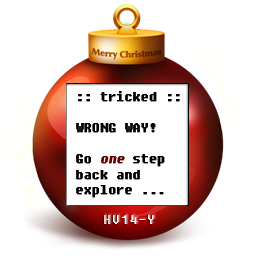
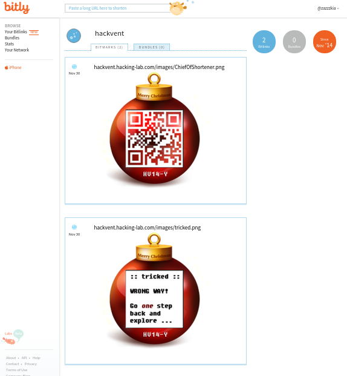

# December 1st: **Move Forward**

**URL:** 

[http://hackvent.hacking-lab.com/challenge.php?day=1](http://hackvent.hacking-lab.com/challenge.php?day=1)

**Hint:**  

*reconnaissance*  
  
*Here is your entry point @hackvent*  
  
*Follow the white rabbit..*  

**Solution:**  

The hint is a twitter account with the name Santa Claus.  
There is a tweet referring to the challenge:

```
Here we go for the first day: https://tr.im/a1188
```

Following the link gets us to an false christmas ball image 




so we need to go one step back, hmm.

After much time wasted on twitter, we perform a wget and see the shortened url 
redirects to another shortened url, *bit.ly/1y04yV4*:


```
 wget tr.im/a1188
--2014-12-05 16:16:54--  http://tr.im/a1188
Resolving tr.im (tr.im)... 54.165.60.202
Connecting to tr.im (tr.im)|54.165.60.202|:80... connected.
HTTP request sent, awaiting response... 301 Moved Permanently
Location: https://tr.im/a1188 [following]
--2014-12-05 16:16:55--  https://tr.im/a1188
Connecting to tr.im (tr.im)|54.165.60.202|:443... connected.
HTTP request sent, awaiting response... 301 Moved Permanently
Location: http://hackvent.hacking-lab.com/ch01.php [following]
--2014-12-05 16:16:55--  http://hackvent.hacking-lab.com/ch01.php
Resolving hackvent.hacking-lab.com (hackvent.hacking-lab.com)... 212.254.178.162
Connecting to hackvent.hacking-lab.com (hackvent.hacking-lab.com)|212.254.178.162|:80... connected.
HTTP request sent, awaiting response... 302 Found
Location: http://bit.ly/1y04yV4 [following]
--2014-12-05 16:16:56--  http://bit.ly/1y04yV4
Resolving bit.ly (bit.ly)... 69.58.188.40, 69.58.188.39
Connecting to bit.ly (bit.ly)|69.58.188.40|:80... connected.
HTTP request sent, awaiting response... 301 Moved Permanently
Location: http://hackvent.hacking-lab.com/images/tricked.png [following]
--2014-12-05 16:16:56--  http://hackvent.hacking-lab.com/images/tricked.png
Connecting to hackvent.hacking-lab.com (hackvent.hacking-lab.com)|212.254.178.162|:80... connected.
HTTP request sent, awaiting response... 200 OK
Length: 55247 (54K) [image/png]

```  
  
This would seem to fit with the hint *one step back*.. Let's explore further  
  
Bitly tracks stats on bit.ly links. To see these we register for an account and do a search of the link.  
We get to HACKvent's Bitly account, and see the link used to redirect to a different location:  





so our bauble is:

  


**Flag:**  

```
HV24-BAAJ-6ZtK-IJHy-bABB-YoMw  
```

