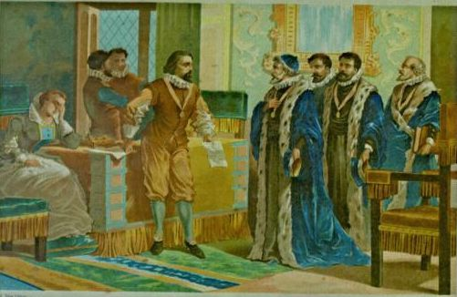

# HACKvent 2019

The annual advent calender from Hacking-lab


## Overview


Title                                             | Category    | Points | Flag
------------------------------------------------- | ----------- | ------ | ------------------------------
[December 1 ](#day-01-censored)                   | Easy        | 2/1    | `HV19{just-4-PREview!}`
[December 2 ](#day-02-triangulation)              | Easy        | 2/1    | `HV19{Cr4ck_Th3_B411!}`
[December 3 ](#day-03-hodor)                      | Easy        | 2/1    | `HV19{h01d-th3-d00r-4204-ld4Y}`
[December 4 ](#day-04-password-policy-circumvention) | Easy     | 2/1    | `HV19{R3memb3r, rem3mber - the 24th 0f December}`
[December 5 ](#day-05-santa-parcel-tracking)      | Easy        | 2/1    | `HV19{D1fficult_to_g3t_a_SPT_R3ader}`
[December 6 ](#day-06-bacon-and-eggs)             | Easy        | 2/1    | `HV19{BACONCIPHERISSIMPLEBUTCOOL}`
[December 7 ](#day-07)                            | Easy        | 2/1    | `HV19-`
[December 8 ](#day-08)                            | Medium      | 3/2    | `HV19-`
[December 9 ](#day-09)                            | Medium      | 3/2    | `HV19-`
[December 10](#day-10)                            | Medium      | 3/2    | `HV19-`
[December 11](#day-11)                            | Medium      | 3/2    | `HV19-`
[December 12](#day-12)                            | Medium      | 3/2    | `HV19-`
[December 13](#day-13)                            | Medium      | 3/2    | `HV19-`
[December 14](#day-14-)                           | Medium      | 3/2    | `HV19-`
[December 15](#day-15-)                           | Hard        | 4/3    | `HV19-`
[December 16](#day-16-)                           | Hard        | 4/3    | `HV19-`
[December 17](#day-17-)                           | Hard        | 4/3    | `HV19-`
[December 18](#day-18-)                           | Hard        | 4/3    | `HV19-`
[December 19](#day-19-)                           | Hard        | 4/3    | `HV19-`
[December 20](#day-20-)                           | Hard        | 4/3    | `HV19-`
[December 21](#day-21-)                           | Hard        | 4/3    | `HV19-`
[December 22](#day-22-)                           | Expert      | 5/4    | `HV19-`
[December 23](#day-23-)                           | Expert      | 5/4    | `HV19-`
[December 24](#day-24-)                           | Expert      | 5/4    | `HV19-`
[December 25](#day-25-)                           | Expert      | 5/4    | `HV19-`

## Day 01: Censored

**Challenge**

I got this little image, but it looks like the best part got censored on the way. Even the tiny preview icon looks clearer than this! Maybe they missed something that would let you restore the original content?


**Solution**

The description sounds like it has something to do with the thumbnail image. Indeed if we download the image we see a QR code in the thumbnail image in our file explorer. We can use exiftool to extract the thumbnail image embedded in the JPEG format:

```
exiftool -b -ThumbnailImage f182d5f0-1d10-4f0f-a0c1-7cba0981b6da.jpg > thumbnail.jpg
```

Then we read this with QR scanner to get our flag


**Flag**
```
HV19{just-4-PREview!}
```

## Day 02: Triangulation

**Description**

Today we give away decorations for your Christmas tree. But be careful and do not break it.

[Triangulation.stl](writeupfiles/dec02/Triangulation.stl)

**Solution**

This is a [STL file](https://en.wikipedia.org/wiki/STL_(file_format)) containing a 3D model of a Christmas bauble:


Nothing obvious there, but if we look at the wireframe view we see that there is more inside:


Cutting through the ball in blender we see an aztec code inside. After cleaning up the image, converting to b/w, removing noise, rotating, we can [read the code](https://www.onlinebarcodereader.com/)


**Flag**
```
HV19{Cr4ck_Th3_B411!}
```

## Day 03: Hodor

**Description**


```
$HODOR: hhodor. Hodor. Hodor!?  = `hodor?!? HODOR!? hodor? Hodor oHodor. hodor? , HODOR!?! ohodor!?  dhodor? hodor odhodor? d HodorHodor  Hodor!? HODOR HODOR? hodor! hodor!? HODOR hodor! hodor? !

hodor?!? Hodor  Hodor Hodor? Hodor  HODOR  rhodor? HODOR Hodor!?  h4Hodor?!? Hodor?!? 0r hhodor?  Hodor!? oHodor?! hodor? Hodor  Hodor! HODOR Hodor hodor? 64 HODOR Hodor  HODOR!? hodor? Hodor!? Hodor!? .

HODOR?!? hodor- hodorHoOodoOor Hodor?!? OHoOodoOorHooodorrHODOR hodor. oHODOR... Dhodor- hodor?! HooodorrHODOR HoOodoOorHooodorrHODOR RoHODOR... HODOR!?! 1hodor?! HODOR... DHODOR- HODOR!?! HooodorrHODOR Hodor- HODORHoOodoOor HODOR!?! HODOR... DHODORHoOodoOor hodor. Hodor! HoOodoOorHodor HODORHoOodoOor 0Hooodorrhodor HoOodoOorHooodorrHODOR 0=`;
hodor.hod(hhodor. Hodor. Hodor!? );
```

(also in [hodor.md](writeupfiles/dec03/hodor.md))

**Solution**

This is the esoteric programming language Hodor ([http://www.hodor-lang.org/](http://www.hodor-lang.org/))

We can install hodor language

```bash
npm install -g hodor-lang
```

then run our script

```bash
$ hodor hodor.hd
HODOR: \-> hodor.hd
Awesome, you decoded Hodors language!

As sis a real h4xx0r he loves base64 as well.

SFYxOXtoMDFkLXRoMy1kMDByLTQyMDQtbGQ0WX0=
```

We base64 decode this string to get our flag

**Flag**
```
HV19{h01d-th3-d00r-4204-ld4Y}
```

## Day 04: password policy circumvention

**Description**

Santa released a new password policy (more than 40 characters, upper, lower, digit, special).

The elves can't remember such long passwords, so they found a way to continue to use their old (bad) password:

```
merry christmas geeks
```


**Solution**

This is a Windows [AutoHotkey](https://www.autohotkey.com/) Script

```ahk
tTime , x,, MM MMMM yyyy
SendInput, %x%{left 4}{del 2}+{right 2}^c{end}{home}^v{home}V{right 2}{ASC 00123}
return

::christmas::
SendInput HV19-pass-w0rd
return

:*?:is::
Send - {del}{right}4h

:*?:as::
Send {left 8}rmmbr{end}{ASC 00125}{home}{right 10}
return

:*?:ee::
Send {left}{left}{del}{del}{left},{right}e{right}3{right 2}e{right}{del 5}{home}H{right 4}
return

:*?:ks::
Send {del}R3{right}e{right 2}3{right 2} {right 8} {right} the{right 3}t{right} 0f{right 3}{del}c{end}{left 5}{del 4}
return

::xmas::
SendInput, -Hack-Vent-Xmas
return

::geeks::
Send -1337-hack
return
```

We start a Windows VM, install AutoHotKey, add the script. Then open notepad, and type `merry christmas geeks` and get our flag

**Flag**
```
HV19{R3memb3r, rem3mber - the 24th 0f December}
```

## Day 05: Santa Parcel Tracking

**Description**

To handle the huge load of parcels Santa introduced this year a parcel tracking system. He didn't like the black and white barcode, so he invented a more solemn barcode. Unfortunately the common barcode readers can't read it anymore, it only works with the pimped models santa owns. Can you read the barcode?


**Solution**

Going pixel by pixel from left to right across a single stripe, we extracted the RGB value of every stripe. They were all in ascii range so we converted them to ascii.

```python
from PIL import Image
import sys

img = Image.open("157de28f-2190-4c6d-a1dc-02ce9e385b5c-line.png")
pixels = img.load()
(w, h) = img.size

c = None
for i in range(w):
    q = pixels[i, 0]
    if q != c:
        if q != (255, 255, 255):
            # sys.stdout.write(chr(q[0]))
            # sys.stdout.write(chr(q[1]))
            sys.stdout.write(chr(q[2]))
    c = q
```

and wrote out only the blue channel since visual inspection showed that the blue channel had some `{}`s

```
$ python3 tmp.py
X8YIOF0ZP4S8HV19{D1fficult_to_g3t_a_SPT_R3ader}S1090OMZE0E3NFP6E%
```

**Flag**
```
HV19{D1fficult_to_g3t_a_SPT_R3ader}
```

## Day 06: Bacon and Eggs

**Description**



<p><em>F</em>ra<em>n</em>cis Baco<em>n</em> <em>w</em>a<em>s</em> <em>a</em>n E<em>ng</em>lish ph<em>i</em>l<em>os</em>o<em>p</em>her a<em>n</em>d <em>s</em>tat<em>e</em>sm<em>a</em>n w<em>h</em>o se<em>rve</em>d <em>a</em>s At<em>t</em>or<em>n</em>ey Gen<em>e</em>ral and as <em>L</em>or<em>d</em> <em>Ch</em>an<em>ce</em>l<em>l</em>or of <em>En</em>g<em>l</em>an<em>d</em>. Hi<em>s</em> <em>w</em>orks ar<em>e</em> c<em>red</em>it<em>e</em>d w<em>ith</em> d<em>e</em>ve<em>lo</em>pi<em>ng</em> <em>t</em>h<em>e</em> sci<em>e</em>nt<em>i</em>fic me<em>t</em>hod and re<em>m</em>ai<em>ned</em> in<em>fl</em>u<em>en</em>ti<em>al</em> th<em>rou</em>gh <em>t</em>he s<em>cien</em>tific <em>r</em>ev<em>o</em>l<em>u</em>ti<em>o</em>n.
<em>B</em>a<em>co</em>n h<em>as</em> <em>b</em>e<em>e</em>n ca<em>l</em>led <em>th</em>e <em>f</em>ath<em>e</em>r o<em>f</em> emp<em>iric</em>i<em>s</em>m. <em>Hi</em>s <em>wor</em>ks ar<em>g</em>ued for th<em>e</em> po<em>ssi</em>bi<em>li</em>t<em>y</em> of s<em>c</em>ie<em>n</em>tifi<em>c</em> <em>kno</em>wl<em>edg</em>e b<em>a</em>se<em>d</em> onl<em>y</em> u<em>p</em>on i<em>n</em>du<em>c</em>t<em>i</em>ve <em>r</em>ea<em>s</em>onin<em>g</em> <em>a</em>nd c<em>aref</em>u<em>l</em> o<em>bs</em>er<em>v</em>ation o<em>f</em> <em>e</em>v<em>e</em>nt<em>s</em> in <em>na</em>tur<em>e</em>. Mo<em>st</em> <em>i</em>mp<em>ort</em>an<em>t</em>l<em>y</em>, <em>he</em> a<em>rgue</em>d sc<em>i</em>en<em>c</em>e co<em>uld</em> <em>b</em>e <em>a</em>c<em>hi</em>eved by us<em>e</em> of a <em>s</em>ce<em>p</em>t<em>ical</em> a<em>nd</em> me<em>t</em>hod<em>i</em>ca<em>l</em> <em>a</em>pp<em>roa</em>ch wh<em>er</em>eby <em>s</em>cientist<em>s</em> ai<em>m</em> t<em>o</em> avo<em>i</em>d m<em>i</em>sl<em>ead</em>in<em>g</em> themsel<em>ve</em>s. <em>A</em>lth<em>oug</em>h <em>h</em>is <em>p</em>ra<em>c</em>tic<em>a</em>l i<em>d</em>e<em>a</em>s ab<em>out</em> <em>s</em>u<em>ch</em> <em>a</em> <em>m</em>et<em>h</em>od, <em>t</em>he B<em>a</em>con<em>i</em>an meth<em>o</em>d, d<em>i</em>d no<em>t</em> have <em>a</em> l<em>o</em>n<em>g</em>-<em>la</em>s<em>t</em>ing <em>i</em>nfluen<em>c</em>e, <em>th</em>e <em>g</em>e<em>ne</em>ral <em>i</em>dea <em>of</em> <em>t</em>he imp<em>o</em>rta<em>n</em>ce and pos<em>s</em>i<em>b</em>il<em>it</em>y o<em>f</em> a s<em>c</em>ept<em>i</em>cal methodology makes Bacon the father of the scientific method. This method was a new rhetorical and theoretical framework for science, the practical details of which are still central in debates about science and methodology.</p>

Bacon was the first recipient of the Queen's counsel designation, which was conferred in 1597 when Elizabeth I of England reserved Bacon as her legal advisor. After the accession of James VI and I in 1603, Bacon was knighted. He was later created Baron Verulam in 1618 and Viscount St. Alban in 1621. Because he had no heirs, both titles became extinct upon his death in 1626, at 65 years. Bacon died of pneumonia, with one account by John Aubrey stating that he had contracted the condition while studying the effects of freezing on the preservation of meat. He is buried at St Michael's Church, St Albans, Hertfordshire.

```
Born: January 22
Died: April 9
Mother: Lady Anne
Father: Sir Nicholas
Secrets: unknown
```


**Solution**

The first paragraph uses alternating italic and non-italic font, which in combination with the title leads us to suspect [Bacon's cipher](https://en.wikipedia.org/wiki/Bacon%27s_cipher).


```
abaaa aaaab bab ba abbaaaa aababbabaaa aba baaabaaba aba aabbba ba aabaabaa aaabaaa aaa aa baab bbaabbabaa aa bbabaab. aab baaaa aab abbbaaba abbb abaabbaabb bab aaabaabaaa aabaaa aaa aabaabbb aabbabbaabb aabbbaa baa abbbbaaaaa baababaaba.
babba abb baba aabaaa bba baaaba ab aaabbbbaba. bba bbbaa aabaaa aaa aab aabbbaabbab aa abaabaaaab bbbaabbba abaab aaab abaa abaababaa baabaaaab baa abbbbab abbaabaaaaa ab babaab aa bbaaab. aabb baabbbaabab, bb abbbba aabaaba aabbb ba babbaaaa aa aab aa a baababbbb abb aabaaabaab baabbbaa aabbaaa baaaaaaaab aab ab aaaba abaabbbaab aaaaaaabba. baaabbba baa baabaaaba ababa aabbb babb b baabaa, baa abaaabaa aaaaba, aba aab aaaa b abab-bbabaaa baaaaaaba, bba babbaaa baaa bb baa aaabaaabaa aaa aaababaabba ab a abaaabaaa aaaaaaaaaaa aaaaa aaaaa aaa aaaaaa aa aaa aaaaaaaaaa aaaaaa. aaaa aaaaaa aaa a aaa aaaaaaaaaa aaa aaaaaaaaaaa aaaaaaaaa aaa aaaaaaa, aaa aaaaaaaaa aaaaaaa aa aaaaa aaa aaaaa aaaaaaa aa aaaaaaa aaaaa aaaaaaa aaa aaaaaaaaaaa.``
```

which we can decode using [this online tool](https://mothereff.in/bacon) to:

```
SANTA LIKES HIS BACON BUT ALSO THIS BACON THE PASSWORD IS H VXBACONCIPHERISSIMPLEBUTCOOLX REPLACE X WITH BRACKETS AND USE UPPERCASE FOR ALL CHARACTER AA A A A A A AA A A A A A AA AAA A A A A AA A A A A AA A A AA AAA
```


**Flag**
```
HV19{BACONCIPHERISSIMPLEBUTCOOL}
```

## Day 07: Title

**Description**

Santa is prototyping a new gadget for his sledge. Unfortunately it still has some glitches, but look for yourself.


**Solution**

**Flag**
```
HV19{}
```

## Day 08: Title

**Description**

**Solution**

**Flag**
```
HV19{}
```

## Day 09: Title

**Description**

**Solution**

**Flag**
```
HV19{}
```

## Day 10: Title

**Description**

**Solution**

**Flag**
```
HV19{}
```

## Day 11: Title

**Description**

**Solution**

**Flag**
```
HV19{}
```

## Day 12: Title

**Description**

**Solution**

**Flag**
```
HV19{}
```

## Day 13: Title

**Description**

**Solution**

**Flag**
```
HV19{}
```

## Day 14: Title

**Description**

**Solution**

**Flag**
```
HV19{}
```

## Day 15: Title

**Description**

**Solution**

**Flag**
```
HV19{}
```

## Day 16: Title

**Description**

**Solution**

**Flag**
```
HV19{}
```

## Day 17: Title

**Description**

**Solution**

**Flag**
```
HV19{}
```

## Day 18: Title

**Description**

**Solution**

**Flag**
```
HV19{}
```

## Day 19: Title

**Description**

**Solution**

**Flag**
```
HV19{}
```

## Day 20: Title

**Description**

**Solution**

**Flag**
```
HV19{}
```

## Day 21: Title

**Description**

**Solution**

**Flag**
```
HV19{}
```

## Day 22: Title

**Description**

**Solution**

**Flag**
```
HV19{}
```

## Day 23: Title

**Description**

**Solution**

**Flag**
```
HV19{}
```

## Day 24: Title

**Description**

**Solution**

**Flag**
```
HV19{}
```
