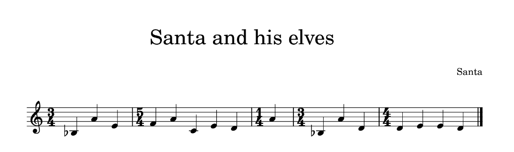

## Challenge

Santa has always wanted to compose a song for his elves to cherish their hard work. Additionally, he set up a vault with a secret access code only he knows!

The elves say that Santa has always liked to hide secret messages in his work and they think that the vaults combination number may be hidden in the magnum opus of his.

What are you waiting for? Go on, help the elves!

Hint #1: Keep in mind that you are given a web service, not a play button for a song.

Hint #2: As stated in the description, Santa's vault accepts a number, not text.

## Solution

We get a website with a submission form:

And the [pdf with the song](writeupfiles/dec2/song.pdf) containing the score:

This is explicitly not a web challenge, and we see nothing suspicious in the pdf file, so the answer must lie in the music notes ..but I am totally not musical so nothing obvious to me..

