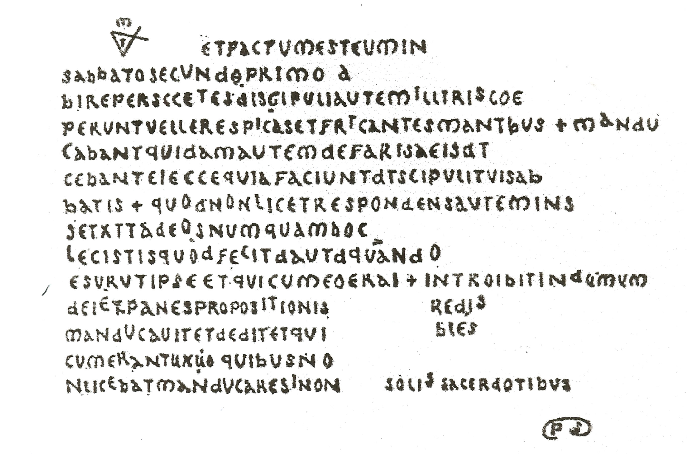

## Challenge

On their holiday, the bunnies came across a sleepy village with an interesting tower. While enjoying the view, one of them found a crumpled parchment in a corner. "Hah, that's clever!", the bunnies agreed after quickly solving the code and altered it ever so slightly.

## Solution

The challenge said the bunnies altered the parchment slightly, so let's find the original so we can compare.

Some Googling tells us this is parchment of Bérenger Saunière, found in the Church of Mary Magdalene at Rennes-le-Château by Bérenger Saunière.
It is said that these documents led to the discovery of the famed treasure of Rennes-le-Château.

Coded messages were later found by historian Henry Lincoln. 

I noticed that some of the letter were moved up compared to the original, so this must be the bunnies code. I simply onderlined all the higher letters and read off the flag

its spells out `but is it a cool old parchment it sure is`. The instructions say the flag is all uppercase and no spaces, so we know our flag

