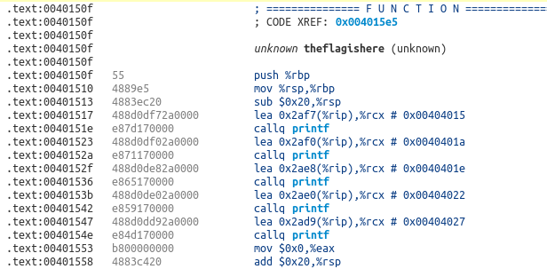
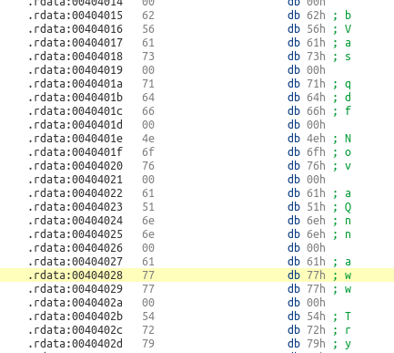
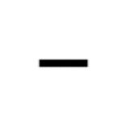
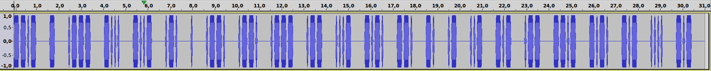
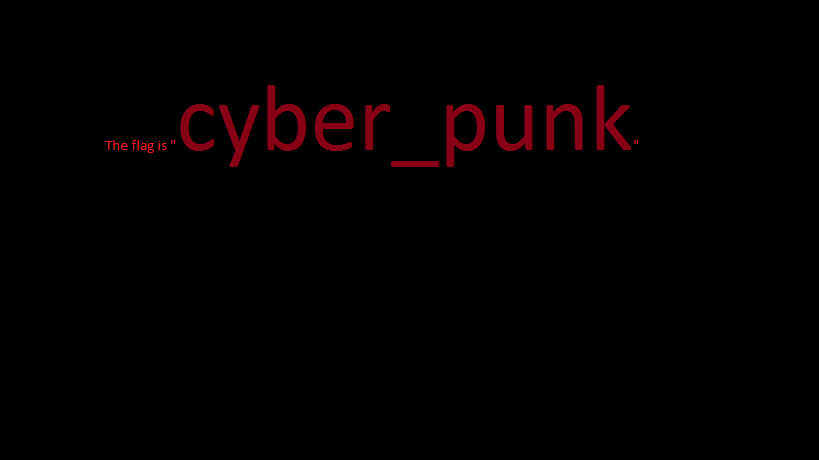
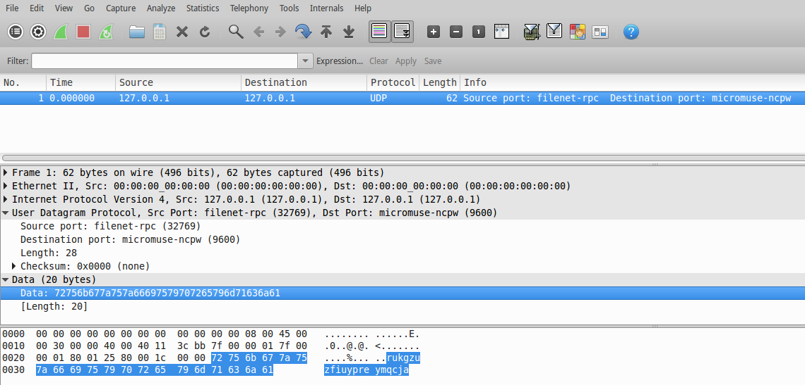
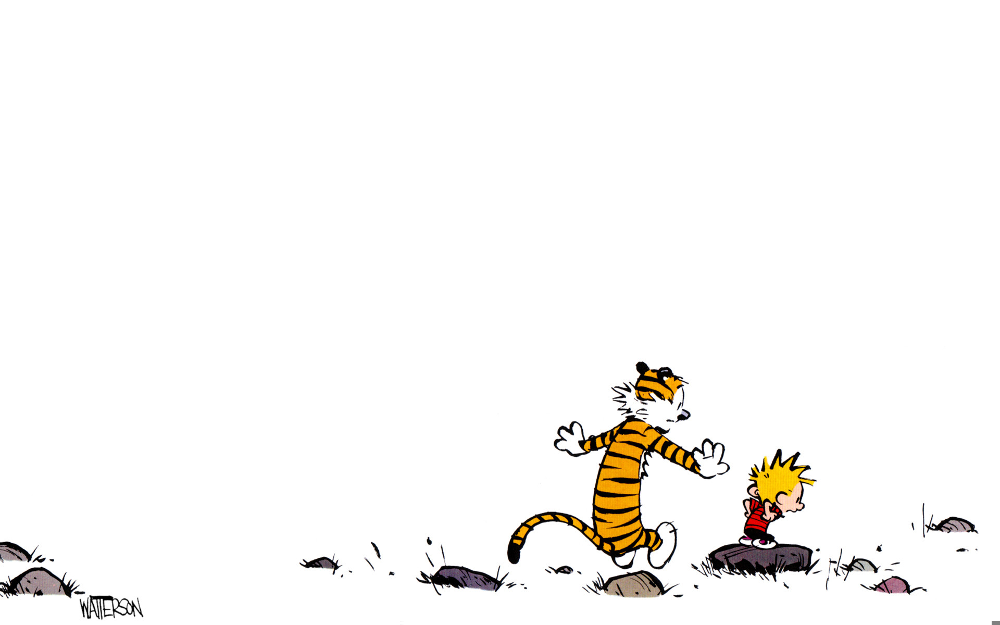
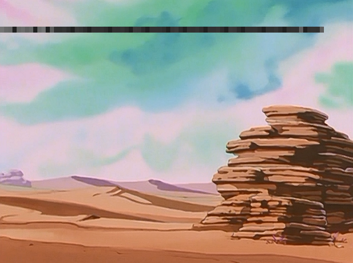
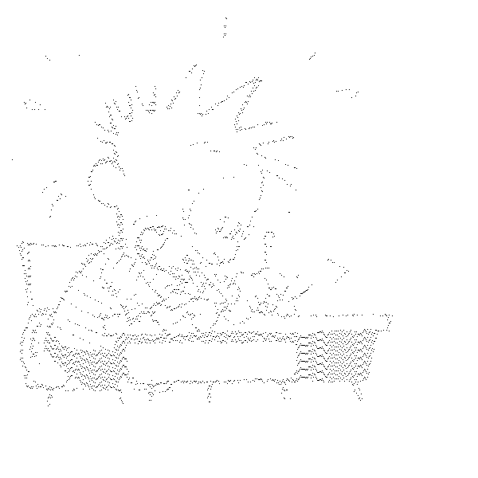

# Pragyan 2016

Week-long CTF in February 2016

## Overview


```
Title                            Category            Points  Flag
-------------------------------- ------------------- ------- -----------------------------
Be the boss                      Binary Exploitation  50      
STDIN                            Binary Exploitation  70      bVasqdfNovaQnnaww
Apple Pies                       Binary Exploitation  100
Threes a crowd                   Binary Exploitation  100 
BAIL Cipher                      Cryptography         20      xwxlQW02mu4FOjvb9hF5
I Agree                          Cryptography         20      theforceisstrongwiththisone
RSA_Encryption                   Cryptography         25      nothing_is_impossible
Kill the devil                   Cryptography         30
Numbers and Spaces               Cryptography         40
Intercepted Transmission         Cryptography         40
Decipher me                      Cryptography         100     cyber_punk
Johnny                           Forensics            25
Crack_this                       Forensics            50
Everybody is a winner            Misc                 1       igotapoint
K                                Misc                 50      theflagisookisnotsoeasy
Bad Habit                        Misc                 70
Symphony                         Misc                 100     es0l@ngs
Breaking Bar                     Misc                 100     
Vault                            Reverse Engineering  50      keygen
Smart Ass Bad Add Great Ass :P   Reverse Engineering  50
Harry Potter                     Steganography        30      bydelta
Calvin Meets a Hitchhiker        Steganography        30      f0rtytw0f0r3v3r
Look at these colours!           Steganography        40      sTegan0graphy
Who made me?                     Steganography        100     billwatterson
```

## Binary 50: Be the boss

**Challenge**  

[B_THE_B05S](writeupfiles/B_THE_B05S)

**Solution**  
**Flag**  

## Binary 70: STDIN

**Challenge**  

[stdin.exe](writeupfiles/stdin.exe)

**Solution**  

We are given a window executable. Disassmbling it with [ODA](https://www.onlinedisassembler.com) a string is read from stdin and a
comparison to string `longlivelinux\n` is performed. Presumably this fails because of the different line endings, but it is also
clear to see what happens when the test passes:



and the referenced locations in memory are:



so from this we piece together that the flag is `bVasqdfNovaQnnaww`

**Flag**  

```
bVasqdfNovaQnnaww
```

## Binary 100: Apple pies

**Challenge**  

[applepie](writeupfiles/applepie)

**Solution**  

**Flag**  

## Binary 100: Threes a crowd

**Challenge**  

[threes_a_crowd](writeupfiles/threes_a_crowd)

**Solution**  

**Flag**  


## Cryptography 20: BAIL Cipher

**Challenge**  

Bob and Alice have come up with a new encryption to communicate. But they want you to figure out if its possible to decipher their messages easily. Can you decipher it?

```
VGF4ME9GaGxnIHdXMkZqaDVlZiBzeFFtNHY5IGlsdWI=
```

**Solution**  

base64 decode:

```
Tax0OFhlg wW2Fjh5ef sxQm4v9 ilub
```

The title suggest it could be a rail fence cipher, we check with a decoder (http://rumkin.com/tools/cipher/railfence.php)
and find the solution when using 4 rails:

```
T     a     x     0     O     F 
 h   l g     w   W 2   F j   h 5
  e f     s   x Q   m 4   v 9   
         i     l     u     b    
```

reading this along the rails gives:

```
The flag is xwxlQW02mu4FOjvb9hF5
```


**Flag**  

```
xwxlQW02mu4FOjvb9hF5
```

## Cryptography 20: I Agree

**Challenge**  

Crack the cipher: `vhixoieemksktorywzvhxzijqni`

Your clue is:
"caesar is everything. But he took it to the next level."


**Solution**  

From the hint I suspect this may be a [Vigenère cipher](https://en.wikipedia.org/wiki/Vigen%C3%A8re_cipher)

There is a handy solver tool online: http://www.guballa.de/vigenere-solver

which gets us the solution:

```
Clear text using key "caesar":

theforceisstrongwiththisone
```

**Flag**  

```
theforceisstrongwiththisone
``` 

## Cryptography 25: RSA_encryption

**Challenge**  

X has sent a message. Can you decrypt it?
The encrypted message and the public key used to encrypt it ( key1_data.txt ) are given to you. 

[rsaq](writeupfiles/rsaq.tar.gz)

**Solution**  

We get the encrypted message and public key N, but also a second file with a public key.

ciphertext:

```
Pob7AQZZSml618nMwTpx3V74N45x/rTimUQeTl0yHq8F0dsekZgOT385Jls1HUzWCx6ZRFPFMJ1RNYR2Yh7AkQtFLVx9lYDfb/Q+SkinBIBX59ER3/fDhrVKxIN4S6h2QmMSRblh4KdVhyY6cOxu+g48Jh7TkQ2Ig93/nCpAnYQ=
```

key1_data.txt:
```
Public key :

n1 =
123948613128507245097711825164030080528129311429181946930789480629270692835124562568997437300916285601268900901495788327838386854611883075845387070635813324417496512348003686061832004434518190158084956517800098929984855603216625922341285873495112316366384741709770903928077127611563285935366595098601100940173

e = 65537
```

key2_data.txt:
```
Public key :

n2 = 
122890614849300155056519159433849880305439158904289542874766496514523043027349829509818565800562562195671251134947871996792136355514373160369135263766229423623131725044925870918859304353484491601318921285331340604341809979578202817714205469839224620893418109679223753141128229197377934231853172927071087589849

e = 65537
```

These numbers are way too large to factor, and no hits in [factordb.com](factordb.com).  We therefore take the second key file as a hint, maybe they use a common prime factor.
Checking our theory we quickly find that they do, so then we can just decrypt the message:

```python
from Crypto.PublicKey import RSA
from fractions import gcd
import gmpy2
import base64

# our data
N = 123948613128507245097711825164030080528129311429181946930789480629270692835124562568997437300916285601268900901495788327838386854611883075845387070635813324417496512348003686061832004434518190158084956517800098929984855603216625922341285873495112316366384741709770903928077127611563285935366595098601100940173
N2 = 122890614849300155056519159433849880305439158904289542874766496514523043027349829509818565800562562195671251134947871996792136355514373160369135263766229423623131725044925870918859304353484491601318921285331340604341809979578202817714205469839224620893418109679223753141128229197377934231853172927071087589849
e = 65537L 

ct = 'Pob7AQZZSml618nMwTpx3V74N45x/rTimUQeTl0yHq8F0dsekZgOT385Jls1HUzWCx6ZRFPFMJ1RNYR2Yh7AkQtFLVx9lYDfb/Q+SkinBIBX59ER3/fDhrVKxIN4S6h2QmMSRblh4KdVhyY6cOxu+g48Jh7TkQ2Ig93/nCpAnYQ='
ct = base64.b64decode(ct)

# find the common prime factor p from the second file, then determine q
p = gcd(N,N2)
q = N/p
r=(p-1)*(q-1)

d = long(gmpy2.divm(1, e, r))

# decrypt the message
rsa = RSA.construct((N,e,d,p,q))
pt = rsa.decrypt(ct)

print pt
```
This outputs

```
Congrats! The flag is nothing_is_impossible
```

**Flag**  

```
nothing_is_impossible
```

## Cryptography 30: Kill the devil

**Challenge**  

Kill the d3vil in 7he bud

[Problem.txt](writeupfiles/killthedevil_Problem.txt)

**Solution**  

```
4c6544144496414154444f434550474e5464857595241
```

kill the devil ..remove the sixes? ..this would make it valid ASCII:

```
LTADIAATDOCEPGNTHWYRA
```

..but now what?


**Flag**  

## Cryptography 40: Numbers and Spaces

**Challenge**  

Go for a fair consideration of the following NUMERS , but ignore the 'X's .

```
EPQS PODY EPQS RYNY PODY EPQS RJTCDY RYNY RJTCDY EPQS RYNY RYNY
```



**Solution**  

The morse code gif has the following morsecode in it:

```
-.-.-..-..--.--..-..---.-.--.--.
```

no spaces though

the use of the word fair in the challenge description and the reference to the X's suggests a [playfair cipher](http://rumkin.com/tools/cipher/playfair.php)

assuming we can trust the spaces, there are only 4 different words in the plaintext

```
EPQS
PODY
RYNY
RJTCDY
```


**Flag**  

## Cryptography 40: Intercepted Transmission

**Challenge**  

R4-D6 has intercepted an encrypted transmission from a nearby battle. 
You have to help him decrypt it and find the flag! R4-D6 did manage to 
hear a part of the transmission though "Red five standing by".

[file.wav](writeupfiles/file.wav)

**Solution**  

This appears to be morse code



```
--.- - .--- -... -..- .-. . .--. .--. .--- .-- ...- -.-. --. -. .- ..- -.- .-- --.- -.-. -.- .... -.-
```

which translates to

```
QTJBXREPPJWVCGNAUKWQCKHK
```

**Flag**  

## Cryptography 100: Decipher Me

**Challenge**  

Ten years after the starship Voyager's return from the Delta Quadrant, the Federation is in a crisis. 
The Federation's main suppliers of dilithium crystals (the primary catalyst for the fuel used in 
faster-than-light travel) are disappearing. Space and time have folded around several planets, 
isolating them from outside contact. The phenomenon is unnatural – someone or something is causing it 
to happen. And all they've got is this file. Can you help the Federation ?

[file](writeupfiles/decipherme)

**Solution**  

we get a file

```bash
$ file decipherme
decipherme: data
```

opening the file in a hex editor reveals it is a PNG image with a broken header, we restore the first eight bytes of the file to their
correct value:

```
89 50 4e 47 0d 0a 1a 0a
```

and get the image:



the image simply shows the flag!

**Flag**  

```
cyber_punk
```

## Forensics 25: Johnny

**Challenge**  

Bob recently found this old file on his old PC. Help him access it.

[problem.zip](writeupfiles/johnny_problem.zip)

**Solution**  

encrypted zip file, lets see if fcrackzip can solve it:

```
$ fcrackzip -u -l 1-6 johnny_problem.zip 


PASSWORD FOUND!!!!: pw == peace

```

we use this to unzip the file and get the flag.txt file from inside

```
loi wtnk az cyhimzm8kka12mo
```

the first three words could be `the flag is`, could this be simple substitution cipher? can we perhaps guess the key to decipher the last word?


```
pt: abcdefghijklmnopqrstuvwxyz
ct: n   iwkoa  t      zl


ct: abcdefghijklmnopqrstuvwxyz
pt: i       e gt ah    l  f  s 
```

not really..


**Flag**  

```

```


## Forensics 50: Crack_this

**Challenge**

Find the flag

[problem](writeupfiles/problem)

**Solution**

the file was a tar.gz file, containing a [Clue.txt](writeupfiles/Clue.txt) file:

```
IP - 127.0.0.1
Port - 32769
```

and a [pcap file](writeupfiles/problem.pcap)

The pcap file contained a single packet:



data:

```
rukgzuzfiuypreymqcja
```

## Misc 1: Everybody is a winner  

**Challenge**  

Something to get you started off with

[file](writeupfiles/file.txt)

**Solution**  

dummy challenge, flag was in the

```
the flag is igotapoint
```

**Flag**

```
igotapoint
```

## Misc 50: K

**Challenge**  

It makes you mad , doesnt it? 

[problem](writeupfiles/K_problem)

**Solution**  

The file contained the following:

```
. . . . . . . . . . . . . . .
. . . . . ! ? ! ! . ? . . . .
. . . . . . . . . . . . . . .
. ? . ? ! . ? . . . . . . . .
! . ? . . . . . . . ! ? ! ! .
? . . . . . . ? . ? ! . ? . .
. . . . . . . . ! . ! ! ! ! !
! ! . . . ! . . . . . . . . .
. . . . ! . ? . . . . . . . !
? ! ! . ? ! ! ! ! ! ! ? . ? !
. ? ! ! ! ! ! . . . . . . . .
. . . . . ! . . . . . ! . ? .
. . . . . . . . ! ? ! ! . ? !
! ! ! ! ! ! ! ? . ? ! . ? ! .
! ! ! ! ! ! ! ! ! . ! . ? . .
. . . . . . . ! ? ! ! . ? . .
. . . . . . ? . ? ! . ? . . .
. . . . . . . . . ! . ! ! ! !
! . ? . . . . . . . . . ! ? !
! . ? ! ! ! ! ! ! ! ! ? . ? !
. ? ! . ! ! ! ! ! ! ! ! ! ! !
. . . ! . . . . . . . . . . .
! . ! ! ! . ! ! ! ! ! ! ! ! !
. ? . . . . . . . . . ! ? ! !
. ? . . . . . . . . ? . ? ! .
? ! . ! ! ! ! ! ! ! ! ! . ! !
! ! ! ! ! ! ! ! ! ! ! ! ! ! !
. . . . . . . . . . . . . ! .
? . 
```

This seems like it could be the short form of the [Ook](http://www.dangermouse.net/esoteric/ook.html) esoteric language. 

Then use the interpreter [here](http://www.splitbrain.org/services/ook) to translate:

```
hvstzouwgccywgbchgcsogm
```

Hmm, seems there is another encoding and after some exploring we find it is ROT-12.


```
theflagisookisnotsoeasy
```


**Flag**  

```
theflagisookisnotsoeasy
```

## Misc 70: Bad Habit

**Challenge**

" You cant get it, it's a
A bad habit, such a
A bad habit such a bad ba.... "


[the_kook-bad_habit(remix).mp3](writeupfiles/the_kook-bad_habit(remix).mp3)

**Solution**

**Flag**


## Misc 100: Symphony 

**Challenge**  

Can you find the flag in this melody?

[problem.zip](writeupfiles/problem.zip)

**Solution**  

Zip file contained and mp3 file

[song.mp3](writeupfiles/song.mp3)

binwalk reveals a zip file appended to the mp3 file, we extract it

```
$ binwalk -e song.mp3 

DECIMAL       HEXADECIMAL     DESCRIPTION
--------------------------------------------------------------------------------
382           0x17E           JPEG image data, JFIF standard 1.01
848892        0xCF3FC         Zip archive data, at least v2.0 to extract, compressed size: 54, uncompressed size: 106, name: problem.txt
849096        0xCF4C8         End of Zip archive

```

and find the file [problem.txt](writeupfiles/_song.mp3.extracted/problem.txt)

```
--[----->+<]>-.[--->+<]>----.+[++>---<]>++.++++++[->++<]>.-[->+++<]>-.+[--->+<]>+++.-------.++++++++++++.
```

ok, brainfuck code, we interpret this online [http://villes.mbnet.fi/php/bf.php](http://villes.mbnet.fi/php/bf.php)

```
es0l@ngs
```
 
**Flag**  

```
es0l@ngs
```

## Misc 100: Breaking Bar

**Challenge**  

Walter White and Jesse Pinkman.

P.S. This question has nothing to do with "threes a crowd" question. 

[BREAKING_BAD](writeupfiles/misc100_BREAKIN_BAD)
[file](writeupfiles/misc100_file)

**Solution**  

**Flag**  


## Reverse Engineering 50: Vault

**Challenge**  

Can you help Bob find the flag?

[source.zip](writeupfiles/vaultsource.zip)

**Solution**  

zip file contains a windows executable

So I actually found the flag while just playing with the executable, never even had to disassemble..

The executable wanted four 4-digit numbers as input, and if the first and third were equal to each other and
the second a fourth were also equal to each other (but different from the first and third) then we got the flag:


```
$ source.exe 
Epic Fail!

$ source.exe bla bla bla
Hogwarts

$ source.exe 1 2 3 4
4 digit numbers are the way forward

$ source.exe 1111 2222 3333 4444
So u think you found the flag

$ source.exe 1337 4242 1337 4242
keygen
```

**Flag**  

```
keygen
```

## Reverse Engineering 50: Smart Ass Bad Ass Great Ass :P

**Challenge**  

Take a closer look
Because the closer you look
The lesser you see


**Solution**  

```
$binwalk -e smartass_image.png

DECIMAL       HEXADECIMAL     DESCRIPTION
--------------------------------------------------------------------------------
0             0x0             PNG image, 1383 x 2048, 8-bit/color RGB, non-interlaced
41            0x29            Zlib compressed data, default compression
1510104       0x170AD8        Zip archive data, at least v2.0 to extract, compressed size: 2806, uncompressed size: 12309, name: SteganEncoder.py
1513054       0x17165E        End of Zip archive
```

There is a python file attached to the image [SteganEncoder.py](writeupfiles/SteganEncoder.py)

```python

import cImage as image
import os
import math
import argparse
import sys
from random import randint

class SteganEncoder(object):


	def __init__(self, textsource = None, imagesource = None, imagedestination = None, keyoption = None, forceoption = None) :

		if imagesource == None :
			sys.exit("\n!! Error : Image source location not specified \n")
		else :
			if not self.valid(imagesource, 0) :
				sys.exit("\n!! Error : Invalid image source location \n")	

		if textsource == None :
			sys.stdout.write("\n## Enter data to be encoded : ")
			textsource = input("")
		else :
			if self.valid(textsource, 1) :
				textsource = self.fetch_data_from_source(textsource)
			else : 
				sys.exit("\n!! Error : Invalid text data source location \n")					

		if imagedestination == None :
			sys.stdout.write("\n## Alert : Image_Destination not specified, default destination address -> './encoded_stegan.png'\n")
			imagedestination = 'encoded_stegan.png'

		self.textsource = textsource
		self.imagesource = imagesource
		self.imagedestination = imagedestination
		self.forceoption = forceoption
		self.keyoption = keyoption

		steganSymbolArray = []
		steganSymbolArray.append({'runlength':3,'value':1})
		steganSymbolArray.append({'runlength':2,'value':0})
		steganSymbolArray.append({'runlength':5,'value':1})
		steganSymbolArray.append({'runlength':1,'value':0})
		steganSymbolArray.append({'runlength':1,'value':1})
		steganSymbolArray.append({'runlength':2,'value':0})
		steganSymbolArray.append({'runlength':2,'value':1})
		steganSymbolArray.append({'runlength':2,'value':0})
		steganSymbolArray.append({'runlength':1,'value':1})
		steganSymbolArray.append({'runlength':1,'value':0})
		steganSymbolArray.append({'runlength':3,'value':1})
		steganSymbolArray.append({'runlength':2,'value':0})
		steganSymbolArray.append({'runlength':5,'value':1})
		steganSymbolArray.append({'runlength':4,'value':0})
		steganSymbolArray.append({'runlength':3,'value':1})
		steganSymbolArray.append({'runlength':1,'value':0})
		steganSymbolArray.append({'runlength':3,'value':1})
		steganSymbolArray.append({'runlength':1,'value':0})

		self.steganSymbolArray = steganSymbolArray

		
	def valid(self, sourcelocation, type) :

		if (not os.path.exists(sourcelocation)) :
			return False
		
		if type == 1 :
			if os.stat(sourcelocation).st_size == 0 :
				return False
			
		return True


	def fetch_data_from_source(self, textsource) :

		file_read = open(textsource, 'r')
		textData = file_read.read()
		return textData


	def runlengthencoder(self):

		textData = self.textsource
		#print(textData)
		binaryData = ''.join(format(ord(x),'#09b')[2:] for x in textData)
		#print(binaryData)

		dataArray = []

		count = 0
		check_bit = binaryData[0]

		for bit in binaryData:
			if check_bit == bit :
				if count == 15 : 
					node = {}
					node['runlength'] = count
					node['value'] = check_bit
					dataArray.append(node)
					count = 1
				else :
					count = count + 1
			else :
				node = {}
				node['runlength'] = count
				node['value'] = check_bit
				dataArray.append(node)
				count = 1
				check_bit = bit


		node = {}
		node['runlength'] = count
		node['value'] = check_bit

		dataArray.append(node)

		#print("hello")
		#for x in dataArray:
		#	print(x['runlength'])
		#	print(x['value'])
		#	print("\n")
		
		return dataArray


	def steganize(self, dataArray, maxRunlenAdd):

		img = image.Image(self.imagesource)
		imgHeight = img.getHeight()
		imgWidth = img.getWidth() 

		'''
		Adding steganHeader, reserved math.floor(imgHeight/10) number of lines for that purpose
		'''

		idx = 0
		idx_flag = 0
		headerHeight = math.floor(imgHeight/10)

		newIm = image.EmptyImage(imgWidth,imgHeight)

		for row in range(imgHeight) : 
			for col in range(imgWidth) :
				oldPix = img.getPixel(col,row)
				newIm.setPixel(col,row,oldPix)

		markerArray = self.steganSymbolArray

		for row in range(0,1) :
			for col in range(1,19) :
				pixel = newIm.getPixel(col,row)
				pixR = pixel.getRed()
				pixG = pixel.getGreen()
				pixB = pixel.getBlue()

				binaryStrR = format(pixR,'#10b')[2:]
				binaryStrG = format(pixG,'#10b')[2:]
				binaryStrB = format(pixB,'#10b')[2:]

				#sys.stdout.write("\n");
				#sys.stdout.write(binaryStrR);
				#sys.stdout.write(" ");
				#sys.stdout.write(binaryStrG);
				#sys.stdout.write(" ");
				#sys.stdout.write(binaryStrB);
				#sys.stdout.write("\n");

				
				listStrR = list(binaryStrR)
				listStrG = list(binaryStrG)
				listStrB = list(binaryStrB)

				listStrR[6] = format(markerArray[idx]['runlength'],'#06b')[2:][0]
				listStrR[7] = format(markerArray[idx]['runlength'],'#06b')[2:][1]

				listStrG[6] = format(markerArray[idx]['runlength'],'#06b')[2:][2]
				listStrG[7] = format(markerArray[idx]['runlength'],'#06b')[2:][3]

				listStrB[7] = format(int(markerArray[idx]['value']),'#03b')[2:][0]


				binaryStrR = ''.join(c for c in listStrR if c not in 'b')
				binaryStrG = ''.join(c for c in listStrG if c not in 'b')
				binaryStrB = ''.join(c for c in listStrB if c not in 'b')

				#sys.stdout.write("\n");
				#sys.stdout.write(binaryStrR);
				#sys.stdout.write(" ");
				#sys.stdout.write(binaryStrG);
				#sys.stdout.write(" ");
				#sys.stdout.write(binaryStrB);
				#sys.stdout.write("\n");

				pixN = image.Pixel(int(binaryStrR,2),int(binaryStrG,2),int(binaryStrB,2))
				newIm.setPixel(col,row,pixN)

				idx = idx + 1
				if idx < len(dataArray) :
					continue
				else :
					idx_flag = 1
					break
	
			if idx_flag == 1 : 
				break

		idx = 0
		idx_flag = 0
		adder_list = []

		for row in range(headerHeight+1,imgHeight-1) :

			for col in range(1,imgWidth-1) :

				if self.keyoption : 
					adder = randint(1,15 - maxRunlenAdd)
					adder_list.append(str(adder))
				else :
					adder = 0

				pixel = newIm.getPixel(col,row)
				pixR = pixel.getRed()
				pixG = pixel.getGreen()
				pixB = pixel.getBlue()

				binaryStrR = format(pixR,'#10b')[2:]
				binaryStrG = format(pixG,'#10b')[2:]
				binaryStrB = format(pixB,'#10b')[2:]

				#sys.stdout.write("\n Old ");
				#sys.stdout.write(binaryStrR);
				#sys.stdout.write(" ");
				#sys.stdout.write(binaryStrG);
				#sys.stdout.write(" ");
				#sys.stdout.write(binaryStrB);
				#sys.stdout.write("\n");

				
				listStrR = list(binaryStrR)
				listStrG = list(binaryStrG)
				listStrB = list(binaryStrB)

				listStrR[6] = format(dataArray[idx]['runlength'] + adder,'#06b')[2:][0]
				listStrR[7] = format(dataArray[idx]['runlength'] + adder,'#06b')[2:][1]

				listStrG[6] = format(dataArray[idx]['runlength'] + adder,'#06b')[2:][2]
				listStrG[7] = format(dataArray[idx]['runlength'] + adder,'#06b')[2:][3]

				listStrB[7] = format(int(dataArray[idx]['value']),'#03b')[2:][0]

				binaryStrR = ''.join(c for c in listStrR if c not in 'b')
				binaryStrG = ''.join(c for c in listStrG if c not in 'b')
				binaryStrB = ''.join(c for c in listStrB if c not in 'b')

				#sys.stdout.write("\n New ");
				#sys.stdout.write(binaryStrR);
				#sys.stdout.write(" ");
				#sys.stdout.write(binaryStrG);
				#sys.stdout.write(" ");
				#sys.stdout.write(binaryStrB);
				#sys.stdout.write("\n");


				try :
					pixN = image.Pixel(int(binaryStrR,2),int(binaryStrG,2),int(binaryStrB,2))
					newIm.setPixel(col,row,pixN)
				except ValueError :
					sys.exit("!! Error : Unexpected error, please try again using a different image or text \n")					

				idx = idx + 1
				if idx < len(dataArray) :
					continue
				else :
					idx_flag = 1
					break
	
			if idx_flag == 1 : 
				break

		recLen = len(dataArray)

		#print (recLen)
		recLen = format(recLen,'#026b')[2:]

		for row in range(1,2) :
			j=0
			for col in range(1,5) :

				pixel = newIm.getPixel(col,row)
				pixR = pixel.getRed()
				pixG = pixel.getGreen()
				pixB = pixel.getBlue()

				binaryStrR = format(pixR,'#10b')[2:]
				binaryStrG = format(pixG,'#10b')[2:]
				binaryStrB = format(pixB,'#10b')[2:]
				
				listStrR = list(binaryStrR)
				listStrG = list(binaryStrG)
				listStrB = list(binaryStrB)

				listStrR[6] = recLen[j+0]
				listStrR[7] = recLen[j+1]

				listStrG[6] = recLen[j+2]
				listStrG[7] = recLen[j+3]

				listStrB[6] = recLen[j+4]
				listStrB[7] = recLen[j+5]

				binaryStrR = ''.join(c for c in listStrR if c not in 'b')
				binaryStrG = ''.join(c for c in listStrG if c not in 'b')
				binaryStrB = ''.join(c for c in listStrB if c not in 'b')

				pixN = image.Pixel(int(binaryStrR,2),int(binaryStrG,2),int(binaryStrB,2))
				newIm.setPixel(col,row,pixN)

				j = j + 6

		
		newIm.save(self.imagedestination)
		if self.keyoption :
			sys.stdout.write('## Status : Encoding completed , Key : \n%s \n' % ''.join(adder_list))
		else :
			sys.stdout.write('## Status : Encoding completed ')


	def compatibility(self):

		img = image.Image(self.imagesource)
		imgHeight = img.getHeight()
		imgWidth = img.getWidth() 

		'''
		Minimum dimensions
			Height : 32
			Width  : 32
		'''

		if (imgHeight < 32) or (imgWidth < 32) :
			sys.exit("\n!! Error : Source image not compatible [minimum dimension -> 32 x 32] \n")			

		headerHeight = math.floor(imgHeight / 10)
		textHeight = imgHeight - headerHeight
		textWidth = imgWidth

		totalEncodableLength = textWidth * textHeight

		'''
		If image was already steganized, caution-prompt displayed
		'''

		'''
		Fill this variable with runLengthEncoded 'stegan' , key used to tell decoder or encoder that image contains data

		'''

		match_SteganSymbol=0

		for row in range(0,1) :
			for column in range (1,19) :
				pix = img.getPixel(column,row)
				pixR = format(pix.getRed(), '#10b')[2:]
				pixG = format(pix.getGreen(), '#10b')[2:]
				pixB = format(pix.getBlue(), '#10b')[2:]

				#print("R: %s G: %s B: %s" % (bin(pixR)[2:],bin(pixG)[2:],bin(pixB)[2:]))
				runLength_SteganSymbol = (int(pixR[6]) * 8) + (int(pixR[7]) * 4) + (int(pixG[6]) * 2) + (int(pixG[7]) * 1)
				value_SteganSymbol = int(pixB[7])

				if (runLength_SteganSymbol == self.steganSymbolArray[column-1]['runlength']) and (value_SteganSymbol == self.steganSymbolArray[column-1]['value']) : 
					match_SteganSymbol = match_SteganSymbol + 1
				else : 
					break

		#print("Number of matches : %d" % match_SteganSymbol)
		if not self.forceoption :
			if match_SteganSymbol == 18 :
				sys.exit("\n!! Error : Image already contains steganized data [Use '-force' to force new steganization] \n")

		return totalEncodableLength


	def run(self):

		dataArray = self.runlengthencoder()
		totalEncodableLength = self.compatibility()

		if(len(dataArray) >= totalEncodableLength)	:
			sys.exit("\n!! Error : Text too big for image, please choose a bigger image or smaller text to encode \n")

		maxRunLen = 0
		for ele in dataArray :
			if ele['runlength'] > maxRunLen :
				maxRunLen = ele['runlength']

		sys.stdout.write('## Status : Encoding [Could take some time depending on image dimensions]... \n')
		self.steganize(dataArray, maxRunLen)
		

def main() : 
	try:
		parser = argparse.ArgumentParser(description = "Encodes textual data into images")
		parser.add_argument('-force', dest='forceoption', action='store_const', const=True, default=False, help='To force encode data into an already steganized image')
		parser.add_argument('-key', dest='keyoption', action='store_const', const=True, default=False, help='To create a key for decoding purpose')
		parser.add_argument('Image_Source', help = 'Source image file location')
		parser.add_argument('Text_Source', nargs = '?', default = None, help = 'Text data file location')
		parser.add_argument('Image_Destination',nargs = '?', default = None, help = 'Steganized image file destination')
		
		args = parser.parse_args()

		stegan_obj = SteganEncoder(args.Text_Source, args.Image_Source, args.Image_Destination, args.keyoption, args.forceoption)
		stegan_obj.run()

	except KeyboardInterrupt:
		sys.exit("\nProgram was closed by user\n")
		

if __name__=='__main__':
	main()

```


So we know the code that was used to hide text in this image, now we need to reverse the process and retrieve the hidden text

**Flag**  


## Steganography 30: Harry Potter

**Challenge**  

Look twice before you believe anything


**Solution**  

```
$ strings HP.png

[..]
- g{_
PlLp
u} Ic
jg3U
c)U>
IEND
wherE ShOUld onE ReaLly lOoK fOr tHis flag

```

A hint came out after a while:

```
Hint! A bacon sandwich is somewhat of a comfort food for Ron Weasley
```

So maybe a baconian cipher.. if we interpret lowercase as A's and uppercase as B's we get:

```
wherE ShOUld onE ReaLly lOoK fOr tHis flag
aaaab babbaa aab baabaa abab aba abaa aaaa
```

which we can decode [here](http://rumkin.com/tools/cipher/baconian.php), giving us the flag

```
bydelta
```

if we use the setting `I=J and U=V`

**Flag**  

```
bydelta
```

## Steganography 30: Calvin Meets a Hitchhiker

**Challenge**  



**Solution**  

```bash
$ strings pctfsteg.jpg

[..]
_TN`(
}p?M
\Cpqn
UUW V
The clue is UFJHWUFOQ1RGQlpEWEVXSFZJVUpTS1FMT00=.....Look here -> jta ndpc ows pia dwwzfec nwi fu n0ijojq0n0i3k3i
```

The base64 string doesnt help much, but the second part of the hint looks like a substitution cipher and using [quipqiup](http://www.quipqiup.com/index.php)
we quickly find the solution

```	
the flag you are looking for is f0rtytw0f0r3v3r
```

**Flag**  

```
f0rtytw0f0r3v3r
```

## Steganography 40: Look at these colours!

**Challenge**  

Something will catch your attention.



**Solution**  

we get the values of the grey pixels with a small python script

```python
from PIL import Image

img = Image.open('landscape.png').convert('RGB') 
pixels_orig = img.load()

(w,h)=img.size

for i in range(45,46):
    for j in range(0,w,7):
      (r,g,b) = pixels_orig[j,i]
      if r==b and b==g: #grey values
          print r,


```

which outputs:
```
116 104 101 32 102 108 97 103 32 105 115 32 91 49 49 53 44 32 56 52 44 32 49 48 49 44 32 49 48 51 44 32 57 55 44 32 49 49 48 44 32 52 56 44 32 49 48 51 44 32 49 49 52 44 32 57 55 44 32 49 49 50 44 32 49 48 52 44 32 49 50 49 93 32 49 50 49 93
```

which translates to

```
the flag is [115, 84, 101, 103, 97, 110, 48, 103, 114, 97, 112, 104, 121] 121]
```

and again ascii decoding gives:

```
sTegan0graphy
```

**Flag**  

```
sTegan0graphy
```

## Steganography 100: Who made me?

**Challenge**  

[pixels.jpg.pkl](writeupfiles/pixels.jpg.pkl)

**Solution**  

python pickle file

```python
>>> import pickle
>>> f= open('pixels.jpg.pkl')
>>> pickel.load(f)
Traceback (most recent call last):
  File "<stdin>", line 1, in <module>
NameError: name 'pickel' is not defined
>>> pickle.load(f)
['The black pixels of a b/w image are at', (15, 200), (21, 308), (23, 310), (24, 314), (25, 308), (25, 318), (25, 431), (25, 441), (25, 451), (26, 310), (26, 320), 
(26, 429), (26, 439), (26, 449), (27, 305), (27, 315), (27, 325), (27, 423), (27, 433), (27, 443), (27, 453), (28, 303), (28, 313), (28, 323), (28, 333), (28, 419), 
(28, 429), (28, 439), (28, 449), (28, 459), (29, 304), (29, 323), (29, 333), (29, 417), (29, 427), (29, 454), (30, 128), (30, 311), (30, 333), (30, 343), (30, 414), 
(30, 424), (30, 456), (30, 471), (31, 130), (31, 339), (31, 349), (31, 414), (31, 460), (31, 474), (32, 129), (32, 343), (32, 353), (32, 363), (32, 411), (32, 461), 
(32, 471), (32, 481), (33, 135), (33, 346), (33, 356), (33, 366), (33, 411), (33, 464), (33, 474), (33, 484), (34, 305), (34, 318), (34, 352), (34, 362), (34, 372), 
(34, 382), (34, 411), (34, 470), (34, 485), (35, 307), (35, 317), (35, 327), (35, 337), (35, 347), (35, 357), (35, 379), (35, 405), (35, 466), (35, 484), (36, 306), 
(36, 316), (36, 326), (36, 336), (36, 346), (36, 356), (36, 400), (36, 466), (37, 125), (37, 307), (37, 327), (37, 337), (37, 347), (37, 357), (37, 398), (37, 438), 
(37, 486), (38, 305), (38, 334), (38, 346), (38, 356), (38, 366), (38, 396), (38, 425), (38, 435), (38, 448), (38, 487), (39, 306), (39, 375), (39, 402), (39, 431), 
(39, 441), (39, 485), (40, 137), (40, 375), (40, 394), (40, 417), (40, 427), (40, 437), (40, 447), (40, 487), (41, 306), (41, 383), (41, 414), (41, 424), (41, 434), 
(41, 444), (41, 485), (42, 305), (42, 396), (42, 415), (42, 425), (42, 444), (42, 478), (43, 137), (43, 397), (43, 417), (43, 427), (43, 447), (44, 128), (44, 394), 

[..]

```

seems like we get the coordinates of all the black pixels, so let's try to reconstruct the image

```python
import pickle
from PIL import Image


f = open('pixels.jpg.pkl')
coords = pickle.load(f)

outimg = Image.new( 'RGB', (600,600), "white") 
pixels_out = outimg.load() 

for c in coords[1:]:   
    pixels_out[c[0],c[1]]=(0,0,0)
    
outimg.save("whomademe.png","png")     
```

This gives the following image:



Seems to be Calvin from Calvin and Hobbes, the title suggests the flag
could be the creator of this comic, Bill Watterson, so now just try all uppercase,lowercase,space,nospace combos until we get it
..if you're not going to have a flag format, at least accept multiple formattings of the right answer!!

**Flag**  

```
billwatterson
```

## Title
**Challenge**  
**Solution**  
**Flag**  

